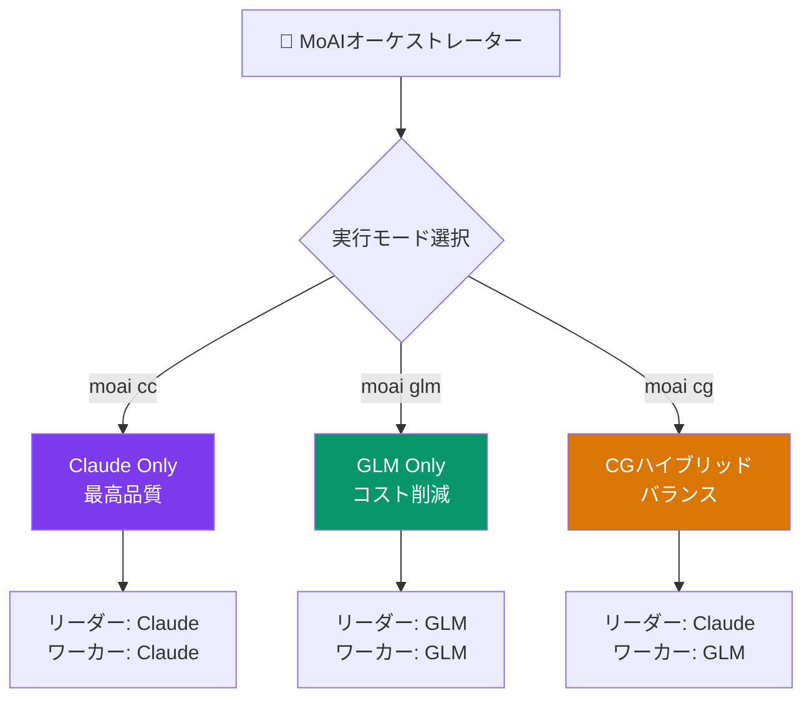

MoAI-ADKはClaude APIに加えて**z.ai GLM**を代替AIバックエンドとしてサポートし、マルチLLM開発ワークフローを実現します。

## z.ai GLMとは?

GLM（Generative Language Model）はz.aiが提供するAIモデルサービスで、Claude Codeと互換性があります。コードを変更せずに環境変数だけで切り替えられます。

| 項目 | 内容 |
|------|------|
| **GLMコーディングプラン** | 月**$10**から（[登録リンク](https://z.ai/subscribe?ic=1NDV03BGWU)） |
| **互換性** | Claude Codeと互換 — コード変更なし |
| **モデル** | glm-5.2[1m], GLM-4.7, GLM-4.5-Air, 無料モデル |

## デフォルトモデルマッピング

| Claudeティア | GLMモデル | 入力（1Mトークンあたり） | 出力（1Mトークンあたり） |
|--------------|-----------|---------------------------|----------------------------|
| Opus | glm-5.2[1m] | $2.00 | $8.00 |
| Sonnet | GLM-4.7 | $0.60 | $2.20 |
| Haiku | GLM-4.5-Air | $0.20 | $1.10 |

> 無料モデルも提供されています: GLM-4.7-Flash, GLM-4.5-Flash。完全な価格は[z.ai Pricing](https://docs.z.ai/guides/overview/pricing)を参照してください。

## 3つの実行モード

MoAI-ADKは3つのLLM実行モードを提供します:

| コマンド | リーダー | ワーカー | tmux必要 | コスト削減 | 用途 |
|----------|----------|----------|----------|------------|------|
| `moai cc` | Claude | Claude | いいえ | - | 最高品質、複雑なタスク |
| `moai glm` | GLM | GLM | 推奨 | ~70% | コスト最適化 |
| `moai cg` | Claude | GLM | **必須** | **~60%** | 品質＋コストバランス |



### クイックスタート

```bash
# 1. GLM APIキーを保存（初回のみ）
moai glm sk-your-glm-api-key

# 2. モードを選択
moai cc            # Claude専用
moai glm           # GLM専用
moai cg            # CGハイブリッド（tmux必要）
```

> **v2.7.1以降**、CGモードが`--team`フラグの**デフォルトチームモード**です。`moai cc`または`moai glm`に明示的に変更しない限りCGモードで実行されます。

## 次のステップ

- [CGモード（Claude + GLM）](/ja/multi-llm/cg-mode) — tmux隔離アーキテクチャの詳細
- [モデルポリシー](/ja/multi-llm/model-policy) — エージェント別モデル割り当て表
