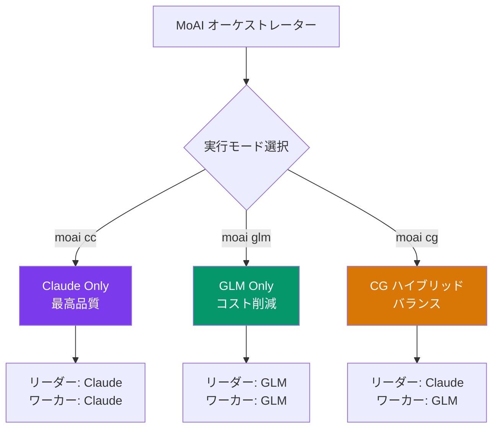

 <strong>所属バリュー</strong>: 🪙 トークノミクス

<!-- @value: tokenomics -->


MoAI-ADK は Claude API に加えて **z.ai GLM** を代替 AI バックエンドとしてサポートします。これは
便利機能ではなく、v3.0 の中核的な価値である **トークノミクス** (Token Economics) を
実現する軸です — 同じ品質のコードをより少ないコストで得るには、タスクごとに
適切なモデルを割り当てられる必要があるからです。


## z.ai GLM とは?

GLM (Generative Language Model) は z.ai が提供する AI モデルサービスで、Claude Code と互換性があります。コード変更なしに環境変数だけで切り替えが可能です。

| 項目 | 内容 |
|------|------|
| **GLM コーディングプラン** | 月額 **$10** から ([登録リンク](https://z.ai/subscribe?ic=1NDV03BGWU)) |
| **互換性** | Claude Code と互換 — コード変更なし |
| **モデル** | glm-5.2[1m]、GLM-4.7、GLM-4.5-Air、無料モデル |

## デフォルトのモデルマッピング

| Claude ティア | GLM モデル | 入力 (1M トークンあたり) | 出力 (1M トークンあたり) |
|-------------|----------|-----------------|-----------------|
| Opus / Sonnet / Haiku / Fable | glm-5.2[1m] | $2.00 | $8.00 |

> 4 つの Claude ティア (Opus、Sonnet、Haiku、Fable) はすべて `glm-5.2[1m]` の単一モデル (1M コンテキスト) に統一されます。GLM モデルを opus→glm-5.2、sonnet→glm-4.7、haiku→glm-4.5-air のようにティアごとに異なるマッピングにしない理由は、1M コンテキストモデルと 200K コンテキストモデルを同じセッションで混在させられないためです — エージェント spawn 時に 1M コンテキストウィンドウを持つモデルと 200K モデルがセッションを共有できない問題が発生します。

> このマッピングは 4 つの Claude Code `ANTHROPIC_DEFAULT_*_MODEL` 環境変数 (`ANTHROPIC_DEFAULT_OPUS_MODEL`、`ANTHROPIC_DEFAULT_SONNET_MODEL`、`ANTHROPIC_DEFAULT_HAIKU_MODEL`、`ANTHROPIC_DEFAULT_FABLE_MODEL`) で実装され、すべて `glm-5.2` に設定されます。Fable 環境変数は Claude Code v2.1.202 から公式サポートされています。

> 無料モデルも提供されています: GLM-4.7-Flash、GLM-4.5-Flash。価格の詳細は [z.ai Pricing](https://docs.z.ai/guides/overview/pricing) を参照してください。

## 3 つの実行モード

MoAI-ADK は 3 つの LLM 実行モードを提供します。「何を最適化するか」に応じて
選択します:

| コマンド | リーダー | ワーカー | tmux 必要 | コスト削減 | 用途 |
|--------|------|------|----------|----------|------|
| `moai cc` | Claude | Claude | いいえ | - | 最高品質、複雑なタスク |
| `moai glm` | GLM | GLM | 推奨 | ~70% | コスト最適化 |
| `moai cg` | Claude | GLM | **必須** | **~60%** | 品質とコストのバランス |


```mermaid
graph TD
    A["MoAI オーケストレーター"] --> B{"実行モード選択"}
    B -->|"moai cc"| C["Claude Only<br/>最高品質"]
    B -->|"moai glm"| D["GLM Only<br/>コスト削減"]
    B -->|"moai cg"| E["CG ハイブリッド<br/>バランス"]

    C --> F["リーダー: Claude<br/>ワーカー: Claude"]
    D --> G["リーダー: GLM<br/>ワーカー: GLM"]
    E --> H["リーダー: Claude<br/>ワーカー: GLM"]

    style C fill:#7C3AED,color:#fff
    style D fill:#059669,color:#fff
    style E fill:#D97706,color:#fff
```

CG モードはトークノミクスの代表例です。戦略・計画・監査のように推論品質が
重要な仕事は Claude リーダーが、大量実装のように物量が重要な仕事は GLM ワーカーが
担当します。実装中心のタスクで約 60-70% のコストが削減されます。

### クイックスタート

```bash
# 1. GLM API キーの保存 (初回のみ)
moai glm sk-your-glm-api-key

# 2. モード選択
moai cc            # Claude 専用
moai glm           # GLM 専用
moai cg            # CG ハイブリッド (tmux 必要)
```

## 次のステップ

- [CG モード (Claude + GLM)](/ja/multi-llm/cg-mode) — tmux 分離アーキテクチャの詳細
- [モデルポリシー](/ja/multi-llm/model-policy) — エージェント別モデル割り当て表
