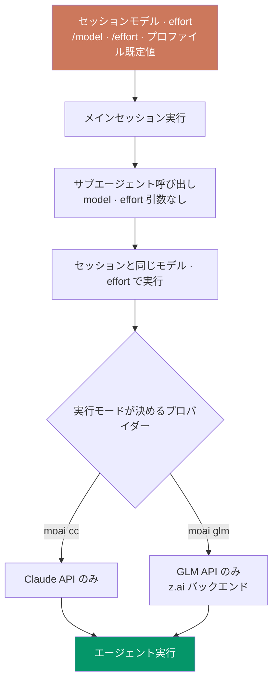

 <strong>所属バリュー</strong>: トークノミクス

<!-- @value: tokenomics -->

MoAI-ADK がセッションを開始するときに決めることがひとつあります。それは
「このセッションをどのモデルで、どれだけ深く考えさせるか」です。このセクションは
まさにそのモデル選択を扱います — Claude モデルラインナップ、推論深度(effort)、
サブエージェントがセッションに従う継承ルール、そして Claude と GLM をひとつの
セッションの中で混ぜて使うマルチプロバイダールーティングまで。

## トークノミクスにおけるこのセクションの位置

トークノミクス(tokenomics)は、同じ品質の結果をより少ないトークンで得るための
あらゆる手段をまとめて呼ぶ名前です。その中でコストを切り分ける仕事は大きく
二つの系統に分かれます。

- **モデル選択** (このセクション) — セッションをどのモデルで、どれだけ深く、どの
  プロバイダーに任せるかを決めます。サブエージェントはそのセッションのモデルと
  推論深度をそのまま踏襲するので、セッション 1 つをうまく選ぶことが全体の割り当てになります。
- **コンテキスト節約** ([コスト最適化](/ja/cost-optimization) セクション) — モデルに
  渡すペイロードそのものを軽くし(コンテキストダイエット)、残ったペイロードを
  安い値段で再利用できるようにします(プロンプトキャッシング)。

二つの系統は互いを補完します。どれだけモデルを上手に選んでもコンテキストが
肥大していればコストは制御を失い、どれだけコンテキストを減らしてもモデル選択が
外れていれば安い作業に高い推論を使うことになります。このセクションが担うのは
前者の系統、すなわち「セッションを何でどんな条件で回すか」です。全体像は
[トークノミクス概論](/ja/advanced/tokenomics-overview) で確認できます。

## ひと組の二軸: モデルと推論深度

セッションが決めるのは `{model, effort}` のひと組です。このひと組がセッションの
すべてのエージェント呼び出しにそのまま適用されます。二つの軸はそれぞれ別の
質問に答えます。

- **モデル** (model) — 「どのモデルで?」Fable·Opus·Sonnet·Haiku のどれを使うかを
  決めます。モデルが変わるとトークン単価とコンテキストウィンドウも一緒に変わります。
- **effort** (推論深度) — 「どれだけ深く考えさせるか?」同じモデルの中でも
  浅く流すか深く掘るかを決めます。推論が深くなるほどトークンがかかります。

この二軸は一緒に動くので、「高いモデルを浅く」使うことも「安いモデルを
深く」使うこともできます。モデルクラスを変えずに effort だけでコスト曲線の
変曲点を見つけられるのはこのためです。

### モデルラインナップ (2026-08)

| モデル | 識別子 | コンテキスト | 向いている仕事 |
|------|--------|----------|------------|
| **Claude Fable 5** | `claude-fable-5` | 1M | 新世代 Mythos ティアの汎用最上位。最も深い推論と複雑なコーディング |
| **Claude Opus 5.5 / 5 / 4.8** | — | 1M | 複雑なアーキテクチャと高難度の推論 |
| **Claude Sonnet 5** | — | 1M | 速度と知性のバランス、日常的なコーディング |
| **Claude Haiku 5.5** | `claude-haiku-5-5` | 1M | 最も速く経済的 (Anthropic API 既定の Haiku、CC v2.1.293+) |
| **Claude Haiku 4.5** | `claude-haiku-4-5-20251001` | 200K | 最も速く経済的、単純·大量作業 (AWS 系の別名解決先) |


**ラインナップと選択は別物です。** 上の表は「使えるモデル」を示すだけです。
MoAI-ADK のセッション既定選択は **No-Haiku ポリシー** に従い Opus 系を第一の
モデルとし、Haiku は既定の組み合わせのどこにも現れません。何で回すかは
セッションのモデル選択が決めます。そのルールは下の
[セッションがモデルと effort を決める](#セッションがモデルと-effort-を決める) で扱います。


### 推論深度 effort

effort は 5 段階で付きます。

| effort | 意味 |
|--------|------|
| `low` | 浅く流す。速度優先、単純作業 |
| `medium` | 既定のバランス |
| `high` | 深く掘る |
| `xhigh` | さらに深く。高難度の推論·複雑なコーディング |
| `max` | 最も深い推論 |

`xhigh` と `max` は Opus 5.5·Opus 5·Opus 4.8·Sonnet 5·Opus 4.7 でサポートされます。二段階を
一度にオンにする短縮語が **ultrathink** キーワードです。このキーワードは
`effort: xhigh` を設定すると同時に **Adaptive Thinking** (推論トークンをモデルが
自ら割り当てる方式) をオンにします。


**固定推論予算は禁止です。** Opus 4.7 以上では `budget_tokens` のような
固定推論予算を拒否します。推論深度は常に effort 段階と Adaptive Thinking だけで
調整してください — 固定値を埋め込むとリクエストが失敗します。


effort はスラッシュコマンドで変更できます。

```bash
/effort low       # 速度優先
/effort high      # 深い推論
/effort xhigh     # 高難度
/effort ultracode # ワークフロー自動編成のトグル
/effort auto      # モデルが文脈に合わせて選択
```

## セッションがモデルと effort を決める

エージェントごとにモデルをひとつずつ選んでいた旧プロファイルマトリクス方式は
退きました。v3.2 からは **サブエージェントはメインセッションのモデルと推論深度を
そのまま踏襲します** — サブエージェントを呼ぶとき `model` も `effort` も渡さず、
MoAI エージェント定義もどちらも宣言しません。エージェント別割り当て表の管理が
要らなくなった代わりに残るのは、セッションの選択 3 つです。

| 選択 | 役割 |
|------|--------|
| モデル (`/model`) | セッションが実行するモデル。すべてのサブエージェントが一緒に従います |
| effort (`/effort` · `ultrathink`) | セッションの推論深度。`high` は品質優先、`medium` が既定、`low` は同じモデル内での経済運用です |
| セッションモデルポリシー (`moai profile setup`) | 推論強度を別に選ばなかったときにプロファイルが渡す既定 effort フォールバックです |

> 旧マトリクス(エージェント 13 個 × プロファイル 3 個)がどう退いたか、そして
> 継承ルールの詳細は
> [プロファイルマトリクス](/ja/advanced/profile-matrix) と
> [モデルポリシー](/ja/multi-llm/model-policy) で確認できます。

### セッション選択がエージェント呼び出しにつながる流れ


```mermaid
flowchart TD
    A["セッションモデル · effort<br/>/model · /effort · プロファイル既定値"] --> B["メインセッション実行"]
    B --> C["サブエージェント呼び出し<br/>model · effort 引数なし"]
    C --> D["セッションと同じモデル · effort で実行"]
    D --> E{"実行モードが決めるプロバイダー"}
    E -->|"moai cc"| F["Claude API のみ"]
    E -->|"moai glm"| G["GLM API のみ<br/>z.ai バックエンド"]
    F --> I["エージェント実行"]
    G --> I

    style A fill:#cc785c,color:#fff
    style I fill:#059669,color:#fff
```

## マルチプロバイダー: Claude と GLM を混ぜて使う

モデル割り当ての最後の質問は「どのプロバイダーに任せるか」です。MoAI-ADK は Claude
API のほかに **z.ai GLM** (Generative Language Model) を代替バックエンドとして使います。コードを
直す必要はなく、環境変数だけ変えれば Claude Code 互換のままそのまま動きます。

GLM に切り替えると、Claude ティアごとに対応する GLM モデルが割り当てられます。Claude
Code の `ANTHROPIC_DEFAULT_*_MODEL` 環境変数で注入される組は次のとおりです。

| Claude スロット | GLM モデル | コンテキスト |
|-------------|----------|----------|
| Opus / Fable | `glm-5.3-flash` | 1M |
| Sonnet | `glm-5.3-flash` | 1M |
| Haiku | `glm-5.3-flash` | 1M |

> `glm-5.3-flash` が既定モデルです。glm-5.3 はどのティアスロットでも引き続き選択できます — `llm.yaml`(`llm.glm.models.*`) でスロットを指定すれば、既存の動作(1M コンテキスト、標準 effort 集約) のままロードされます。

### 実行モード

Claude または GLM ランチャーを明示的に選択します。

| コマンド | リーダー | ワーカー | tmux 必要 | コスト削減 | 用途 |
|--------|------|------|----------|----------|------|
| `moai cc` | Claude | Claude | いいえ | — | 最高品質、複雑なタスク |
| `moai glm` | GLM | GLM | 推奨 | ~70% | コスト最適化 |

`moai cg` は廃止されました。Claude や GLM を起動せず、移行案内を表示して終了します。`moai cc` の別名ではありません。`llm.team_mode: cg` が残るプロジェクトでは、セッションを起動する前に移行先を明示的に選ぶ必要があります。 [CG の廃止と設定の移行](/ja/multi-llm/cg-mode/)

```bash
# 1. GLM API キーの保存 (初回のみ)
moai glm setup sk-your-glm-api-key

# 2. モード選択
moai cc            # Claude 専用
moai glm           # GLM 専用
```

## モデルポリシー: セッションが決め、エージェントが従う

**モデルポリシー** (model policy) の今日の位置は、セッションのモデルと推論深度を
決める仕事です。サブエージェントはセッションのモデルと推論深度をそのまま踏襲するため
呼び出しにモデルを明示する必要がなく、エージェント定義もどちらも宣言しません。
以前は「宣言されたモデル」と「実際に解釈されたモデル」がずれる **drift** (漂流) を
監査ログで捉えていましたが、継承が既定になった今は、呼び出しにモデルを明示すること
自体がまれな観測対象にすぎません。

セッションモデルポリシーが何を決め何を決めないか、旧マトリクスが退いた経緯は
[モデルポリシー](/ja/multi-llm/model-policy) で展開します。

## このセクションのドキュメント

- [CG の廃止と設定の移行](/ja/multi-llm/cg-mode/)
- [モデルポリシー](/ja/multi-llm/model-policy) — セッションモデルポリシー、effort フォールバック、継承ルールの詳細
- [プロファイルマトリクス](/ja/advanced/profile-matrix) — 旧マトリクスが退いた場所と現在の継承ルール

## 関連ドキュメント

- [コスト最適化](/ja/cost-optimization) — トークノミクスのもうひとつの系統: コンテキストダイエットとプロンプトキャッシング
- [トークノミクス概論](/ja/advanced/tokenomics-overview) — モデル割り当てとコンテキスト節約をつなぐ全体像
