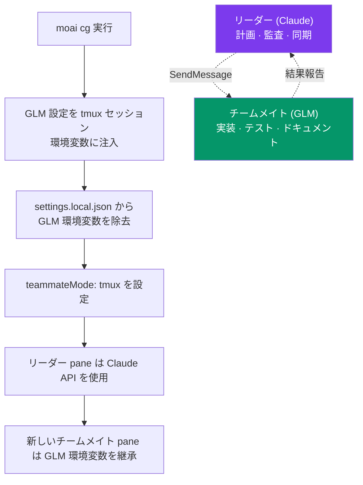

## CG モード、ひとことで

CG モードとは、ひとことで言えば「思考は Claude が、手は GLM が動かす」実行方式です。戦略と品質判断が重要な仕事は **Claude** リーダーが担い、コードを直接書く実装中心の仕事はより安価な **GLM** (z.ai) チームメイトに任せて、1 つのセッションの中でコストを約 60-70% 削減します。

名前の **CG** は **Claude + GLM** を意味します。2 つのモデルを交互に切り替えるのではなく、tmux セッションごとに環境変数を分けて格納し、1 つのセッションの中で 2 つのモデルがそれぞれの役割だけを担うよう隔離します。「計画は Claude が深く、実装は GLM が安く」というトークノミクス (tokenomics) の目標を、コードを 1 行も変えずにそのまま実行する仕組みです。


 <strong>中心となる考え方</strong>: 最も高価な推論は最も賢いモデルに、最も物量の多い仕事は最も安いモデルに。2 つの役割を 1 つのセッションで分担させること — それが CG モードのすべてです。


## なぜこの分離が必要か

AI コーディングのコストの大半は「実装」段階で発生します。SPEC を立てアーキテクチャを練る計画 (plan) と結果を吟味する監査 (audit) の段階は、推論の深さが品質を分けるものの呼び出し回数そのものは少なくてすみます。一方、コードを実際に書き、テストを埋め、ドキュメントを作る実装 (run) の段階はトークンが流れ込む区間です。

そこで両方の段階に同じ最高価格のモデルを使うと、品質は保証されてもコストが急速に膨らみます。CG モードはこの非対称を利用します。Claude の深い推論が必要な場所には Claude を、物量が多くモデル単価が請求額を分ける場所にはより安い GLM を配置します。結果として、計画と監査の品質はそのままに、実装コストだけを大きく削ります。

## 仕組み

CG モードは tmux セッションを単位として環境変数を切り分けます。リーダーが使う pane には Claude API 環境だけが残り、新しく開かれるチームメイトの pane は tmux セッションに注入された GLM 環境変数を引き継ぎます。コードを直す必要はなく、環境変数だけで 2 つのモデルが分かれて回るのです。



リーダーとチームメイトは Claude Code のメッセンジャー (SendMessage) ツールで対話します。リーダーが作業を渡すとチームメイトの pane でその仕事が GLM によって実行され、結果は再びリーダーに戻ってきます。

## どの仕事を誰が担うか

| 役割 | モデル | 担当する仕事 |
|------|------|--------|
| **リーダー** (現在の tmux pane) | Claude | オーケストレーション、計画 (plan)、品質判断、監査、同期 (sync) |
| **チームメイト** (新しい tmux pane) | GLM | run 段階の実装物量、コード生成、テスト作成、ドキュメント生成 |

リーダーは「何をどう作るか」を決め、結果が基準を満たしているかを確認します。チームメイトは決められた計画に従って実際のコードを書きます。この分担が CG モードのコスト削減の源泉です — 高価なモデルが実装の物量まで背負わないようにします。

> **GLM チームメイトが使うモデル**: Claude ティア群 (Opus · Sonnet · Haiku · Fable) がすべて、1M コンテキストの `glm-5.3` ひとつにまとめられます。Claude Code は自動圧縮ウィンドウを Opus スロット基準で 1 回だけ設定し、別スロットで起動したエージェントもその値を引き継ぐため、小さいモデルを混ぜると自分の限界を超えても圧縮がかかりません。ティアの区別はモデルではなく推論深度 (effort) の軸が担います。詳しいマッピングは[マルチ LLM 紹介](/ja/multi-llm)を参照してください。

## 準備と実行

### ステップ 1: GLM API キーの保存 (最初の 1 回)

```bash
moai glm setup sk-your-glm-api-key
```

キーは `~/.moai/.env.glm` に安全に保存されます。

### ステップ 2: tmux 環境の確認

すでに tmux を使っているなら、新しいセッションを作る必要はありません。

```bash
# tmux を使用中でないなら:
tmux new -s moai
```


 VS Code ターミナルの既定シェルを tmux にしておくと、このステップ自体を丸ごとスキップできます。CG モードのリーダー/チームメイトの API 分離は tmux 分割画面環境でのみ可能です。


### ステップ 3: CG モードの実行

```bash
moai cg
```

`moai cg` が現在の pane で Claude Code を自動で起動します。別途 `claude` を実行する必要はありません。

### ステップ 4: ワークフローの実行

```bash
/moai "ユーザー認証機能の実装"
```

あとは普段どおりです。オーケストレーター (リーダー、Claude) が計画と品質、同期を担い、実装の物量が大きい作業は新しい tmux pane の GLM チームメイトに渡ります。


 かつての <code>--team</code> フラグ (Agent Teams 静的オーケストレーション階層) は v3.0 で退きました。強制的に指定しても sub-agent モードに戻ります。CG モードのリーダー/チームメイト分離は Claude Code 内蔵の teammate ランタイム (tmux pane) が担っており、このランタイムはそのまま残っています。


## いつ CG モードを使い、いつ避けるべきか

### CG モードが適する作業

- 実装中心の SPEC 実行 (run 段階)
- コード生成、リファクタリングの物量
- テストコードの作成
- ドキュメント生成

こうした作業は推論より物量が多いため、GLM チームメイトに任せたときのコスト削減効果が最も大きくなります。

### CG モードを避けるべき作業

- アーキテクチャ設計と計画 (Opus/Fable 級の深い推論が必要)
- セキュリティレビュー (Claude のセキュリティトレーニングが必要)
- 複雑なデバッグ (高度な推論が品質を分ける)

こうした作業は 1 回の判断がその後のコストと方向を大きく左右します。最も賢いモデルが最後まで直接担う方が安全です。この場面では CG モードの代わりに Claude 専用実行 (`moai cc`) を使ってください。


 CG モードが常に正解というわけではありません。計画段階で GLM チームメイトに早すぎる判断を任せると、コストは減っても方向が狂い、やり直しのコストがさらに大きくなることがあります。「思考」は必ず Claude リーダーが、「手」だけを GLM チームメイトに任せるのが、このモードの正しい使い方です。


## 3 つの実行モードの比較

| コマンド | リーダー | チームメイト | tmux 必要 | コスト削減 | 用途 |
|--------|------|------|----------|----------|------|
| `moai cc` | Claude | Claude | いいえ | - | 複雑な作業、最高品質 |
| `moai glm` | GLM | GLM | 推奨 | ~70% | コスト最適化 |
| `moai cg` | Claude | GLM | **必須** | **~60%** | 品質 + コストのバランス |

`moai cc` は品質最優先、`moai glm` はコスト最優先、`moai cg` はその中間のバランスです。CG モードだけがリーダーとチームメイトに異なるモデルを割り当てるため、tmux が必須になります。

## ディスプレイモード (teammateMode)

`teammateMode` は Claude Code 内蔵のディスプレイ設定で、`settings.local.json` に保存されます。MoAI の team-mode (かつての `--team` フラグ、v3.0 で退場) とは別の概念です。teammate ランタイム自体は Claude Code が提供し、`teammateMode` は画面にどう表示するかだけを決めます。

| 値 | 説明 | リーダー/チームメイト分離 | CG モード |
|------|------|--------------|---------|
| `in-process` | デフォルト値、同じターミナルにインライン | 不可 | 未使用 |
| `auto` | 環境の自動検出 | 未対応 | 未使用 |
| `tmux` | tmux 分割画面 | セッション環境変数の隔離 |  使用 |
| `iterm2` | iTerm2 分割画面 | 未対応 | 未使用 |

`moai cg` と `moai glm` は `settings.local.json` の `teammateMode` を `"tmux"` に設定し、`moai cc` は空の値に戻します。かつての `CLAUDE_CODE_TEAMMATE_DISPLAY` 環境変数より `teammateMode` 設定が優先されます。

> **CG モードのリーダー/チームメイト API 分離は `tmux` ディスプレイモードでのみ可能です。**

## 重要事項

| 項目 | 説明 |
|------|------|
| **tmux 環境** | すでに tmux 使用中なら新しいセッションは不要。既定シェルを tmux にしておくと便利 |
| **自動実行** | `moai cg` が現在の pane で Claude Code を自動起動。別途 `claude` コマンドは不要 |
| **セッション終了** | session_end フックが tmux セッション環境変数を自動で片付ける → 次のセッションは Claude を使用 |
| **チーム通信** | SendMessage ツールでリーダーとチームメイトの間の通信 |
| **モード切替** | `moai glm` から切り替えるとき、`moai cg` が GLM 設定を自動で初期化。途中で `moai cc` を挟む必要はない |

## tmux 環境変数注入のセキュリティモデル {#tmux-env-security}

v3.0.0 から、`moai cg` は GLM token (`ANTHROPIC_AUTH_TOKEN`) を tmux セッション環境変数に注入するとき、**argv チャネル** (`tmux set-environment <KEY> <VALUE>`) の代わりに **source-file チャネル** (`tmux source-file <tmp>`) を使います。そのおかげで token は `ps auxe`、`/proc/<pid>/cmdline`、auditd ログ、sysmon 追跡、クラッシュダンプに平文で現れなくなりました (CWE-214)。

### 注入フロー

1. `~/.moai/run/` 配下に一時ファイルを `mkstemp` で生成 (mode `0o600` を強制)
2. `set-environment -t <session> <KEY> <VALUE>` の 1 行を記録
3. `tmux source-file <tmp>` で tmux がそのファイルを読み込み環境に注入
4. 注入直後に `os.Remove` で unlink

argv に残るのは一時ファイルのパスだけで、token 自体は露出しません。

### 機密でない値は argv を維持

`CLAUDE_CONFIG_DIR`、`ANTHROPIC_BASE_URL`、`ANTHROPIC_DEFAULT_*_MODEL` のような token ではない値は、従来どおり argv 経路をそのまま使います (セキュリティ上の脅威なし)。

### ユーザーの責任

`~/.moai/.env.glm` ファイルはユーザー環境で `0o600` 権限を維持する必要があります。権限は `moai glm` コマンドが自動で設定します:

```bash
stat -c '%a' ~/.moai/.env.glm    # Linux: 600
stat -f '%A' ~/.moai/.env.glm    # macOS: 600
```

### 自己点検

CG モードの動作中に token が argv に露出していないか確認してみます:

```bash
# moai cg 実行後、新しい tmux セッションの中で
ps auxe | grep -i 'tmux set-environment.*ANTHROPIC_AUTH_TOKEN'
# 期待値: 0 matches (token が argv にない)
```

詳しい脅威モデルと失敗時の動作 (`ErrTmuxSensitiveInjectFailed` sentinel)、追加の点検手順は[セキュリティノート — CWE-214](/ja/advanced/security-notes/#cwe-214)を参照してください。

## コストを削る 2 つの経路

CG モードが扱う「コスト削減」と、プロンプトキャッシングが扱う「コスト削減」は観点が異なります。どちらもトークノミクスのひとつの軸ですが、どこで節約するかが違います。

| 経路 | どこで節約するか | どう | 関連ページ |
|------|--------------|--------|------------|
| **モデル配分** (CG モード) | モデル単価 | 安い仕事は安いモデルに | このページ |
| **計算の再利用** (プロンプトキャッシング) | 反復計算 | 同じプレフィックスをキャッシュして再計算を省く | [プロンプトキャッシング](/ja/claude-code/context-memory/prompt-caching) |

CG モードは**コスト**の観点 (請求額を減らす) であり、プロンプトキャッシングは**コンテキスト**の観点 (同じコンテキストを再計算するコストを減らす) です。2 つの軸は互いに排他ではないので、併用すれば効果が重なります。ただしこのページの主題はモデル配分の側です。

## トラブルシューティング

| 問題 | 原因 | 解決 |
|------|------|------|
| チームメイトが Claude API を使う | tmux セッション環境変数が設定されていない | tmux の中で `moai cg` を再実行 |
| `moai cg` を実行しても Claude Code が起動しない | tmux の外で実行した | `tmux new -s moai` の後に再実行 |
| セッションを閉じても GLM 環境変数が残る | session_end フックの失敗 | `moai cc` で直接整理 |

## 次のステップ

- [モデルポリシー](/ja/multi-llm/model-policy) — エージェントごとに適切なモデルを割り当てるしくみ
- [プロンプトキャッシング](/ja/claude-code/context-memory/prompt-caching) — コスト削減のもうひとつの軸、計算の再利用
- [よくある質問](/ja/getting-started/faq) — 実行モード関連の FAQ
- [CLI リファレンス](/ja/getting-started/cli) — moai cc、moai glm、moai cg の詳細
