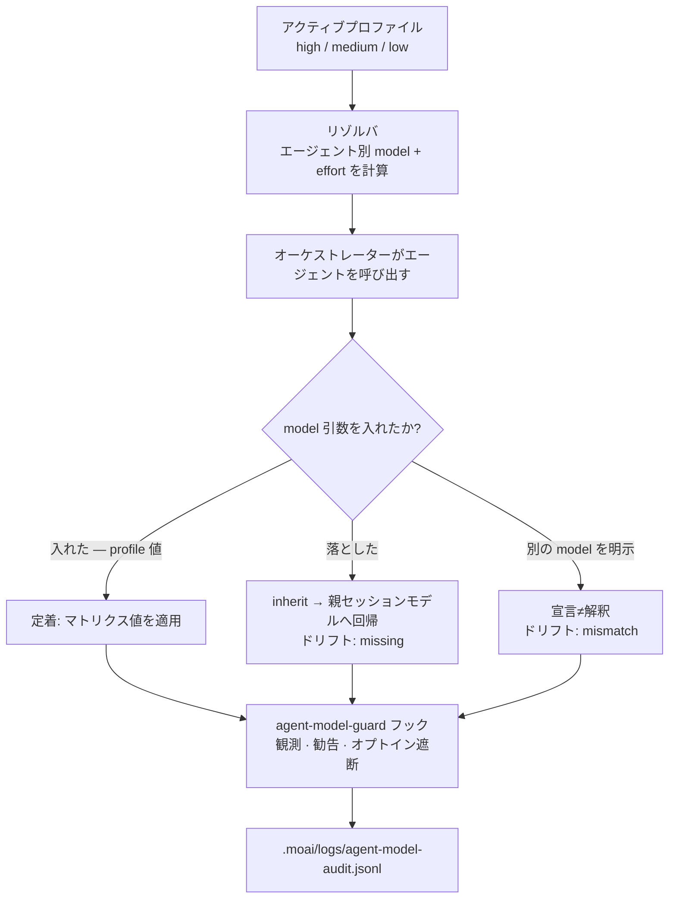

## モデルポリシーとは?

モデルポリシーは、「どんな作業にも最も高いモデルを」の代わりに「この作業にはこのモデルを、この深さで」と置き換える割り当て規則です。計画・監査のように思考が重い仕事と、ドキュメント化・Git 手続きのような軽い仕事を切り分け、エージェントごとに適切なモデルと推論深度 (effort) を宣言的に定めておきます。そうすることで、Claude Code サブスクリプションプランの範囲内で品質を最大限に引き上げながら、レート制限エラーを回避できます。

この規則はトークノミクス (tokenomics、トークン経済) の骨格です。トークノミクスとは品質あたりのコストを天秤にかけてトークンを配分するやり方を指し、MoAI-ADK がそのうち**コスト**の軸を実際に実装する手段が、まさにこのモデルポリシーです。


**ひとことで:** プロファイル (high/medium/low) を 1 つ選ぶと、その列の値がその日の 11 エージェントそれぞれのモデルと推論深度を一度に決めます。モデルを直接選ぶ負担が 11 か所から 1 か所 (プロファイル選択) に減ります。


## 「最強のモデル」にこだわってはいけない理由

一見すると、常に Opus だけを使うのが最も安全に見えます。しかし 2 つの点が引っかかります。

第一に、**請求額を分けるのはトークン単価ではなく、課題あたりのステップ数**です。マルチターンのエージェントは課題が終わるまでステップを踏み続け、ステップが伸びるほど出力トークンが積もってコストが膨らみます。深い推論のモデルが 1 回で終える作業を、浅いモデルが何度もやり直せば、トークン単価は安くても総コストはむしろ大きくなります。逆に、本当に単純な 1 パスで終わる作業まで毎回深い推論のモデルで回せば、コストの無駄でしかありません。

第二に、**同じモデルの中でも推論深度を調節できます**。Opus の `low` effort は、ある段階の Sonnet よりもスコアが高く、課題あたりコストはむしろ安いことがあります。つまりコストを節約するためにモデルクラスを下げるのではなく、同じモデルの中で推論深度だけを下げる方が、品質とコストの両面で有利になる帯域があるのです。モデルポリシーは、まさにこの帯域を見つけて割り当てる仕事です。

## モデルパレットと推論深度

まず選択肢を確認しておきます。モデルポリシーとは、以下のラインナップのどのモデルを、どの推論深度で使うかを選ぶ規則です。

### モデルラインナップ (2026-08)

| モデル | 識別子 | コンテキスト | 性格 |
|------|--------|----------|------|
| Claude Fable 5 | `claude-fable-5` | 256K | 新規 Mythos-tier 汎用最上位。最も深い推論と複雑なコーディング |
| Claude Opus 5 / 4.8 | `opus` | 1M | 複雑なアーキテクチャ、高難度の推論 |
| Claude Sonnet 5 | `sonnet` | 200K | 速度と知能のバランス、日常的なコーディング |
| Claude Haiku 4.5 | `claude-haiku-4-5-20251001` | 200K | 最速かつ低コスト、単純・大量の作業 |

> MoAI のモデルポリシーはこのラインナップ全体を使いません。**No-Haiku ポリシー**により Haiku はエージェントマトリクスのどこにも登場せず、マルチターンのエージェンティック行はすべて Opus が担当します。理由はすぐ次の節で説明します。

### 推論深度 (effort)

モデルがどれだけ深く考えるかを 5 段階から選びます。

| effort | 意味 |
|--------|------|
| `low` | 最も浅い推論。速くて安い |
| `medium` | バランス。デフォルトプロファイルの基準点 |
| `high` | 深い推論 |
| `xhigh` | さらに深い推論 (Opus 5 · 4.8 · Sonnet 5 · Opus 4.7 が対応) |
| `max` | 最も深い推論 |

> **`ultrathink` キーワード**: `ultrathink` を入力すると、`effort:xhigh` と Adaptive Thinking (推論トークンの自動割り当て) が同時に有効になります。固定の `budget_tokens` は使いません — モデル自身が推論深度を配分します。`/effort low|medium|high|xhigh|max|ultracode|auto` スラッシュコマンドでも切り替えられます。

## 3 段階プロファイル

ポリシーは 3 つの値のうち 1 つを選ぶことから始まります。1 つ選べば、その列全体が有効になります。

| プロファイル (profile) | CLI フラグ | 性格 |
|---------------|-----------|------|
| **high** | `--model-policy high` | 品質優先。監査・助言・調整行が `high` を維持し、著作行は `medium` にとどまる |
| **medium** (デフォルト) | `--model-policy medium` | バランス。`high` と 2 行 (builder-harness · e2e-tester) でのみ異なる |
| **low** | `--model-policy low` | 課題あたり最低コスト。ほとんどのエージェンティック行は Opus `medium` に下がる |


**名前の整理**: `llm.yaml` の `profile` フィールド、legacy の `performance_tier` エイリアス、CLI フラグ `--model-policy` はいずれも `high`/`medium`/`low` の 3 値をそのまま使い、1:1 で対応します。デフォルトは `medium` です。旧最上位ティア名の `max` は、既存設定が読み込まれ続けるよう今も `high` の**読み取り専用エイリアス**として扱われますが、保存時には常に `high` と記録されます。移行作業は不要です。`performance_tier` は `profile` がないときのみ読み込まれます。


> **ポリシーを下げても、より弱いモデルクラスに移るわけではありません。** 長い息のエージェンティック作業では、Opus の `low` effort がどの effort の Sonnet よりもスコアが高く、同時に課題あたりコストも安くなります。そこで `low` ポリシーは推論深度を下げて Opus *の内側* で節約し、マルチステップの完走失敗が問題にならない単発の行でのみ Sonnet を使います。

## エージェント別割り当て表

以下の 36 セルがプロファイルマトリクス (エージェント 12 個 × プロファイル 3 個) です。各セルには、リゾルバが spawn 時点で注入する `{model, effort}` ペアが入っています。オーケストレーターのメインセッションは呼び出される側のエージェントではないため、表から外しています。

### Manager Agents (6 個)

| エージェント | high | medium | low |
|---------|------|--------|-----|
| manager-spec | opus / medium | opus / medium | opus / medium |
| manager-develop | opus / medium | opus / medium | opus / medium |
| manager-docs | sonnet / low | sonnet / low | sonnet / low |
| manager-git | sonnet / low | sonnet / low | sonnet / low |
| manager-design | opus / high | opus / high | opus / medium |
| manager-lead | opus / high | opus / high | opus / medium |

### Evaluator · Advisor · Builder · Specialist Agents (5 個)

| エージェント | high | medium | low |
|---------|------|--------|-----|
| plan-auditor | opus / high | opus / high | opus / medium |
| sync-auditor | opus / high | opus / high | opus / medium |
| super-advisor | opus / high | opus / high | opus / high |
| builder-harness | opus / high | opus / medium | opus / low |
| e2e-tester | opus / medium | opus / low | sonnet / low |

### ビルトインエージェント (1 個)

| エージェント | high | medium | low |
|---------|------|--------|-----|
| Explore | sonnet / low | sonnet / low | sonnet / low |

> `Explore` はディスク上にエージェントファイルがないため、frontmatter で effort を固定できません。代わりにマトリクスが `sonnet / low` を呼び出し時のデフォルトとして記録し、この値が呼び出しプロンプトにそのまま記載されます。Agent Teams の静的階層 (静的 role profile) は v3.0 で退き、その場所は sub-agent の並列実行と動的ワークフローが埋めました。`moai cg` の teammate ランタイム (tmux pane) はそのまま残っています。

> **Haiku 除去** (v3.0): かつての Haiku スロット (ドキュメント化 · MX タグ付け · Git 手続き) は、より低いモデルクラスではなく、より低い推論深度に置き換えられました。コストはモデルの入れ替えではなく、effort の段階分けで削減します。

## 割り当て原則

- **支出は判断する行に**: ポリシーはコスト/スコア曲線の導出ではなく、確定されたオペレーター判断です。監査・助言行（`plan-auditor`、`sync-auditor`、`super-advisor`）と調整行（`manager-design`、`manager-lead`）が `high` を維持する一方、著作・実装行（`manager-spec`、`manager-develop`）は 3 プロファイルすべて `medium` にとどまります。
- **エージェンティック行はすべて Opus**: `manager-spec`、`manager-develop`、`plan-auditor`、`sync-auditor`、`manager-design`、`manager-lead`、`builder-harness`、`e2e-tester` などマルチターン作業はすべて Opus に残します。Opus の `low` がどの effort の Sonnet よりもスコアが高く、課題あたりコストが安いからです。
- **Sonnet は単発・入力支配の行のみ**: `manager-docs` のドキュメント整理、`manager-git` の機械的作業、`Explore` の探索は入力が大半を占める単一パスで終わり、マルチステップの完走失敗を心配する必要がなく、その場所では Sonnet の安い入力単価が決め手になります。この 3 行は 3 つのプロファイルすべてで `sonnet / low` に固定です。
- **`max` を受ける行はない**: `max` は `high` の上の唯一の段階として語彙に残りますが、現在使用するセルはありません。
- **`xhigh` はどこにも使わない**: Opus ではスコアが `high` と同じなのにコストだけ 49% 余分にかかります。

**`manager-lead` はマトリクスの 1 行になりました。** 以前は表にまったくなく、未マッピングエージェント用の `inherit` センチネルとして解決されていました — Tier L の調整者が、セッションがたまたま乗っていたモデルをそのまま受け取る状態でした。現在は他の維持エージェントと同じく自分の行を持ち、注入とオーバーライドの対象です。

計画を立てたエージェントが自分の計画を監査しないよう、`plan-auditor` と `sync-auditor` は `manager-spec` とは別個に割り当てます。バイアスを防ぐ力はセルの値ではなく、カタログの構造そのものから生まれます。

## 決めた値をエージェントに伝えるしくみ

ここまでは「このエージェントはこのモデルを使うべきだ」という**意図**を整理しただけです。しかし意図がそのまま実行になるわけではありません。マトリクスが決めた値を実際の呼び出し (spawn) に反映する過程が別にあり、その過程こそが**モデルポリシーの強制ポイント**です。

### リゾルバが値を決める

エージェントを 1 つ呼び出すたび、そのエージェントが使う `{model, effort}` を決める決定器を**リゾルバ** (resolver) と呼びます。リゾルバは決められた優先順位に従い、最初に見つかった値を使います。

1. `llm.agent_overrides[エージェント名]` があればその値が優先されます。
2. なければアクティブプロファイルのエージェントセル (config の `llm.profiles`) を使います。
3. config にセルがなければ Go のデフォルトマトリクスのエージェントセルを使います。
4. マトリクスにないエージェント (ユーザーが追加したエージェント) は `inherit` です — モデルを注入せず、親セッションに従います。

解決された値を確認するには、読み取り専用コマンドの `moai model profile` を使います。人が読む表は引数なし、機械判読用には `--json` を付けます。

```bash
moai model profile          # 人が読む表
moai model profile --json   # 機械判読用 JSON
```

このコマンドは何も変更しません — オーケストレーターがエージェントを呼び出すときに入れる値を、そのまま見せるだけです。

### model と effort は別の経路を通る

ここが核心です。解決された **model** と **effort** は、消費される経路が異なります。

- **model** — オーケストレーターがエージェントを呼ぶときに**呼び出しごとに渡すランタイム引数**です。`Agent(model: <alias>)` の形で渡します。エージェントファイルの frontmatter は `model: inherit` のままにし、初期化 · 更新 · 保存のどの段階でもこの値には触れません。
- **effort** — エージェントが推論深度を決める基準となる**文書化された意図**です。エージェントを呼び出すツールは呼び出しごとに effort 引数を受け取らないため、effort は (a) エージェントファイルの effort デフォルト、(b) GLM effort オーバーレイ、(c) ワークフローやプロンプトレベルのステアリングを通してのみ反映されます。


**`model: inherit` の罠**: ほぼすべてのエージェントファイルの frontmatter がデフォルトで `model: inherit` です。そのためオーケストレーターがエージェントを呼ぶときに `model` 引数を**落とす**と、プロフィールが決めたモデルではなく**親セッションのモデル**へ静かに回帰します。プロファイルは計算されているのに、誰も「適用されなかった」と報告しない状態になります。実際の観測では、model 引数が付いた呼び出しは 1% にも満たません。この点が次の節のドリフトの話につながります。




### GLM バックエンドの reasoning 上限

GLM バックエンド（`moai glm`、または `moai cg` の GLM ペイン）では、effort は Claude の 5 段語彙をそのまま使えません。GLM-5.3 は **常に推論します** — reasoning の無効化はサポートされず、それを要求するリクエストは失敗します。制御軸は 3 段階の `reasoning_effort`（low / high / max）1 つであり、Claude effort はその上に collapse します:

| Claude effort | GLM reasoning_effort |
|--------------|---------------------|
| `low` | `low` |
| `medium` | `max` |
| `high` | `max` |
| `xhigh` | `max` |
| `max` | `max` |
| (認識不能な値) | `max` — 全体性条項: 決して過少推論しない |

つまり **上限は `max`** です。`low` より上のすべての Claude effort が reasoning-max に収束し、認識不能な値も reasoning-max に落ち、明示的なオーバーライドのない GLM セッションはデフォルトで reasoning-max として実行されます。reasoning-high は依然として有効な wire 値ですが、どの Claude effort もそこへは collapse しません。実装エージェントの `manager-develop` は collapse 結果と無関係に reasoning-max を強制され（z.ai の「コーディング課題は reasoning max」推奨）、`manager-git` は 3 プロファイルすべて `low` effort のため reasoning-low の席を占めます。

このマッピングの源はコードであり、このページではありません — ランタイムの SSOT は `internal/template/glm_effort_overlay.go` です。

## 宣言と解釈がずれるとき (ドリフト)

マトリクスが定めた値 (解釈) と実際の呼び出しに付いた値 (宣言) が異なると**ドリフト** (drift) が発生します。MoAI はこの隙間を機械的に観察する PreToolUse フック、**agent-model-guard** を備えています。呼び出しが起きるたびにこのフックは宣言された model を取り出し、リゾルバに「このエージェントは本来どのモデルであるべきか」を尋ねたうえで、4 種の判定 (verdict) のいずれかを下します。

| 判定 | 意味 | 処理 |
|------|------|------|
| `ok` | 宣言と解釈が一致 | 通過 |
| `missing` | 解釈は具体的なエイリアスなのに呼び出しに model 引数がない | 勧告 (非遮断) — 最も多いケース |
| `mismatch` | 呼び出しが宣言した model が解釈と異なる | 勧告 + (オプトイン時) 遮断 |
| `unmapped` | 保持カタログ外のエージェント (ユーザーのハーネススペシャリスト) — `inherit` なので比較対象がない | 通過 |

### 3 段階の強度

フックは互いに独立してオン/オフできる 3 段階で動作します。

- **observe** (観測) — 常に有効です。呼び出しごとに JSONL ログを 1 行残し、決して遮断しません。
- **advise** (勧告) — 常に有効です。`missing` や `mismatch` のとき、遮断しない勧告メッセージを出します。
- **block** (遮断) — オプトインです。`workflow.agent_model_guard.enabled` (デフォルト `false`) を有効にしたときのみ動作し、**`mismatch` 判定だけ**を拒否します。


**`missing` は遮断しません。** model 引数の付いた呼び出しが 1% に満たない現実では、`missing` まで遮断するとほぼすべての呼び出しを拒否することになります。そのためゲートを有効にしても `missing` は勧告のままです。遮断は「明らかに別のモデルを明示した」`mismatch` にのみ適用されます。


### 監査ログと fail-open

観測ログは `<プロジェクトルート>/.moai/logs/agent-model-audit.jsonl` に 1 行ずつ積まれます。1 行には時刻 · セッション · エージェント · 宣言された model · 解釈された model · 判定が入り、プロンプト本文は決して記録されません。このログでエージェント別のドリフト率を集計できます。

遮断は**肯定的な証拠**があるときのみ出ます (fail-open 原則)。エージェント識別子がパースされ、解釈がマッピングされ、宣言された model が存在し、両者が異なるときにのみ拒否します。それ以外の不確実な状態 (パース不能、識別子なし、マッピングなし、config 読み込み失敗、プロジェクトルート不明) はすべて通します。強制のバグがセッションを立ち止らせないためです。

> **effort はこのフックの守備範囲外です。** エージェントを呼び出すツールは effort 引数をそもそも公開しないため、呼び出し時点で観察できるのは `model` だけです。effort が正しく届いているかは、frontmatter とオーバーレイでのみ扱います。

## v3.1 での強化

現在の agent-model-guard は「観測は常時、遮断はオプトイン」の段階にとどまっています。最も多い `missing` 判定は勧告にしかならないため、意図したプロファイルが静かに無視される隙間が残っています。v3.1 ではこの強制をより堅固にする作業 (SPEC-AGENT-MODEL-ENFORCE-001、進行中) が動いています。

方向性は、呼び出し時点で model 引数を落とすこと自体を減らすことです — オーケストレーターが `moai model profile --json` の示す値を呼び出しごとに誠実に注入するようルーティングを強化し、観測ログが積もるぶんだけドリフト率を可視化します。ただしこの SPEC はまだ進行中なので、「v3.1 で `missing` まで自動遮断される」とは読まないでください。現時点の遮断は引き続き `mismatch` 専用 · オプトインです。

## コストをさらに削ぐ 2 つのレバー

モデルポリシーが「どのモデルを」を決めるのに対し、コストをさらに下げる 2 つのレバーが横にあります。どちらもこのページが扱う**コスト**の観点から触れ、深掘りはそれぞれ専用ページに譲ります。

**プロンプトキャッシング**はプレフィックスマッチ (tools → system → messages の順) で直前のリクエストの前半を再利用し、入力コストを削ります。読み込みは基本入力の約 0.1 倍、書き込みは 1.25 倍で、5 分間リクエストがないと (アイドル TTL) キャッシュが失効します。だからゲートは早い場所に束ね、長いセッションは分割する方が有利になります。ちなみにこの**コスト**観点のプロンプトキャッシングは、[コンテキスト/メモリのプロンプトキャッシング](/ja/claude-code/context-memory/prompt-caching/)が扱う「コンテキスト維持」の観点とは見る角度が違います — 同じメカニズムでも、一方は課金、他方はセッションの連続性を問います。

**`MOAI_AUTONOMY_TIER`** は自律性ティアごとにコストと速度のトレードオフを定めます。ティアが高いほど人間の介入なしに進む仕事は増えますが、そのぶんトークン消費も大きくなります。ティアの定義の詳細は[自律性ティア](/ja/advanced/autonomy-tier/)ページにあります。

## 設定方法

### プロジェクト初期化時

```bash
moai init my-project
# 対話型ウィザードにモデルポリシー選択を含む
```

### 既存プロジェクトの再設定

```bash
moai update
# 対話型プロンプト:
# - Reset model policy? (y/n) — モデルポリシーの再設定
# - Update GLM settings? (y/n) — GLM 環境変数の設定
```

### CLI フラグで直接設定

```bash
moai init my-project --model-policy high    # 品質優先 (監査・助言・調整行 high)
moai init my-project --model-policy medium  # バランス (デフォルト)
moai init my-project --model-policy low     # 課題あたり最低コスト
```

`--model-policy` は `high`/`medium`/`low` の 3 値を受け取り、結果は `llm.yaml` に保存されます。旧最上位ティア名の `max` も入力値としては引き続き受け付け、`high` に正規化します。


デフォルトポリシーは `medium` です (llm.yaml `profile: "medium"`、CLI `--model-policy medium` に該当し、値がなければ `medium` とみなします)。GLM 設定は `settings.local.json` に隔離されるため Git にコミットされません。特定のエージェントだけ上書きするには、`llm.agent_overrides` にエージェント名をキーとして値を書きます — モデル enum とエージェントカタログで検証するため、未知の名前は拒否されます。


## 次のステップ

- [プロファイルマトリクス](/ja/advanced/profile-matrix/) — 36 セルの配置根拠 (判断加重ポリシー) とリゾルバの優先順位の詳細
- [CG モード](/ja/multi-llm/cg-mode) — Claude リーダー + GLM ワーカーのハイブリッドでコスト削減
- [自律性ティア](/ja/advanced/autonomy-tier/) — `MOAI_AUTONOMY_TIER` のコスト · 速度トレードオフ
- [CLI リファレンス](/ja/getting-started/cli) — `moai init`、`moai update`、`moai model profile` の詳細
