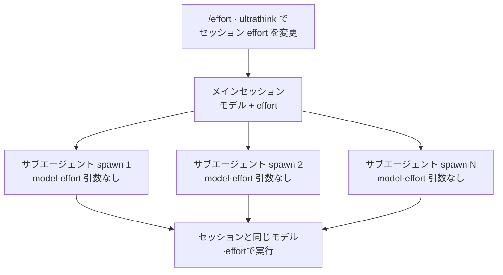

## モデルポリシーとは?

モデルポリシーは「すべてに最も高いモデル」ではなく「このセッションにはこのモデルを、この深さで」と置き換える選択です。v3.2 から MoAI-ADK のモデルと推論深度 (effort) は**セッション単位**で決まります。メインセッションがどのモデルでどの推論深度で動いているなら、サブエージェントもそのまま同じモデル・同じ推論深度で動きます。エージェントごとにモデルを割り当てていた昔のプロファイルマトリクス方式は退きました。

この選択はトークノミクス (トークン経済) の背骨です。トークノミクスとは品質対コストでトークンを分けて使う考え方を指し、MoAI-ADK がそのうちの**コスト**側を実際に扱う手段がこのモデルポリシーです。


**ひとことで:** メインセッションのモデルと推論深度が、すべてのサブエージェントのモデルと推論深度です。エージェントごとにモデルを選ぶ必要はもうなく、選ぶのはセッション 1 つのモデルと effort だけです。


## 「最も強いモデル」に固執してはいけない理由

なんとなく Opus だけを使うのが一番安全に見えます。しかし 2 つの点が引っかかります。

ひとつ目、**請求額を分けるのはトークン単価ではなくタスクあたりのステップ数**です。マルチターンのエージェントはタスクが終わるまでステップを踏み、ステップが長くなると出力トークンが積み上がってコストが膨らみます。深い推論のモデルが 1 回で終わる仕事を浅いモデルが何度もやり直せば、トークン単価が安くても合計コストはむしろ大きくなります。逆に、本当に単純な 1 パスで終わる仕事まで毎回深い推論モデルで回すのはコストの無駄です。

ふたつ目、**同じモデルの中でも推論深度は調整できます**。Opus の `low` effort はある段階の Sonnet よりもスコアが高いのにタスクあたりコストは安い、という帯域があります。つまりコストを抑えるためにモデルクラスを下げる代わりに、同じモデルの中で推論深度だけ下げる方が品質とコストの両面で有利な区間があるのです。モデルポリシーはこの区間を見つける仕事です。

この原則の根拠と実測データは[3 層エージェントアーキテクチャ](/ja/advanced/no-haiku-3tier/)ページにまとまっています。

## モデルのラインナップと推論深度

まず選択肢を確認します。モデルポリシーは、下のラインナップのどのモデルで、どの推論深度でセッションを動かすかを決める規則です。

### モデルラインナップ (2026-09)

| モデル | 識別子 | コンテキスト | 性格 |
|------|--------|----------|------|
| Claude Fable 5 | `claude-fable-5` | 1M | 新しい Mythos-tier 汎用フラッグシップ。最も深い推論と複雑なコーディング |
| Claude Opus 5.5 | `opus` | 1M | 複雑なアーキテクチャ、高難度の推論 |
| Claude Sonnet 5.5 | `sonnet` | 1M | 速度と知性のバランス、日常のコーディング |
| Claude Haiku 5.5 | `claude-haiku-5-5` | 1M | 最も速く経済的 (Anthropic API 既定の Haiku、CC v2.1.293+) |
| Claude Haiku 4.5 | `claude-haiku-4-5-20251001` | 200K | 最も速く経済的。単純・大量処理向け (AWS 系の別名解決先) |

> **Haiku 5.5 ファクト (Claude Code v2.1.293+)**: Anthropic API では `haiku` エイリアスは Haiku
> 5.5(`claude-haiku-5-5`、全プランで 1M コンテキスト、`[1m]` 接尾辞不要)に解決されます。auto-compact
> の既定は ~967K。料金は input $0.10 / output $0.50 per Mtok で、プロンプトが over 100K(10万トークン
> 超過)だと input $0.50 / output $2.50 に上がります。adaptive thinking は常時有効で無効化できません。
> 一方、AWS Bedrock・GCP Agent Platform・Microsoft Foundry では `haiku` は Haiku 4.5(200K)に解決されます
> — エイリアス解決はプロバイダー別です。

> MoAI のセッションラインナップは既定で Haiku を使いません。長丁場のエージェンティック作業に Haiku を組み込むとタスクあたりコストがかえって膨らむことが DeepSWE リーダーボードの実測で確認された**No-Haiku ポリシー**です。根拠は[3 層エージェントアーキテクチャ](/ja/advanced/no-haiku-3tier/)ページにあります。


**Sonnet 5.5 への移行**： thinking をオフにして Sonnet を使っている場合は、移行前に thinking 設定を
`between_tools` に切り替えてください — Sonnet 5.5 でも事前(アップフロント)の thinking はオフのままです。


### 推論深度 (effort)

モデルがどれだけ深く考えるかを 5 段階で選びます。

| effort | 意味 |
|--------|------|
| `low` | 最も浅い推論。速くて安い |
| `medium` | バランス。セッション既定値の基準点 |
| `high` | 深い推論 |
| `xhigh` | さらに深い推論 (Opus 5.5 · Opus 5 · 4.8 · Sonnet 5.5 · Opus 4.7 が対応) |
| `max` | 最も深い推論 |

> **既定の effort**: Opus 5.5 の既定 effort は `medium` で、effort に対応する他のモデルの大半は `high` が既定です。
> `opus` エイリアスが Opus 5.5 に解決されるには Claude Code v2.1.280 以上が必要です。

> **`ultrathink` キーワード**: `ultrathink` と入力すると `effort:xhigh` と Adaptive Thinking (推論トークンの自動配分) が一緒に有効になります。固定の `budget_tokens` は使わず、モデルが自分で推論深度を配分します。`/effort low|medium|high|xhigh|max|ultracode|auto` スラッシュコマンドでも変更できます。この調整は**セッション単位**です — セッションの effort を変えれば、そのセッションで動くサブエージェントもすべてそれに従います。

## サブエージェントはセッションに従う

MoAI-ADK v3.2 のモデル・effort の規則はひとつの文にまとまります。

> サブエージェントはメインセッションのモデルと推論深度をそのまま引き継ぎます — サブエージェントを spawn するとき `model` も `effort` も渡さず、MoAI のエージェント定義はどちらも宣言しません。

この文から導かれる実際の姿は 3 つです。

- **エージェント定義は model も effort も宣言しません。** `.claude/agents/moai/` のエージェントファイルの frontmatter にはどちらも書きません。かつて配布されていた `model: inherit` フィールドと effort の既定値は退きました。
- **呼ぶときも渡しません。** オーケストレーターがサブエージェントを呼ぶとき、model や effort の引数を渡さないのが普通の形です。呼び出しに model を明示するのはプロファイルマトリクス時代の作法で、今はもうしません。
- **セッションが正解です。** そのセッションが `opus / high` で動いていれば、そのセッションのすべてのサブエージェントが `opus / high` で動きます。`/effort` スラッシュコマンドや `ultrathink` キーワードでセッション effort を変えれば、以降のサブエージェント呼び出しはすべて新しい深度に従います。


```mermaid
flowchart TD
    S["メインセッション<br/>モデル + effort"] --> W1["サブエージェント spawn 1<br/>model·effort 引数なし"]
    S --> W2["サブエージェント spawn 2<br/>model·effort 引数なし"]
    S --> W3["サブエージェント spawn N<br/>model·effort 引数なし"]
    W1 --> I["セッションと同じモデル·effortで実行"]
    W2 --> I
    W3 --> I
    E["/effort · ultrathink で<br/>セッション effort を変更"] --> S
```

セッションごとにモデルを切り替えるのは Claude Code 自身のモデル選択 (`/model` など) の仕事で、MoAI はセッションモデルに触れません。

## セッションモデルポリシーの仕事

`moai profile setup` ウィザードの**セッションモデルポリシー**の質問は、モデルではなく **effort フォールバック**を決めます。このプロファイルで起動する Claude セッションの開始時に推論強度を別に選ばなかったとき、ここで選んだ値がセッションの既定の推論強度になります。`high` / `medium` / `low` の 3 値がそのまま effort の語彙に写り、値がなければオーバーライドなしで Claude Code の既定動作に従います。


**名前の整理**: かつては `llm.yaml` の `profile` フィールド、`performance_tier` エイリアス、`moai init --model-policy` フラグがエージェント別割り当て表の列を選んでいました。今その席に残っているのはセッション effort フォールバックの 1 つだけです。旧フラグはスクリプト互換のために受け付けるだけで効果はなく、実行すると `moai profile setup` を案内する廃止警告を出します。


### GLM バックエンドの reasoning 上限

GLM バックエンド (`moai glm` 切り替え) では、セッションの effort は Claude の 5 段階の語彙をそのまま使えません。GLM-5.3 は**常に推論します** — reasoning を切ることはサポートされず、切るよう要求する呼び出しは失敗します。調整軸は 3 段階の `reasoning_effort` (low / high / max) の 1 つだけで、Claude の effort はその上に集約されます。

| Claude effort | GLM reasoning_effort |
|--------------|---------------------|
| `low` | `low` |
| `medium` | `max` |
| `high` | `max` |
| `xhigh` | `max` |
| `max` | `max` |
| (未認識の値) | `max` — 全体性条項: 絶対に推論を不足させない |

つまり**上限は `max`** です。`low` より上のすべての Claude effort は reasoning-max に収束し、認識できない値も reasoning-max に落ち、明示的なオーバーライドのない GLM セッションは既定で reasoning-max で動きます。reasoning-high は依然として有効な wire 値ですが、どの Claude effort もそこへは集約されません。実装エージェントの `manager-develop` は集約結果にかかわらず reasoning-max に強制されます (z.ai の「コーディング課題は reasoning max」推奨)。

このマッピングの原典はドキュメントではなくコードです — ランタイムの単一の源泉は `internal/template/glm_effort_overlay.go` です。

## かつてのエージェント別割り当てはどうなったか (歴史)

v3.1 まで MoAI-ADK は**プロファイルマトリクス**でエージェント 1 個 1 個に `{model, effort}` を割り当てていました。エージェント 13 個 × プロファイル 3 個 = 39 セルの表がアクティブプロファイルの 1 列を選び、リゾルバがその値を spawn 時点に注入し、`moai model profile` コマンドで解決値を覗き見できました。

この仕組み全体が SPEC-AGENT-MODEL-INHERIT-001 で退きました。きっかけは実測です — 呼び出しに model 引数が付くのは 1% にも満たないにもかかわらず、マトリクスは「計算はされるのに誰にも適用されない」ドリフトを作り続けていました。割り当ての単一の源泉はセッション 1 つに替わり、アクセサ・リゾルバ・ドリフト強制は一緒に整理されました。当時のマトリクスの配置根拠 (支出は判断する行に、エージェンティックな行は Opus、No-Haiku) は、セッション単位のモデル選択でもそのまま有効な判断基準として[3 層エージェントアーキテクチャ](/ja/advanced/no-haiku-3tier/)と[プロファイルマトリクス](/ja/advanced/profile-matrix/)のページに残っています。

spawn 時点の model 引数の観測記録 (`.moai/logs/agent-model-audit.jsonl`) は残っています。継承が既定になった今、この記録の仕事は「宣言された model がセッション値と異なるか」を見張ることで、ブロックはオプトインです。普段は気にしなくてよい観測レイヤーです。

## コストをさらに下げる 2 つの lever

モデルポリシーが「セッションをどのモデルでどの深さで」決めるなら、コストをさらに下げる 2 つの lever が隣にあります。どちらもこのページが扱う**コスト**の視点でだけ触れ、深掘りは各専用ページに委ねます。

**プロンプトキャッシング**は接頭辞一致 (tools → system → messages の順) で以前のリクエストの前半を再利用して入力コストを下げます。読み出しは基本入力の約 0.1 倍、書き込みは 1.25 倍で、5 分間リクエストがないと (アイドル TTL) キャッシュが切れます。そのためゲートは早い段階にまとめ、長いセッションは分割する方が得です。なお、この**コスト**の視点のプロンプトキャッシングは、[コンテキスト/メモリのプロンプトキャッシング](/ja/claude-code/context-memory/prompt-caching/)が扱う「コンテキスト維持」の視点とは切り口が違います — 同じメカニズムでも、片方は料金を、片方はセッションの連続性を追います。

**`MOAI_AUTONOMY_TIER`** は自律性ティアごとにコストと速度のトレードオフを決めます。ティアが高いほど多くの作業を人の介入なしに進めますが、その分トークン消費が大きくなります。ティアの定義は[自律性ティア](/ja/advanced/autonomy-tier/)ページにあります。

## 設定方法

### プロファイルウィザードで決める

```bash
moai profile setup
# セッションモデルポリシーの質問でセッション既定の effort フォールバックを選びます
```

セッションモデルポリシーは、このプロファイルで起動する Claude セッションの既定の推論強度を決めます。サブエージェントはそのセッションのモデルと推論深度をそのまま引き継ぎます。

### CLI フラグについて

かつて使われていた `moai init --model-policy`、`--profile`、`--high`、`--medium-alias`、`--low` フラグは**廃止されたスタブ (stub)** です。スクリプト互換のため値は受け付けますが効果はなく、実行すると `moai profile setup` を案内する警告を出します。新しい設定はウィザードで行ってください。


GLM 設定は `settings.local.json` に別に置かれるため Git にはコミットされません。セッションのモデルと effort をその都度変えるには Claude Code の `/model`、`/effort` を使ってください。


## 次のステップ

- [プロファイルマトリクス](/ja/advanced/profile-matrix/) — マトリクスが退いた場所と継承の規則の詳細
- [3 層エージェントアーキテクチャ](/ja/advanced/no-haiku-3tier/) — DeepSWE 実測の根拠と No-Haiku ポリシー
- [CG 廃止と設定移行](/ja/multi-llm/cg-mode/)
- [CLI リファレンス](/ja/getting-started/cli) — `moai profile setup`、`moai init` の詳細
