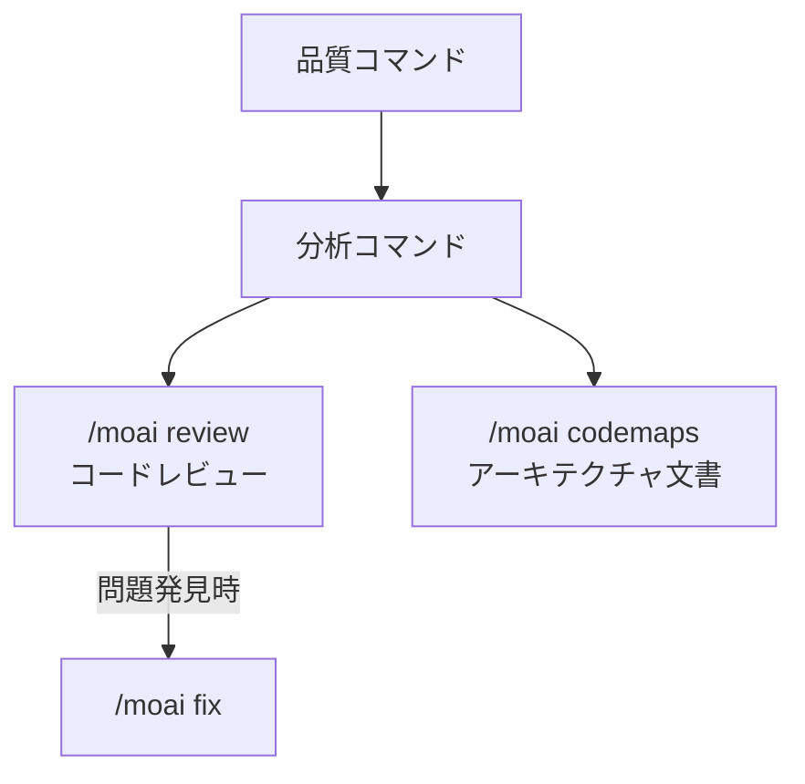

MoAI-ADK のコード品質管理コマンドを紹介します。


品質コマンドは、**コードレビュー、テストカバレッジ、E2E テスト、アーキテクチャ分析**に特化したコマンドです。コード品質を体系的に管理・改善できます。


## コマンド比較

| コマンド | 目的 | 実行方式 | 使用タイミング |
|----------|------|----------|----------------|
| `/moai review` | コードレビュー | セキュリティ/性能/品質/UX の 4 観点分析 | PR 前にコードレビューが必要なとき |
| `/moai codemaps` | アーキテクチャ文書 | コードベース構造分析と文書化 | プロジェクトアーキテクチャを把握したいとき |

## コマンド関係図


**どのコマンドを使えばいいかわからない場合**

- コード品質を全体的にチェックしたい → `/moai review`
- プロジェクト構造を理解して文書化したい → `/moai codemaps`

