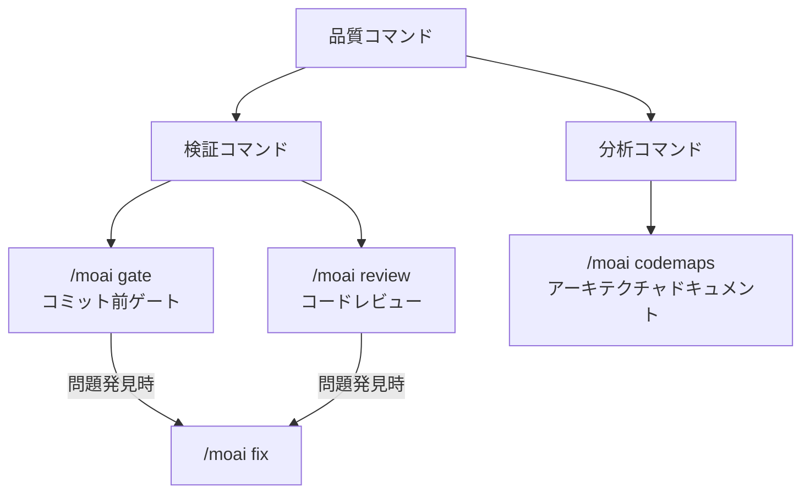

コード品質を検証し、アーキテクチャをドキュメント化するコマンド群です。


品質コマンドは **コミット前ゲート、多視点コードレビュー、アーキテクチャ分析** に特化したコマンドです。TRUST 5 品質フレームワークを日常のワークフローの中で実行する表面です。


## 品質ゲートもハーネスの一部

v3 のエージェンティックハーネスは「エージェントがうまく働ける環境」を意味し、品質ゲートはその環境の中核部品です。エージェントが作った成果物を「できた気がする」ではなく、lint・テスト・レビューという **証拠** で判定する仕組みだからです。検証の深さも作業サイズに合わせて選びます — コミット直前には 30 秒以内に終わる `/moai gate`、PR 直前には 4 つの視点による `/moai review`。毎回いちばん重い検査を回さないことがトークノミクスです。

## コマンド比較

| コマンド | 目的 | 実行方式 | 使用タイミング |
|--------|------|-----------|-----------|
| `/moai gate` | コミット前品質ゲート | lint + format + type-check + test を並列実行 (<30秒) | すべての commit 直前 |
| `/moai review` | コードレビュー | セキュリティ/パフォーマンス/品質/UX の 4 視点分析 | PR 前にコードレビューが必要なとき |
| `/moai codemaps` | アーキテクチャドキュメント | コードベース構造の分析とドキュメント化 | プロジェクトのアーキテクチャを把握したいとき |

## コマンド関係図

```mermaid
flowchart TD
    A[品質コマンド] --> B[検証コマンド]
    A --> C[分析コマンド]

    B --> G["/moai gate<br/>コミット前ゲート"]
    B --> D["/moai review<br/>コードレビュー"]
    C --> E["/moai codemaps<br/>アーキテクチャドキュメント"]

    G -->|問題発見時| H["/moai fix"]
    D -->|問題発見時| H
```


**どのコマンドを使えばよいか分からないときは?**

- コミットする前に素早くセーフティネットを回したい → `/moai gate`
- コード品質を全体的に点検したい → `/moai review`
- プロジェクト構造を理解してドキュメント化したい → `/moai codemaps`

