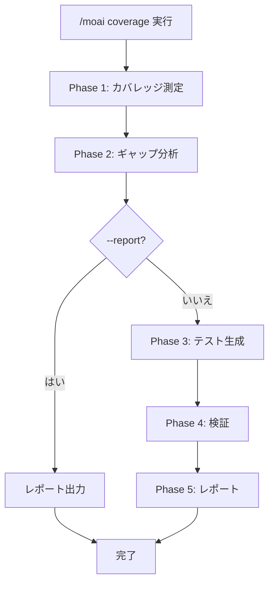
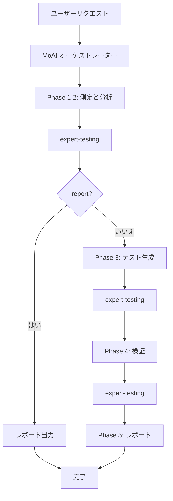

テストカバレッジを分析し、ギャップを特定し、不足しているテストを自動生成するコマンドです。


**一言まとめ**: `/moai coverage` は「テストギャップハンター」です。言語別カバレッジツールで **正確に測定** し、優先度別に **不足テストを自動生成** します。



**スラッシュコマンド**: Claude Code で `/moai:coverage` と入力すると、このコマンドを直接実行できます。`/moai` だけ入力すると、利用可能なすべてのサブコマンドの一覧が表示されます。


## 概要

テストカバレッジを向上させるには、まずどこが不足しているかを知る必要があります。`/moai coverage` は言語別の専用ツールでカバレッジを正確に測定し、リスク度に応じてギャップを優先順位で分類し、不足しているテストを自動生成します。

`quality.yaml` の `development_mode` 設定に応じて、TDD または DDD 方式のテストを生成します。

## 使用法

```bash
# プロジェクト全体のカバレッジ分析とテスト生成
> /moai coverage

# カバレッジ目標 85% で分析
> /moai coverage --target 85

# 特定ファイルのみ分析
> /moai coverage --file src/auth/

# レポートのみ生成 (テスト生成なし)
> /moai coverage --report

# 未カバー行のみ表示
> /moai coverage --uncovered

# クリティカルパスのみに集中
> /moai coverage --critical
```

## サポートされるフラグ

| フラグ | 説明 | 例 |
|--------|------|----|
| `--target N` | カバレッジ目標パーセント (デフォルト: quality.yaml の test_coverage_target) | `/moai coverage --target 85` |
| `--file PATH` | 特定ファイルまたはディレクトリのみ分析 | `/moai coverage --file src/auth/` |
| `--report` | レポートのみ生成、テスト生成なし | `/moai coverage --report` |
| `--package PKG` | 特定パッケージ (Go) またはモジュールのみ分析 | `/moai coverage --package pkg/api` |
| `--uncovered` | 未カバーの行/関数のみ表示 | `/moai coverage --uncovered` |
| `--critical` | クリティカルパス (高い fan_in、パブリック API) に集中 | `/moai coverage --critical` |

### --target フラグ

カバレッジ目標を指定します。未指定の場合、`quality.yaml` の `test_coverage_target` 値を使用します (デフォルト: 85%):

```bash
# 90% カバレッジ達成目標
> /moai coverage --target 90
```

### --report フラグ

テストを生成せず、ギャップ分析レポートのみ出力します:

```bash
> /moai coverage --report
```

現在の状態を把握したい場合に便利です。

### --critical フラグ

P1 (パブリック API、高い fan_in) および P2 (ビジネスロジック、エラーハンドリング) のみに集中します:

```bash
> /moai coverage --critical
```

## 実行プロセス

`/moai coverage` は5段階で実行されます。



### Phase 1: カバレッジ測定

言語別の専用ツールで正確なカバレッジを測定します:

| 言語 | カバレッジツール | 実行コマンド |
|------|----------------|-------------|
| **Go** | go test + cover | `go test -coverprofile=coverage.out -covermode=atomic ./...` |
| **Python** | pytest-cov または coverage | `pytest --cov --cov-report=json` |
| **TypeScript/JavaScript** | vitest または jest | `vitest run --coverage` |
| **Rust** | cargo-llvm-cov | `cargo llvm-cov --json` |

測定結果:
- 全体カバレッジパーセント
- ファイル別カバレッジパーセント
- 関数別カバレッジデータ (カバー済み/未カバー行)
- ブランチカバレッジ (利用可能な場合)

### Phase 2: ギャップ分析

カバレッジターゲット未達のファイルを特定し、優先順位で分類します:

| 優先度 | 条件 | 説明 |
|--------|------|------|
| **P1 (クリティカル)** | パブリック API 関数、fan_in >= 3、@MX:ANCHOR | 最優先テスト必要 |
| **P2 (高)** | ビジネスロジック、エラーハンドリングパス | ビジネス影響の大きいコード |
| **P3 (中)** | 内部ユーティリティ、ヘルパー関数 | ターゲット未達時テスト必要 |
| **P4 (低)** | 生成コード、設定、単純な getter/setter | ターゲットから除外可能 |

### Phase 3: テスト生成

`quality.yaml` の `development_mode` に応じて異なる方法でテストを生成します:

| モード | テスト方式 | 説明 |
|--------|-----------|------|
| **TDD** | RED-GREEN-REFACTOR | 失敗するテストを先に作成して検証 |
| **DDD** | 特性化テスト | 既存の動作をキャプチャするテスト作成 |

テスト生成順: P1 → P2 → P3 → P4 スキップ

各ギャップに対して:
- テーブルドリブンテスト (Go) またはパラメータ化テスト (Python/TS)
- エッジケースとエラーシナリオを含む
- コードベースの既存テストパターンに従う
- ファイル命名規則を遵守 (`*_test.go`, `*.test.ts`, `test_*.py`)

### Phase 4: 検証

テスト生成後:
- 完全なテストスイートを実行してリグレッションがないことを確認
- カバレッジを再測定して改善を確認
- 前後のカバレッジパーセントを比較
- ターゲット達成を確認

### Phase 5: レポート

```
## カバレッジレポート

### Before: 72.5% -> After: 88.3%
### ターゲット: 85% - 達成

### 生成されたテスト: 8個
- auth_test.go: TestAuthenticateUser (P1 ギャップカバー)
- auth_test.go: TestValidateToken (P1 ギャップカバー)
- handler_test.go: TestErrorHandling (P2 ギャップカバー)

### パッケージ別カバレッジ
| パッケージ | Before | After | ターゲット | 状態 |
|-----------|--------|-------|-----------|------|
| pkg/api | 70% | 88% | 85% | PASS |
| pkg/core | 45% | 82% | 85% | FAIL |

### 残りのギャップ
- pkg/core: 3% 不足 (2関数が未カバー)
```

## エージェント委任チェーン



**エージェントの役割:**

| エージェント | 役割 | 主な作業 |
|-------------|------|----------|
| **MoAI オーケストレーター** | ワークフロー調整、ユーザーインタラクション | レポート出力、次のステップ案内 |
| **expert-testing** | 測定、分析、生成、検証の専任 | カバレッジ測定、ギャップ分析、テスト作成、検証 |

## よくある質問

### Q: どのカバレッジツールが使用されますか?

プロジェクト言語に適した標準ツールが自動選択されます。Go は `go test -cover`、Python は `pytest-cov`、TypeScript は `vitest` または `jest` のカバレッジ機能を使用します。

### Q: 生成されたテストの品質はどうですか?

コードベースの既存テストパターンを分析して一貫したスタイルでテストを作成します。テーブルドリブンテスト、エッジケース、エラーシナリオを含みます。

### Q: カバレッジターゲットが達成できない場合は?

残りのギャップリストとともに追加テスト生成オプションが提示されます。P4 (低優先度) ギャップはスキップされるため、100% 達成は不可能な場合があります。

### Q: 特定ファイルをカバレッジ測定から除外できますか?

`quality.yaml` の `coverage_exemptions` 設定で除外できます。ただし、除外率はデフォルトで 5% に制限されています。

## 関連ドキュメント

- [/moai review - コードレビュー](/quality-commands/moai-review)
- [/moai e2e - E2E テスト](/quality-commands/moai-e2e)
- [/moai fix - ワンショット自動修正](/utility-commands/moai-fix)
- [/moai loop - 反復修正ループ](/utility-commands/moai-loop)
