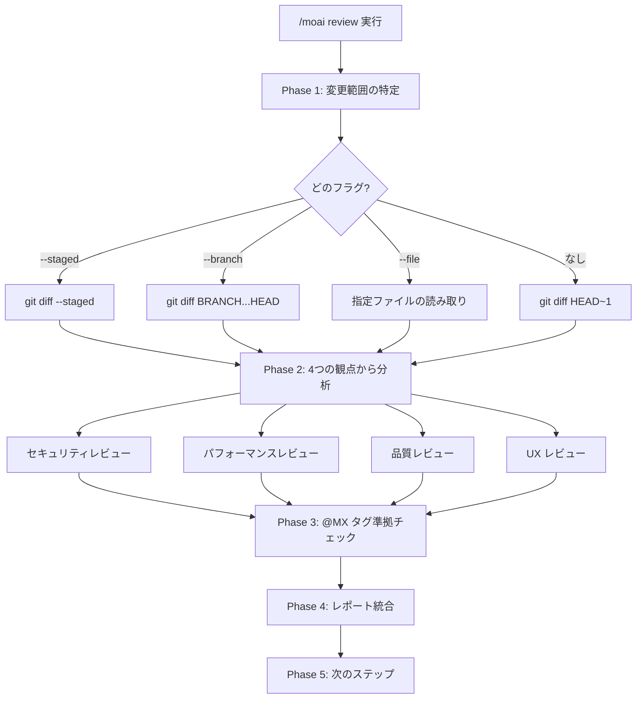
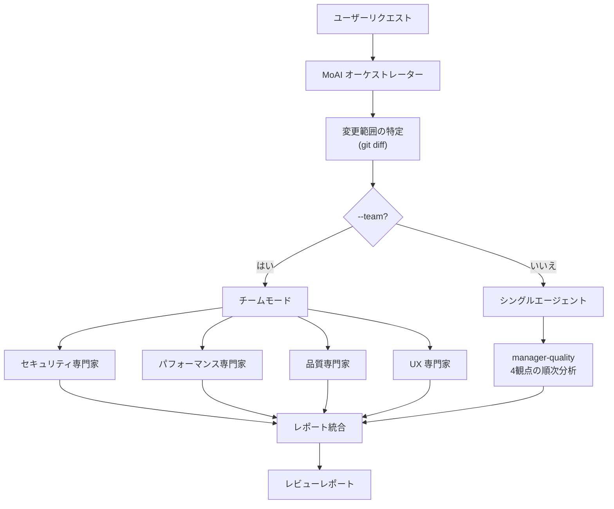

# /moai review

コードベースを **セキュリティ、パフォーマンス、品質、UX** の4つの観点から分析するコードレビューコマンドです。


**一言まとめ**: `/moai review` は「AI コードレビュアー」です。OWASP セキュリティチェックからパフォーマンス分析、TRUST 5 品質検証、UX アクセシビリティまで **4つの観点から同時にレビュー** します。



**スラッシュコマンド**: Claude Code で `/moai:review` と入力すると、このコマンドを直接実行できます。`/moai` だけ入力すると、利用可能なすべてのサブコマンドの一覧が表示されます。


## 概要

コードレビューはソフトウェア品質の核心です。しかし、セキュリティ、パフォーマンス、品質、UX を全て丁寧に確認するのは容易ではありません。`/moai review` は AI が4つの観点から体系的にコードを分析し、重大度別に整理されたレビューレポートを生成します。

@MX タグの準拠状況も合わせて検査し、AI エージェントがコードをより理解しやすくします。

## 使用法

```bash
# 直近のコミット変更をレビュー
> /moai review

# ステージングされた変更のみレビュー
> /moai review --staged

# 特定ブランチとの比較レビュー
> /moai review --branch develop

# セキュリティ重点レビュー
> /moai review --security

# 特定ファイルのみレビュー
> /moai review --file src/auth/service.py
```

## サポートされるフラグ

| フラグ | 説明 | 例 |
|--------|------|----|
| `--staged` | ステージングされた (git add) 変更のみレビュー | `/moai review --staged` |
| `--branch BRANCH` | 指定ブランチと比較レビュー (デフォルト: main) | `/moai review --branch develop` |
| `--security` | セキュリティレビューに集中 (OWASP、インジェクション、認証) | `/moai review --security` |
| `--file PATH` | 特定ファイルのみレビュー | `/moai review --file src/auth/` |
| `--team` | エージェントチームモード (4人の専門レビュアーが並列分析) | `/moai review --team` |

### --staged フラグ

`git add` でステージングした変更のみレビューします。コミット前の最終確認に便利です:

```bash
> git add src/auth/
> /moai review --staged
```

### --security フラグ

セキュリティ観点に集中してより深い分析を行います:

```bash
> /moai review --security
```

OWASP Top 10、インジェクションリスク、認証・認可ロジック、シークレットの露出などを深層分析します。

### --team フラグ

4人の専門レビューエージェントが同時に分析します:

```bash
> /moai review --team
```

セキュリティ、パフォーマンス、品質、UX の専門家がそれぞれ独立してレビューするため、より深い分析が可能です。

## 実行プロセス

`/moai review` は5段階で実行されます。



### Phase 1: 変更範囲の特定

フラグに応じてレビュー対象を決定します:

| 条件 | 使用されるコマンド |
|------|-------------------|
| `--staged` | `git diff --staged` |
| `--branch BRANCH` | `git diff {BRANCH}...HEAD` |
| `--file PATH` | 指定ファイルの直接読み取り |
| フラグなし | `git diff HEAD~1` |

### Phase 2: 4つの観点から分析

4つの専門的な観点からコードを分析します:

#### 観点 1: セキュリティレビュー

| チェック項目 | 説明 |
|-------------|------|
| OWASP Top 10 準拠 | 主要なウェブセキュリティ脆弱性チェック |
| 入力バリデーションとサニタイジング | ユーザー入力処理の安全性 |
| 認証・認可ロジック | アクセス制御の実装検証 |
| シークレットの露出 | API キー、パスワード、トークンの漏洩 |
| インジェクションリスク | SQL、コマンド、XSS、CSRF のリスク |
| 依存関係の脆弱性 | サードパーティライブラリの脆弱性 |

#### 観点 2: パフォーマンスレビュー

| チェック項目 | 説明 |
|-------------|------|
| アルゴリズム複雑度 | O(n) 分析 |
| データベースクエリ効率 | N+1 クエリ、欠落インデックス |
| メモリ使用パターン | メモリリーク、過剰な割り当て |
| キャッシング機会 | キャッシュ適用可能な箇所の特定 |
| バンドルサイズ影響 | フロントエンド変更のバンドルサイズへの影響 |
| 並行処理の安全性 | レースコンディション、デッドロック |

#### 観点 3: 品質レビュー

| チェック項目 | 説明 |
|-------------|------|
| TRUST 5 準拠 | Tested, Readable, Unified, Secured, Trackable |
| 命名規則 | コードの可読性 |
| エラーハンドリング | エラー処理の完全性 |
| テストカバレッジ | 変更されたコードのテスト有無 |
| ドキュメント | パブリック API のドキュメント |
| プロジェクトパターンの一貫性 | 既存コードベースパターンの準拠 |

#### 観点 4: UX レビュー

| チェック項目 | 説明 |
|-------------|------|
| ユーザーフローの整合性 | 既存フローが壊れないか |
| エラー状態 | ユーザー視点のエラーとエッジケース |
| アクセシビリティ | WCAG、ARIA 準拠 |
| ローディング状態 | ローディング表示とフィードバック |
| 破壊的変更 | パブリックインターフェースの互換性 |

### Phase 3: @MX タグ準拠チェック

変更されたファイルの @MX タグ準拠状況を検査します:

- 新しい exported 関数: `@MX:NOTE` または `@MX:ANCHOR` が必要
- 高い fan_in を持つ関数 (>=3 呼び出し元): `@MX:ANCHOR` が必須
- 危険なパターン: `@MX:WARN` が必要
- テストのないパブリック関数: `@MX:TODO` が必要

### Phase 4: レポート統合

重大度別に整理された統合レポートを生成します:

```
## コードレビューレポート

### 致命的な問題 (修正必須)
- [SECURITY] src/auth/service.py:45: SQL インジェクションのリスク
- [PERFORMANCE] src/api/handler.py:23: N+1 クエリパターン

### 警告 (修正推奨)
- [QUALITY] src/utils/helper.py:12: エラーハンドリングの欠落
- [UX] src/components/Form.tsx:88: アクセシビリティ属性の欠落

### 提案 (改善可能)
- [QUALITY] src/models/user.py:34: メソッド分離推奨

### @MX タグ準拠
- 欠落タグ: 3個
- 古いタグ: 1個
- 準拠ファイル: 8/12

### 総合評価
- セキュリティ: PASS
- パフォーマンス: WARN
- 品質: PASS
- UX: WARN
- TRUST 5 スコア: 4/5
```

### Phase 5: 次のステップ

レビュー結果に基づいて次のステップを案内します:

- **自動修正**: `/moai fix` で Level 1-2 の問題を自動解決
- **修正タスク作成**: 各発見事項を個別タスクとして登録
- **レポートエクスポート**: `.moai/reports/` にレビューレポートを保存
- **閉じる**: レビューを確認し、アクションなしで終了

## エージェント委任チェーン



**エージェントの役割:**

| エージェント | 役割 | 主な作業 |
|-------------|------|----------|
| **MoAI オーケストレーター** | 変更特定と結果統合 | git diff、レポート生成 |
| **manager-quality** | コード品質分析 (デフォルトモード) | 4観点の順次分析 |
| **expert-security** | セキュリティ集中分析 (`--security`) | OWASP、インジェクション、認証 |

## よくある質問

### Q: --team モードとデフォルトモードの違いは?

デフォルトモードは `manager-quality` エージェントが4つの観点を順次分析します。`--team` モードは4人の専門レビュアーが同時に分析するため、より深い分析が可能ですが、トークン消費は約4倍になります。

### Q: PR 前のレビューに最適なフラグの組み合わせは?

`/moai review --staged` でステージングされた変更のみレビューするのが最も効率的です。セキュリティが重要な場合は `/moai review --staged --security` を使用してください。

### Q: @MX タグチェックをスキップできますか?

現時点では、@MX タグチェックは常に含まれます。結果はレポートの別セクションに表示され、タグは自動的に追加されません。

### Q: レビューで見つかった問題を自動修正できますか?

はい、レビュー後に `/moai fix` を実行すると Level 1-2 の問題を自動修正できます。Level 3-4 の問題は手動確認が必要です。

## 関連ドキュメント

- [/moai fix - ワンショット自動修正](/utility-commands/moai-fix)
- [/moai coverage - カバレッジ分析](/quality-commands/moai-coverage)
- [/moai e2e - E2E テスト](/quality-commands/moai-e2e)
- [/moai codemaps - アーキテクチャドキュメント](/quality-commands/moai-codemaps)
