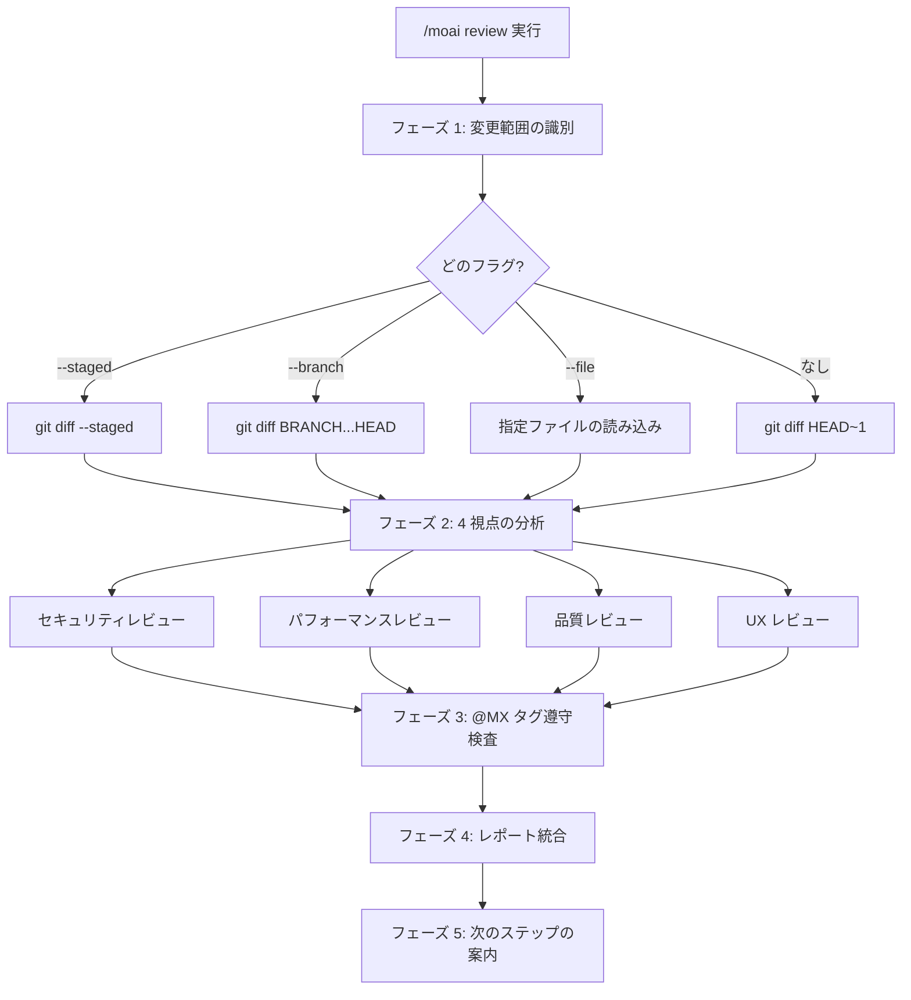
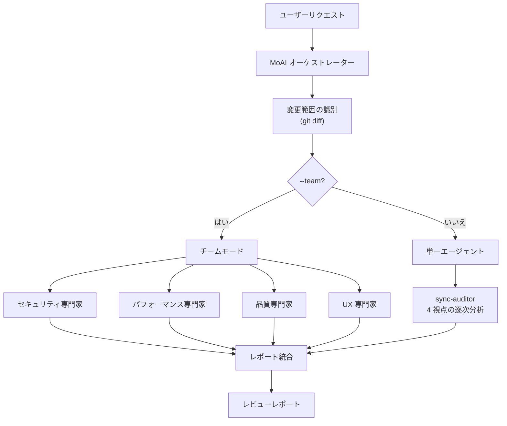

コードベースを **セキュリティ、パフォーマンス、品質、UX** の 4 つの視点から分析するコードレビューコマンドです。


**一言まとめ**: `/moai review` は「AI コードレビュアー」です。OWASP セキュリティ点検からパフォーマンス分析、TRUST 5 品質検証、UX アクセシビリティまで **4 つの視点から同時にレビュー** します。



**スラッシュコマンド**: Claude Code で `/moai:review` と入力すると、このコマンドをすぐに実行できます。`/moai` だけを入力すると、使用可能なすべてのサブコマンドの一覧が表示されます。


## 概要

コードレビューはソフトウェア品質の中核です。しかし、セキュリティ、パフォーマンス、品質、UX をすべて丁寧に確認するのは簡単ではありません。`/moai review` は AI が 4 つの視点から体系的にコードを分析し、深刻度別に整理されたレビューレポートを生成します。

レビューの基本担当は **sync-auditor** — コードを作ったエージェントではない独立した評価者です。作った本人が検査しないというハーネス原則が、レビューコマンドにもそのまま適用されます。@MX タグの遵守状況も併せて検査し、AI エージェントがコードをよりよく理解できるよう支援します。

## 使い方

```bash
# 直近のコミットの変更をレビュー
> /moai review

# ステージング済みの変更のみレビュー
> /moai review --staged

# 特定ブランチと比較してレビュー
> /moai review --branch develop

# セキュリティ集中レビュー
> /moai review --security

# 特定ファイルのみレビュー
> /moai review --file src/auth/service.py
```

## サポートされるフラグ

| フラグ | 説明 | 例 |
|-------|------|------|
| `--staged` | ステージング済み (git add) の変更のみレビュー | `/moai review --staged` |
| `--branch BRANCH` | 指定ブランチとの比較レビュー (デフォルト: main) | `/moai review --branch develop` |
| `--security` | セキュリティレビューに集中 (OWASP、インジェクション、認証) | `/moai review --security` |
| `--file PATH` | 特定ファイルのみレビュー | `/moai review --file src/auth/` |
| `--team` | エージェントチームモード (4 名の専門レビュアーが並列分析) | `/moai review --team` |

### --staged フラグ

`git add` でステージングした変更のみをレビューします。コミット前の最終チェックに便利です:

```bash
> git add src/auth/
> /moai review --staged
```

### --security フラグ

セキュリティの視点に集中し、より深い分析を行います:

```bash
> /moai review --security
```

OWASP Top 10、インジェクションリスク、認証/認可ロジック、シークレット露出などを詳細に分析します。

### --team フラグ

4 名の専門レビューエージェントが同時に分析します:

```bash
> /moai review --team
```

セキュリティ、パフォーマンス、品質、UX の専門家がそれぞれ独立してレビューするため、より深い分析が可能です。その分トークン消費も大きくなるため (約 4 倍)、セキュリティ・決済のように重要度の高い変更に選択的に使うのが経済的です。

## 実行プロセス

`/moai review` は 5 つのフェーズで実行されます。


```mermaid
flowchart TD
    Start["/moai review 実行"] --> Phase1["フェーズ 1: 変更範囲の識別"]

    Phase1 --> Scope{"どのフラグ?"}
    Scope -->|--staged| Staged["git diff --staged"]
    Scope -->|--branch| Branch["git diff BRANCH...HEAD"]
    Scope -->|--file| File["指定ファイルの読み込み"]
    Scope -->|なし| Recent["git diff HEAD~1"]

    Staged --> Phase2["フェーズ 2: 4 視点の分析"]
    Branch --> Phase2
    File --> Phase2
    Recent --> Phase2

    Phase2 --> Security["セキュリティレビュー"]
    Phase2 --> Performance["パフォーマンスレビュー"]
    Phase2 --> Quality["品質レビュー"]
    Phase2 --> UX["UX レビュー"]

    Security --> Phase3["フェーズ 3: @MX タグ遵守検査"]
    Performance --> Phase3
    Quality --> Phase3
    UX --> Phase3

    Phase3 --> Phase4["フェーズ 4: レポート統合"]
    Phase4 --> Phase5["フェーズ 5: 次のステップの案内"]
```

### フェーズ 1: 変更範囲の識別

フラグに応じてレビュー対象を決定します:

| 条件 | 使用されるコマンド |
|------|----------------|
| `--staged` | `git diff --staged` |
| `--branch BRANCH` | `git diff {BRANCH}...HEAD` |
| `--file PATH` | 指定ファイルを直接読み込み |
| フラグなし | `git diff HEAD~1` |

コードベース全体ではなく変更範囲だけをレビュー対象にするのも、トークン効率のための設計です。

### フェーズ 2: 4 視点の分析

4 つの専門視点からコードを分析します:

#### 視点 1: セキュリティレビュー

| 検査項目 | 説明 |
|-----------|------|
| OWASP Top 10 遵守 | 主要な Web セキュリティ脆弱性の点検 |
| 入力検証とサニタイズ | ユーザー入力処理の安全性 |
| 認証/認可ロジック | アクセス制御実装の検証 |
| シークレット露出 | API キー、パスワード、トークンの漏洩有無 |
| インジェクションリスク | SQL、コマンド、XSS、CSRF リスク |
| 依存関係の脆弱性 | サードパーティライブラリの脆弱性 |

#### 視点 2: パフォーマンスレビュー

| 検査項目 | 説明 |
|-----------|------|
| アルゴリズム計算量 | O(n) 分析 |
| データベースクエリ効率 | N+1 クエリ、欠落インデックス |
| メモリ使用パターン | メモリリーク、過剰なアロケーション |
| キャッシュ機会 | キャッシュ適用可能な箇所の識別 |
| バンドルサイズ | フロントエンド変更のバンドルサイズへの影響 |
| 並行性の安全性 | レースコンディション、デッドロック |

#### 視点 3: 品質レビュー

| 検査項目 | 説明 |
|-----------|------|
| TRUST 5 遵守 | Tested, Readable, Unified, Secured, Trackable |
| 命名規則 | コードの可読性 |
| エラーハンドリング | エラー処理の完全性 |
| テストカバレッジ | 変更されたコードのテスト有無 |
| ドキュメント化 | 公開 API のドキュメント有無 |
| プロジェクトパターンの一貫性 | 既存コードベースパターンの遵守 |

#### 視点 4: UX レビュー

| 検査項目 | 説明 |
|-----------|------|
| ユーザーフロー | 既存フローの破壊有無 |
| エラー状態 | ユーザー視点のエラーとエッジケース |
| アクセシビリティ | WCAG、ARIA 遵守 |
| ローディング状態 | ローディング表示とフィードバック |
| 破壊的変更 | 公開インターフェースの互換性 |

### フェーズ 3: @MX タグ遵守検査

変更されたファイルの @MX タグ遵守状況を検査します:

- 新しい exported 関数: `@MX:NOTE` または `@MX:ANCHOR` が必要
- 高 fan_in 関数 (>=3 呼び出し): `@MX:ANCHOR` 必須
- 危険なパターン: `@MX:WARN` が必要
- テストのない公開関数: `@MX:TODO` が必要

### フェーズ 4: レポート統合

深刻度別に整理された統合レポートを生成します:

```
## コードレビューレポート

### 致命的な問題 (必ず修正)
- [SECURITY] src/auth/service.py:45: SQL インジェクションの可能性
- [PERFORMANCE] src/api/handler.py:23: N+1 クエリパターン

### 警告 (修正推奨)
- [QUALITY] src/utils/helper.py:12: エラーハンドリングの欠落
- [UX] src/components/Form.tsx:88: アクセシビリティ属性の欠落

### 提案 (改善可能)
- [QUALITY] src/models/user.py:34: メソッド分離を推奨

### @MX タグ遵守
- 欠落タグ: 3 件
- 古いタグ: 1 件
- 遵守ファイル: 8/12

### 総合評価
- セキュリティ: PASS
- パフォーマンス: WARN
- 品質: PASS
- UX: WARN
- TRUST 5 スコア: 4/5
```

### フェーズ 5: 次のステップの案内

レビュー結果に応じて次のステップを案内します:

- **自動修正**: `/moai fix` で Level 1-2 の問題を自動解決
- **修正タスクの作成**: 各発見事項を個別タスクとして登録
- **レポートのエクスポート**: `.moai/reports/` にレビューレポートを保存
- **クローズ**: レビュー確認後、追加対応なしで終了

## エージェント委任チェーン


```mermaid
flowchart TD
    User["ユーザーリクエスト"] --> MoAI["MoAI オーケストレーター"]
    MoAI --> Identify["変更範囲の識別<br/>(git diff)"]
    Identify --> Agent{"--team?"}

    Agent -->|はい| Team["チームモード"]
    Agent -->|いいえ| Single["単一エージェント"]

    Team --> R1["セキュリティ専門家"]
    Team --> R2["パフォーマンス専門家"]
    Team --> R3["品質専門家"]
    Team --> R4["UX 専門家"]

    Single --> Quality["sync-auditor<br/>4 視点の逐次分析"]

    R1 --> Consolidate["レポート統合"]
    R2 --> Consolidate
    R3 --> Consolidate
    R4 --> Consolidate
    Quality --> Consolidate

    Consolidate --> Report["レビューレポート"]
```

**エージェントの役割:**

| エージェント | 役割 | 主な作業 |
|----------|------|----------|
| **MoAI オーケストレーター** | 変更の識別と結果の統合 | git diff、レポート生成 |
| **sync-auditor** | コード品質分析 (デフォルトモード) | 4 視点の逐次分析 |
| **manager-develop** | セキュリティ集中分析 (`--security`) | OWASP、インジェクション、認証 |

## よくある質問

### Q: --team モードとデフォルトモードの違いは?

デフォルトモードは `sync-auditor` エージェントが 4 つの視点を順番に分析します。`--team` モードは 4 名の専門レビュアーが同時に分析するため、より深い分析が可能ですが、トークン消費が約 4 倍になります。

### Q: PR 前レビューに最適なフラグの組み合わせは?

`/moai review --staged` でステージング済みの変更のみをレビューするのが最も効率的です。セキュリティが重要な場合は `/moai review --staged --security` を使用してください。

### Q: @MX タグ検査をスキップできますか?

現在、@MX タグ検査は常に含まれます。検査結果はレポートに独立したセクションとして表示され、タグの追加は自動では行われません。

### Q: レビューで発見された問題を自動で修正できますか?

はい、レビュー完了後の次のステップで `/moai fix` を実行すると、Level 1-2 の問題を自動で修正できます。Level 3-4 の問題は手動確認が必要です。

## 関連ドキュメント

- [/moai gate - コミット前品質ゲート](/quality-commands/moai-gate)
- [/moai fix - ワンショット自動修正](/utility-commands/moai-fix)
- [/moai codemaps - アーキテクチャドキュメント](/quality-commands/moai-codemaps)
