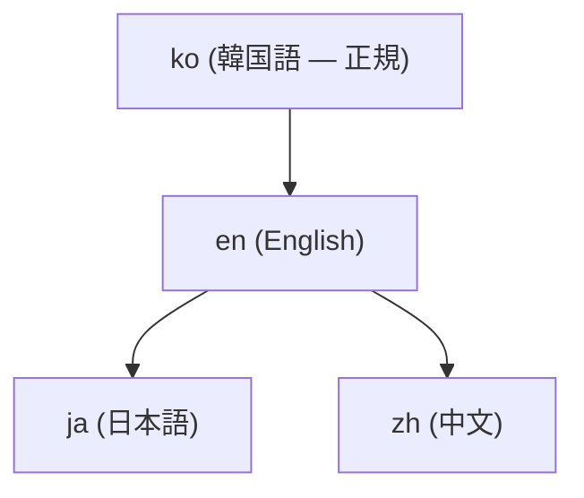

# 4ロケイルドキュメントと翻訳

このドキュメントサイト（adk.mo.ai.kr）は**4つの言語**で同じ内容を提供します — 韓国語(ko)、英語(en)、日本語(ja)、中国語(zh)。すべてのページが4つの言語に同じ重みで存在することがルールです。このページはその構造を説明し、翻訳問題をどう報告するかを案内します。

## 4つのロケイルの位置

各ロケイルはドキュメントルートの下に自分のディレクトリを持ちます。

| ロケイル | 言語 | パス |
|--------|------|------|
| **ko** | 韓国語 | `/ko/...`（サイトデフォルト言語） |
| **en** | English | `/en/...` |
| **ja** | 日本語 | `/ja/...` |
| **zh** | 中文 | `/zh/...` |

`ko`がサイトのデフォルト言語です（Hugo設定`defaultContentLanguage = "ko"`）。サイト上部の言語セレクターで4ロケイル間を行き来できます。

## 正規連鎖 — どこから翻訳が始まるか

ドキュメントの原典（正規ロケイル）は**韓国語(ko)**です。翻訳は決まった順序に従います。

- **ko**が正規原典です。新しいページはkoでまず書かれます。
- **en**はkoから派生します。
- **ja**と**zh**はenを経て派生します。

韓国語ページを修正すると、同じ変更がen·ja·zhの対応ページにも一緒に反映されなければなりません。


**正規ロケイルでだけ修正してください。** 翻訳ロケイル(en·ja·zh)で原文を「修正する」ことは禁止されています。翻訳がおかしいなら、大抵の場合原文(ko)が翻訳を誤って導いている可能性があります。翻訳ページを直接修正せず、原文ページの修正を提案してください。


## 4ロケイル同時更新義務

すべてのドキュメント変更は**1つのPRで4つのロケイルすべて**に反映されなければなりません。韓国語ページだけ修正して残り3つのロケイルを後回しにするとロケイル間不整合が生じます。新しいページを作るときも同じです — 4ロケイルのページが1つの束で上がります。

## 何が保存され、何が翻訳されるか

翻訳が**変えないもの**（ロケイルを横断する共通ルール）:

- **Mermaidダイアグラム方向** — `flowchart TD` / `graph TB`のみ許可されます。`LR`/`RL`方向は禁止で、翻訳が方向を変えません。
- **コードブロック** — コマンド・コード・フラグはそのままにします。コメント内の自然言語だけ翻訳します。
- **URLホワイトリスト** — `adk.mo.ai.kr`と`github.com/modu-ai`のみ許可されます。それ以外の変形ドメイン（`docs`+`moai-ai`+`dev`系、`adk`+`moai`+`com`系、ドット位置が異なる`adk`+`moai`+`kr`系）はどのロケイルでも使いません。有効なドメインは正確に`adk.mo.ai.kr`です — ドット1つでも違ってはなりません。
- **装飾絵文字禁止** — 本文の装飾用絵文字の代わりに``shortcodeを使います。タイポグラフィ記号（`→ ← ↓ ✓ ✗`）は絵文字ではないのでそのままにします。
- **バージョン** — `hugo.toml`の`params.version` / `params.releaseDate`が単一原典です。ページにバージョンを直接書かず``shortcodeを使います。

翻訳が**変えるもの**:

- 本文散文 — 各ロケイルの自然言語で。
- UIラベルとメニュー — サイトメニュー（`data/menu/main.yaml`）の名前マップはロケイルごとに翻訳されます。
- ドキュメントタイトル — frontmatterの`title`は各言語に翻訳されます。

## 翻訳品質 — 翻訳調を避ける

英語が原典言語で他の言語は派生されるため、翻訳が英語の文構造をそのまま移す「翻訳調」(calque)に陥りやすいです。各言語の自然な表現を使います。

- 韓国語で「3つの軸」/「7つの柱」のような構造的比喩は避けます。「3つの核心」/「7つの強点」が自然です。
- 英語の比喩的表現を単語単位で移さず、各言語で同じ意味を伝える普遍的表現を探します。
- 会話体散文と文語体散文を区別します — ガイドの散文はきれいな文語体で書きます。

## 翻訳問題をどう報告するか

翻訳エラーやロケイル間不整合を発見したら、GitHub Issueで知らせてください。

1. **どのページか** — URL（例: `https://adk.mo.ai.kr/ja/core-concepts/trust-5/`）を書いてください。
2. **どのロケイルか** — 4つのロケイルの中のどこか（ko/en/ja/zh）明示してください。
3. **問題が何か** — 翻訳エラー、抜けた段落、ロケイル間不整合、用語不整合などを知らせてください。
4. **提案があれば** — 自然な代替表現を共に書いてくれると反映に役立ちます。

Issueは[github.com/modu-ai/moai-adk/issues](https://github.com/modu-ai/moai-adk/issues)で開きます。Claude Codeセッション内では`/moai feedback`コマンドでもIssueを開けます。


**原文が疑わしいとき。** 翻訳がおかしいといって翻訳ページを先に疑わないでください。韓国語原文(ko)の表現が翻訳を誤って導いているケースが多いです。この場合原文修正と翻訳修正が1つの束で処理されます。


## READMEも同じ構造です

このドキュメントサイトだけでなく、GitHubリポジトリのREADMEも4つの言語で提供されます。ただ、READMEはサイトと逆に**英語(en)が正規**で韓国語・日本語・中国語が派生されます。ドキュメントサイト（ko正規）とREADME(en正規)の正規ロケイルが異なる点に注意してください。

- **ドキュメントサイト**（このサイト） — ko正規、en·ja·zh派生。
- **README**（GitHubリポジトリ） — `README.md`(en)正規、`README.ko.md` / `README.ja.md` / `README.zh.md`派生。

両方の表面とも4つのロケイルが1つの変更束で更新されるルールは同じです。

## 関連ドキュメント

- [始め方](/ja/getting-started/) — インストールとクイックスタート
- [MoAI-ADKとは？](/ja/core-concepts/what-is-moai-adk/) — プロジェクト概要
- [GitHubリポジトリ](https://github.com/modu-ai/moai-adk) — Issueと貢献
