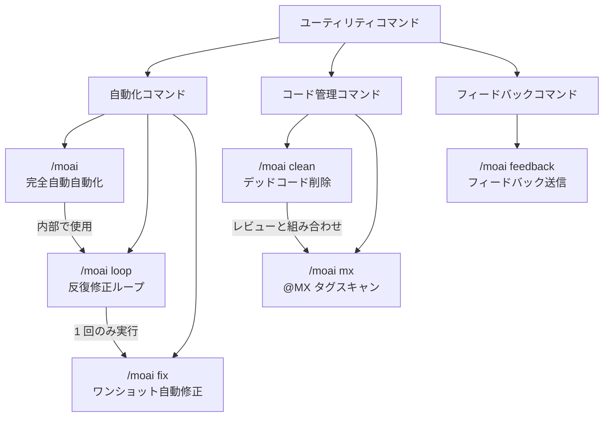

MoAI-ADK の自動化とフィードバックコマンドの概要。


ユーティリティコマンドは**高速な自動化と問題解決**に特化しています。ワークフローコマンド (`/moai plan`、`/moai run`、`/moai sync`) とは異なります。


## コマンド比較

| コマンド | 目的 | 実行方法 | 使用タイミング |
|---------|---------|------------------|-------------|
| `/moai` | 完全自動自動化 | SPEC 作成から文書化まで全プロセス | 機能を最初から最後まで委任したい場合 |
| `/moai loop` | 反復修正ループ | 診断 → 修正 → 検証を繰り返し | 複数のエラーを一度に修正したい場合 |
| `/moai fix` | ワンショット自動修正 | 診断 → 修正 → 完了 (1 回のみ) | リンターエラーやタイプエラーを迅速に修正したい場合 |
| `/moai clean` | デッドコード削除 | 静的解析 → 使用グラフ → 安全な削除 | 未使用コードを整理したい場合 |
| `/moai mx` | @MX タグスキャン | 3 パススキャン → 自動タグ挿入 | コードに AI コンテキストアノテーションを追加したい場合 |
| `/moai feedback` | フィードバック送信 | GitHub Issue を自動作成 | MoAI-ADK へのバグ報告や改善提案を送りたい場合 |

## コマンド関係図


**どのコマンドを使用すべきかわかりませんか?**

- 機能を最初から作成したい → `/moai`
- コードの多くのエラーを反復的に修正したい → `/moai loop`
- 簡単なリンターエラーを迅速に修正したい → `/moai fix`
- 未使用コードを整理したい → `/moai clean`
- AI がコードをよりよく理解できるようタグを付けたい → `/moai mx`
- MoAI-ADK 自体に問題がある → `/moai feedback`

