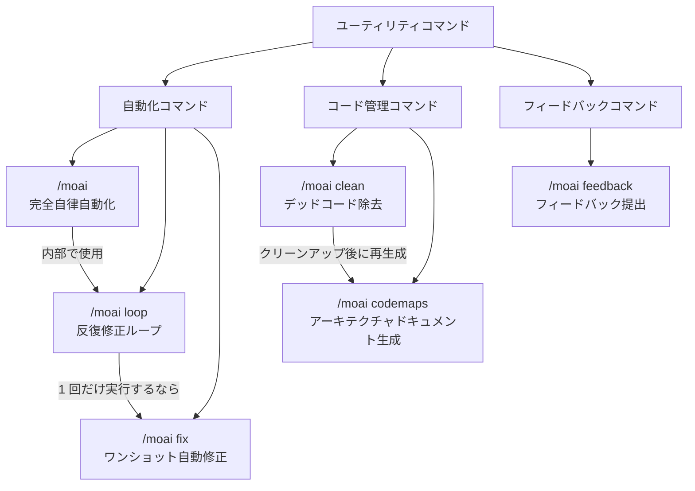

自律的な自動化と反復修正ループ、コード管理、フィードバックのコマンド群です。


ユーティリティコマンドはワークフローコマンド (`/moai plan`, `/moai run`, `/moai sync`) とは異なり、**素早い自動化と問題解決** に特化したコマンドです。


## エージェンティックループエンジニアリングの実行表面

v3 の第 2 の柱である **エージェンティックループエンジニアリング** が実際に回る場所がこのセクションです。`/moai loop` は診断ツールが見つけた問題キューが空になるまで反復する診断型ループであり、`/moai goal` は完了条件を宣言すると条件が満たされるまでセッションが自ら働く条件宣言型ループです。`/moai fix` は同じ系列のワンショット (1 回) プリセットです。ループが回りながら残した観察はハーネス学習の原料になります — ループが観察を蓄積し、ハーネスが学習して指針が進化する再帰的な環の入口です。

## コマンド比較

| コマンド | 目的 | 実行方式 | 使用タイミング |
|--------|------|-----------|-----------|
| `/moai` | 完全自律自動化 | SPEC 生成からドキュメント化まで全工程 | 新機能を最初から最後まで任せたいとき |
| `/moai goal` | 条件宣言型自律ループ | 完了条件を満たすまでターンを続ける | 「テストが全部通るまで」のように終了状態を宣言したいとき |
| `/moai loop` | 反復修正ループ | 診断 → 修正 → 検証を反復 | 複数のエラーをまとめて解決したいとき |
| `/moai fix` | ワンショット自動修正 | 診断 → 修正 → 完了 (1 回) | lint エラーや型エラーを素早く直したいとき |
| `/moai clean` | デッドコード除去 | 静的分析 → 使用グラフ → 安全な除去 | 未使用コードを整理したいとき |
| `/moai codemaps` | アーキテクチャドキュメント生成 | コードベーススキャン → 構造ドキュメント自動生成 | プロジェクトのアーキテクチャドキュメントを作成したいとき |
| `/moai feedback` | フィードバック提出 | GitHub Issue の自動作成 | MoAI-ADK にバグレポートや改善提案を送るとき |

## コマンド関係図

```mermaid
flowchart TD
    A[ユーティリティコマンド] --> B[自動化コマンド]
    A --> C[コード管理コマンド]
    A --> D[フィードバックコマンド]

    B --> E["/moai<br/>完全自律自動化"]
    B --> F["/moai loop<br/>反復修正ループ"]
    B --> G["/moai fix<br/>ワンショット自動修正"]
    C --> H["/moai clean<br/>デッドコード除去"]
    C --> I["/moai codemaps<br/>アーキテクチャドキュメント生成"]
    D --> J["/moai feedback<br/>フィードバック提出"]

    E -->|内部で使用| F
    F -->|1 回だけ実行するなら| G
    H -->|クリーンアップ後に再生成| I
```


**どのコマンドを使えばよいか分からないときは?**

- 機能を丸ごと 1 つ作りたい → `/moai`
- 「この条件が満たされるまで自分でやって」なら → `/moai goal`
- コードにエラーが多く、繰り返し修正したい → `/moai loop`
- 簡単な lint エラーだけを素早く直したい → `/moai fix`
- 使っていないコードを整理したい → `/moai clean`
- プロジェクトのアーキテクチャドキュメントを作成したい → `/moai codemaps`
- MoAI-ADK 自体に問題があるなら → `/moai feedback`

