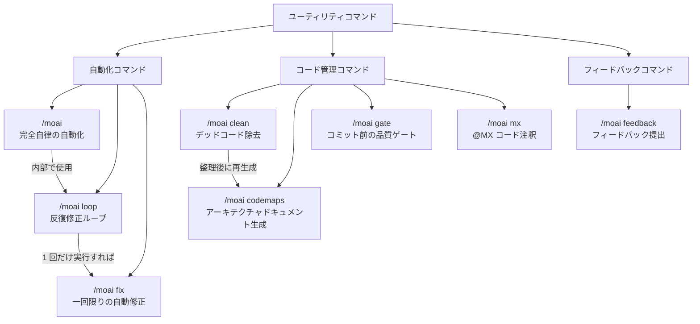

 <strong>所属バリュー</strong>: 🧠 再帰的自己学習 · 🛡️ エージェント型ハーネス

<!-- @value: self-learning, agentic-harness -->

自律的な自動化と反復修正ループ、コード管理、フィードバックコマンドの集まりです。


ユーティリティコマンドはワークフローコマンド (`/moai plan`、`/moai run`、`/moai sync`) とは異なり、**素早い自動化と問題解決** に特化したコマンドです。


## エージェンティックループエンジニアリングの実行表面

v3 の 2 つ目の柱である **エージェンティックループエンジニアリング** (Agentic Loop Engineering) が実際に回る場所がこのセクションです。`/moai loop` は診断ツールが見つけた課題キューを空にするまで反復する診断型ループで、`/moai goal` は完了条件を宣言すると条件が満たされるまでセッションが自ら働く条件宣言型ループです。`/moai fix` は同じ系列の単発 (1 回) プリセットです。ループが回りながら残した観察はハーネス学習の原料になります — ループが観察を蓄積し、ハーネスが学習して指針が進化する再帰ループの入口です。

## コマンド比較

| コマンド | 目的 | 実行方式 | 使用タイミング |
|--------|------|-----------|-----------|
| `/moai` | 完全自律の自動化 | SPEC 生成からドキュメント化まで全過程 | 新機能を最初から最後まで任せたいとき |
| `/moai goal` | 条件宣言型の自律ループ | 完了条件が満たされるまでターンを続ける | 「テストが全部通るまで」のように終わりの状態を宣言したいとき |
| `/moai loop` | 反復修正ループ | 診断 → 修正 → 検証を反復 | 複数のエラーを一度に捕まえたいとき |
| `/moai fix` | 一回限りの自動修正 | 診断 → 修正 → 完了 (1 回) | 素早くリントエラーや型エラーを直したいとき |
| `/moai gate` | コミット前の品質ゲート | リント・フォーマット・型・テスト並列検査 (<30 秒) | コミットする前に素早く合格/失敗を確認したいとき |
| `/moai mx` | @MX コード注釈 | コードベーススキャン → @MX タグ挿入 | AI 文脈用のコードアンカー・危険マーキングを埋め込みたいとき |
| `/moai clean` | デッドコード除去 | 静的分析 → 使用グラフ → 安全な除去 | 未使用コードを整理したいとき |
| `/moai codemaps` | アーキテクチャドキュメント生成 | コードベーススキャン → 構造ドキュメント自動生成 | プロジェクトアーキテクチャドキュメントを作りたいとき |
| `/moai feedback` | フィードバック提出 | GitHub Issue 自動生成 | MoAI-ADK にバグレポートや改善提案を送るとき |

## コマンド関係図

```mermaid
flowchart TD
    A[ユーティリティコマンド] --> B[自動化コマンド]
    A --> C[コード管理コマンド]
    A --> D[フィードバックコマンド]

    B --> E["/moai<br/>完全自律の自動化"]
    B --> F["/moai loop<br/>反復修正ループ"]
    B --> G["/moai fix<br/>一回限りの自動修正"]
    C --> H["/moai clean<br/>デッドコード除去"]
    C --> I["/moai codemaps<br/>アーキテクチャドキュメント生成"]
    C --> K["/moai gate<br/>コミット前の品質ゲート"]
    C --> L["/moai mx<br/>@MX コード注釈"]
    D --> J["/moai feedback<br/>フィードバック提出"]

    E -->|内部で使用| F
    F -->|1 回だけ実行すれば| G
    H -->|整理後に再生成| I
```


**どのコマンドを使えばいいか分からないときは?**

- 機能を 1 つ丸ごと作りたいなら → `/moai`
- 「この条件が満たされるまで任せて」なら → `/moai goal`
- コードにエラーが多くて反復的に直したいなら → `/moai loop`
- 簡単なリントエラーだけ素早く直したいなら → `/moai fix`
- コミット前に合格/失敗だけ素早く確認したいなら → `/moai gate`
- AI 文脈用のコード注釈 (@MX) を埋め込みたいなら → `/moai mx`
- 使っていないコードを整理したいなら → `/moai clean`
- プロジェクトアーキテクチャドキュメントを作りたいなら → `/moai codemaps`
- MoAI-ADK 自体に問題があるなら → `/moai feedback`

