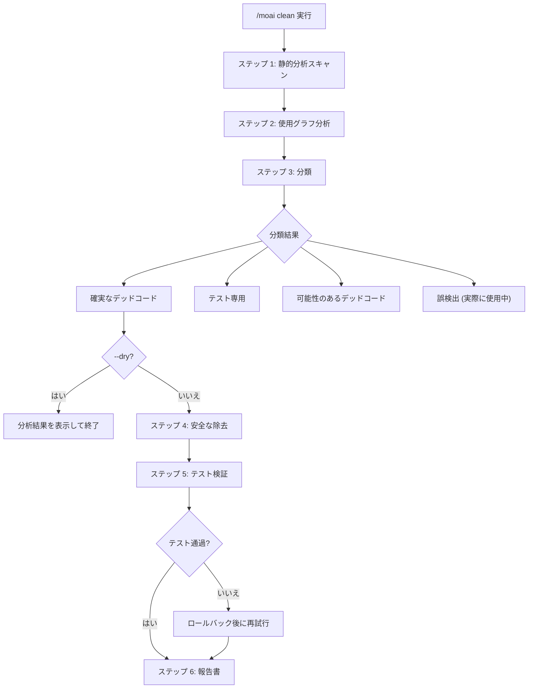
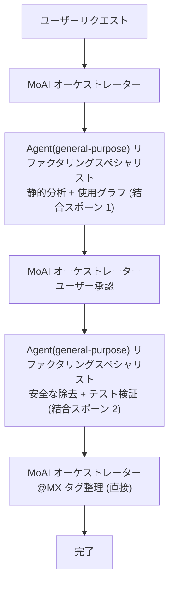

デッドコードの識別および安全な除去コマンドです。静的分析と使用グラフ分析を通じて **未使用コードを見つけ、安全に除去** します。


**一行要約**: `/moai clean` は「コードダイエットツール」です。使っていない関数、変数、import、ファイルを **自動的に見つけて安全に削除** します。



**スラッシュコマンド**: Claude Code で `/moai:clean` と入力すると、このコマンドをすぐに実行できます。`/moai` だけ入力すると、利用可能なすべてのサブコマンド一覧が表示されます。


## 概要

プロジェクトが成長すると、もう使っていないコードが溜まっていきます。未使用の import、呼び出されない関数、参照されない型などがコードベースを複雑にします。`/moai clean` はこうしたデッドコードを静的分析で見つけ出し、テスト検証を経て安全に除去します。

ハーネスエンジニアリングの観点では、このコマンドは **ガベージコレクション** の役割です。死んだコードは人間にとってだけの負担ではなくエージェントにとっても負担です — エージェントが読むコード 1 行 1 行がコンテキスト (トークン) なので、デッドコードの除去はコード衛生であると同時にコンテキストダイエット、すなわちトークノミクスです。

## 使い方

```bash
# 基本的な使い方
> /moai clean

# プレビュー (修正せず確認のみ)
> /moai clean --dry

# 安全な項目のみ除去
> /moai clean --safe-only

# 特定のファイル/ディレクトリのみ分析
> /moai clean --file src/auth/

# 特定のコードタイプのみ分析
> /moai clean --type functions
```

## 対応フラグ

| フラグ | 説明 | 例 |
|-------|------|------|
| `--dry` (または `--dry-run`) | 除去せず分析結果のみ表示 | `/moai clean --dry` |
| `--safe-only` | 確実なデッドコードのみ除去 (不確実な項目はスキップ) | `/moai clean --safe-only` |
| `--file PATH` | 特定のファイルまたはディレクトリのみ分析 | `/moai clean --file src/utils/` |
| `--type TYPE` | 特定のコードタイプのみ分析 | `/moai clean --type imports` |
| `--aggressive` | 使用の少ないコードも含める (1 個の呼び出し元がデッドコードの場合) | `/moai clean --aggressive` |

### --type フラグのオプション

| タイプ | 説明 |
|------|------|
| `functions` | 呼び出されない関数/メソッド |
| `imports` | 参照されない import 文 |
| `types` | 使われない型定義 |
| `variables` | 宣言後に使われない変数 |
| `files` | どこからも import されないファイル |

### --dry フラグ

実際のコードを修正せず、どの項目がデッドコードに分類されるかを事前に確認します:

```bash
> /moai clean --dry
```

このオプションは除去前に分析結果を検討したいときに有用です。

## 実行プロセス

`/moai clean` は 6 ステップで実行されます。



### ステップ 1: 静的分析スキャン

言語別ツールを使ってデッドコード候補を検出します:

| 言語 | 分析ツール | 検査対象 |
|------|-----------|-----------|
| **Go** | `go vet`, `staticcheck`, `deadcode` | 未使用の変数、関数、型 |
| **Python** | `vulture`, `autoflake` | デッドコード、未使用 import |
| **TypeScript/JavaScript** | `ts-prune`, ESLint `no-unused-vars` | 未使用 export、変数 |
| **Rust** | `cargo clippy`, `cargo udeps` | デッドコード警告、未使用の依存性 |

**スキャンカテゴリ:**

- 未使用 import: 参照がない import 文
- 未使用変数: 宣言されたが読まれない変数
- 未使用関数: 定義されたが呼び出されない関数
- 未使用型: 使用場所がない型定義
- 未使用ファイル: どこからも import しないファイル
- デッド依存性: インストールされたが import されないパッケージ

### ステップ 2: 使用グラフ分析

静的分析結果を検証するために使用グラフを構築します:

- 各候補についてコードベース全体で参照を検索
- 間接使用の確認 (インターフェース、リフレクション、動的ディスパッチ)
- テスト専用使用の確認 (テストのみで使用、プロダクションコードで未使用)
- 条件付きコンパイルの確認 (ビルドタグ、環境ベースの import)

### ステップ 3: 分類

| 分類 | 説明 | 除去の安全度 |
|------|------|------------|
| **確実なデッドコード** | コードベースのどこからも参照なし | 安全 |
| **テスト専用** | テストファイルのみで使用される | おおむね安全 |
| **可能性のあるデッドコード** | 低い信頼度 (動的使用の可能性) | 注意が必要 |
| **誤検出** | 実際に使用中 (リフレクション、プラグインなど) | 除去不可 |

### ステップ 4: 安全な除去

依存性グラフの逆順で除去します (リーフノードから先に):

- 関連するコードをグループで除去 (関数 + 非公開ヘルパー)
- 影響を受ける import を更新
- すべての export が除去された空ファイルを整理
- `@MX:ANCHOR` タグがあるコードは明示的な承認なしに除去しない

### ステップ 5: テスト検証

除去後にテストスイート全体を実行して回帰を検証します。テストが失敗した場合、その除去をロールバックして「誤検出」に分類します。「消したけど大丈夫そう」ではなくテスト通過という証拠で安全を判定します。

### ステップ 6: 報告書

```
デッドコード除去報告書

除去済み: 15 項目 (287 行)
  - src/utils/helper.go: UnusedFunction (15 行)
  - src/models/old.go: ファイル全体削除 (120 行)

維持 (誤検出): 2 項目
  - src/api/handler.go: DynamicHandler (リフレクション使用)

テスト結果: PASS (すべてのテスト通過)

コードベースの削減:
  - ファイル除去: 3 個
  - 行の除去: 287 行
  - 依存性の除去: 1 個
```

## エージェント委任チェーン

`/moai clean` は `Agent(general-purpose)` リファクタリングスペシャリストのスポーン 2 回で実行されます (専用の named エージェントではなく、リファクタリングホワイトリスト + ANALYZE-PRESERVE-IMPROVE 指針がスポーン時点で注入される汎用エージェント)。ステップ 1・2 は 1 つの結合スポーン、ステップ 4・5 はもう 1 つの結合スポーン、ステップ 6 はオーケストレーター直接 (スポーンなし) です。



| エージェント | 役割 | 主な作業 |
|----------|------|----------|
| **Agent(general-purpose) リファクタリングスペシャリスト** (スポーン 1) | 分析 | 静的分析 + 使用グラフ (ステップ 1・2 結合) |
| **Agent(general-purpose) リファクタリングスペシャリスト** (スポーン 2) | 除去および検証 | 安全な除去 + テストスイート実行・回帰確認 (ステップ 4・5 結合) |
| **MoAI オーケストレーター** | 調整 | ユーザー承認、@MX タグ整理 (ステップ 6、直接) |

## よくある質問

### Q: デッドコードを誤って除去したらどうなりますか?

Git で元に戻せます。MoAI は依存性の逆順で除去してテストを実行するので、問題が起きれば自動的にロールバックします。

### Q: `--aggressive` はいつ使いますか?

呼び出し元が 1 個でその呼び出し元もデッドコードの場合を含めたいときに使います。大規模なリファクタリング後の整理に有用です。

### Q: リフレクションで使われるコードも除去されますか?

`--safe-only` モードでは「確実なデッドコード」のみ除去します。リフレクションや動的ディスパッチで使われるコードは「誤検出」に分類され保存されます。

## 関連ドキュメント

- [/moai fix - 一回限りの自動修正](/utility-commands/moai-fix)
- [/moai codemaps - アーキテクチャドキュメント生成](/utility-commands/moai-codemaps)
