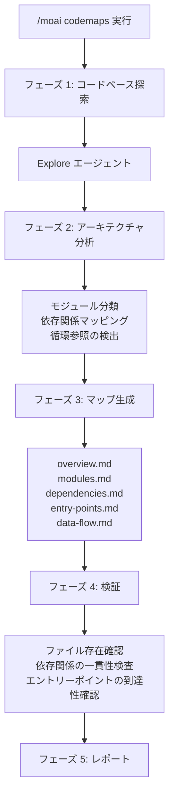
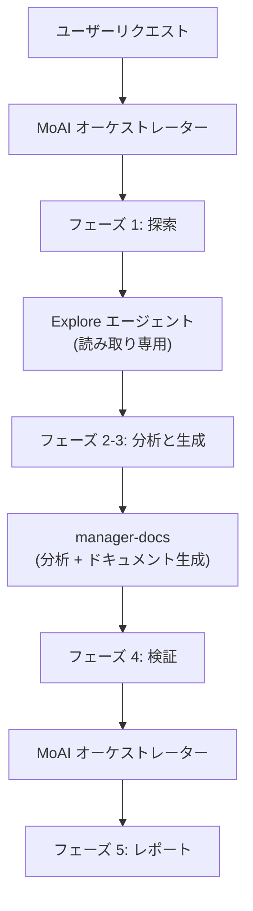

コードベースをスキャンして **アーキテクチャドキュメント** を自動生成するコマンドです。


**一言まとめ**: `/moai codemaps` は「アーキテクチャ地図の製作者」です。コードベースを分析し、モジュールマップ、依存関係グラフ、エントリーポイントカタログなどの **構造ドキュメントを自動生成** します。



**スラッシュコマンド**: Claude Code で `/moai:codemaps` と入力すると、このコマンドをすぐに実行できます。`/moai` だけを入力すると、使用可能なすべてのサブコマンドの一覧が表示されます。


## 概要

新しいプロジェクトに参加したり大規模なコードベースを把握したりするとき、アーキテクチャの理解が最も重要です。`/moai codemaps` はコードベースを自動的に分析し、モジュールマップ、依存関係グラフ、エントリーポイントカタログ、データフロードキュメントを生成します。

生成されたドキュメントは `.moai/project/codemaps/` ディレクトリに保存され、人間と AI エージェントの両方がコードベースを素早く理解できるよう支援します。ハーネスエンジニアリングの用語では **コンテキストマップ** — エージェントが毎セッションでアーキテクチャを再発見する代わりに、いつでも参照できるファイルベースの地図です。反復探索コストをドキュメント生成 1 回で置き換えるという点で、トークン節約効果も大きいものです。

## 使い方

```bash
# コードベース全体のアーキテクチャドキュメントを生成
> /moai codemaps

# 既存ドキュメントを無視して再生成
> /moai codemaps --force

# 特定の領域のみ分析
> /moai codemaps --area api

# Mermaid ダイアグラムを含める
> /moai codemaps --format mermaid

# 探索の深さを制限
> /moai codemaps --depth 3
```

## サポートされるフラグ

| フラグ | 説明 | 例 |
|-------|------|------|
| `--force` (または `--regenerate`) | 既存ドキュメントを無視してすべてのコードマップを再生成 | `/moai codemaps --force` |
| `--area AREA` | 特定領域に集中して分析 | `/moai codemaps --area auth` |
| `--format FORMAT` | 出力形式 (markdown, mermaid, json, デフォルト: markdown) | `/moai codemaps --format mermaid` |
| `--depth N` | 最大ディレクトリ探索深度 (デフォルト: 4) | `/moai codemaps --depth 3` |

### --force フラグ

既存のコードマップドキュメントをすべて削除し、最初から再生成します:

```bash
> /moai codemaps --force
```

コードベースに大きな変化があったときに便利です。

### --area フラグ

特定の領域とその依存関係のみを分析します:

```bash
# API モジュールのみ分析
> /moai codemaps --area api

# 認証モジュールのみ分析
> /moai codemaps --area auth
```

結果は `.moai/project/codemaps/{area}/` に保存されます。

### --format フラグ

出力形式を指定します:

```bash
# Mermaid ダイアグラムを含める
> /moai codemaps --format mermaid

# JSON 形式を追加生成
> /moai codemaps --format json
```

## 実行プロセス

`/moai codemaps` は 5 つのフェーズで実行されます。



### フェーズ 1: コードベース探索

`Explore` エージェントがコードベースを深く探索します:

| 探索対象 | 説明 |
|-----------|------|
| ディレクトリ構造 | 最上位および重要なサブディレクトリのマッピング |
| モジュール境界 | パッケージ/モジュールの境界と責務の識別 |
| エントリーポイント | メインエントリーポイントの探索 (main.go, index.ts, app.py など) |
| 公開 API | エクスポートされた関数、型、インターフェースの一覧 |
| 依存関係グラフ | モジュール間依存のマッピング (import, require) |
| 外部依存関係 | サードパーティ依存のカタログ |
| 設定ファイル | ビルド、デプロイ、設定ファイルの識別 |

### フェーズ 2: アーキテクチャ分析

`manager-docs` エージェントが探索結果を分析します:

- レイヤー別のモジュール分類 (プレゼンテーション、ビジネス、データ、インフラ)
- 高 fan-in モジュールの識別 (`@MX:ANCHOR` 候補)
- 循環依存の検出
- リクエスト/データフロー経路のマッピング
- ドメイン境界の識別
- アーキテクチャパターンの認識 (MVC, Clean, Hexagonal など)

### フェーズ 3: マップ生成

`.moai/project/codemaps/` ディレクトリに 5 種類のドキュメントを生成します:

| ファイル | 内容 |
|------|------|
| `overview.md` | 高レベルのアーキテクチャ要約とモジュール説明 |
| `modules.md` | 詳細モジュールカタログ (責務、依存関係) |
| `dependencies.md` | 依存関係グラフ (テキストおよび Mermaid ダイアグラム) |
| `entry-points.md` | エントリーポイントカタログと呼び出し経路 |
| `data-flow.md` | 主要なデータフロー経路 |

`--area` フラグ使用時:
- `.moai/project/codemaps/{area}/overview.md`
- `.moai/project/codemaps/{area}/modules.md`
- `.moai/project/codemaps/{area}/dependencies.md`

### フェーズ 4: 検証

- 参照されたすべてのファイルとモジュールの実在確認
- 依存関係の双方向一貫性検査
- エントリーポイントの到達可能性の検証
- 既存コードマップとの変更比較 (`--force` でない場合)

生成された地図が実際のコードと一致するかを機械的に確認するステップです — ドキュメントも「生成した」ではなく、検証を経て初めて完了と判定されます。

### フェーズ 5: レポート

```
## コードマップ生成レポート

### 生成されたファイル
- .moai/project/codemaps/overview.md
- .moai/project/codemaps/modules.md
- .moai/project/codemaps/dependencies.md
- .moai/project/codemaps/entry-points.md
- .moai/project/codemaps/data-flow.md

### アーキテクチャハイライト
- パターン: Clean Architecture
- モジュール数: 12 個
- エントリーポイント: 3 個 (API サーバー、CLI、ワーカー)

### 潜在的な問題
- 循環依存: pkg/auth <-> pkg/user
- 高い結合度: pkg/core (fan_in: 8)
- 孤立したモジュール: pkg/legacy (使用箇所なし)
```

## エージェント委任チェーン



**エージェントの役割:**

| エージェント | 役割 | 主な作業 |
|----------|------|----------|
| **MoAI オーケストレーター** | ワークフローの調整、検証、レポート | フラグ解析、検証、ユーザーとの対話 |
| **Explore** | コードベース探索 (読み取り専用) | ディレクトリ構造、モジュール境界、依存関係マッピング |
| **manager-docs** | アーキテクチャ分析とドキュメント生成 | モジュール分類、依存関係分析、コードマップファイルの作成 |

## よくある質問

### Q: コードマップはどのくらいの頻度で再生成すべきですか?

大規模なリファクタリングや新モジュール追加の後に再生成するのがよいでしょう。`/moai sync` を実行すると、コードマップも自動的に更新されます。

### Q: --area フラグで生成したコードマップは全体コードマップと衝突しますか?

いいえ。`--area` で生成したコードマップは独立したサブディレクトリに保存されます。全体コードマップとは独立して管理されます。

### Q: 生成されたコードマップを直接編集してもよいですか?

はい、手動で編集できます。ただし `--force` フラグで再生成すると手動の編集は上書きされます。`--force` なしで実行すると、既存ドキュメントを参照して増分更新します。

### Q: どのようなアーキテクチャパターンを認識しますか?

MVC、Clean Architecture、Hexagonal、Layered Architecture など主要なパターンを認識します。認識されたパターンは `overview.md` に記録されます。

## 関連ドキュメント

- [/moai clean - デッドコード除去](/utility-commands/moai-clean)
- [/moai feedback - フィードバック提出](/utility-commands/moai-feedback)
