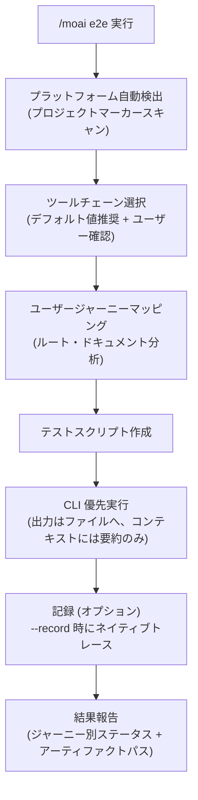
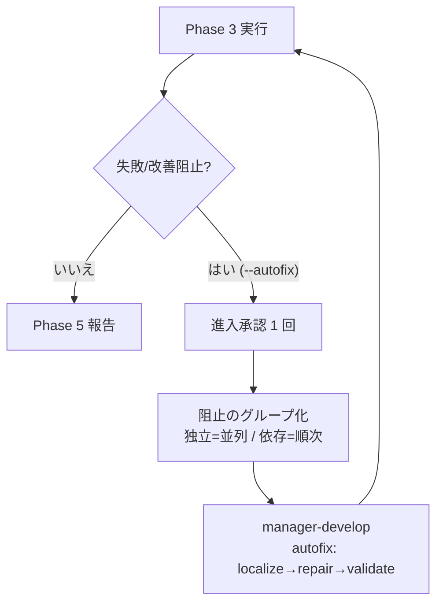
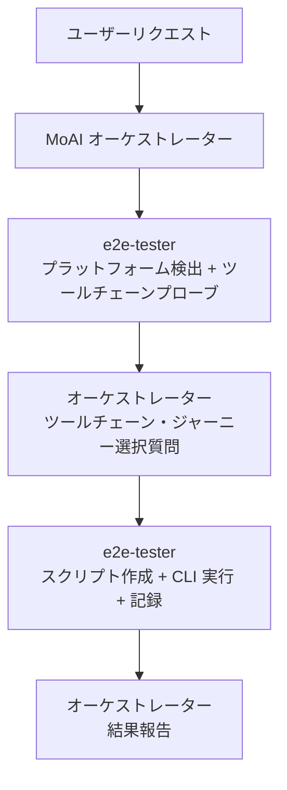

Web・モバイル・デスクトップアプリケーションの E2E (End-to-End) テストを生成し実行するコマンドです。プロジェクトタイプを **自動検出** し、プラットフォームに合った **CLI 優先ツールチェーン** を選択してトークンを最小化しながら実行します。


**一行要約**: `/moai e2e` は「ユーザージャーニー検証ツール」です。ログイン → 決済 → 確認のような実際のユーザーフローをブラウザ・シミュレーター・デスクトップアプリで最後まで実行して検証します。



**スラッシュコマンド**: Claude Code で `/moai:e2e` と入力すると、このコマンドをすぐに実行できます。`/moai` だけ入力すると、利用可能なすべてのサブコマンド一覧が表示されます。


## 概要

ユニットテストが関数 1 つを検証するとすれば、E2E テストは **ユーザーの実際のジャーニー全体** を検証します。`/moai e2e` はこのプロセスを自動化します — プロジェクトが Web かモバイルかデスクトップかを自ら判別し、プラットフォーム別の基本ツールチェーンを選んでテストスクリプトを書き実行します。

全体のフローは次のとおりです。



## 使い方

```bash
> /moai e2e
```

引数なしで実行するとプロジェクトタイプを検出した後、推奨ツールチェーンと発見されたユーザージャーニーを提示し、選択を受けて進行します。

```bash
# ツールチェーンを指定してすぐ実行
> /moai e2e --tool playwright

# 特定のジャーニーのみ実行
> /moai e2e --journey login

# 実行プロセスを記録 (トレース/レコーディング)
> /moai e2e --record
```

## 対応フラグ

| フラグ | 説明 | 例 |
|-------|------|------|
| `--tool TOOL` | ツールチェーンを強制指定 (選択質問を省略) | `/moai e2e --tool maestro` |
| `--platform web\|mobile\|desktop\|desktop-native` | プラットフォーム分類を強制指定 | `/moai e2e --platform desktop-native` |
| `--record` | ツールチェーンのネイティブ記録機能で実行を記録 | `/moai e2e --record` |
| `--url URL` | Web テスト対象 URL を指定 | `/moai e2e --url http://localhost:3000` |
| `--journey NAME` | 指定したユーザージャーニーのみ実行 | `/moai e2e --journey checkout` |
| `--headless` | ヘッドレスモード実行 (デフォルト値 true) | `/moai e2e --headless` |
| `--browser BROWSER` | Playwright ブラウザ選択 (デフォルト値 chromium) | `/moai e2e --browser firefox` |
| `--timeout N` | テストタイムアウト (秒、デフォルト値 30) | `/moai e2e --timeout 60` |
| `--retry N` | 失敗テストのリトライ回数 (デフォルト値 1) — **失敗したスペックのみ** 再実行 | `/moai e2e --retry 2` |
| `--autofix` | 自動修正委任を有効化 — Phase 3 失敗時に manager-develop に修正を委任して再実行 (最大 3 回、独立した阻止は並列) | `/moai e2e --autofix` |

## プラットフォーム別ツールチェーンマトリックス

プラットフォームごとに基本ツールチェーンが決まっており、すべての基本経路は **CLI のみで完結** します。

| プラットフォーム | 基本ツールチェーン | 代替/フォールバック | 備考 |
|--------|-------------|-----------|------|
| **Web** | Playwright CLI | agent-browser (AI 探索型) | chromium / firefox / webkit のクロスブラウザ |
| **モバイル** | Maestro | Appium (フォールバック)、Detox (React Native 限定) | iOS / Android / Flutter 対応、宣言的 YAML フロー |
| **デスクトップ (Electron)** | Playwright `_electron` | — | Web Playwright のインストールを再利用。API は実験的 (experimental) — 報告書に明示 |
| **デスクトップ (Tauri)** | WebdriverIO + `@wdio/tauri-service` | — | 埋め込み WebDriver モードは macOS を含むクロスプラットフォーム |
| **デスクトップネイティブ (macOS)** | axcli | appium-mac2 + WebdriverIO (フォールバック) | AppKit・ネイティブ macOS アプリを AXUIElement アクセシビリティツリーで制御。バージョン PIN |
| **デスクトップネイティブ (Windows)** | FlaUI.WebDriver + WebdriverIO | pywinauto (フォールバック) | WinUI/Win32/Qt。W3C WebDriver2 over UIA3。実験的 — バージョン PIN |
| **デスクトップネイティブ (Linux)** | dogtail | ydotool/xdotool + スクリーンショット検証 (フォールバック) | GTK/Qt を AT-SPI2 で制御。Wayland は GNOME 限定 |

選択したツールチェーンがインストールされていない場合、インストールコマンドを先に提示し、承認後にインストール → バージョン再確認 → 進行します。

デスクトップネイティブレーンは 3 つの OS (macOS・Windows・Linux) のアクセシビリティレシピをすべてドキュメント化しますが、**ホスト OS ルール** に従い、ホストと異なる OS のレシピは宣言的ドキュメントとしてのみ扱い、実際のプローブ・実行はホスト OS に対してのみ行います。

## プロジェクトタイプの自動検出

プロジェクトの **マーカーファイル** を読んでプラットフォームを分類します。検出はマーカーベースで、特定の言語やフレームワークを優遇しません。

| 分類 | 検出マーカー (例) |
|------|------------------|
| デスクトップ (Electron) | package.json 依存性の `electron`、electron-builder/Forge 設定 |
| デスクトップ (Tauri) | `src-tauri/tauri.conf.json`、依存性の `tauri` |
| モバイル (React Native) | 依存性の `react-native`、`ios/` + `android/` ディレクトリ |
| モバイル (Flutter) | `flutter:` を含む `pubspec.yaml`、`lib/main.dart` |
| モバイル (ネイティブ) | iOS ターゲットの `*.xcodeproj`、`com.android.application` がある `build.gradle` |
| Web | next/nuxt/vite/astro などの Web フレームワーク設定、`index.html`、HTTP 配信アプリ全般 |
| デスクトップネイティブ | Electron/Tauri なしにネイティブツールキットマーカーのみ — AppKit (`.xcodeproj`/`Package.swift` の macOS アプリターゲット、electron/tauri 依存性なし)、WinUI/Win32 (`.vcxproj`)、Qt (`CMakeLists.txt` の Qt `find_package`/`.pro`)、GTK (gtk 依存性) |
| 混合 (mixed) | 2 つ以上のプラットフォームマーカーが同時に検出 — 表面別にそれぞれツールチェーンを選択 |

## 実行プロセス

### ステップ 1: ユーザージャーニーマッピング

プロジェクトドキュメントとルート定義 (routes.ts、urls.py、router.go、ナビゲーショングラフなど) を読んでテストするユーザージャーニー候補を発見します。ログイン、核心機能、エラー処理のような重要な経路が優先です。

```markdown
ジャーニー: ユーザーログイン
ステップ:
1. /login へ移動 (Web) | ログイン画面でアプリ起動 (モバイル/デスクトップ)
2. メールアドレス入力
3. パスワード入力
4. 送信
5. /dashboard へのリダイレクト確認
6. ウェルカムメッセージ表示確認
```

### ステップ 2: スクリプト作成

選択されたツールチェーンの規約に合わせて `e2e/` ディレクトリにテストスクリプトを作成します。

| ツールチェーン | 成果物の場所 |
|--------|-------------|
| Playwright | `e2e/<ジャーニー>.spec.ts` |
| Maestro | `e2e/flows/<ジャーニー>.yaml` |
| Appium / WebdriverIO | `e2e/<ジャーニー>.e2e.ts` + `wdio.conf.ts` |

すべてのジャーニーステップは **検証可能な結果** と対になります — アサーション (assertion) のないナビゲーションスクリプトは作成しません。

### ステップ 3: 実行と報告

テストを実行し、ジャーニー別の PASS/FAIL 状態・所要時間・アーティファクトパスを表で報告します。失敗したジャーニーは失敗地点のログ抜粋とスクリーンショットパスが併せて提供されます。

## 自動修正委任 (--autofix)

`--autofix` フラグを与えると Phase 3 実行で **失敗や改善の余地** が見つかったとき、オーケストレーターが修正を `manager-develop` エージェントに委任して Phase 3 を再実行するループに入ります。フラグがないか Phase 3 が green ならこのステップはスキップします。



- **進入承認 1 回**: 最初の委任前にオーケストレーターが 1 回承認を受けます。この承認がループ全体を包み、以降の反復では再度尋ねません。拒否すると従来の手動の次ステップフローに戻ります。
- **阻止のグループ化**: 異なるファイルを触る独立した阻止は並列 fan-out、同じモジュールを触る依存する阻止は順次処理します (同時書き込み衝突の防止)。
- **ループ限界**: 最大 3 回反復 (`ci-autofix-protocol.md` と同じ)。green なら報告、3 回使い切ったら残余の失敗とアーティファクトパスをユーザーに回帰します。

## トークン最小化実行

`/moai e2e` の核心的な設計原則は **CLI 優先** (CLI-first) です。AI コンテキストに冗長な出力を積む代わりに、最も安い経路から使います。

1. **CLI + 制限された末尾出力**: 実行ログ全体は `e2e/.runs/` 配下のファイルに保存し、コンテキストには終了コード + 最後の一部のみを表示します。ログファイルのパスは常に引用されます。
2. **構造化リポーター**: 失敗分析時に全体の再実行の代わりに JSON リポーター出力から **失敗したスペックのみ** を選別して読みます。
3. **MCP は条件付き**: パフォーマンストレース、Lighthouse 類の監査のように CLI で不可能な機能にのみ MCP ツールを使います。MCP はどの基本経路でも必須の依存性ではありません。

報告書・トレース・スクリーンショット・レコーディングはプロジェクトローカルの `e2e/` ディレクトリに保存され **パスで引用** されます — 内容がコンテキストにインライン化されません。

## 記録オプション

`--record` フラグを使うと選択したツールチェーンの **ネイティブ記録機能** で実行を記録します。

| ツールチェーン | ネイティブ機能 | 出力場所 |
|--------|---------------|-----------|
| Playwright | `--trace on` トレース | `e2e/traces/*.zip` |
| Maestro | `maestro record` | `e2e/recordings/` |
| WebdriverIO | ビデオ/トレースリポーターサービス | `e2e/recordings/` |

## 対象がないとき

テストする E2E 表面が検出されないと (例: Web/モバイル/デスクトップの進入点がない純粋なライブラリ)、どのマーカーを確認したかの根拠とともに **「E2E 対象なし」** を報告し、`e2e/` アーティファクトを作らずに正常終了します。

Electron でも Tauri でもない **ネイティブデスクトップアプリ** (純粋な macOS アプリ、WinUI、Qt/GTK など) が検出されるとこの分岐へは行きません — デスクトップネイティブ自動化レーン (macOS の axcli、Windows の FlaUI.WebDriver、Linux の dogtail) にルーティングされ、正常にテストが進行します。「E2E 対象なし」分岐はどの表面もない純粋なライブラリにのみ予約されています。

## エージェント委任チェーン

`/moai e2e` の実行主体は **e2e-tester** エージェントです。すべてのユーザー選択質問は MoAI オーケストレーターが担当し、e2e-tester は選択結果を受け取って実行のみを行います。



| エージェント | 役割 | 主な作業 |
|----------|------|----------|
| **MoAI オーケストレーター** | 選択と報告 | ツールチェーン/ジャーニー選択質問、結果報告のレンダリング |
| **e2e-tester** | 実行専任 | 検出プローブ、ジャーニーマッピング、スクリプト作成、CLI 実行、記録 |
| **manager-develop** (--autofix 時) | 修正委任 | localize→repair→validate (関連する e2e スペックのローカル再検証) |

## 関連ドキュメント

- [/moai fix - 一回限りの自動修正](/utility-commands/moai-fix)
- [/moai loop - 反復修正ループ](/utility-commands/moai-loop)
- [/moai - 完全自律の自動化](/utility-commands/moai)
