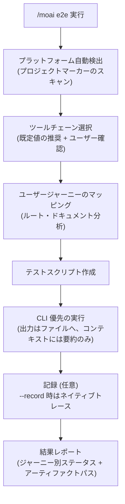
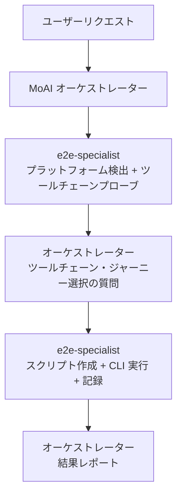

ウェブ・モバイル・デスクトップアプリケーションの E2E (End-to-End) テストを作成・実行するコマンドです。プロジェクトの種類を**自動検出**し、プラットフォームに合った **CLI 優先のツールチェーン**を選択して、トークンを最小化しながら実行します。


**一行要約**: `/moai e2e` は「ユーザージャーニー検証ツール」です。ログイン → 決済 → 確認のような実際のユーザーフローを、ブラウザ・シミュレーター・デスクトップアプリで最後まで実行して検証します。



**スラッシュコマンド**: Claude Code で `/moai:e2e` と入力すると、このコマンドを直接実行できます。`/moai` だけを入力すると、利用可能なすべてのサブコマンドの一覧が表示されます。


## 概要

ユニットテストが関数 1 つを検証するのに対し、E2E テストは**ユーザーの実際のジャーニー全体**を検証します。`/moai e2e` はこの過程を自動化します — プロジェクトがウェブかモバイルかデスクトップかを自ら判別し、プラットフォームごとの既定ツールチェーンを選んでテストスクリプトを作成・実行します。

全体の流れは次のとおりです。



## 使い方

```bash
> /moai e2e
```

引数なしで実行すると、プロジェクトの種類を検出したうえで、推奨ツールチェーンと発見されたユーザージャーニーを提示し、選択を受けて進行します。

```bash
# ツールチェーンを指定して直接実行
> /moai e2e --tool playwright

# 特定のジャーニーのみ実行
> /moai e2e --journey login

# 実行過程を記録 (トレース/レコーディング)
> /moai e2e --record
```

## サポートフラグ

| フラグ | 説明 | 例 |
|-------|------|------|
| `--tool TOOL` | ツールチェーンを強制指定 (選択質問を省略) | `/moai e2e --tool maestro` |
| `--platform web\|mobile\|desktop` | プラットフォーム分類を強制指定 | `/moai e2e --platform web` |
| `--record` | ツールチェーンのネイティブ記録機能で実行を記録 | `/moai e2e --record` |
| `--url URL` | ウェブテスト対象の URL を指定 | `/moai e2e --url http://localhost:3000` |
| `--journey NAME` | 指定したユーザージャーニーのみ実行 | `/moai e2e --journey checkout` |
| `--headless` | ヘッドレスモードで実行 (既定値 true) | `/moai e2e --headless` |
| `--browser BROWSER` | Playwright のブラウザを選択 (既定値 chromium) | `/moai e2e --browser firefox` |
| `--timeout N` | テストタイムアウト (秒、既定値 30) | `/moai e2e --timeout 60` |
| `--retry N` | 失敗テストの再試行回数 (既定値 1) — **失敗したスペックのみ**再実行 | `/moai e2e --retry 2` |

## プラットフォーム別ツールチェーンマトリクス

プラットフォームごとに既定ツールチェーンが決まっており、すべての既定パスは **CLI だけで完結**します。

| プラットフォーム | 既定ツールチェーン | 代替/フォールバック | 備考 |
|--------|-------------|-----------|------|
| **ウェブ** | Playwright CLI | agent-browser (AI 探索型) | chromium / firefox / webkit のクロスブラウザ |
| **モバイル** | Maestro | Appium (フォールバック)、Detox (React Native 限定) | iOS / Android / Flutter 対応、宣言的 YAML フロー |
| **デスクトップ (Electron)** | Playwright `_electron` | — | ウェブの Playwright インストールを再利用。API は実験的 (experimental) — レポートに明記 |
| **デスクトップ (Tauri)** | WebdriverIO + `@wdio/tauri-service` | — | 組み込み WebDriver モードは macOS を含むクロスプラットフォーム |

選択したツールチェーンがインストールされていない場合は、インストールコマンドを先に提示し、承認後にインストール → バージョン再確認 → 進行します。

## プロジェクト種類の自動検出

プロジェクトの**マーカーファイル**を読み取ってプラットフォームを分類します。検出はマーカー駆動で、特定の言語やフレームワークを優遇しません。

| 分類 | 検出マーカー (例) |
|------|------------------|
| デスクトップ (Electron) | package.json 依存関係の `electron`、electron-builder/Forge 設定 |
| デスクトップ (Tauri) | `src-tauri/tauri.conf.json`、依存関係の `tauri` |
| モバイル (React Native) | 依存関係の `react-native`、`ios/` + `android/` ディレクトリ |
| モバイル (Flutter) | `flutter:` を含む `pubspec.yaml`、`lib/main.dart` |
| モバイル (ネイティブ) | iOS ターゲットの `*.xcodeproj`、`com.android.application` のある `build.gradle` |
| ウェブ | next/nuxt/vite/astro などのウェブフレームワーク設定、`index.html`、HTTP サービングアプリ全般 |
| 混合 (mixed) | 2 つ以上のプラットフォームマーカーを同時検出 — サーフェスごとに個別にツールチェーンを選択 |

## 実行フロー

### ステップ 1: ユーザージャーニーのマッピング

プロジェクトのドキュメントとルート定義 (routes.ts、urls.py、router.go、ナビゲーショングラフなど) を読み取り、テストすべきユーザージャーニーの候補を発見します。ログイン、コア機能、エラー処理といった重要経路が優先されます。

```markdown
ジャーニー: ユーザーログイン
ステップ:
1. /login へ移動 (ウェブ) | ログイン画面までアプリを起動 (モバイル/デスクトップ)
2. メールアドレスを入力
3. パスワードを入力
4. 送信
5. /dashboard へのリダイレクトを確認
6. ウェルカムメッセージの表示を確認
```

### ステップ 2: スクリプト作成

選択されたツールチェーンの規約に従い、`e2e/` ディレクトリにテストスクリプトを作成します。

| ツールチェーン | 成果物の場所 |
|--------|-------------|
| Playwright | `e2e/<ジャーニー>.spec.ts` |
| Maestro | `e2e/flows/<ジャーニー>.yaml` |
| Appium / WebdriverIO | `e2e/<ジャーニー>.e2e.ts` + `wdio.conf.ts` |

すべてのジャーニーステップは**検証可能な結果**と対になります — アサーション (assertion) のないナビゲーションスクリプトは作成しません。

### ステップ 3: 実行とレポート

テストを実行し、ジャーニー別の PASS/FAIL ステータス・所要時間・アーティファクトパスを表で報告します。失敗したジャーニーには、失敗地点のログ抜粋とスクリーンショットパスが添えられます。

## トークン最小化の実行

`/moai e2e` の中核設計原則は **CLI 優先** (CLI-first) です。AI コンテキストに冗長な出力を積み上げる代わりに、最も安い経路から使います。

1. **CLI + 制限付きテール出力**: 実行ログ全体は `e2e/.runs/` 配下のファイルに保存し、コンテキストには終了コード + 末尾の数行のみを表示します。ログファイルのパスは常に引用されます。
2. **構造化レポーター**: 失敗の分析時は、スイート全体を再実行する代わりに JSON レポーター出力から**失敗したスペックのみ**を選別して読みます。
3. **MCP は条件付き**: パフォーマンストレースや Lighthouse 級の監査のように CLI では不可能な機能にのみ MCP ツールを使います。MCP はどの既定パスでも必須依存ではありません。

レポート・トレース・スクリーンショット・レコーディングはプロジェクトローカルの `e2e/` ディレクトリに保存され、**パスで引用**されます — 内容がコンテキストにインライン展開されることはありません。

## 記録オプション

`--record` フラグを使うと、選択したツールチェーンの**ネイティブ記録機能**で実行を記録します。

| ツールチェーン | ネイティブ機能 | 出力先 |
|--------|---------------|-----------|
| Playwright | `--trace on` トレース | `e2e/traces/*.zip` |
| Maestro | `maestro record` | `e2e/recordings/` |
| WebdriverIO | ビデオ/トレースレポーターサービス | `e2e/recordings/` |

## 対象が見つからないとき

テスト可能な E2E サーフェスが検出されない場合 (例: ウェブ/モバイル/デスクトップのエントリーポイントを持たない純粋なライブラリ)、どのマーカーを確認したかの根拠とともに **「E2E 対象なし」**を報告し、`e2e/` アーティファクトを作らずに正常終了します。

Electron でも Tauri でもない**ネイティブデスクトップアプリ** (純粋な macOS アプリ、WinUI、Qt/GTK など) が検出された場合も同じ分岐に進みます — OS レベルのネイティブデスクトップ自動化はまだ提供されておらず、分類の根拠とともに保留 (deferral) の案内を報告して正常終了します。

## エージェント委任チェーン

`/moai e2e` の実行主体は **e2e-specialist** エージェントです。ユーザー向けの選択質問はすべて MoAI オーケストレーターが担当し、e2e-specialist は選択結果を受け取って実行のみを行います。



| エージェント | 役割 | 主な作業 |
|----------|------|----------|
| **MoAI オーケストレーター** | 選択とレポート | ツールチェーン/ジャーニー選択の質問、結果レポートのレンダリング |
| **e2e-specialist** | 実行専任 | 検出プローブ、ジャーニーマッピング、スクリプト作成、CLI 実行、記録 |

## 関連ドキュメント

- [/moai fix - ワンショット自動修正](/utility-commands/moai-fix)
- [/moai loop - 反復修正ループ](/utility-commands/moai-loop)
- [/moai - 完全自律オートメーション](/utility-commands/moai)
