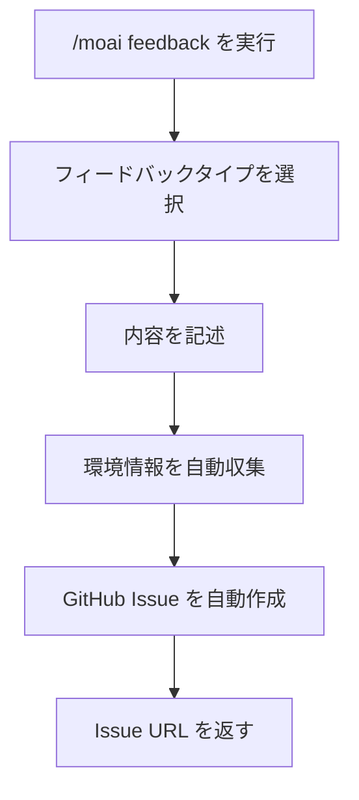
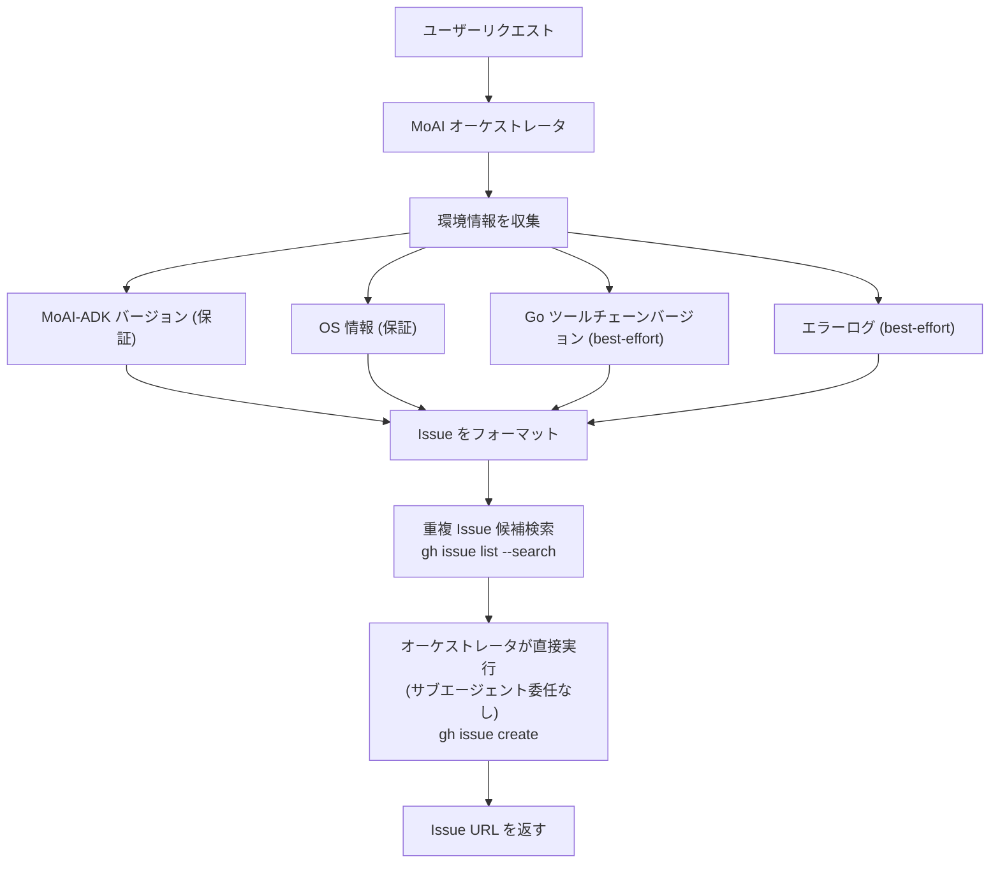

MoAI-ADK へのフィードバックやバグレポートを送信するコマンド。



**新しいコマンド形式**

`/moai:9-feedback` は `/moai feedback` に変更されました。




**一言でいうと**: `/moai feedback` は MoAI-ADK 自体への改善提案やバグレポートについて**GitHub Issue を自動作成**するコマンドです。



**スラッシュコマンド**: Claude Code で `/moai:feedback` と入力すると、このコマンドを直接実行できます。`/moai` だけ入力すると、利用可能なすべてのサブコマンドの一覧が表示されます。


## 概要

MoAI-ADK を使用中にバグを発見した場合、新機能が必要な場合、または改善アイデアがある場合にこのコマンドを使用します。GitHub に直接アクセスする必要はありません - Claude Code 内から直接フィードバックを送信できます。


**重要**: このコマンドは**プロジェクトコードを変更するためのものではありません**。MoAI-ADK ツール自体についてのフィードバックを開発チームに伝えるためのものです。


## 使用方法

```bash
# 標準形式
> /moai feedback

# 短いエイリアス
> /moai fb
> /moai bug
> /moai issue
```

コマンドを実行すると、フィードバックタイプの選択と内容の入力をガイドされます。

## サポートされるフラグ

| フラグ | 説明 | 例 |
|------|-------------|---------|
| `--type {bug,feature,question}` | フィードバックタイプを直接指定 | `/moai feedback --type bug` |
| `--title "<title>"` | タイトルを直接指定 | `/moai feedback --title "エラーレポート"` |
| `--dry-run` | Issue 作成なしで内容のみ確認 | `/moai feedback --dry-run` |

## 仕組み

`/moai feedback` を実行すると、以下のプロセスが実行されます：



### 自動収集される情報

フィードバック送信時、開発チームが問題を迅速に理解できるよう、以下の情報が自動的に含まれます。

| 収集項目 | 説明 | 例 |
|----------------|-------------|---------|
| MoAI-ADK バージョン | 現在インストールされているバージョン | v10.8.0 |
| OS 情報 | オペレーティングシステムとバージョン | macOS 15.2 |
| Claude Code バージョン | 使用中の Claude Code バージョン | 1.0.30 |
| 現在の SPEC | 作業中の SPEC ID | SPEC-AUTH-001 |
| エラーログ | 最近のエラー (ある場合) | TypeError: ... |

## フィードバック設定

`/moai feedback` は次の4つの詳細な動作で Issue 作成プロセスを強化します。

### 診断情報: 保証項目 + best-effort 項目

上記の表のとおり、MoAI-ADK バージョン(`moai version`)と OS 情報(`uname`)は**常に**収集される保証項目です。Go ツールチェーンバージョン(`go version`)とオーケストレータが伝えるエラーコンテキストは **best-effort** 項目であり、条件が整わない場合(例: 事前ビルドされた `moai` バイナリのみが存在し、Go ツールチェーンがインストールされていない環境)は省略されますが、これは失敗ではありません。

### 重複 Issue 候補の確認

Issue タイトルが決まると、Issue 作成前に `gh issue list --repo <対象リポジトリ> --search "<タイトルキーワード>" --state open` コマンドで対象リポジトリ内の未解決の重複 Issue を検索します。このステップはユーザーに直接尋ねることはなく、「重複の可能性がある Issue」候補レポート(Issue 番号、タイトル、URL、状態)のみを生成し、新規 Issue として進めるか既存 Issue を案内するかはオーケストレータが判断します。

### `gh` 認証失敗時のローカル一時保存

Issue 作成の直前に `gh auth status` を確認します。`gh` が認証されていない、または GitHub API のレート制限に達している場合、次のように適切に対応します。

1. 検出された状態(未認証またはレート制限)をユーザーに通知します。
2. 未認証の場合は `gh auth login` の実行を、レート制限の場合は制限解除までの待機を案内します。
3. 作成済みの Issue 内容を `.moai/state/feedback-draft-<timestamp>.md` にローカル保存するかを提案します。

作成したフィードバック内容は `gh` の失敗によって失われることはなく、ローカルの一時ファイルが復旧手段となります。

### フィードバック対象リポジトリの設定

`/moai feedback` が Issue を作成する対象リポジトリは、`.moai/config/sections/feedback.yaml` の `feedback.repository` 値で設定されます。デフォルト値は `modu-ai/moai-adk`(MoAI-ADK ツールリポジトリ自体)であり、フォークを保守しているユーザーはこの値を自分のフォークリポジトリに変更してフィードバックをリダイレクトできます。

## フィードバックタイプ

### バグレポート

MoAI-ADK を使用中に遭遇したエラーや予期しない動作を報告します。

```bash
> /moai feedback
# タイプ選択: バグレポート
# タイトル: /moai run 実行時にキャラクタリゼーションテストが作成されない
# 説明: SPEC-AUTH-001 で /moai run を実行しましたが、キャラクタリゼーション
#        テストが PRESERVE フェーズで作成されず、直接 IMPROVE に進みました。
# 再現: /moai run SPEC-AUTH-001 を実行
```

### 機能リクエスト

MoAI-ADK に追加してほしい新機能を提案します。

```bash
> /moai feedback
# タイプ選択: 機能リクエスト
# タイトル: /moai loop で特定ファイルのみ対象にするオプションを追加
# 説明: /moai loop がプロジェクト全体ではなく、特定のディレクトリや
#        ファイルのみを対象にできると便利です。
# 例: /moai loop --path src/auth/
```

### 改善提案

既存機能を改善するアイデアを提案します。

```bash
> /moai feedback
# タイプ選択: 改善提案
# タイトル: /moai fix 実行結果で前後の diff を表示
# 説明: /moai fix が自動修正を diff 形式で表示すれば、
#        どのような変更が行われたかを一目で確認できます。
```

## エージェント委任チェーン

`/moai feedback` コマンドは、サブエージェントへの委任なしに **オーケストレータが直接** 全プロセスを実行します:



**担当:**

| 担当 | 役割 | 主なタスク |
|----------|------|----------|
| **MoAI オーケストレータ** | フィードバックプロセス全体をオーケストレータが直接進行(サブエージェント委任なし) | タイプ/タイトル/説明の収集、環境情報の収集、重複 Issue 候補検索、`gh issue create` の直接実行、URL の返却 |

## 実践例

### 状況: コマンド実行中の予期しないエラー

```bash
# エラーが発生した状況
> /moai "決済機能を実装" --branch
# エラー: ブランチ作成失敗 - 権限が拒否されました

# フィードバックを送信
> /moai feedback
```

MoAI オーケストレータが順番にフィードバックタイプ、タイトル、説明を尋ねます。回答を入力すると、GitHub Issue が自動的に作成され、Issue URL が返されます。

```
GitHub Issue が作成されました:
https://github.com/anthropics/moai-adk/issues/1234

開発チームがレビュー後に回答します。
```


**フィードバックはいつでも歓迎します!** 小さな不便でもフィードバックを送ってください。MoAI-ADK の改善に役立ちます。


## よくある質問

### Q: フィードバック内容を編集または削除できますか?

はい、GitHub で直接 Issue を編集またはクローズできます。Issue URL が提供されるため、いつでもアクセスできます。

### Q: 同じ問題を複数回報告できますか?

心配ありません - GitHub は重複した Issue をチェックします。問題が既に報告されている場合、既存の Issue に案内されます。

### Q: フィードバックへの回答はいつ受け取れますか?

開発チームは週次で Issue をレビューしてコメントします。複雑な問題は解決に時間がかかる場合があります。

### Q: `/moai feedback` と直接 GitHub Issue を作成の違いは何ですか?

`/moai feedback` は環境情報を自動収集するため、開発チームが問題をより迅速に理解できます。手動で Issue を作成するよりも効率的です。

## 関連ドキュメント

- [/moai - 完全自律自動化](/utility-commands/moai)
- [/moai loop - 反復修正ループ](/utility-commands/moai-loop)
- [/moai fix - ワンショット自動修正](/utility-commands/moai-fix)
