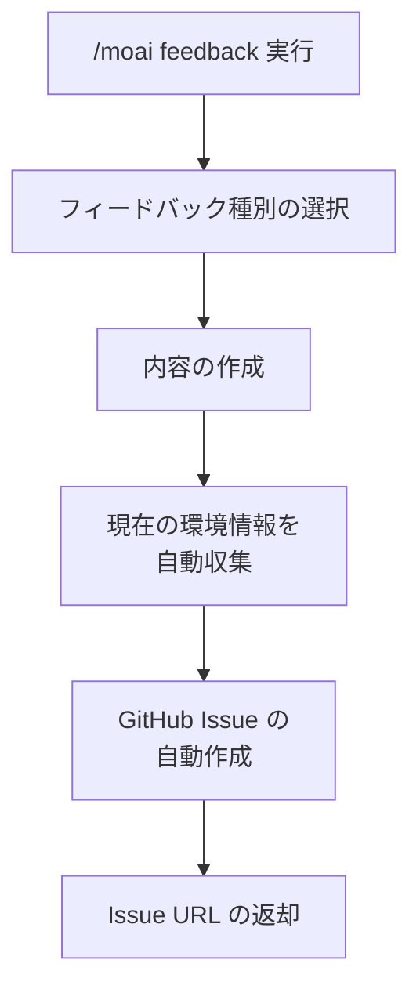
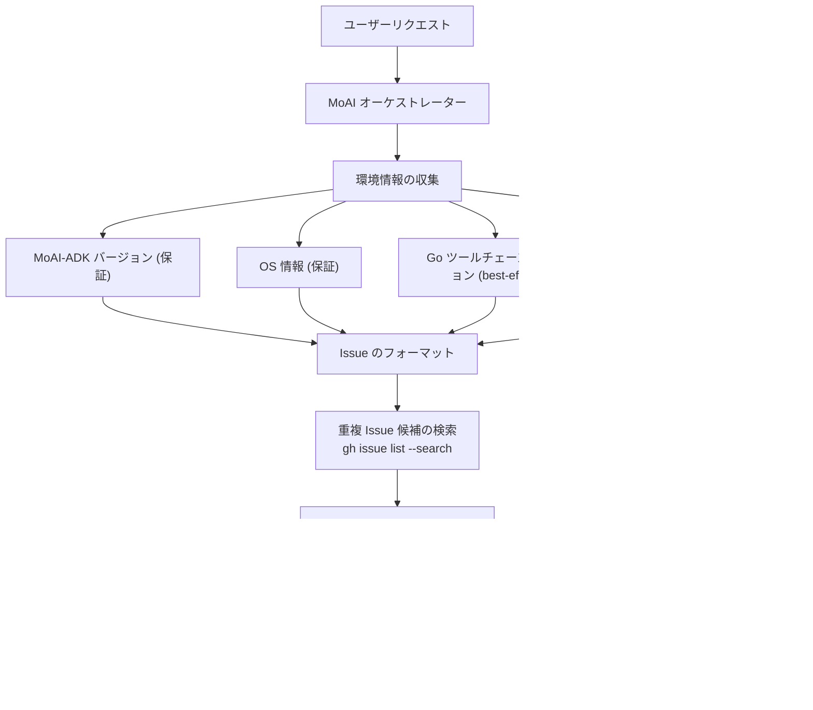

MoAI-ADK にフィードバックやバグレポートを提出するコマンドです。


**一言まとめ**: `/moai feedback` は MoAI-ADK 自体への改善提案やバグレポートを **GitHub Issue として自動作成** してくれるコマンドです。



**スラッシュコマンド**: Claude Code で `/moai:feedback` と入力すると、このコマンドをすぐに実行できます。`/moai` だけを入力すると、使用可能なすべてのサブコマンドの一覧が表示されます。


## 概要

MoAI-ADK を使っていてバグを発見したり、新しい機能が必要になったり、改善のアイデアを思いついたりしたときにこのコマンドを使います。GitHub に直接アクセスして Issue を書く必要なく、Claude Code の中でそのままフィードバックを提出できます。


**重要**: このコマンドは **あなたのプロジェクトコードを修正するコマンドではありません**。MoAI-ADK ツール自体へのフィードバックを開発チームに届けるコマンドです。


## 使い方

```bash
# 標準形式
> /moai feedback

# 短いエイリアス
> /moai fb
> /moai bug
> /moai issue
```

コマンドを実行すると、フィードバックの種類を選択し、内容を入力するプロセスが案内されます。

## サポートされるフラグ

| フラグ | 説明 | 例 |
|-------|------|------|
| `--type {bug,feature,question}` | フィードバック種別を直接指定 | `/moai feedback --type bug` |
| `--title "<title>"` | タイトルを直接指定 | `/moai feedback --title "エラー報告"` |
| `--dry-run` | Issue 作成なしで内容のみ確認 | `/moai feedback --dry-run` |

## 動作の仕組み

`/moai feedback` を実行すると、次のプロセスが進みます。


```mermaid
flowchart TD
    A["/moai feedback 実行"] --> B["フィードバック種別の選択"]
    B --> C["内容の作成"]
    C --> D["現在の環境情報を<br/>自動収集"]
    D --> E["GitHub Issue の<br/>自動作成"]
    E --> F["Issue URL の返却"]
```

### 自動収集される情報

フィードバック提出時、次の情報が自動的に含まれ、開発チームが問題をより素早く把握できます。

| 収集項目 | 説明 | 例 | 収集方式 |
|-----------|------|------|-----------|
| MoAI-ADK バージョン | 現在インストールされているバージョン (`moai version`) | v10.8.0 | 保証 (常に収集) |
| OS 情報 | オペレーティングシステムとバージョン (`uname`) | macOS 15.2 | 保証 (常に収集) |
| Go ツールチェーンバージョン | ツールバイナリのビルド元情報 (`go version`) | go1.23.4 | best-effort (Go ツールチェーン未インストール環境では省略) |
| エラーログ | オーケストレーターが渡したエラーコンテキスト (ある場合) | TypeError: ... | best-effort (オーケストレーターが渡したときのみ含む、ワークフロー自体はセッション記録を読まない) |

## フィードバック設定

`/moai feedback` は次の 4 つの詳細動作で Issue 作成プロセスを補強します。

### 診断情報: 保証項目 + best-effort 項目

上の表のとおり、MoAI-ADK バージョン (`moai version`) と OS 情報 (`uname`) は **常に** 収集される保証項目です。Go ツールチェーンバージョン (`go version`) とオーケストレーターが渡すエラーコンテキストは **best-effort** 項目で、条件が合わない場合 (例: 事前ビルドされた `moai` バイナリのみで Go ツールチェーンがインストールされていない環境) は省略され、これは失敗ではありません。

### 重複 Issue 候補の確認

Issue タイトルが決まると、Issue 作成前に `gh issue list --repo <対象リポジトリ> --search "<タイトルキーワード>" --state open` コマンドで対象リポジトリのオープン中の重複 Issue を検索します。このステップはユーザーに直接尋ねることなく「重複の可能性がある Issue」候補レポート (Issue 番号、タイトル、URL、状態) のみを生成し、新規 Issue として進めるか既存 Issue に案内するかはオーケストレーターが判断します。

### `gh` 認証失敗時のローカル一時保存

Issue 作成の直前に `gh auth status` を確認します。`gh` が未認証、または GitHub API のレートリミットに達している場合、次のように graceful に対応します。

1. 検知した状態 (未認証またはレートリミット) をユーザーに知らせます。
2. 未認証なら `gh auth login` の実行を、レートリミットなら制限解除までの待機を案内します。
3. 作成した Issue 内容を `.moai/state/feedback-draft-<timestamp>.md` パスにローカル保存することを提案します。

作成したフィードバック内容は `gh` の失敗によって失われることはなく、ローカル一時ファイルが復旧手段になります。

### フィードバック対象リポジトリの設定

`/moai feedback` が Issue を作成する対象リポジトリは `.moai/config/sections/feedback.yaml` の `feedback.repository` 値で設定されます。デフォルトは `modu-ai/moai-adk` (MoAI-ADK ツールリポジトリ自体) で、fork を保守するユーザーはこの値を自分の fork リポジトリに変更してフィードバックをリダイレクトできます。

## フィードバックの種類

### バグレポート

MoAI-ADK 使用中に発生したエラーや、期待と異なる動作を報告します。

```bash
> /moai feedback
# 種別選択: バグレポート
# タイトル: /moai run 実行時に特性化テストが生成されない
# 説明: SPEC-AUTH-001 に対して /moai run を実行したところ、
#        PRESERVE 段階で特性化テストが生成されず、
#        そのまま IMPROVE 段階に進みます。
# 再現手順: /moai run SPEC-AUTH-001 を実行
```

### 機能リクエスト

MoAI-ADK に追加してほしい新機能を提案します。

```bash
> /moai feedback
# 種別選択: 機能リクエスト
# タイトル: /moai loop に特定ファイルのみを対象とするオプションを追加
# 説明: /moai loop 実行時にプロジェクト全体ではなく特定のディレクトリや
#        ファイルだけを対象にできるとうれしいです。
# 例: /moai loop --path src/auth/
```

### 改善提案

既存機能の改善アイデアを提案します。

```bash
> /moai feedback
# 種別選択: 改善提案
# タイトル: /moai fix の実行結果に修正前後の diff を表示
# 説明: /moai fix が自動修正した内容を diff 形式で
#        見せてくれれば、どのような変更があったか一目で把握できます。
```

## エージェント委任チェーン

`/moai feedback` コマンドはサブエージェントへの委任なしに **オーケストレーターが直接** 全工程を実行します:


```mermaid
flowchart TD
    User["ユーザーリクエスト"] --> Orchestrator["MoAI オーケストレーター"]
    Orchestrator --> Collect["環境情報の収集"]

    Collect --> Info1["MoAI-ADK バージョン (保証)"]
    Collect --> Info2["OS 情報 (保証)"]
    Collect --> Info3["Go ツールチェーンバージョン (best-effort)"]
    Collect --> Info4["エラーログ (best-effort)"]

    Info1 --> Format["Issue のフォーマット"]
    Info2 --> Format
    Info3 --> Format
    Info4 --> Format

    Format --> Dup["重複 Issue 候補の検索<br/>gh issue list --search"]
    Dup --> GitHub["オーケストレーター直接実行<br/>(サブエージェント委任なし)<br/>gh issue create"]
    GitHub --> Complete["Issue URL の返却"]
```

**担当主体:**

| 担当主体 | 役割 | 主な作業 |
|----------|------|----------|
| **MoAI オーケストレーター** | フィードバックプロセス全体をオーケストレーターが直接進行 (サブエージェント委任なし) | 種別/タイトル/説明の収集、環境情報の収集、重複 Issue 候補の検索、`gh issue create` の直接実行、URL の返却 |

単純な単一手順の作業にサブエージェントを立ち上げないこともトークノミクス原則です — 委任は必要なときだけ、最も安い経路で。

## 実践例

### 状況: コマンド実行中に予期しないエラーが発生

```bash
# エラーが発生した状況
> /moai "決済機能の実装" --branch
# Error: Branch creation failed - permission denied

# フィードバックの提出
> /moai feedback
```

MoAI オーケストレーターがフィードバックの種別、タイトル、説明を順に尋ねます。回答を入力すると自動で GitHub Issue が作成され、Issue URL が返されます。

```
GitHub Issue が作成されました:
https://github.com/modu-ai/moai-adk/issues/1234

開発チームが確認後、回答いたします。
```


**フィードバックはいつでも歓迎です!** 些細な不便でもフィードバックを提出していただければ、MoAI-ADK の改善に大いに役立ちます。


## よくある質問

### Q: フィードバック内容を修正または削除できますか?

はい、GitHub で直接 Issue を編集したりクローズしたりできます。Issue URL が提供されるので、いつでもアクセスできます。

### Q: 同じ問題を複数回報告してもよいですか?

GitHub で重複 Issue を確認するため、心配は不要です。すでに報告済みの問題であれば既存の Issue に案内されます。

### Q: フィードバックへの返答はいつ受け取れますか?

開発チームが確認後、Issue にコメントで回答します。複雑な問題の場合、解決までに時間がかかることがあります。

### Q: `/moai feedback` と GitHub での直接 Issue 作成の違いは何ですか?

`/moai feedback` は環境情報を自動収集し、開発チームが問題をより素早く把握できるようにします。手動で Issue を作成するより効率的です。

## 関連ドキュメント

- [/moai - 完全自律自動化](/utility-commands/moai)
- [/moai loop - 反復修正ループ](/utility-commands/moai-loop)
- [/moai fix - ワンショット自動修正](/utility-commands/moai-fix)
