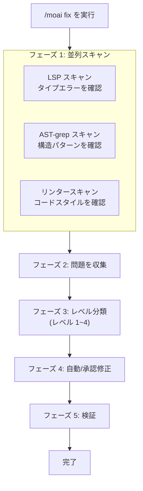
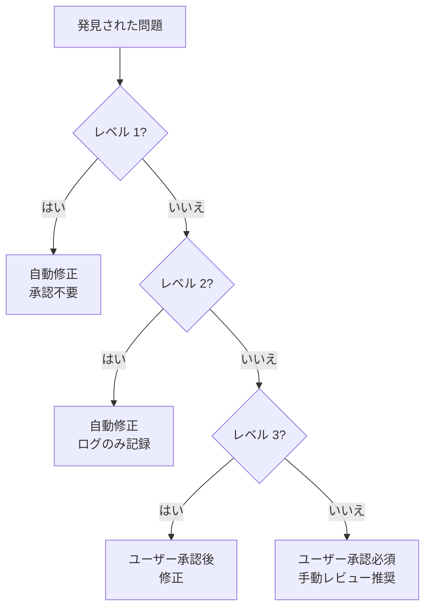
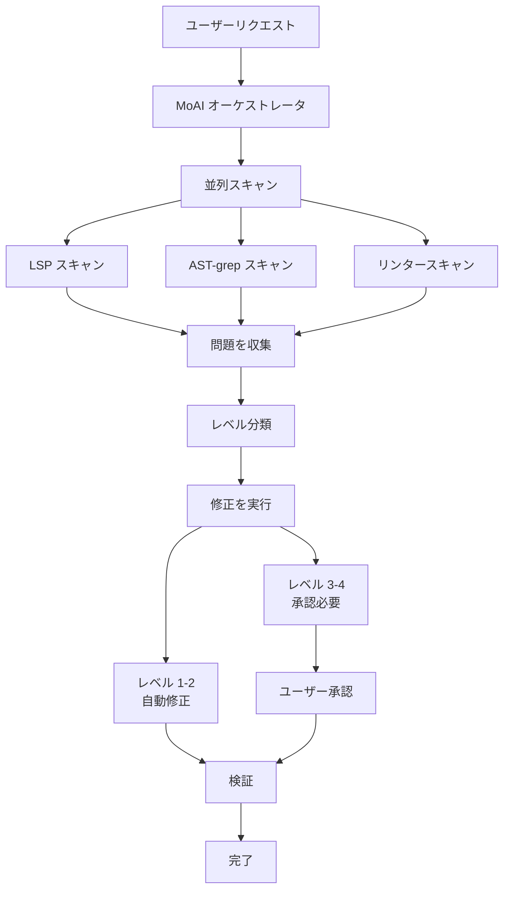

# /moai fix

ワンショット自動修正コマンド。コードエラーを**並列スキャン**して**一度に修正**します。


**一言でいうと**: `/moai fix` は「高速クリーンアップツール」です。コードに蓄積したリンターエラーやタイプエラーを**一度に**修正します。



**スラッシュコマンド**: Claude Code で `/moai:fix` と入力すると、このコマンドを直接実行できます。`/moai` だけ入力すると、利用可能なすべてのサブコマンドの一覧が表示されます。


## 概要

開発中にインポート順序が崩れたり、型が一致しなかったり、リンター警告が蓄積したりします。各問題を個別に見つけて修正する代わりに、`/moai fix` を実行すると AI が自動的に問題を見つけて修正します。

`/moai loop` とは異なり、**1 回のみ**実行されるため、現在の状態を迅速にクリーンアップしたい場合に適しています。

## 使用方法

```bash
> /moai fix
```

個別の引数なしで実行すると、現在のプロジェクトのエラーをスキャンして自動的に修正可能なものを修正します。

## サポートされるフラグ

| フラグ | 説明 | 例 |
|------|-------------|---------|
| `--dry` (or `--dry-run`) | 結果のみ表示、修正なし | `/moai fix --dry` |
| `--sequential` (or `--seq`) | 並列ではなく順次スキャン | `/moai fix --sequential` |
| `--level N` | 最大修正レベルを指定 (デフォルト 3) | `/moai fix --level 2` |
| `--errors` (or `--errors-only`) | エラーのみ修正、警告をスキップ | `/moai fix --errors` |
| `--security` (or `--include-security`) | セキュリティ問題を含める | `/moai fix --security` |
| `--no-fmt` (or `--no-format`) | フォーマット修正をスキップ | `/moai fix --no-fmt` |
| `--resume [ID]` (or `--resume-from`) | スナップショットから再開 (最新は latest) | `/moai fix --resume` |
| `--team` | Agent Teams モードを強制 | `/moai fix --team` |
| `--solo` | サブエージェントモードを強制 | `/moai fix --solo` |

### --dry フラグ

修正なしで変更内容をプレビューします：

```bash
> /moai fix --dry
```

このオプションでは、実際のコード変更は行われません - 発見された問題と予想される変更のみが表示されます。

### --level フラグ

修正レベルを制限します：

```bash
# レベル 1-2 のみ修正 (フォーマット、リンター)
> /moai fix --level 2

# レベル 1 のみ修正 (フォーマットのみ)
> /moai fix --level 1
```

## 実行プロセス

`/moai fix` は 5 つのフェーズで実行されます：



### フェーズ 1: 並列スキャン

3 つのツールがコードを**同時に**スキャンします。

| スキャンツール | チェック項目 | 発見される問題 |
|-----------|--------|----------------|
| **LSP** | タイプシステム | 型の不一致、未定義変数、間違った引数の数 |
| **AST-grep** | コード構造 | 未使用のコード、危険なパターン、非効率な構造 |
| **リンター** | コードスタイル | インポート順序、インデント、命名規則違反 |

### フェーズ 2: 問題収集

スキャン結果を単一のリストに統合します。

```
発見された問題 (例):
  [レベル 1] src/api/router.py:3 - インポート順序が必要
  [レベル 1] src/models/user.py:15 - 不要な空白
  [レベル 2] src/utils/helper.py:8 - 未使用変数 "temp"
  [レベル 2] src/auth/service.py:22 - 不要な else 文
  [レベル 3] src/auth/service.py:45 - エラーハンドリングが不足
  [レベル 4] src/db/connection.py:12 - SQL Injection の可能性
```

### フェーズ 3: レベル分類

収集された問題はリスク別に**4 つのレベルに分類**されます。自動修正が適用されるかはレベルによります。



## 問題レベルの詳細

### レベル 1: フォーマットエラー

コードの動作に**影響しない**形式的な問題。AI が自動的に修正します。

| 項目 | 内容 |
|------|---------|
| **リスク** | 非常に低い |
| **承認** | 不要 (自動修正) |
| **例** | インポート順序、末尾の空白削除、改行統一、インデント修正 |
| **修正ツール** | black, isort, prettier |

**実際の修正例:**

```python
# 修正前 (レベル 1 の問題)
import os
import sys
from pathlib import Path
import json

# 修正後 (自動修正)
import json
import os
import sys
from pathlib import Path
```

### レベル 2: リンター警告

コード品質に影響する**軽微な**問題。AI が自動的に修正してログを記録します。

| 項目 | 内容 |
|------|---------|
| **リスク** | 低い |
| **承認** | 不要 (自動修正、ログ記録) |
| **例** | 未使用変数、不要な else、重複コード、命名規則違反 |
| **修正ツール** | ruff, eslint, golangci-lint |

**実際の修正例:**

```python
# 修正前 (レベル 2 の問題)
def get_user(user_id):
    result = db.query(user_id)
    if result:
        return result
    else:           # 不要な else
        return None

# 修正後 (自動修正)
def get_user(user_id):
    result = db.query(user_id)
    if result:
        return result
    return None
```

### レベル 3: ロジックエラー

コードの動作を**変更する可能性がある**問題。ユーザー承認後に修正されます。

| 項目 | 内容 |
|------|---------|
| **リスク** | 中程度 |
| **承認** | 必要 (ユーザー確認後に修正) |
| **例** | エラーハンドリング不足、間違った条件分岐、未処理のエッジケース、非同期エラー |
| **修正方法** | ユーザーに変更を表示して承認を要求 |

**ユーザーに表示される内容:**

```
[レベル 3] src/auth/service.py:45
  問題: 認証失敗時のエラーハンドリングが不足
  提案: 認証失敗時に適切なエラーレスポンスを返す try-except ブロックを追加

  承認しますか? (y/n)
```

### レベル 4: セキュリティ脆弱性

セキュリティに影響する**深刻な問題**。ユーザー承認が必要で、手動レビューが推奨されます。

| 項目 | 内容 |
|------|---------|
| **リスク** | 高い |
| **承認** | 必要 (手動レビューを強く推奨) |
| **例** | SQL Injection、XSS 脆弱性、ハードコードされたシークレット、安全でないデシリアライズ |
| **修正方法** | 問題と解決策を詳細に説明し、ユーザーレビューを要求 |


**レベル 4 の問題が発見された場合**、AI は自動的に修正しません。セキュリティ脆弱性は誤って修正すると大きな問題を引き起こす可能性があるため、手動でレビューして修正してください。


## /moai loop との違い

| 比較項目 | `/moai fix` | `/moai loop` |
|-----------------|-------------|--------------|
| **実行回数** | 1 回 | 完了まで繰り返し |
| **レベル分類** | あり (レベル 1-4) | なし |
| **承認プロセス** | レベル 3-4 は承認必要 | 自律的に処理 |
| **所要時間** | 短い (1-2 分) | 長くなる可能性 (5-30 分) |
| **最適な用途** | 簡単なエラークリーンアップ | 大規模な問題解決 |


**選択ガイド**:
- "コミット前にリンターエラーを迅速にクリーンアップしたい" → `/moai fix`
- "多くのテスト失敗があり、すべて修正したい" → `/moai loop`


## エージェント委任チェーン

`/moai fix` コマンドのエージェント委任フロー：



**エージェントの役割:**

| エージェント | 役割 | 主なタスク |
|-------|------|------------|
| **MoAI オーケストレータ** | 並列スキャンを調整 |
| **expert-backend** | バックエンド修正 (レベル 1-2) |
| **expert-frontend** | フロントエンド修正 (レベル 1-2) |
| **expert-debug** | ロジックエラー修正 (レベル 3-4) |
| **manager-quality** | 品質検証 | 修正結果を検証 |

## 実践例

### 状況: コミット前のコードクリーンアップ

新機能の実装後、コミット前にコードをクリーンアップしたい場合。

```bash
# 現在のステータスを確認
$ ruff check src/
# 12 個のリンター警告が発見されました

# fix を実行
> /moai fix
```

**実行ログ:**

```
[並列スキャン]
  LSP: 2 個のエラーを発見
  AST-grep: 3 個のパターン違反を発見
  リンター: 12 個の警告を発見

[問題分類]
  レベル 1 (フォーマット): 7 → 自動修正
  レベル 2 (リンター): 8 → 自動修正
  レベル 3 (ロジック): 2 → 承認必要
  レベル 4 (セキュリティ): 0

[レベル 1-2 自動修正完了]
  - インポート順序: 5 件修正
  - 末尾空白削除: 2 件修正
  - 未使用変数削除: 3 件修正
  - 不要な else 削除: 2 件修正
  - タイプヒント修正: 2 件修正
  - 命名規則修正: 1 件修正

[レベル 3 承認リクエスト]
  問題 1: src/auth/service.py:45
    問題: トークン有効期限時のエラーハンドリングが不足
    提案: TokenExpiredError 例外処理を追加
    → 承認済み: 修正完了

  問題 2: src/api/router.py:78
    問題: 入力検証が不足
    提案: Pydantic モデルで入力検証を追加
    → 承認済み: 修正完了

[検証]
  LSP エラー: 0
  リンター警告: 0
  すべての修正を検証。

完了: 17 件の問題を修正
```

## よくある質問

### Q: レベル 3-4 の問題すべてを承認する必要がありますか?

はい、各レベル 3-4 の問題には承認が必要です。ただし、`--dry` で最初に確認して、重要なもののみ承認できます。

### Q: `/moai fix` 実行後に問題が発生した場合はどうすればよいですか?

Git で元に戻せます。修正前にコミットするか、`git stash` でバックアップしておくと良いでしょう。

### Q: 特定のファイルのみ修正したい場合はどうすればよいですか?

`--path` フラグを使用します：

```bash
> /moai fix --path src/auth/
```

### Q: `/moai fix` と `/moai` の違いは何ですか?

`/moai fix` は**エラー修正のみ**を担当します。`/moai` は SPEC 作成から実装、文書化まで**全ワークフロー**を自動的に実行します。

## 関連ドキュメント

- [/moai loop - 反復修正ループ](/utility-commands/moai-loop)
- [/moai - 完全自律自動化](/utility-commands/moai)
- [TRUST 5 品質システム](/core-concepts/trust-5)
