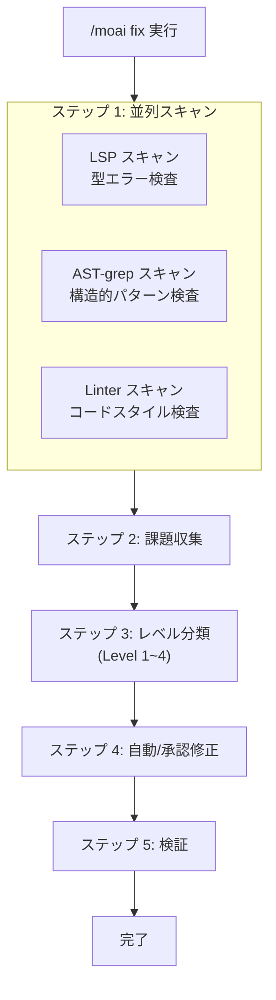
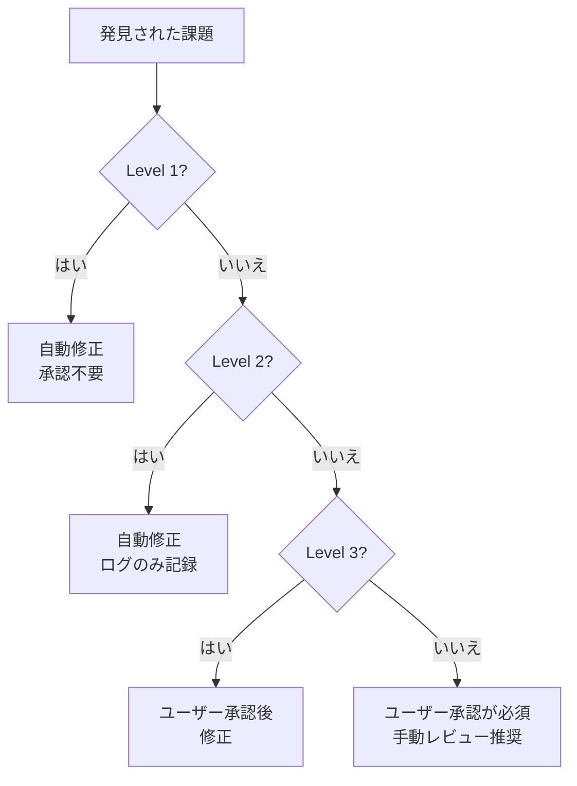
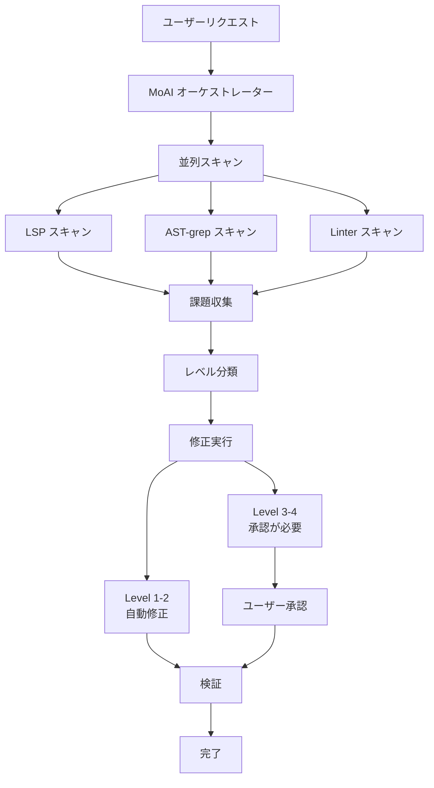

一回限りの自動修正コマンドです。コードのエラーを **並列でスキャン** した後 **一度に修正** します。


**一行要約**: `/moai fix` は「素早い掃除ツール」です。コードに溜まったリントエラー、型エラーを **一度に掃き集めて** 修正します。



**スラッシュコマンド**: Claude Code で `/moai:fix` と入力すると、このコマンドをすぐに実行できます。`/moai` だけ入力すると、利用可能なすべてのサブコマンド一覧が表示されます。


## 概要

開発していると import の並びが崩れたり、型が合わなかったり、リント警告が溜まったりします。こうした問題を 1 つずつ探して直す代わりに、`/moai fix` を実行すると AI が自動的に問題を見つけて修正します。

`/moai loop` とは異なり **ちょうど 1 回だけ** 実行されるので、素早く現在の状態をきれいにしたいときに適しています。ループ系列で見ると `/moai fix` は **単発 (1 回) プリセット** です — 反復が必要ない明確なエラーにループを回すのはトークンの浪費なので、作業サイズに合った最も安いツールを選ぶことがトークノミクスの観点で正しい選択です。

## 使い方

```bash
> /moai fix
```

引数なしで実行すると、現在のプロジェクトのエラーをスキャンして可能なものを自動修正します。

## 対応フラグ

| フラグ | 説明 | 例 |
|-------|------|------|
| `--dry` (または `--dry-run`) | 修正せず結果のみ表示 | `/moai fix --dry` |
| `--sequential` (または `--seq`) | 並列の代わりに順次スキャン | `/moai fix --sequential` |
| `--level N` | 最大修正レベルの指定 (デフォルト値 3) | `/moai fix --level 2` |
| `--errors` (または `--errors-only`) | エラーのみ修正、警告をスキップ | `/moai fix --errors` |
| `--security` (または `--include-security`) | セキュリティ課題を含む | `/moai fix --security` |
| `--no-fmt` (または `--no-format`) | フォーマット修正をスキップ | `/moai fix --no-fmt` |
| `--resume [ID]` (または `--resume-from`) | スナップショットから再開 (latest なら最新) | `/moai fix --resume` |

### --dry フラグ

修正せずにどの変更が行われるかを事前に見られます:

```bash
> /moai fix --dry
```

このオプションを使うと実際のコードを修正せず、発見された課題と予想される変更事項のみを表示します。

### --level フラグ

修正するレベルを制限します:

```bash
# Level 1-2 のみ修正 (フォーマット、リント)
> /moai fix --level 2

# Level 1 のみ修正 (フォーマットのみ)
> /moai fix --level 1
```

## 実行プロセス

`/moai fix` は 5 ステップで実行されます。


```mermaid
flowchart TD
    Start["/moai fix 実行"] --> Scan

    subgraph Scan["ステップ 1: 並列スキャン"]
        S1["LSP スキャン<br/>型エラー検査"]
        S2["AST-grep スキャン<br/>構造的パターン検査"]
        S3["Linter スキャン<br/>コードスタイル検査"]
    end

    Scan --> Collect["ステップ 2: 課題収集"]
    Collect --> Classify["ステップ 3: レベル分類<br/>(Level 1~4)"]
    Classify --> Fix["ステップ 4: 自動/承認修正"]
    Fix --> Verify["ステップ 5: 検証"]
    Verify --> Done["完了"]
```

### ステップ 1: 並列スキャン

3 つのツールが **同時に** コードをスキャンします。

| スキャンツール | 検査対象 | 発見する問題 |
|-----------|-----------|---------------|
| **LSP** | 型システム | 型の不一致、未定義変数、誤った引数の個数 |
| **AST-grep** | コード構造 | 使わないコード、危険なパターン、非効率な構造 |
| **Linter** | コードスタイル | import の並び、インデント、命名規則違反 |

### ステップ 2: 課題収集

スキャン結果を 1 つのリストにまとめます。

```
発見された課題 (例):
  [Level 1] src/api/router.py:3 - import の並びが必要
  [Level 1] src/models/user.py:15 - 不要な空白
  [Level 2] src/utils/helper.py:8 - 使わない変数 "temp"
  [Level 2] src/auth/service.py:22 - 不要な else 構文
  [Level 3] src/auth/service.py:45 - 欠落したエラー処理
  [Level 4] src/db/connection.py:12 - SQL Injection の可能性
```

### ステップ 3: レベル分類

収集された課題を **危険度に応じて 4 段階に分類** します。レベルに応じて自動修正の可否が変わります。安全なものは機械が処理し、危険なものは人の承認を受ける — 自律性と安全ゲートを一緒に置くハーネス設計の原則がここにも適用されます。


```mermaid
flowchart TD
    Issue[発見された課題] --> L1{Level 1?}
    L1 -->|はい| Auto1["自動修正<br/>承認不要"]
    L1 -->|いいえ| L2{Level 2?}
    L2 -->|はい| Auto2["自動修正<br/>ログのみ記録"]
    L2 -->|いいえ| L3{Level 3?}
    L3 -->|はい| Approve3["ユーザー承認後<br/>修正"]
    L3 -->|いいえ| Approve4["ユーザー承認が必須<br/>手動レビュー推奨"]
```

## 課題レベルの詳細

### Level 1: フォーマットエラー

コードの **動作に影響を与えない** 形式的な問題です。AI が自動的に修正します。

| 項目 | 内容 |
|------|------|
| **危険度** | 非常に低い |
| **承認** | 不要 (自動修正) |
| **例** | import の並び、末尾空白の除去、改行の統一、インデントの修正 |
| **修正ツール** | black, isort, prettier |

**実際の修正例:**

```python
# 修正前 (Level 1 課題)
import os
import sys
from pathlib import Path
import json

# 修正後 (自動修正)
import json
import os
import sys
from pathlib import Path
```

### Level 2: リント警告

コード品質に影響を与える **軽微な** 問題です。AI が自動的に修正してログを残します。

| 項目 | 内容 |
|------|------|
| **危険度** | 低い |
| **承認** | 不要 (自動修正、ログ記録) |
| **例** | 使わない変数、不要な else、重複コード、命名規則違反 |
| **修正ツール** | ruff, eslint, golangci-lint |

**実際の修正例:**

```python
# 修正前 (Level 2 課題)
def get_user(user_id):
    result = db.query(user_id)
    if result:
        return result
    else:           # 不要な else
        return None

# 修正後 (自動修正)
def get_user(user_id):
    result = db.query(user_id)
    if result:
        return result
    return None
```

### Level 3: ロジックエラー

コードの **動作を変える可能性がある** 問題です。ユーザーの承認を受けた後に修正します。

| 項目 | 内容 |
|------|------|
| **危険度** | 中程度 |
| **承認** | 必要 (ユーザー確認後に修正) |
| **例** | 欠落したエラー処理、誤った条件文、境界値の未処理、非同期エラー |
| **修正方式** | ユーザーに変更内容を見せて承認を要請 |

**ユーザーに見せる内容:**

```
[Level 3] src/auth/service.py:45
  問題: 認証失敗時のエラー処理が欠落しています
  提案: try-except ブロックを追加して認証失敗時に適切なエラー応答を返します

  承認しますか? (y/n)
```

### Level 4: セキュリティ脆弱性

**セキュリティに影響を与える** 深刻な問題です。必ずユーザーの承認が必要で、手動レビューを推奨します。

| 項目 | 内容 |
|------|------|
| **危険度** | 高い |
| **承認** | 必須 (手動レビューを強く推奨) |
| **例** | SQL Injection、XSS 脆弱性、ハードコードされた秘密鍵、安全でない逆シリアライズ |
| **修正方式** | 問題と解決方法を詳しく説明してユーザーにレビューを要請 |


**Level 4 課題が発見されると** AI は自動的に修正しません。セキュリティ脆弱性は誤って修正するとより大きな問題を作りかねないので、必ず自ら確認した後に修正してください。


## /moai loop との違い

| 比較項目 | `/moai fix` | `/moai loop` |
|-----------|-------------|--------------|
| **実行回数** | 1 回 | 完了するまで反復 |
| **レベル分類** | あり (Level 1-4) | なし |
| **承認手続き** | Level 3-4 は承認が必要 | 自律的に処理 |
| **所要時間** | 短い (1-2 分) | 長くなることがある (5-30 分) |
| **適した状況** | 簡単なエラーの整理 | 大規模な問題解決 |


**選択ガイド**:
- 「コミット前にリントエラーだけ素早く整理したい」 → `/moai fix`
- 「テスト失敗が多くて全部直したい」 → `/moai loop`


## 残余課題のハンドオフ (loop への引き継ぎ)

`/moai fix` は単発 (1 回) パイプラインなので、1 度のスキャン-修正-検証で解決されない課題が残ることがあります。残る課題の種類:

- **Level 4 手動項目** (セキュリティ・アーキテクチャ — 自動修正禁止)
- **未解決エラー** (repair ステップで直せなかった項目)
- **Phase 5 回帰ガード失敗** (元に戻すことも報告することもできなかった回帰)

こうした残余が残ると fix ワークフローはこれを `.moai/state/loop-verdict-<id>.json` に `exit_kind: "one-shot-residue"`、`iterations_used: 1` で永続化します。このスキーマは `/moai loop` の残余永続化スキーマと同じです。

報告書は再修正可能な残余について `/moai loop` への進入を **提案するだけ** で、fix ワークフローが `/moai loop` や他のサブコマンドを自動呼び出しすることはありません。ユーザーが自ら `/moai loop` に再進入すると、永続化された残余がループのスキャンキューに項目として組み込まれ、goal-preset スイープがこれを空にします。

## エージェント委任チェーン

`/moai fix` コマンドのエージェント委任フローです:


```mermaid
flowchart TD
    User["ユーザーリクエスト"] --> Orchestrator["MoAI オーケストレーター"]
    Orchestrator --> Parallel["並列スキャン"]

    Parallel --> LSP["LSP スキャン"]
    Parallel --> AST["AST-grep スキャン"]
    Parallel --> Linter["Linter スキャン"]

    LSP --> Collect["課題収集"]
    AST --> Collect
    Linter --> Collect

    Collect --> Classify["レベル分類"]
    Classify --> Fix["修正実行"]

    Fix --> Level12["Level 1-2<br/>自動修正"]
    Fix --> Level34["Level 3-4<br/>承認が必要"]

    Level12 --> Verify["検証"]
    Level34 --> UserApprove["ユーザー承認"]
    UserApprove --> Verify

    Verify --> Complete["完了"]
```

**エージェントの役割:**

| エージェント | 役割 | 主な作業 |
|----------|------|----------|
| **MoAI オーケストレーター** | 並列スキャンの調整 | 課題収集、レベル分類、ユーザー承認 |
| **manager-develop** | 修正実行 | Level 1-2 自動修正、Level 3-4 承認後に修正 |
| **sync-auditor** | 品質検証 | 修正結果の確認 |

## 実践例

### 状況: コミット前のコード整理

新しい機能を実装した後、コミットする前にコードを整理したい状況です。

```bash
# 現在の状態確認
$ ruff check src/
# 12 個のリント警告を発見

# fix 実行
> /moai fix
```

**実行ログ:**

```
[並列スキャン]
  LSP: エラー 2 個を発見
  AST-grep: パターン違反 3 個を発見
  Linter: 警告 12 個を発見

[課題分類]
  Level 1 (フォーマット): 7 個 → 自動修正
  Level 2 (リント): 8 個 → 自動修正
  Level 3 (ロジック): 2 個 → 承認が必要
  Level 4 (セキュリティ): 0 個

[Level 1-2 自動修正完了]
  - import の並び 5 件
  - 末尾空白の除去 2 件
  - 使わない変数の除去 3 件
  - 不要な else の除去 2 件
  - 型ヒントの修正 2 件
  - 命名規則の修正 1 件

[Level 3 承認要請]
  課題 1: src/auth/service.py:45
    問題: トークン有効期限切れ時のエラー処理が欠落
    提案: TokenExpiredError 例外処理を追加
    → 承認済み: 修正完了

  課題 2: src/api/router.py:78
    問題: 入力値の検証が欠落
    提案: Pydantic モデルで入力検証を追加
    → 承認済み: 修正完了

[検証]
  LSP エラー: 0 個
  Linter 警告: 0 個
  すべての修正が検証されました。

完了: 17 個の課題を修正
```

## よくある質問

### Q: Level 3-4 課題が多ければすべて承認しないといけませんか?

はい、Level 3-4 課題はそれぞれ承認が必要です。ただし `--dry` で先に確認して、重要なものだけ承認することもできます。

### Q: `/moai fix` 実行後に問題が起きたら?

Git で元に戻せます。修正前にコミットするか、`git stash` でバックアップしておくのが良いです。

### Q: 修正できなかった残余課題はどうなりますか?

`/moai fix` が残余課題 (Level 4 手動項目、未解決エラー、Phase 5 回帰ガード失敗) を残したまま終了すると、残余項目は `.moai/state/loop-verdict-<id>.json` に `exit_kind: "one-shot-residue"` で永続化されます。報告書は再修正可能な残余について `/moai loop` への進入を **提案するだけ** で (自動呼び出ししない)、ユーザーが `/moai loop` に再進入するとこの残余がループキューにスキャン項目として入ります。

### Q: `/moai fix` と `/moai` の違いは何ですか?

`/moai fix` は **エラー修正のみ** を担当します。`/moai` は SPEC 生成から実装、ドキュメント化まで **ワークフロー全体** を自動的に行います。

## 関連ドキュメント

- [/moai loop - 反復修正ループ](/utility-commands/moai-loop)
- [/moai - 完全自律の自動化](/utility-commands/moai)
- [TRUST 5 品質システム](/core-concepts/trust-5)
