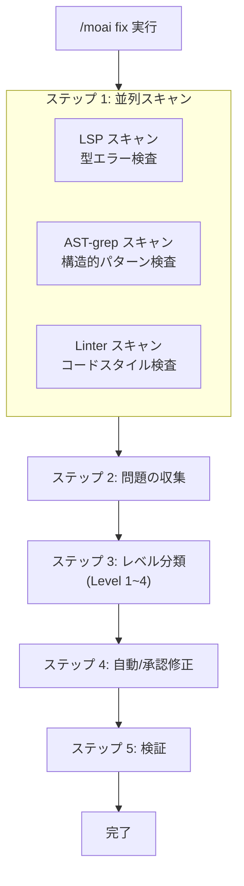
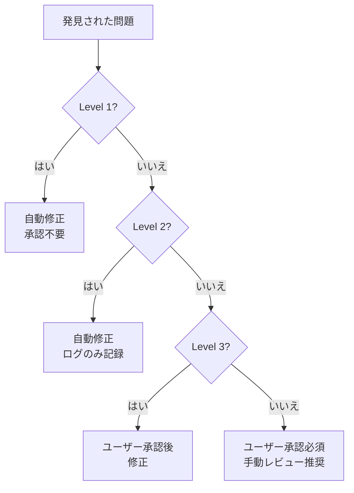
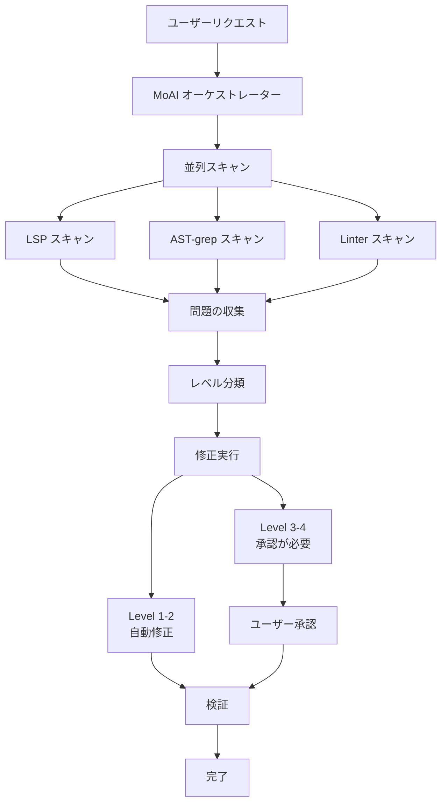

ワンショット自動修正コマンドです。コードのエラーを **並列でスキャン** した後、**一度に修正** します。


**一言まとめ**: `/moai fix` は「素早い掃除ツール」です。コードにたまった lint エラーや型エラーを **一気にまとめて** 修正します。



**スラッシュコマンド**: Claude Code で `/moai:fix` と入力すると、このコマンドをすぐに実行できます。`/moai` だけを入力すると、使用可能なすべてのサブコマンドの一覧が表示されます。


## 概要

開発していると、import の整列が崩れたり、型が合わなかったり、lint 警告がたまったりします。こうした問題を 1 つずつ探して直す代わりに、`/moai fix` を実行すると AI が自動で問題を見つけて修正します。

`/moai loop` と異なり **1 回だけ** 実行されるため、素早く現在の状態をきれいにしたいときに適しています。ループ系列の中で見ると `/moai fix` は **ワンショット (1 回) プリセット** です — 反復が不要な明確なエラーにループを回すのはトークンの浪費なので、作業サイズに合った最も安いツールを選ぶのがトークノミクスの観点で正しい選択です。

## 使い方

```bash
> /moai fix
```

引数なしで実行すると、現在のプロジェクトのエラーをスキャンし、可能なものを自動修正します。

## サポートされるフラグ

| フラグ | 説明 | 例 |
|-------|------|------|
| `--dry` (または `--dry-run`) | 修正なしで結果のみ表示 | `/moai fix --dry` |
| `--sequential` (または `--seq`) | 並列ではなく逐次スキャン | `/moai fix --sequential` |
| `--level N` | 最大修正レベルを指定 (デフォルト 3) | `/moai fix --level 2` |
| `--errors` (または `--errors-only`) | エラーのみ修正、警告はスキップ | `/moai fix --errors` |
| `--security` (または `--include-security`) | セキュリティ問題を含める | `/moai fix --security` |
| `--no-fmt` (または `--no-format`) | フォーマット修正をスキップ | `/moai fix --no-fmt` |
| `--resume [ID]` (または `--resume-from`) | スナップショットから再開 (latest なら最新) | `/moai fix --resume` |
| `--team` | エージェントチームモードを強制 | `/moai fix --team` |
| `--solo` | サブエージェントモードを強制 | `/moai fix --solo` |

### --dry フラグ

修正なしで、どのような変更が行われるかを事前に確認できます:

```bash
> /moai fix --dry
```

このオプションを使うと実際のコードは修正せず、発見された問題と予想される変更のみを表示します。

### --level フラグ

修正するレベルを制限します:

```bash
# Level 1-2 のみ修正 (フォーマット、lint)
> /moai fix --level 2

# Level 1 のみ修正 (フォーマットのみ)
> /moai fix --level 1
```

## 実行プロセス

`/moai fix` は 5 つのステップで実行されます。


```mermaid
flowchart TD
    Start["/moai fix 実行"] --> Scan

    subgraph Scan["ステップ 1: 並列スキャン"]
        S1["LSP スキャン<br/>型エラー検査"]
        S2["AST-grep スキャン<br/>構造的パターン検査"]
        S3["Linter スキャン<br/>コードスタイル検査"]
    end

    Scan --> Collect["ステップ 2: 問題の収集"]
    Collect --> Classify["ステップ 3: レベル分類<br/>(Level 1~4)"]
    Classify --> Fix["ステップ 4: 自動/承認修正"]
    Fix --> Verify["ステップ 5: 検証"]
    Verify --> Done["完了"]
```

### ステップ 1: 並列スキャン

3 つのツールが **同時に** コードをスキャンします。

| スキャンツール | 検査対象 | 発見する問題 |
|-----------|-----------|---------------|
| **LSP** | 型システム | 型の不一致、未定義変数、不正な引数の数 |
| **AST-grep** | コード構造 | 未使用コード、危険なパターン、非効率な構造 |
| **Linter** | コードスタイル | import の整列、インデント、命名規則違反 |

### ステップ 2: 問題の収集

スキャン結果を 1 つのリストにまとめます。

```
発見された問題 (例):
  [Level 1] src/api/router.py:3 - import の整列が必要
  [Level 1] src/models/user.py:15 - 不要な空白
  [Level 2] src/utils/helper.py:8 - 未使用変数 "temp"
  [Level 2] src/auth/service.py:22 - 不要な else 構文
  [Level 3] src/auth/service.py:45 - エラー処理の欠落
  [Level 4] src/db/connection.py:12 - SQL Injection の可能性
```

### ステップ 3: レベル分類

収集された問題を **リスクに応じて 4 段階に分類** します。レベルによって自動修正の可否が変わります。安全なものは機械が処理し、危険なものは人間の承認を得る — 自律性と安全ゲートを両立させるハーネス設計原則がここにも適用されています。


```mermaid
flowchart TD
    Issue[発見された問題] --> L1{Level 1?}
    L1 -->|はい| Auto1["自動修正<br/>承認不要"]
    L1 -->|いいえ| L2{Level 2?}
    L2 -->|はい| Auto2["自動修正<br/>ログのみ記録"]
    L2 -->|いいえ| L3{Level 3?}
    L3 -->|はい| Approve3["ユーザー承認後<br/>修正"]
    L3 -->|いいえ| Approve4["ユーザー承認必須<br/>手動レビュー推奨"]
```

## 問題レベルの詳細

### Level 1: フォーマットエラー

コードの **動作に影響しない** 形式的な問題です。AI が自動で修正します。

| 項目 | 内容 |
|------|------|
| **リスク** | 非常に低い |
| **承認** | 不要 (自動修正) |
| **例** | import の整列、末尾空白の除去、改行の統一、インデントの修正 |
| **修正ツール** | black, isort, prettier |

**実際の修正例:**

```python
# 修正前 (Level 1 の問題)
import os
import sys
from pathlib import Path
import json

# 修正後 (自動修正)
import json
import os
import sys
from pathlib import Path
```

### Level 2: lint 警告

コード品質に影響する **軽微な** 問題です。AI が自動で修正し、ログを残します。

| 項目 | 内容 |
|------|------|
| **リスク** | 低い |
| **承認** | 不要 (自動修正、ログ記録) |
| **例** | 未使用変数、不要な else、重複コード、命名規則違反 |
| **修正ツール** | ruff, eslint, golangci-lint |

**実際の修正例:**

```python
# 修正前 (Level 2 の問題)
def get_user(user_id):
    result = db.query(user_id)
    if result:
        return result
    else:           # 不要な else
        return None

# 修正後 (自動修正)
def get_user(user_id):
    result = db.query(user_id)
    if result:
        return result
    return None
```

### Level 3: ロジックエラー

コードの **動作を変える可能性のある** 問題です。ユーザーの承認を得てから修正します。

| 項目 | 内容 |
|------|------|
| **リスク** | 中程度 |
| **承認** | 必要 (ユーザー確認後に修正) |
| **例** | エラー処理の欠落、誤った条件文、境界値の未処理、非同期エラー |
| **修正方式** | ユーザーに変更内容を提示して承認を要請 |

**ユーザーに提示される内容:**

```
[Level 3] src/auth/service.py:45
  問題: 認証失敗時のエラー処理が欠落しています
  提案: try-except ブロックを追加し、認証失敗時に適切なエラーレスポンスを返します

  承認しますか? (y/n)
```

### Level 4: セキュリティ脆弱性

**セキュリティに影響する** 深刻な問題です。必ずユーザーの承認が必要で、手動レビューを推奨します。

| 項目 | 内容 |
|------|------|
| **リスク** | 高い |
| **承認** | 必須 (手動レビューを強く推奨) |
| **例** | SQL Injection、XSS 脆弱性、ハードコードされた秘密鍵、安全でないデシリアライズ |
| **修正方式** | 問題と解決策を詳細に説明し、ユーザーにレビューを要請 |


**Level 4 の問題が発見された場合**、AI は自動では修正しません。セキュリティ脆弱性は誤って修正するとより大きな問題を生む可能性があるため、必ず直接確認してから修正してください。


## /moai loop との違い

| 比較項目 | `/moai fix` | `/moai loop` |
|-----------|-------------|--------------|
| **実行回数** | 1 回 | 完了するまで反復 |
| **レベル分類** | あり (Level 1-4) | なし |
| **承認手続き** | Level 3-4 は承認が必要 | 自律的に処理 |
| **所要時間** | 短い (1-2 分) | 長くなり得る (5-30 分) |
| **適した状況** | 簡単なエラー整理 | 大規模な問題解決 |


**選択ガイド**:
- 「コミット前に lint エラーだけ素早く片付けたい」 → `/moai fix`
- 「テスト失敗が多いので全部直したい」 → `/moai loop`


## エージェント委任チェーン

`/moai fix` コマンドのエージェント委任フローです:


```mermaid
flowchart TD
    User["ユーザーリクエスト"] --> Orchestrator["MoAI オーケストレーター"]
    Orchestrator --> Parallel["並列スキャン"]

    Parallel --> LSP["LSP スキャン"]
    Parallel --> AST["AST-grep スキャン"]
    Parallel --> Linter["Linter スキャン"]

    LSP --> Collect["問題の収集"]
    AST --> Collect
    Linter --> Collect

    Collect --> Classify["レベル分類"]
    Classify --> Fix["修正実行"]

    Fix --> Level12["Level 1-2<br/>自動修正"]
    Fix --> Level34["Level 3-4<br/>承認が必要"]

    Level12 --> Verify["検証"]
    Level34 --> UserApprove["ユーザー承認"]
    UserApprove --> Verify

    Verify --> Complete["完了"]
```

**エージェントの役割:**

| エージェント | 役割 | 主な作業 |
|----------|------|----------|
| **MoAI オーケストレーター** | 並列スキャンの調整 | 問題の収集、レベル分類、ユーザー承認 |
| **manager-develop** | 修正実行 | Level 1-2 の自動修正、Level 3-4 の承認後修正 |
| **sync-auditor** | 品質検証 | 修正結果の確認 |

## 実践例

### 状況: コミット前のコード整理

新機能を実装した後、コミット前にコードを整理したい状況です。

```bash
# 現在の状態を確認
$ ruff check src/
# 12 件の lint 警告を発見

# fix 実行
> /moai fix
```

**実行ログ:**

```
[並列スキャン]
  LSP: エラー 2 件発見
  AST-grep: パターン違反 3 件発見
  Linter: 警告 12 件発見

[問題の分類]
  Level 1 (フォーマット): 7 件 → 自動修正
  Level 2 (lint): 8 件 → 自動修正
  Level 3 (ロジック): 2 件 → 承認が必要
  Level 4 (セキュリティ): 0 件

[Level 1-2 自動修正完了]
  - import 整列 5 件
  - 末尾空白の除去 2 件
  - 未使用変数の除去 3 件
  - 不要な else の除去 2 件
  - 型ヒントの修正 2 件
  - 命名規則の修正 1 件

[Level 3 承認要請]
  問題 1: src/auth/service.py:45
    問題: トークン失効時のエラー処理欠落
    提案: TokenExpiredError の例外処理を追加
    → 承認: 修正完了

  問題 2: src/api/router.py:78
    問題: 入力値検証の欠落
    提案: Pydantic モデルで入力検証を追加
    → 承認: 修正完了

[検証]
  LSP エラー: 0 件
  Linter 警告: 0 件
  すべての修正が検証されました。

完了: 17 件の問題を修正
```

## よくある質問

### Q: Level 3-4 の問題が多い場合、すべて承認しなければなりませんか?

はい、Level 3-4 の問題はそれぞれ承認が必要です。ただし `--dry` で先に確認し、重要なものだけ承認することもできます。

### Q: `/moai fix` 実行後に問題が起きたら?

Git で元に戻せます。修正前にコミットするか、`git stash` でバックアップしておくのがよいでしょう。

### Q: 特定のファイルだけ修正したい場合は?

`--path` フラグを使ってください:

```bash
> /moai fix --path src/auth/
```

### Q: `/moai fix` と `/moai` の違いは何ですか?

`/moai fix` は **エラー修正のみ** を担当します。`/moai` は SPEC 生成から実装、ドキュメント化まで **ワークフロー全体** を自動で実行します。

## 関連ドキュメント

- [/moai loop - 反復修正ループ](/utility-commands/moai-loop)
- [/moai - 完全自律自動化](/utility-commands/moai)
- [TRUST 5 品質システム](/core-concepts/trust-5)
