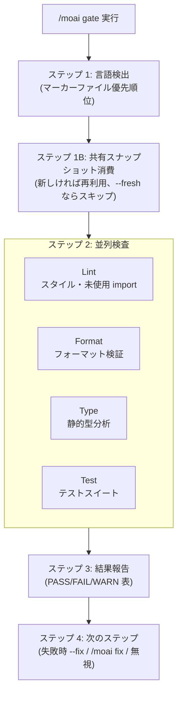

コミット前に品質を素早く検証する **軽量ゲート** コマンドです。リント・フォーマット・型検査・テストを **並列で** 実行し、ほとんどのプロジェクトで 30 秒以内に完了します。


**一行要約**: `/moai gate` は「コミット前のクイック検問所」です。4 つの検査 (リント・フォーマット・型・テスト) を同時に走らせ、合格/失敗を即座に知らせます — フルコードレビューやカバレッジ分析なしで素早く。



**スラッシュコマンド**: Claude Code で `/moai:gate` と入力すると、このコマンドをすぐに実行できます。`/moai` だけ入力すると、利用可能なすべてのサブコマンド一覧が表示されます。


## 概要

コミットする前に「今の状態はクリーンか?」を確認したいときに使います。`/moai review` (深層 4 観点レビュー) や sync パイプラインの全体品質検査とは異なり、`/moai gate` は **素早い合格/失敗判定** のみを提供します。

| ワークフロー | 範囲 | 速度 | 使用タイミング |
|-----------|------|------|-----------|
| `/moai gate` | リント + フォーマット + 型 + テスト | 速い (<30 秒) | 毎コミット前 |
| `/moai review` | 4 観点深層コードレビュー | 中程度 (2-5 分) | PR 前、設計レビュー |
| sync 品質検査 | 全体品質 + コードレビュー + カバレッジ | 遅い (5-10 分) | sync パイプラインの一部 |

## 使い方

```bash
# 全体検査
> /moai gate

# リント・フォーマット自動修正
> /moai gate --fix

# ステージングされたファイルのみ検査
> /moai gate --staged

# 特定ファイルのみ検査
> /moai gate --file src/auth/service.go
```

## 対応フラグ

| フラグ | 説明 | 例 |
|-------|------|------|
| `--fix` | リント・フォーマットの問題を自動修正 (デフォルト: 報告のみ) | `/moai gate --fix` |
| `--staged` | `git diff --staged` のファイルのみ検査 (テストは常に全体実行) | `/moai gate --staged` |
| `--file PATH` | 特定ファイルのみ検査 | `/moai gate --file src/api.go` |
| `--fresh` | 強制 fresh モード — 共有診断スナップショットの消費をすべて無効化し、すべての検査を新規に実行 | `/moai gate --fresh` |

## 実行プロセス



### ステップ 1: 言語検出

マーカーファイルを優先順位順に確認し (最初のマッチが勝つ)、言語別ツールチェーンを選択します。16 個の対応言語を同等に扱い、たとえば Go は `go vet`・`golangci-lint`・`go test -race`、Python は `ruff`・`mypy`・`pytest` が実行されます。認識されるマーカーがなければ言語別検査をスキップし、"unknown language" を報告します。

### ステップ 1B: 共有診断スナップショット消費

検査を実行する前に、現在の作業ツリーに対する共有診断スナップショットを照会します。新しいスナップショット (キー一致 + TTL 以内、デフォルト 10 分) がこのゲートが走らせる検査カテゴリをカバーしていれば、再実行の代わりに記録された結果を再利用し、報告書に `Test | PASS (snapshot)` のように表示します。古いスナップショットは決して証拠として引用せず、再実行します。`--fresh` モードではこのステップを丸ごとスキップします。

### ステップ 2: 並列検査

4 つの検査をバックグラウンドで同時に実行します。

| 検査 | 対象 | `--fix` 動作 |
|------|------|--------------|
| **Lint** | スタイル違反、未使用 import、デッドコード | 自動修正可能な項目を修正 |
| **Format** | フォーマットされていないファイル | 自動フォーマット |
| **Type** | 型エラー、欠落したアノテーション | 自動修正なし (手動介入) |
| **Test** | テスト失敗 | 自動修正なし (原因調査が必要) |

個別検査のタイムアウトは 60 秒、ゲート全体のタイムアウトは 90 秒です。タイムアウトすると WARNING として報告しますが、ブロックはしません。実行された (再利用ではない) 全体範囲の検査結果は `.moai/state/verify/` 配下の共有スナップショットストアに記録され、ダウンストリームの消費者 (run-phase 事前レビューゲート、sync 事前ゲート、stop-goal 評価器) がツリーがそのままである間、再利用できます。

### ステップ 3: 結果報告

```
## Quality Gate: PASS
| Check  | Status | Time  |
|--------|--------|-------|
| Lint   | PASS   | 2.1s  |
| Format | PASS   | 0.8s  |
| Type   | PASS   | 3.2s  |
| Test   | PASS   | 12.4s |
Total: 18.5s
```

### ステップ 4: 次のステップ

すべて合格すればコミット準備完了メッセージを表示します。`--fix` なしで失敗すると `AskUserQuestion` で次を提示します — 自動修正 (`--fix` 再実行、推奨) / `/moai fix` (深層解決) / 無視して進行。`--fix` の後にも残る問題 (型エラー・テスト失敗) は手動調査を推奨します。

## 他のコマンドとの関係

`/moai gate` は検証のみを行いファイルを修正しない **軽量検問所** です (`--fix` を与えたときのみリント・フォーマットを修正)。より深い解決が必要なら `/moai fix` (単発) や `/moai loop` (反復) に進み、PR 前の総合レビューは `/moai review` を使います。`--fresh` モードは `/moai loop` の独立した最終検証パスが自己参照のない証拠を得るためにこのゲートを呼び出すときに使われます。

## 関連ドキュメント

- [/moai fix - 一回限りの自動修正](/utility-commands/moai-fix)
- [/moai loop - 反復修正ループ](/utility-commands/moai-loop)
- [TRUST 5 品質システム](/core-concepts/trust-5)
