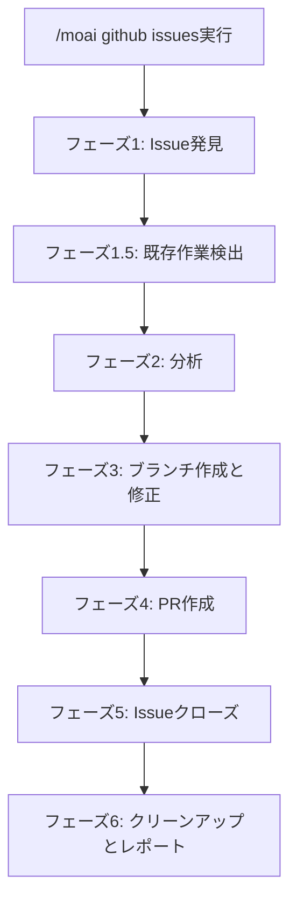
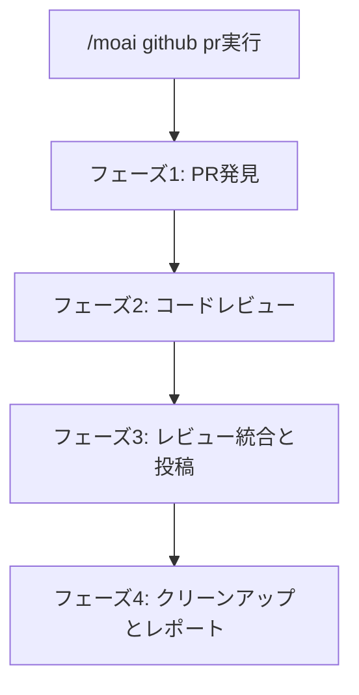

GitHub Issue修正とPRコードレビューの自動化（Agent Teams対応）。


**一言でいうと**: `/moai github`はAgent Teamsを使用して**GitHub Issueを自動修正し、PRを多角的に分析してレビュー**します。



**スラッシュコマンド**: Claude Codeで `/moai:github` と入力して直接実行します。`/moai` のみを入力すると、利用可能なすべてのサブコマンドのリストが表示されます。


## 概要

`/moai github`は2つの主要なワークフローを提供します：

- **issues**: GitHub Issueを取得して根本原因を分析し、修正を実装してPRを作成
- **pr**: PRを取得して多角的コードレビューを実行し、レビューコメントを投稿


**重要**: このコマンドを使用するには、GitHub CLI (`gh`)がインストールされ、認証されている必要があります。


## 使用方法

### Issue修正ワークフロー

```bash
# オープン中のIssue一覧を表示して選択
> /moai github issues

# 特定のIssueを修正
> /moai github issues 123

# 特定のラベルのIssueを修正
> /moai github issues --label bug

# すべてのオープン中のIssueを修正（バッチモード）
> /moai github issues --all

# CI通過後自動マージ
> /moai github issues 123 --merge
```

### PRレビューワークフロー

```bash
# オープン中のPR一覧を表示して選択
> /moai github pr

# 特定のPRをレビュー
> /moai github pr 456

# すべてのオープン中のPRをレビュー
> /moai github pr --all

# 承認後自動マージ
> /moai github pr 456 --merge

# サブエージェントモード強制（Agent Teamsをスキップ）
> /moai github pr 456 --solo
```

## 対応フラグ

| フラグ | 説明 | 例 |
|------|------|---------|
| `--all` | すべてのオープン項目を処理 | `/moai github issues --all` |
| `--label LABEL` | ラベルでIssueをフィルタリング | `/moai github issues --label bug` |
| `--merge` | CI通過後自動マージ | `/moai github pr 123 --merge` |
| `--solo` | サブエージェントモードを強制 | `/moai github issues --solo` |
| `--tmux` | 並列作業用tmuxセッション作成 | `/moai github issues --tmux` |

## Issueワークフロー

Issueワークフローは以下のフェーズに従います：



### フェーズ1: Issue発見

1. GitHubからオープン中のIssueを取得
2. Issueリストを表示またはラベル/番号でフィルタリング
3. タイプ別にIssueを分類（バグ、機能、改善、ドキュメント）

### フェーズ1.5: 既存作業検出

分析を開始する前に、ワークフローは既存のボット作業を確認します：

- @claudeボットブランチを検出
- Issueを参照する既存のPRを確認
- 既存作業を再利用するか最初からやり直すかをユーザーに質問

| ボットブランチ | PR存在 | アクション |
|-----------|-----------|--------|
| あり | あり（マージ済み） | Issueをスキップ（既に解決済み） |
| あり | あり（オープン中） | 質問: 既存PRをレビュー/やり直し |
| なし | あり（オープン中） | 質問: 既存PRをレビュー/作業継続 |
| なし | なし | 通常の分析を継続 |

### フェーズ2: 分析

**チームモード（デフォルト）:**

並列Issue分析のためのチームを作成：

- **アナリストチームメイト**: コードベースを探索、根本原因を特定
- **コーダーチームメイト**: 分離されたワークツリーで修正を実装
- **バリデーターチームメイト**: 修正を検証し、テストカバレッジを確認

**サブエージェントモード（--solo）:**

適切な専門エージェントに委譲：
- バグ修正: expert-debugサブエージェント
- 機能: expert-backendまたはexpert-frontendサブエージェント
- 改善: expert-refactoringサブエージェント

### フェーズ3: ブランチ作成と修正

1. Issueタイプに基づいて機能ブランチを作成：
   - バグ: `fix/issue-{number}`
   - 機能: `feat/issue-{number}`
   - 改善: `improve/issue-{number}`
   - ドキュメント: `docs/issue-{number}`

2. テストと共に修正を実装
3. テストが通ることを確認
4. `Fixes #{number}` 参照を含めて変更をコミット

### フェーズ4: PR作成

以下の内容でPRを作成：
- タイトル: `{type}: {issue title}`
- 本文: 修正要約、テスト計画、Issue参照
- `Fixes #{number}`によるIssue自動リンク

### フェーズ5: Issueクローズ

PRマージ後、多言語コメントでIssueをクローズ：

```
Issueが正常に解決されました！

実装: {要約}
関連PR: #{pr_number}
マージ時刻: {timestamp} {timezone}
テストカバレッジ: {coverage}%
```

対応言語: 英語、韓国語、日本語、中国語

## PRレビューワークフロー

PRワークフローは多角的コードレビューを実行します：



### フェーズ2: 多角的レビュー

**チームモード（デフォルト）:**

3人のレビューアーがPRを並列分析：

| レビューアー | 視点 | 集中領域 |
|----------|-------------|-------------|
| **security-reviewer** | セキュリティ | インジェクションリスク、認証/認可、データ漏洩、OWASP Top 10 |
| **perf-reviewer** | パフォーマンス | アルゴリズム複雑度、データベースパターン、メモリリーク、並行性 |
| **quality-reviewer** | 品質 | 正確性、テストカバレッジ、命名、エラー処理 |

**サブエージェントモード（--solo）:**

以下のエージェントが順次レビュー：
1. expert-securityサブエージェント
2. expert-performanceサブエージェント
3. manager-qualityサブエージェント

### フェーズ3: レビュー投稿

発見内容は重大度で分類：

- **Critical**: マージ前に修正必須（セキュリティ脆弱性、データ損失リスク）
- **Important**: 修正推奨（パフォーマンス問題、エラー処理欠如）
- **Suggestion**: 改善提案（命名、スタイル、軽微な改善）

レビューアクションオプション：
- **Approve**: 要約と共に承認を投稿
- **Request Changes**: 必須変更と共に投稿
- **Comment Only**: 承認決定なしにコメントのみ投稿

## ボットレビュー統合

PRマージ時、マージ前にボットレビューステータスを確認：

| ボット | レビューステータス | アクション |
|-----|-------------|--------|
| CodeRabbit | CHANGES_REQUESTED | フィードバック修正後 `@coderabbitai resolve` を投稿 |
| CodeRabbit | APPROVED | マージを継続 |
| CodeRabbit | COMMENTED | コメントをレビュー、Critical/Importantなら修正 |
| ボットレビューなし | - | マージを継続 |

## 自動マージ安全プロトコル

マージ試行前に以下を確認：

1. **マージ可能性確認**: `CLEAN`、`BEHIND`、`BLOCKED`、または `DIRTY`
2. **レビュー決定確認**: `APPROVED`、`CHANGES_REQUESTED`、またはなし
3. **CIステータス確認**: すべての必須チェックが通過している必要あり

| マージステータス | アクション |
|-------------|--------|
| CLEAN | マージを継続 |
| BEHIND | ブランチを更新、CIを待機、再試行 |
| BLOCKED | ブロッカーを解決（レビュー/CI） |
| DIRTY | 競合を報告、自動マージ不可 |

## エージェントモード

### チームモード（デフォルト）

Agent Teamsモードは並列多角的分析を提供：

- **前提条件**: `CLAUDE_CODE_EXPERIMENTAL_AGENT_TEAMS=1`および`workflow.team.enabled: true`
- **利点**: より高速な分析、同時多角的視点
- **分離**: 各チームメイトは分離されたワークツリーで作業

### サブエージェントモード（--solo）

Agent Teams利用不可時のフォールバックモード：

- 順次エージェント委譲
- 単一コンテキストウィンドウ
- より簡単なデバッグ

## tmux並列開発

`--tmux`フラグ提供時：

1. tmuxセッション作成: `github-issues-{timestamp}`
2. Issueワークツリーごとに1つのペイン（最大3つ表示）
3. 各ペインはワークツリー進入を自動実行
4. 作成後最初のペインにフォーカスを戻す

レイアウト：
- ペイン1-3: 垂直分割
- ペイン4+: 水平分割

## Gitワークフロー設定

`.moai/config/sections/system.yaml`の`github.git_workflow`を読み取り：

| 戦略 | ブランチ動作 | PRターゲット |
|----------|----------------|-----------|
| **github_flow** | 機能ブランチを作成 | main |
| **gitflow** | 機能ブランチを作成 | develop |
| **main_direct** | mainに留まる | main（PRなし） |

## よくある質問

### Q: 修正中にテストが失敗したらどうなりますか？

ワークフローはエラーコンテキストと共に最大3回再試行します。それでも失敗する場合、ユーザーに再試行、スキップ、中止を尋ねます。

### Q: 自動マージなしでPRをレビューできますか？

はい、`--merge`フラグを省略してください。レビューが投稿されますが、マージはされません。

### Q: マージ後、Issueはどのようにクローズされますか？

実装要約、PRリンク、マージタイムスタンプ、テストカバレッジを含む多言語コメント（EN/KO/JA/ZH）でIssueがクローズされます。

### Q: CodeRabbitが変更を要求したらどうなりますか？

ワークフロー:
1. レビューコメントを解析
2. 専門エージェントに修正を委譲
3. PRブランチに修正をプッシュ
4. `@coderabbitai resolve` コメントを投稿
5. 再レビューを待機（最大5分）

### Q: 複数のIssueを同時に処理できますか？

はい、バッチモードには `--all` フラグを使用してください。ブランチ競合を防ぐため、Issueは順次処理されます。

## 関連ドキュメント

- [/moai - 完全自動化](/utility-commands/moai)
- [/moai pr - プルリクエスト管理](/workflow-commands/moai-sync)
- [Git Worktreeガイド](/worktree/guide)
