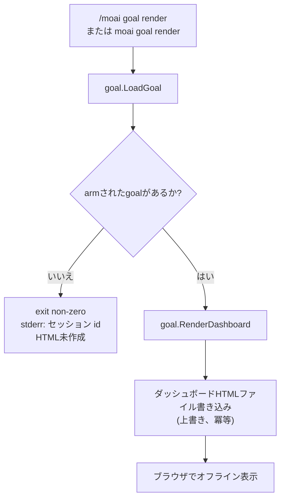

完了条件を宣言すると、セッションがその条件を満たすまで自ら働く **条件宣言型の自律ループ** コマンドです。`/moai goal "<条件>"` で完了条件を arm すると、毎ターン終了時に `stop-goal` Stop フックが条件充足の可否を評価し、満たされるまで次のターンを自動的に開始します。


**一行要約**: `/moai goal` は「終わりの状態を宣言する汎用ループ」です。`/moai loop` が「診断ツールが見つけた問題を全部なくすまで」という条件があらかじめ決まっているプリセットだとすれば、`/moai goal` は完了条件を **直接宣言する** 汎用エンジンです。



**プログラマティックコマンド**: ネイティブの Claude Code `/goal` はユーザーだけが入力できる (HUMAN-ONLY) TUI コマンドです。`/moai goal` は同じ意味を **パイプラインからプログラマティックに** 実装した MoAI 所有コマンドで、`moai` スキルルーティングと `moai goal` CLI を通じて進入します。


## 概要

エージェントに「この条件が満たされるまで任せて働き続けて」と指示したいときに使います。条件は 2 種類を混ぜて使えます。

- **機械的条件 (mechanical)**: シェルコマンドで検証される条件。例: `go test ./... exits 0`。コマンドを実行して終了コードを観察します。
- **モデル評価条件 (model-evaluated)**: トランスクリプトに対する判断で検証される条件。例: `すべての AC 行が PASS として記録される`。セッションがこれまでに残した内容を根拠に評価します。

このループが v3 の 2 つ目の柱、**エージェンティックループエンジニアリング** の汎用エンジンです。goal 状態は `.moai/state/goal/<session-id>.json` にセッションごとに保存され (共有ファイルではない)、**ターン上限 (デフォルト 30)** がループを有界にします。上限に達すると評価器は 5 セクション判定 (Claim / Evidence / Baseline-attribution / Gaps / Residual-risk) を出し、ブロッキングを止めます。`--max-turns 0` を指定すると、コンパクション境界を越えて持続する無限 goal が回り、ターン数の代わりに `--max-duration` (実時間) と停滞ガードが実際の上限になる。実上限なしに `--max-turns 0` を arm すると arm 時に拒否される (fail-closed)。

## 動詞 (verbs)

### `/moai goal "<条件>"` — 登録 + arm

条件テキストを登録し、アクティブセッションに goal を arm します。条件は `conditions[]` 配列としてパースされ、純粋なシェルコマンド文字列は機械的条件、トランスクリプトを参照する主張はモデル条件となります。arm すると `.moai/state/goal/<session-id>.json` がアトミックに (temp+rename) 記録され、`stop-goal` Stop フックが次のターン終了時にこれを拾って評価を開始します。

```bash
> /moai goal "go test ./... exits 0; すべての AC が PASS として記録、または 30 ターン後に中断"
```

### `/moai goal status [--all]`

アクティブセッションの goal (または `--all` ですべてのセッションの goal) を出力します。条件テキスト、conditions 配列、使用したターン数と上限、進行ログ、ライフサイクル状態 (`armed` / `satisfied` / `ceiling-exit` / `cleared`) を表示します。

### `/moai goal clear`

アクティブセッションの goal を解除します (状態ファイル削除)。Stop フックは arm された goal がないことを見てブロッキングを止めます。オーケストレーターがモデル条件を充足と判定した後にループを終える方法です。


**`resume` 動詞は提供されません。** かつて議論されていた `resume` (解除された goal をアーカイブから復元する) 動詞は現在の CLI にはありません。`moai goal --help` にも `resume` は含まれず、`arm` / `status` / `clear` / `render` のみが表示されます。`clear` が状態ファイルを **削除** するため (アーカイブに tombstone しない)、復元する原本が残りません。


### `/moai goal render` — ダッシュボードHTMLレンダ

アクティブセッションのgoal状態を **自己完結型HTMLダッシュボード** としてレンダリングし、`.moai/state/goal/<session-id>.html`に書き出します。冪等(idempotent)なので再実行すると同じパスを上書きします。スラッシュコマンド(`/moai goal render`)とターミナルCLI(`moai goal render`)の両方から呼び出せ、どちらも同じ `goal.RenderDashboard` を呼び出します。armされたgoalがない場合は、非ゼロ終了コードとともにセッションidをstderrに出力し、HTMLは書き出しません。`--json` フラグを付けると `{action, session_id, path, bytes}` を出力します。レンダリングされる内容とセキュリティ属性は下の [ゴールダッシュボード](#ゴールダッシュボード) セクションを参照してください。

## 進行モード (自律 / 半自律)

オーケストレーターが実装着手承認 (plan→run 境界の `AskUserQuestion`) を実行するとき、承認/拒否の決定と **区別される別の軸** として **自律 vs 半自律** の進行モードを選択させます。選択したモードは goal 状態の `progression_mode` フィールドに保存されます (ユーザーが選ばなければデフォルト `autonomous`)。

| モード | 動作 |
|------|------|
| **自律 (autonomous, デフォルト)** | 評価器が条件充足または上限到達まで毎ターンブロッキングし、ターンごとにユーザーに尋ねません。既存の Stop フック動作そのままです。 |
| **半自律 (semi-autonomous)** | `stop-goal` フックが毎ターン境界で **チェックポイント信号** ブロック JSON を出力し、オーケストレーターがこれを読んで `AskUserQuestion` 確認ラウンド (続行 / goal 解除 / 自律へ切替) を回します。フック自体は決して `AskUserQuestion` を呼び出しません (フック・サブエージェント境界 — 構造化 JSON のみ放出)。 |


**承認は両モードとも必須です。** 進行モードの軸はゲートが通過された **後** に何をするかだけを選択するものであり、ゲートの迂回でもなければ実装着手承認の緩和でもありません。arm された goal はどのモードでも run-phase 進入を承認したり、PR を作ったり、破壊的な作業を行ったりしません。


## 安全不変式

1. **実装着手承認は両モードとも必須** — 進行モードは承認後の進行選択であってゲート緩和ではなく、スコアと無関係に維持されます。
2. **arm された goal はゲートを迂回しない** — PR を自動生成せず、破壊的な作業を行いません。評価器はターンを続けるかだけを決定し、取り消せない作業を事前承認しません。
3. **`stop-goal` フックは `AskUserQuestion` を呼び出さない** — 構造化 JSON のみ放出します (フック・サブエージェント境界)。
4. **停滞ガード (stagnation guard)** — N 回連続で無進展の反復が検出されるとループを止め、E1/E3 エスカレーションノートを含む 5 セクション判定を出します。

## goal 条件は速くあるべきです

評価器は毎ターン終了時に実行されます。スイート全体より `go test -run <pattern>` を、時間のかかるコマンドより決定論的なコマンドを選んでください。`stop-goal` の Stop フックタイムアウトは 120 秒ですが、速いコマンドがターンループを緻密に保ちます。

## /moai loop との関係

`/moai loop` は **goal エンジンの上のプリセット** です。`/moai goal` がユーザーが完了条件を直接宣言する汎用ループだとすれば、`/moai loop` は「診断ツールが見つけた課題キューを全部空にするまで」という条件をあらかじめ埋めておいたプリセットです。

| エンジン | 目標 | 完了条件 |
|------|------|----------|
| `/moai goal` | 条件宣言型の汎用ループ | ユーザー定義の条件式充足 |
| `/moai loop` | 診断修正ループ (プリセット) | 課題キュー空 + 診断クリーン (0 エラー / テスト通過 / カバレッジ) |

終わりの状態を条件式で表現できるなら `/moai goal`、「ツールが見つける問題を全部なくして」なら `/moai loop` が適しています。

## ゴールダッシュボード

`render` 動詞は現在のセッションのgoal状態を静的HTMLダッシュボード1つにレンダリングし、`.moai/state/goal/<session-id>.html` に書き出します。このファイルは外部JS・CSSフレームワークやCDNに依存せずインラインCSSのみを使うため、ブラウザでオフラインのまま直接開け、メール添付やSlackのドラッグ&ドロップでも壊れません。




**自己完結型HTML**: 外部リソースがないためネットワークが切れても開けます。レンダリング時点のgoal状態がファイル内に完全に直列化されます。


**ダッシュボードに表示される内容**: v3.1 CLIでは評価器(verdict)引数が常に `nil` で渡されるため、ダッシュボードは「まだ判定なし」プレースホルダとともに以下の項目をレンダリングします。

- **ヘッダ** — セッションid、ライフサイクル状態 (`armed` / `satisfied` / `ceiling-exit` / `cleared`)、ターン使用量/上限、進行モード (`autonomous` / `semi-autonomous`)、生成タイムスタンプ
- **条件宣言部** — goal条件テキストを枠線ブロック内にそのまま表示
- **宣言された条件表 (Declared Conditions)** — 各conditionを表で並べます。機械的条件は `<コマンド> (expect exit N)` 形式で、モデル評価条件は主張(claim)テキストをそのまま表示
- **判定プレースホルダ** — turn/上限行、失敗した条件表、5-セクション天井判定 (Claim / Evidence / Baseline-attribution / Gaps / Residual-risk) が入る枠に「まだ判定なし」を表示

**XSS自動エスケープ**: 信頼できないすべてのフィールドはGo標準ライブラリ `html/template` の `{{.Field}}` 構文でレンダリングされ、自動エスケープされます。条件テキストや条件値に `<script>` ペイロードが入ってもHTMLエンティティに変換され実行されません。goal条件にはシェルコマンド文字列と自由テキストが混ざり得るため、この自動エスケープは意味のあるセキュリティ属性です。

**`clear` と連動する兄弟HTMLクリーンアップ**: `moai goal clear` は状態ファイル(`<session>.json`)とともに兄弟の `<session>.html` ダッシュボードファイルも削除します。さらに `PruneOrphans` が孤立した `.html` を `.json` とともに `consumed/` アーカイブディレクトリへ移動します (best-effort)。これにより状態ディレクトリに古いダッシュボードが蓄積しません。

## ロードマップ

 レンダラは準備済みだがv3.1 CLIでは未接続、v3.2での接続が予定されているサーフェスです。今 `moai goal render` を実行しても以下の3つは表示されません。

-  **判定セクションの有効化** — turn/上限行、失敗した条件表、5-セクション天井判定 (Claim / Evidence / Baseline-attribution / Gaps / Residual-risk)。レンダラは評価器がnon-nil verdictを渡せばこれらのセクションを埋めますが、v3.1 CLIは常に `nil` を渡すため「まだ判定なし」プレースホルダが表示されます。この接続はv3.2で毎ターンのStopフックがダッシュボードを自動更新するLIVEボードとともに導入予定です。
-  **計画HTMLレポート** — plan-phase産出物 (goal + 8-フィールド自律性契約 + 判定スコア + マイルストン) を `.moai/reports/plan-html/<SPEC-ID>-plan.html` に書き出す別のレンダラ `RenderPlanHTML` です。v3.1にはCLIラッパーとプロダクション呼び出し元がないため、このパスは埋まりません。
-  **再武装 (re-arm) UI** — `/clear` 時の再武装表示、新しいidで再武装されたことの表示、D8無限goal拒否バナーの3つの条件付きダッシュボードビューです。レンダラは存在しますがプロダクションでこのコンテキストを構成する呼び出し元がないため、v3.1 CLIは `nil` を渡します。

再武装メカニズム自体 (セッションハンドオフ埋め込み + `/clear` 時の再武装 + 無限goal拒否防御) は以前のSPECで既に出荷されています — このロードマップで「未接続」なのは、そのメカニズム状態をダッシュボードUIに **表面化** する部分のみです。

## 関連ドキュメント

- [/moai loop - 反復修正ループ](/utility-commands/moai-loop)
- [/moai fix - 一回限りの自動修正](/utility-commands/moai-fix)
- [/moai - 完全自律の自動化](/utility-commands/moai)
