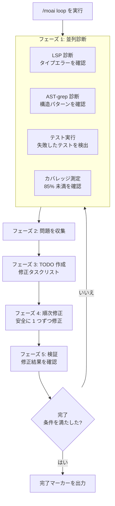
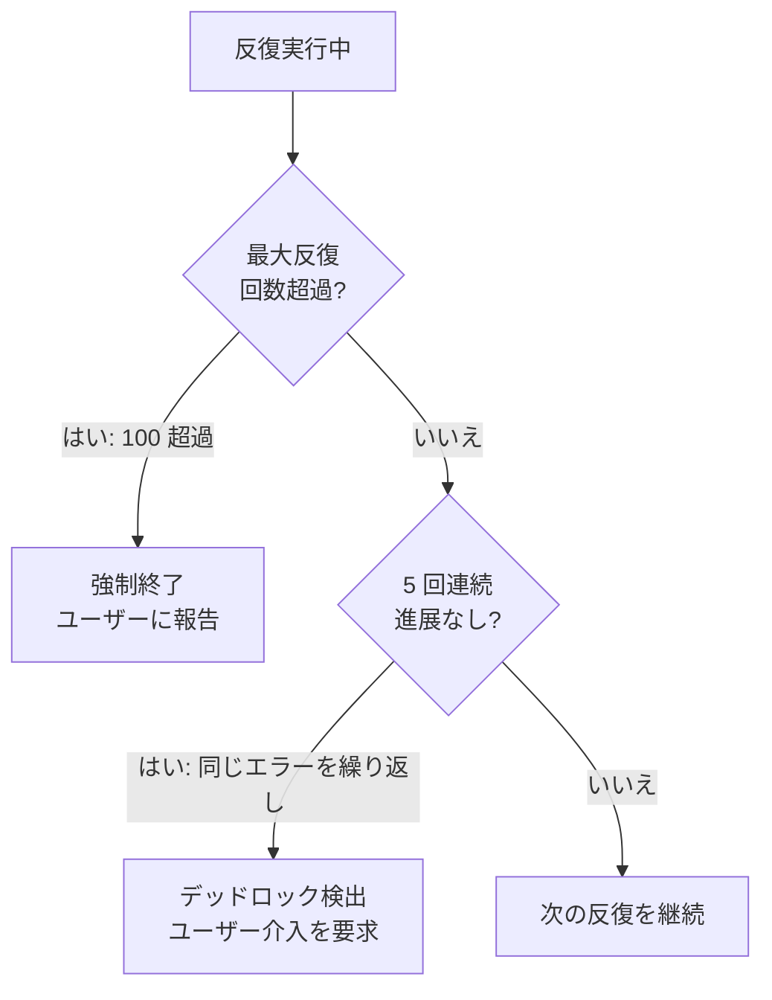
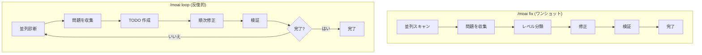
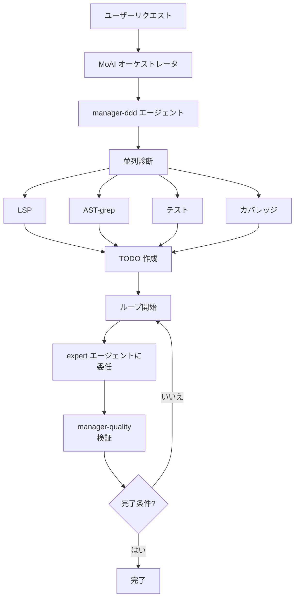

自律的反復修正ループコマンド。AI が**診断、修正、検証**のプロセスを自動的に繰り返し、**すべてのエラーが解決されるまで**実行します。


  **一言でいうと**: `/moai loop` は「Ralph Engine」自律修正エンジンです。
  **診断 → 修正 → 検証** を繰り返してすべてのコード問題を自動的に解決します。



**スラッシュコマンド**: Claude Code で `/moai:loop` と入力すると、このコマンドを直接実行できます。`/moai` だけ入力すると、利用可能なすべてのサブコマンドの一覧が表示されます。


## 概要

コードを書いているとき、複数の問題が同時に発生することがあります：タイプエラー、リンター警告、テスト失敗。各問題を手動で修正する代わりに、`/moai loop` を実行すると AI が**自動的に反復してすべての問題を修正**します。

**1 回のみ**修正する `/moai fix` とは異なり、`/moai loop` は**完了条件が満たされるまで**継続します。

## 使用方法

```bash
> /moai loop
```

個別の引数なしで実行すると、現在のプロジェクトのすべての問題を自動的に見つけて修正します。

## サポートされるフラグ

| フラグ                                   | 説明                             | 例                          |
| -------------------------------------- | --------------------------------------- | -------------------------------- |
| `--max N` (or `--max-iterations`)      | 最大反復回数を制限 (デフォルト 100) | `/moai loop --max 10`            |
| `--path <path>`                        | 特定のパスのみ対象               | `/moai loop --path src/auth/`     |
| `--stop-on {level}`                    | 特定レベル以上で停止        | `/moai loop --stop-on 3`          |
| `--auto` (or `--auto-fix`)             | 自動修正を有効化 (デフォルト レベル 1)      | `/moai loop --auto`               |
| `--sequential` (or `--seq`)            | 並列ではなく順次診断| `/moai loop --sequential`       |
| `--errors` (or `--errors-only`)        | エラーのみ修正、警告をスキップ         | `/moai loop --errors`             |
| `--coverage` (or `--include-coverage`) | カバレッジを含める (デフォルト 85%)         | `/moai loop --coverage`           |
| `--memory-check`                       | メモリ圧力検出を有効化       | `/moai loop --memory-check`       |
| `--resume ID` (or `--resume-from`)     | スナップショットから再開                  | `/moai loop --resume latest`      |

### --max フラグ

反復回数を制限します：

```bash
# 最大 10 反復のみ
> /moai loop --max 10
```


  無限ループを防ぐため、デフォルトは 100 反復です。ほとんどの場合 10 反復以内で完了します。


## 実行プロセス

`/moai loop` は各反復で以下のプロセスを実行します：



### フェーズ 1: 並列診断

4 つの診断ツールが**同時に**実行され、プロジェクトのすべての問題を迅速に特定します：

| 診断ツール | チェック項目 | 発見される問題の例 |
| --------------- | ------- | ------------------------ |
| **LSP**         | タイプシステム | 型の不一致、未定義変数、間違った引数 |
| **AST-grep**    | コード構造 | 未使用インポート、危険なパターン、コードの不自然さ |
| **テスト**       | テスト実行 | 失敗したテスト、発生中のエラー |
| **カバレッジ**    | カバレッジ測定 | 85% 未満のモジュール |


  **並列診断とは何ですか?** 4 つの診断を**同時に**実行することは、順次実行する約 4 倍高速です。収集された問題は単一のリストに統合されます。


### フェーズ 2: 問題収集

並列診断で発見されたすべての問題を単一のリストに整理します：

```
発見された問題 (例):
  [LSP] src/auth/service.py:42 - "int" 型を "str" 型に代入できません
  [LSP] src/auth/router.py:15 - 未定義の型 "User"
  [AST] src/utils/helper.py:3 - 未使用のインポート "os"
  [TEST] tests/test_auth.py::test_login - AssertionError
  [COV] src/auth/service.py - カバレッジ 62% (目標 85%)
```

### フェーズ 3: TODO 作成

収集された問題に基づいて修正タスクリスト (TODO) を自動的に作成します。**依存順序**を考慮して修正順序を決定します。

例えば、型定義が不足している場合、その型を最初に追加した後その型を使用するコードを修正します。

### フェーズ 4: 順次修正

TODO リストの項目を**順次 1 つずつ**修正します。並列修正は競合を引き起こす可能性があるため、安全に 1 つずつ処理します。

### フェーズ 5: 検証

修正後、問題が解決されたことを確認するために再び診断を実行します。問題が残っている場合は、フェーズ 1 に戻って繰り返します。

## ループ防止メカニズム

2 つの安全対策により無限ループを防止します：



| 安全対策       | 条件             | アクション                                           |
| -------------------- | --------------------- | ------------------------------------------------ |
| **最大反復回数制限** | 100 反復超過   | ループを強制終了して現在の状態を報告    |
| **進展なし検出** | 同じエラーが 5 回連続 | デッドロックとみなし、ユーザー介入を要求 |


  **デッドロックが発生した場合?** AI が同じエラーを 5 回連続で修正できない場合、自動的に停止してユーザー介入を要求します。この場合、エラー内容を直接確認するかヒントを提供してください。


## 完了条件

`/moai loop` は**3 つの条件**すべてが満たされたときにループを終了します：

| 条件            | 基準         | 説明                              |
| -------------------- | ---------------- | ---------------------------------------- |
| **zero_errors**      | 0 LSP エラー      | タイプエラーまたは構文エラーなし          |
| **tests_pass**       | すべてのテスト通過   | 失敗したテストなし                         |
| **coverage >= 85%**  | カバレッジ 85% 以上    | TRUST 5 品質基準を満たす           |

## /moai fix との違い

`/moai fix` と `/moai loop` は似ていますが、重要な違いがあります：



| 比較項目 | `/moai fix`           | `/moai loop`            |
| ---------------- | --------------------- | ----------------------- |
| **実行回数**| 1 回                  | 完了まで繰り返し  |
| **目標**          | 現在 visible なエラーを修正 | すべてのエラーを完全に解決 |
| **レベル分類** | あり (レベル 1-4)  | なし (すべての問題を処理)   |
| **承認の有無**| レベル 3-4 は承認必要| 自律的に処理     |
| **所要時間**  | 短い (1-2 分)       | 長くなる可能性 (5-30 分)   |
| **使用タイミング**   | 簡単な修正          | 大規模なリファクタリング後  |


  **選択ガイド**: エラーが少ない場合は `/moai fix` で迅速に解決します。エラーが多いまたは相互に問題がある場合は `/moai loop` の方が効果的です。


## エージェント委任チェーン

`/moai loop` コマンドのエージェント委任フロー：



**エージェントの役割:**

| エージェント                | 役割        | 主なタスク          |
| -------------------- | ----------- | ------------------- |
| **MoAI オーケストレータ** | ループ調整 |
| **manager-ddd**       | ループ管理 | TODO 作成、修正の調整 |
| **expert-\***         | 修正を実行 | 実際のコード変更 |
| **manager-quality**   | 品質検証 | 完了条件を確認 |

## 実践例

### 状況: DDD 実装後の複数のエラー

`/moai run` でコードを実装した後、複数のエラーが残っていると仮定します。

```bash
# 現在のステータスを確認
$ pytest --tb=short
# 3 つのテスト失敗
# カバレッジ: 71%

# LSP エラーを確認
# 5 つのタイプエラー、2 つの未定義参照

# ループを実行
> /moai loop
```

**実行ログ:**

```
[反復 1/100]
  診断: 5 LSP エラー、3 テスト失敗、カバレッジ 71%
  TODO: 7 つの修正タスクを作成
  修正: 5 つのタイプエラーを解決
  検証: 0 LSP エラー、2 テスト失敗、カバレッジ 71%

[反復 2/100]
  診断: 2 テスト失敗、カバレッジ 71%
  TODO: 2 つの修正タスクを作成
  修正: 2 つのテストロジックを修正
  検証: 0 LSP エラー、0 テスト失敗、カバレッジ 74%

[反復 3/100]
  診断: カバレッジ 74% (目標 85%)
  TODO: 3 つのテスト追加タスクを作成
  修正: 不足しているテストケースを追加
  検証: 0 LSP エラー、0 テスト失敗、カバレッジ 87%

完了条件を満たしました!
  - LSP エラー: 0
  - テスト: すべて通過
  - カバレッジ: 87%

DONE
```

この例では、`/moai loop` はわずか 3 回の反復ですべての問題を解決しました。手動であれば、各エラーを 1 つずつ確認して修正する必要がありました。

## よくある質問

### Q: `/moai loop` が長く実行されすぎる場合はどうすればよいですか?

`--max` フラグで反復回数を制限できるか、`Ctrl+C` で中断できます。現在の状態が保存されるため、後で再開できます。

### Q: 特定のエラータイプのみ修正したい場合はどうすればよいですか?

`--stop-on` フラグを使用します：

```bash
# レベル 3 以上で停止 (セキュリティ、ロジックエラーは手動で処理)
> /moai loop --stop-on 3
```

### Q: `/moai loop` と `/moai` の違いは何ですか?

`/moai loop` は**エラー修正ループのみ**を担当します。`/moai` は SPEC 作成から実装、文書化まで**全ワークフロー**を自動的に実行します。

### Q: ループがデッドロックに陥った場合はどうすればよいですか?

AI が同じエラーを 5 回連続で修正できない場合、自動的に停止してユーザー介入を要求します。この場合、コードを直接確認するかヒントを提供してください。

## 関連ドキュメント

- [/moai fix - ワンショット自動修正](/utility-commands/moai-fix)
- [/moai - 完全自律自動化](/utility-commands/moai)
- [TRUST 5 品質システム](/core-concepts/trust-5)
- [ドメイン駆動開発](/core-concepts/ddd)
