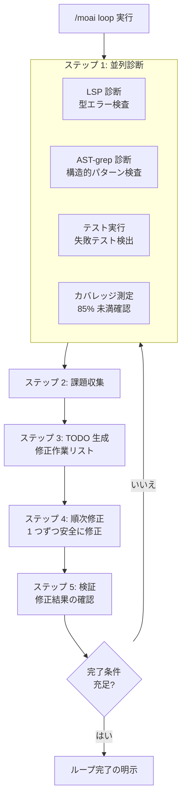
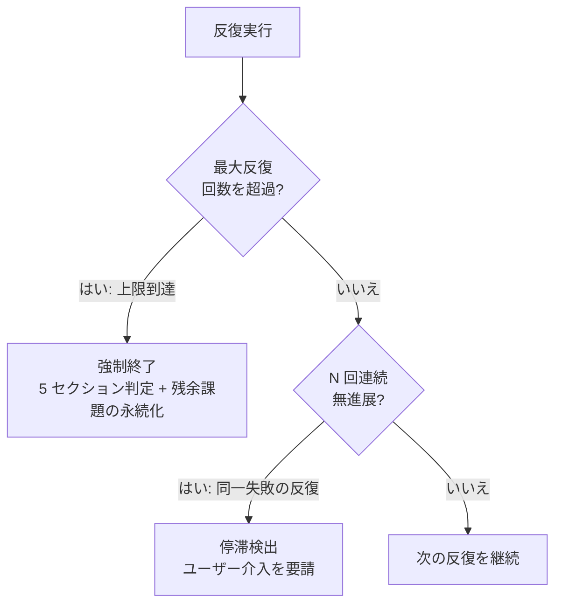
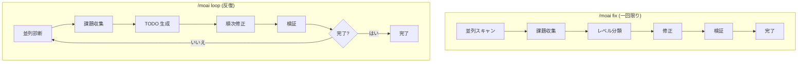
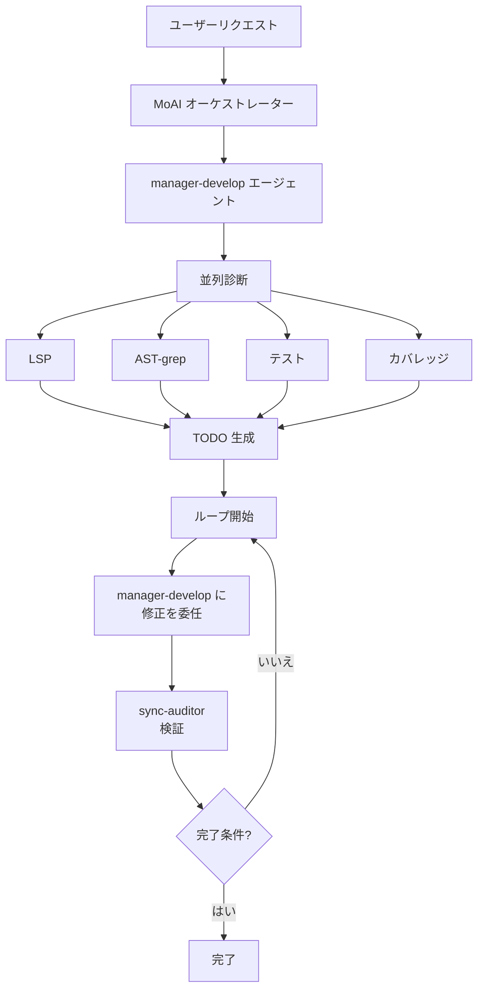

自律的な反復修正ループコマンドです。AI が自ら問題を診断し、修正し、検証するプロセスを **エラーがすべて解決されるまで** 自動的に反復します。


  **一行要約**: `/moai loop` は「Ralph Engine」という自律修正エンジンです。
  **診断 → 修正 → 検証** を反復してコードのすべての問題を自動的に解決します。



**スラッシュコマンド**: Claude Code で `/moai:loop` と入力すると、このコマンドをすぐに実行できます。`/moai` だけ入力すると、利用可能なすべてのサブコマンド一覧が表示されます。


## 概要

コードを書いていると、型エラー、リント警告、テスト失敗など複数の問題が同時に発生することがあります。こうした問題を 1 つずつ手動で直す代わりに、`/moai loop` を実行すると AI がすべての問題を **自動的に反復修正** します。

`/moai fix` が **一度だけ** 修正するのとは異なり、`/moai loop` は **完了条件を満たすまで** 繰り返します。

このループが v3 の 2 つ目の柱、**エージェンティックループエンジニアリング** の代表例です。人がエラーのたびに介入する代わりにループが自ら診断して修正し、ループが残した観察はハーネス学習 (再帰的な自己学習) の原料として蓄積されます。エンジンの実装は `internal/ralph/engine.go` — 各反復の `Decide()` が continue / converge / request_review / abort のいずれかを優先順位順に判定します。

## /moai goal との関係

`/moai loop` は **goal エンジンの上のプリセット** です。`/moai goal "<条件>"` がユーザーが完了条件を直接宣言する汎用ループだとすれば、`/moai loop` は「診断ツールが見つけた課題キューを全部空にするまで」という条件をあらかじめ埋めておいたプリセットです。

| エンジン | 目標 | 動作方式 | 完了条件 |
|------|------|----------|----------|
| `/moai goal` | 目標収束ループ | ユーザー定義の条件充足まで | 条件式の充足 |
| `/moai loop` | 診断修正ループ | エラー 0 まで反復 | 0 エラー / 0 型 / 85%+ カバレッジ |

```text
/moai goal "go test ./... exits 0; すべての AC が PASS として記録"
/moai goal status | clear
```

終わりの状態を条件式で表現できるなら `/moai goal`、「ツールが見つける問題を全部なくして」なら `/moai loop` が適しています。

## 使い方

```bash
> /moai loop
```

引数なしで実行すると、現在のプロジェクトのすべての問題を自動的に見つけて修正します。

## 対応フラグ

| フラグ                                   | 説明                             | 例                          |
| ---------------------------------------- | -------------------------------- | ----------------------------- |
| `--max N` (または `--max-iterations`)      | 最大反復回数の制限 (デフォルト値 10)  | `/moai loop --max 20`         |
| `--lens {clean\|simplify\|coverage}`     | スキャンレンズの追加 (カンマ区切り、opt-in) | `/moai loop --lens clean,coverage` |
| `--auto` (または `--auto-fix`)             | 自動修正の有効化 (デフォルト Level 1)  | `/moai loop --auto`           |
| `--sequential` (または `--seq`)            | 並列の代わりに順次診断        | `/moai loop --sequential`     |
| `--errors` (または `--errors-only`)        | エラーのみ修正、警告をスキップ         | `/moai loop --errors`         |
| `--coverage` (または `--include-coverage`) | カバレッジを含む (デフォルト値 85%)       | `/moai loop --coverage`       |
| `--memory-check`                         | メモリ圧力検出の有効化          | `/moai loop --memory-check`   |
| `--resume ID` (または `--resume-from`)     | スナップショットから再開                  | `/moai loop --resume latest`  |

### --max フラグ

反復回数を制限します:

```bash
# 最大 20 回まで反復
> /moai loop --max 20
```


  無限ループを防ぐためデフォルト値は 10 回です (`ralph.yaml` の `loop.max_iterations`)。
  反復上限の優先順位は CLI `--max` フラグ > `ralph.yaml` `loop.max_iterations` >
  `workflow.yaml` `loop_prevention.max_iterations` の順です。


### --lens フラグ

基本のスキャンレンズ (LSP · lint · テスト失敗 · レビューレンズ [セキュリティ、@MX]) に加えて、opt-in レンズでスキャン範囲を広げます:

| レンズ | 追加される課題 |
|------|---------------|
| `clean` | デッドコード (未使用の関数・import・ファイル) |
| `simplify` | 過剰設計 (over-engineering) の発見項目 |
| `coverage` | カバレッジ不足箇所 (カバレッジゲートがオンのときのみ課題を供給) |

レンズが見つけたものだけがキューに入り、ループはスキャンされたキュー外の「作り上げた改善」を決して行いません。

## 実行プロセス

`/moai loop` は各反復 (iteration) ごとに次のプロセスを経ます。


```mermaid
flowchart TD
    Start["/moai loop 実行"] --> Diag

    subgraph Diag["ステップ 1: 並列診断"]
        D1["LSP 診断<br/>型エラー検査"]
        D2["AST-grep 診断<br/>構造的パターン検査"]
        D3["テスト実行<br/>失敗テスト検出"]
        D4["カバレッジ測定<br/>85% 未満確認"]
    end

    Diag --> Collect["ステップ 2: 課題収集"]
    Collect --> Todo["ステップ 3: TODO 生成<br/>修正作業リスト"]
    Todo --> Fix["ステップ 4: 順次修正<br/>1 つずつ安全に修正"]
    Fix --> Verify["ステップ 5: 検証<br/>修正結果の確認"]
    Verify --> Check{完了条件<br/>充足?}
    Check -->|いいえ| Diag
    Check -->|はい| Done["ループ完了の明示"]
```

### ステップ 1: 並列診断

4 つの診断ツールが **同時に** 実行され、プロジェクトのすべての問題を素早く把握します。

| 診断ツール    | 検査対象     | 発見する問題の例                           |
| ------------ | ------------- | -------------------------------------------- |
| **LSP**      | 型システム   | 型の不一致、未定義変数、誤った引数        |
| **AST-grep** | コード構造     | 使わない import、危険なパターン、コードスメル |
| **Tests**    | テスト実行   | 失敗するテスト、エラー発生                   |
| **Coverage** | カバレッジ測定 | 85% 未満のモジュール                              |


  **並列診断とは?** 4 つの診断を **同時に** 実行するので、順次に 1 つずつ
  実行するより約 4 倍速いです。こうして収集された問題は 1 つのリストに
  まとめられます。


### ステップ 2: 課題収集

並列診断で発見されたすべての問題を 1 つのリストに整理します。

```
発見された課題 (例):
  [LSP] src/auth/service.py:42 - "str" 型に "int" を代入不可
  [LSP] src/auth/router.py:15 - "User" 型が未定義
  [AST] src/utils/helper.py:3 - 使わない import "os"
  [TEST] tests/test_auth.py::test_login - AssertionError
  [COV] src/auth/service.py - カバレッジ 62% (目標 85%)
```

### ステップ 3: TODO 生成

収集された課題を基に修正作業リスト (TODO) を自動生成します。このとき **依存性の順序** を考慮して修正順序を決定します。

たとえば型定義が欠落している場合、その型を先に追加してからその型を使うコードを修正します。

### ステップ 4: 順次修正

TODO リストの項目を **1 つずつ順次** 修正します。並列で修正すると互いに衝突する可能性があるため、安全に 1 つずつ処理します。

### ステップ 5: 検証

修正が終わると再び診断を実行して問題が解決されたか確認します。まだ残った問題があればステップ 1 に戻って繰り返します。

## ループ防止メカニズム

無限ループを防ぐために 2 つの安全装置があります。ループを無限に回し続けることはトークンの浪費でもあるため、安全装置は安定性とトークノミクスの両方を守ります。


```mermaid
flowchart TD
    A[反復実行] --> B{最大反復<br/>回数を超過?}
    B -->|はい: 上限到達| C["強制終了<br/>5 セクション判定 + 残余課題の永続化"]
    B -->|いいえ| D{N 回連続<br/>無進展?}
    D -->|はい: 同一失敗の反復| E["停滞検出<br/>ユーザー介入を要請"]
    D -->|いいえ| F[次の反復を継続]
```

| 安全装置           | 条件                   | 動作                                              |
| ------------------ | ---------------------- | ------------------------------------------------- |
| **最大反復制限** | 反復上限に到達 (デフォルト 10) | ループを強制終了して 5 セクション判定 (Claim / Evidence / Baseline-attribution / Gaps / Residual-risk) を出した後、残余課題を `.moai/state/loop-verdict-<id>.json` に永続化します |
| **停滞検出**      | N 回連続で無進展 (同一の失敗シグネチャ) | 停滞と判断して 5 セクション判定を出した後、ユーザーに介入を要請します |


  **停滞状態が発生したら?** AI が同じ失敗シグネチャを連続して解決できないと、
  自動的に中断して 5 セクションの証拠判定とともにユーザーに介入を要請します。この場合は
  エラー内容を自ら確認するかヒントを提供してください。


## 完了条件

`/moai loop` は次の **3 つの条件をすべて満たす** とループを終了します。

| 条件                | 基準              | 説明                                 |
| ------------------- | ----------------- | ------------------------------------ |
| **zero_errors**     | LSP エラー 0 個      | 型エラー、構文エラーがないこと |
| **tests_pass**      | すべてのテスト通過  | 失敗するテストがないこと      |
| **coverage >= 85%** | カバレッジ 85% 以上 | TRUST 5 品質基準を満たすこと  |

## /moai fix との違い

`/moai fix` と `/moai loop` は似て見えますが、核心的な違いがあります。


```mermaid
flowchart TD
    subgraph Fix["/moai fix (一回限り)"]
        F1[並列スキャン] --> F2[課題収集]
        F2 --> F3[レベル分類]
        F3 --> F4[修正]
        F4 --> F5[検証]
        F5 --> F6[完了]
    end

    subgraph Loop["/moai loop (反復)"]
        L1[並列診断] --> L2[課題収集]
        L2 --> L3[TODO 生成]
        L3 --> L4[順次修正]
        L4 --> L5[検証]
        L5 --> L6{完了?}
        L6 -->|いいえ| L1
        L6 -->|はい| L7[完了]
    end
```

| 比較項目     | `/moai fix`           | `/moai loop`            |
| ------------- | --------------------- | ----------------------- |
| **実行回数** | 1 回                   | 完了するまで反復      |
| **目標**      | 現在見えているエラーの修正 | すべてのエラーの完全な解決     |
| **レベル分類** | あり (Level 1-4)      | なし (すべての課題を処理)   |
| **承認の要否** | Level 3-4 は承認が必要 | 自律的に処理         |
| **所要時間** | 短い (1-2 分)          | 長くなることがある (5-30 分)     |
| **使用タイミング** | 簡単な修正           | 大規模なリファクタリング後の整理 |


  **選択ガイド**: エラーが数個しかなければ `/moai fix` で素早く解決してください。エラーが
  多いか互いに関連する問題があれば `/moai loop` がより効果的です。


## エージェント委任チェーン

`/moai loop` コマンドのエージェント委任フローです:


```mermaid
flowchart TD
    User["ユーザーリクエスト"] --> Orchestrator["MoAI オーケストレーター"]
    Orchestrator --> ManagerDDD["manager-develop エージェント"]

    ManagerDDD --> Diagnose["並列診断"]
    Diagnose --> LSP["LSP"]
    Diagnose --> AST["AST-grep"]
    Diagnose --> Test["テスト"]
    Diagnose --> Cov["カバレッジ"]

    LSP --> Todo["TODO 生成"]
    AST --> Todo
    Test --> Todo
    Cov --> Todo

    Todo --> Loop["ループ開始"]

    Loop --> Fix["manager-develop に<br/>修正を委任"]
    Fix --> Verify["sync-auditor<br/>検証"]

    Verify --> Complete{"完了条件?"}
    Complete -->|いいえ| Loop
    Complete -->|はい| Done["完了"]
```

**エージェントの役割:**

| エージェント                | 役割      | 主な作業            |
| ----------------------- | --------- | -------------------- |
| **MoAI オーケストレーター** | ループ調整 | 診断の調整、ユーザー報告 |
| **manager-develop**     | ループ管理および修正実行 | TODO 生成、実際のコード修正 (cycle_type=autofix) |
| **sync-auditor**        | 品質検証 | 完了条件の確認       |

## 実践例

### 状況: DDD 実装後に多数のエラーが発生

`/moai run` でコードを実装した後、複数のエラーが残っている状況を想定します。

```bash
# 現在の状態確認
$ pytest --tb=short
# 3 個のテスト失敗
# カバレッジ: 71%

# LSP エラー確認
# 5 個の型エラー、2 個の未定義参照

# loop 実行
> /moai loop
```

**実行ログ:**

```
[反復 1/10]
  診断: LSP エラー 5 個、テスト失敗 3 個、カバレッジ 71%
  TODO: 7 個の修正作業を生成
  修正: 型エラー 5 個を解決
  検証: LSP エラー 0 個、テスト失敗 2 個、カバレッジ 71%

[反復 2/10]
  診断: テスト失敗 2 個、カバレッジ 71%
  TODO: 2 個の修正作業を生成
  修正: テストロジックの修正 2 件
  検証: LSP エラー 0 個、テスト失敗 0 個、カバレッジ 74%

[反復 3/10]
  診断: カバレッジ 74% (目標 85%)
  TODO: 3 個のテスト追加作業を生成
  修正: 欠落したテストケースを追加
  検証: LSP エラー 0 個、テスト失敗 0 個、カバレッジ 87%

完了条件を充足!
  - LSP エラー: 0 個
  - テスト: すべて通過
  - カバレッジ: 87%

DONE
```

この例では `/moai loop` は 3 回の反復だけですべての問題を解決しました。手動でやっていたら各エラーを 1 つずつ確認して修正する必要があったでしょう。

## よくある質問

### Q: `/moai loop` が長く実行されすぎたらどうしますか?

`--max` フラグで反復回数を制限するか、`Ctrl+C` で中断できます。現在の状態が保存されるので後で再開できます。

### Q: 特定のタイプのエラーだけ修正したいなら?

`--errors` フラグでエラーだけ修正して警告をスキップするか、`--lens` フラグでスキャン範囲を調整してください:

```bash
# エラーだけ修正 (警告をスキップ)
> /moai loop --errors

# デッドコード・カバレッジレンズを追加
> /moai loop --lens clean,coverage
```

### Q: `/moai loop` と `/moai` の違いは何ですか?

`/moai loop` は **エラー修正ループのみ** を担当します。`/moai` は SPEC 生成から実装、ドキュメント化まで **ワークフロー全体** を自動的に行います。

### Q: `/moai loop` と `/moai goal` の違いは何ですか?

`/moai loop` は診断ツール (LSP、テスト、リンター) が見つけた課題をなくすことが目標で、`/moai goal` はユーザーが宣言した任意の完了条件 (例: 「AC-001~AC-010 すべて達成」) に向かってターンを続けます。`/moai loop` は goal エンジンのプリセットです。

### Q: ループがデッドロックに陥ったらどうしますか?

AI が同一の失敗シグネチャを N 回連続で解決できないと (停滞検出) 自動的に中断して 5 セクションの証拠判定とともにユーザーに介入を要請します。この場合は自らコードを確認するかヒントを提供してください。

## 関連ドキュメント

- [/moai fix - 一回限りの自動修正](/utility-commands/moai-fix)
- [/moai - 完全自律の自動化](/utility-commands/moai)
- [TRUST 5 品質システム](/core-concepts/trust-5)
- [ドメイン駆動開発](/core-concepts/ddd)
