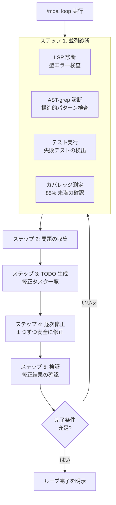
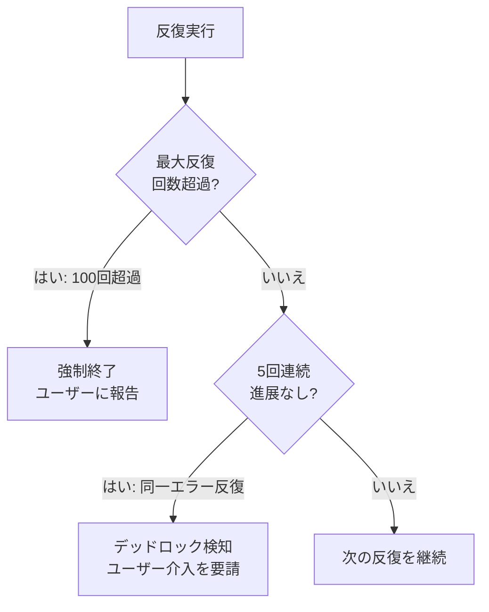
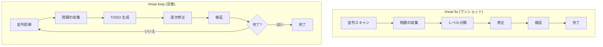
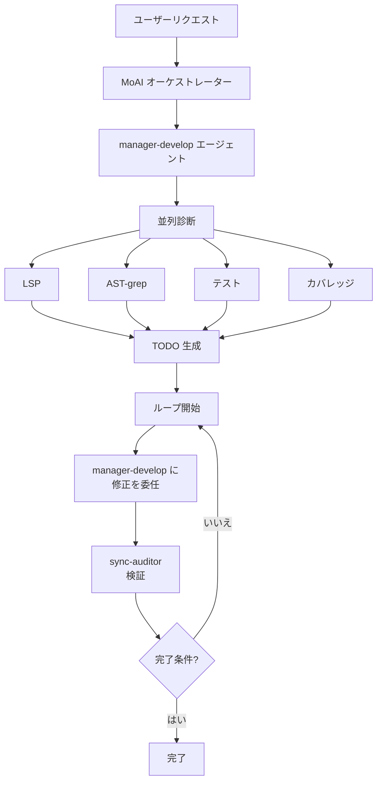

自律反復修正ループコマンドです。AI が自ら問題を診断し、修正し、検証するプロセスを **エラーがすべて解決されるまで** 自動で繰り返します。


  **一言まとめ**: `/moai loop` は "Ralph Engine" という自律修正エンジンです。
  **診断 → 修正 → 検証** を反復し、コードのすべての問題を自動で解決します。



**スラッシュコマンド**: Claude Code で `/moai:loop` と入力すると、このコマンドをすぐに実行できます。`/moai` だけを入力すると、使用可能なすべてのサブコマンドの一覧が表示されます。


## 概要

コードを書いていると、型エラー、lint 警告、テスト失敗など複数の問題が同時に発生することがあります。こうした問題を 1 つずつ手動で直す代わりに、`/moai loop` を実行すると AI がすべての問題を **自動で反復修正** します。

`/moai fix` が **一度だけ** 修正するのに対し、`/moai loop` は **完了条件を満たすまで** 反復し続けます。

このループが v3 の第 2 の柱、**エージェンティックループエンジニアリング** の代表例です。人間がエラーのたびに介入する代わりにループが自ら診断・修正し、ループが残した観察はハーネス学習 (再帰的な自己学習) の原料として蓄積されます。エンジンの実装は `internal/ralph/engine.go` — 毎反復の `Decide()` が continue / converge / request_review / abort のいずれかを優先順位順に判定します。

## /moai goal との関係

`/moai loop` は **goal エンジンの上のプリセット** です。`/moai goal "<条件>"` がユーザーが完了条件を直接宣言する汎用ループであるのに対し、`/moai loop` は「診断ツールが見つけた問題キューをすべて空にするまで」という条件をあらかじめ埋め込んだプリセットです。

| エンジン | 目標 | 動作方式 | 完了条件 |
|------|------|----------|----------|
| `/moai goal` | 目標収束ループ | ユーザー定義条件を満たすまで | 条件式の充足 |
| `/moai loop` | 診断修正ループ | エラー 0 まで反復 | 0 エラー / 0 型エラー / 85%+ カバレッジ |

```text
/moai goal "go test ./... exits 0; すべての AC が PASS で記録"
/moai goal status | clear
```

終了状態を条件式で表現できるなら `/moai goal`、「ツールが見つける問題を全部なくして」なら `/moai loop` が適しています。

## 使い方

```bash
> /moai loop
```

引数なしで実行すると、現在のプロジェクトのすべての問題を自動で見つけて修正します。

## サポートされるフラグ

| フラグ                                   | 説明                             | 例                          |
| ---------------------------------------- | -------------------------------- | ----------------------------- |
| `--max N` (または `--max-iterations`)      | 最大反復回数の制限 (デフォルト 100) | `/moai loop --max 10`         |
| `--path <path>`                          | 特定パスのみを対象に指定        | `/moai loop --path src/auth/` |
| `--stop-on {level}`                      | 特定レベル以上で中断          | `/moai loop --stop-on 3`      |
| `--auto` (または `--auto-fix`)             | 自動修正の有効化 (デフォルト Level 1)  | `/moai loop --auto`           |
| `--sequential` (または `--seq`)            | 並列ではなく逐次診断        | `/moai loop --sequential`     |
| `--errors` (または `--errors-only`)        | エラーのみ修正、警告はスキップ         | `/moai loop --errors`         |
| `--coverage` (または `--include-coverage`) | カバレッジを含める (デフォルト 85%)       | `/moai loop --coverage`       |
| `--memory-check`                         | メモリ圧迫検知の有効化          | `/moai loop --memory-check`   |
| `--resume ID` (または `--resume-from`)     | スナップショットから再開                  | `/moai loop --resume latest`  |

### --max フラグ

反復回数を制限します:

```bash
# 最大 10 回だけ反復
> /moai loop --max 10
```


  無限ループを防ぐため、デフォルトは 100 回です。ほとんどの場合、10 回以内に
  完了します。


## 実行プロセス

`/moai loop` は毎反復 (iteration) ごとに次のプロセスを経ます。


```mermaid
flowchart TD
    Start["/moai loop 実行"] --> Diag

    subgraph Diag["ステップ 1: 並列診断"]
        D1["LSP 診断<br/>型エラー検査"]
        D2["AST-grep 診断<br/>構造的パターン検査"]
        D3["テスト実行<br/>失敗テストの検出"]
        D4["カバレッジ測定<br/>85% 未満の確認"]
    end

    Diag --> Collect["ステップ 2: 問題の収集"]
    Collect --> Todo["ステップ 3: TODO 生成<br/>修正タスク一覧"]
    Todo --> Fix["ステップ 4: 逐次修正<br/>1 つずつ安全に修正"]
    Fix --> Verify["ステップ 5: 検証<br/>修正結果の確認"]
    Verify --> Check{完了条件<br/>充足?}
    Check -->|いいえ| Diag
    Check -->|はい| Done["ループ完了を明示"]
```

### ステップ 1: 並列診断

4 つの診断ツールが **同時に** 実行され、プロジェクトのすべての問題を素早く把握します。

| 診断ツール    | 検査対象     | 発見する問題の例                           |
| ------------ | ------------- | -------------------------------------------- |
| **LSP**      | 型システム   | 型の不一致、未定義変数、不正な引数        |
| **AST-grep** | コード構造     | 未使用 import、危険なパターン、コードスメル |
| **Tests**    | テスト実行   | 失敗するテスト、エラー発生                   |
| **Coverage** | カバレッジ測定 | 85% 未満のモジュール                              |


  **並列診断とは?** 4 つの診断を **同時に** 実行するため、逐次的に 1 つずつ
  実行するより約 4 倍高速です。こうして収集された問題は 1 つのリストに
  まとめられます。


### ステップ 2: 問題の収集

並列診断で発見されたすべての問題を 1 つのリストに整理します。

```
発見された問題 (例):
  [LSP] src/auth/service.py:42 - "str" 型に "int" を割り当て不可
  [LSP] src/auth/router.py:15 - "User" 型が未定義
  [AST] src/utils/helper.py:3 - 未使用 import "os"
  [TEST] tests/test_auth.py::test_login - AssertionError
  [COV] src/auth/service.py - カバレッジ 62% (目標 85%)
```

### ステップ 3: TODO 生成

収集された問題をもとに修正タスク一覧 (TODO) を自動生成します。このとき **依存関係の順序** を考慮して修正順を決定します。

たとえば型定義が欠落している場合、その型を先に追加してから、その型を使うコードを修正します。

### ステップ 4: 逐次修正

TODO リストの項目を **1 つずつ順番に** 修正します。並列で修正すると互いに衝突する可能性があるため、安全に 1 つずつ処理します。

### ステップ 5: 検証

修正が終わると再び診断を実行し、問題が解決されたかを確認します。まだ残っている問題があればステップ 1 に戻って反復します。

## ループ防止メカニズム

無限ループを防ぐために 2 つのセーフガードがあります。ループを無限に回し続けるのはトークンの浪費でもあるため、セーフガードは安定性とトークノミクスの両方を守ります。


```mermaid
flowchart TD
    A[反復実行] --> B{最大反復<br/>回数超過?}
    B -->|はい: 100回超過| C["強制終了<br/>ユーザーに報告"]
    B -->|いいえ| D{5回連続<br/>進展なし?}
    D -->|はい: 同一エラー反復| E["デッドロック検知<br/>ユーザー介入を要請"]
    D -->|いいえ| F[次の反復を継続]
```

| セーフガード           | 条件               | 動作                                              |
| ------------------ | ------------------ | ------------------------------------------------- |
| **最大反復制限** | 100 回超過         | ループを強制終了し、現在の状態を報告します       |
| **進展なし検知**    | 5 回連続で同一エラー | デッドロックと判断し、ユーザーに介入を要請します |


  **デッドロックが発生したら?** AI が同じエラーを 5 回連続で直せない場合、
  自動で中断してユーザーに介入を要請します。この場合はエラー内容を直接
  確認するか、ヒントを提供してください。


## 完了条件

`/moai loop` は次の **3 つの条件をすべて満たす** とループを終了します。

| 条件                | 基準              | 説明                                 |
| ------------------- | ----------------- | ------------------------------------ |
| **zero_errors**     | LSP エラー 0 件      | 型エラー、構文エラーがないこと |
| **tests_pass**      | すべてのテスト通過  | 失敗するテストがないこと      |
| **coverage >= 85%** | カバレッジ 85% 以上 | TRUST 5 品質基準を満たすこと  |

## /moai fix との違い

`/moai fix` と `/moai loop` は似ているように見えますが、本質的な違いがあります。


```mermaid
flowchart TD
    subgraph Fix["/moai fix (ワンショット)"]
        F1[並列スキャン] --> F2[問題の収集]
        F2 --> F3[レベル分類]
        F3 --> F4[修正]
        F4 --> F5[検証]
        F5 --> F6[完了]
    end

    subgraph Loop["/moai loop (反復)"]
        L1[並列診断] --> L2[問題の収集]
        L2 --> L3[TODO 生成]
        L3 --> L4[逐次修正]
        L4 --> L5[検証]
        L5 --> L6{完了?}
        L6 -->|いいえ| L1
        L6 -->|はい| L7[完了]
    end
```

| 比較項目     | `/moai fix`           | `/moai loop`            |
| ------------- | --------------------- | ----------------------- |
| **実行回数** | 1 回                   | 完了するまで反復      |
| **目標**      | 現在見えるエラーの修正 | すべてのエラーの完全解決     |
| **レベル分類** | あり (Level 1-4)      | なし (すべての問題を処理)   |
| **承認の要否** | Level 3-4 は承認が必要 | 自律的に処理         |
| **所要時間** | 短い (1-2 分)          | 長くなり得る (5-30 分)     |
| **使用タイミング** | 簡単な修正           | 大規模リファクタリング後の後片付け |


  **選択ガイド**: エラーが少なければ `/moai fix` で素早く解決してください。エラーが
  多い、または相互に関連する問題がある場合は `/moai loop` の方が効果的です。


## エージェント委任チェーン

`/moai loop` コマンドのエージェント委任フローです:


```mermaid
flowchart TD
    User["ユーザーリクエスト"] --> Orchestrator["MoAI オーケストレーター"]
    Orchestrator --> ManagerDDD["manager-develop エージェント"]

    ManagerDDD --> Diagnose["並列診断"]
    Diagnose --> LSP["LSP"]
    Diagnose --> AST["AST-grep"]
    Diagnose --> Test["テスト"]
    Diagnose --> Cov["カバレッジ"]

    LSP --> Todo["TODO 生成"]
    AST --> Todo
    Test --> Todo
    Cov --> Todo

    Todo --> Loop["ループ開始"]

    Loop --> Fix["manager-develop に<br/>修正を委任"]
    Fix --> Verify["sync-auditor<br/>検証"]

    Verify --> Complete{"完了条件?"}
    Complete -->|いいえ| Loop
    Complete -->|はい| Done["完了"]
```

**エージェントの役割:**

| エージェント                | 役割      | 主な作業            |
| ----------------------- | --------- | -------------------- |
| **MoAI オーケストレーター** | ループの調整 | 診断の調整、ユーザーへの報告 |
| **manager-develop**     | ループ管理と修正実行 | TODO 生成、実際のコード修正 (cycle_type=autofix) |
| **sync-auditor**        | 品質検証 | 完了条件の確認       |

## 実践例

### 状況: DDD 実装後に多数のエラーが発生

`/moai run` でコードを実装した後、複数のエラーが残っている状況を想定します。

```bash
# 現在の状態を確認
$ pytest --tb=short
# 3 件のテスト失敗
# カバレッジ: 71%

# LSP エラーの確認
# 5 件の型エラー、2 件の未定義参照

# loop 実行
> /moai loop
```

**実行ログ:**

```
[反復 1/100]
  診断: LSP エラー 5 件、テスト失敗 3 件、カバレッジ 71%
  TODO: 7 件の修正タスクを生成
  修正: 型エラー 5 件を解決
  検証: LSP エラー 0 件、テスト失敗 2 件、カバレッジ 71%

[反復 2/100]
  診断: テスト失敗 2 件、カバレッジ 71%
  TODO: 2 件の修正タスクを生成
  修正: テストロジックの修正 2 件
  検証: LSP エラー 0 件、テスト失敗 0 件、カバレッジ 74%

[反復 3/100]
  診断: カバレッジ 74% (目標 85%)
  TODO: 3 件のテスト追加タスクを生成
  修正: 欠落したテストケースを追加
  検証: LSP エラー 0 件、テスト失敗 0 件、カバレッジ 87%

完了条件充足!
  - LSP エラー: 0 件
  - テスト: すべて通過
  - カバレッジ: 87%

DONE
```

この例では `/moai loop` は 3 回の反復ですべての問題を解決しました。手動でやっていたら、各エラーを 1 つずつ確認して修正しなければならなかったでしょう。

## よくある質問

### Q: `/moai loop` の実行が長すぎる場合はどうすればよいですか?

`--max` フラグで反復回数を制限するか、`Ctrl+C` で中断できます。現在の状態が保存されるため、後で再開できます。

### Q: 特定の種類のエラーだけを修正したい場合は?

`--stop-on` フラグを使ってください:

```bash
# Level 3 以上で中断 (セキュリティ、ロジックエラーは手動処理)
> /moai loop --stop-on 3
```

### Q: `/moai loop` と `/moai` の違いは何ですか?

`/moai loop` は **エラー修正ループのみ** を担当します。`/moai` は SPEC 生成から実装、ドキュメント化まで **ワークフロー全体** を自動で実行します。

### Q: `/moai loop` と `/moai goal` の違いは何ですか?

`/moai loop` は診断ツール (LSP、テスト、リンター) が見つけた問題をなくすことが目標で、`/moai goal` はユーザーが宣言した任意の完了条件 (例: "AC-001~AC-010 をすべて達成") に向かってターンを続けます。`/moai loop` は goal エンジンのプリセットです。

### Q: ループがデッドロックに陥ったらどうすればよいですか?

AI が 5 回連続で同一エラーを繰り返すと、自動で中断してユーザーに介入を要請します。この場合は直接コードを確認するか、ヒントを提供してください。

## 関連ドキュメント

- [/moai fix - ワンショット自動修正](/utility-commands/moai-fix)
- [/moai - 完全自律自動化](/utility-commands/moai)
- [TRUST 5 品質システム](/core-concepts/trust-5)
- [ドメイン駆動開発](/core-concepts/ddd)
