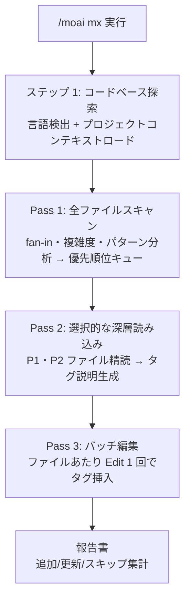

コードベースをスキャンして **@MX コード注釈** を追加するコマンドです。@MX タグは AI エージェントがコードの文脈・意図・危険を素早く把握できるように助けるコードレベルのアノテーションです。


**一行要約**: `/moai mx` は「AI のためのコード道標設置器」です。高い fan-in 関数、危険区域、未完成箇所などを自動で見つけ、`@MX:ANCHOR`・`@MX:WARN`・`@MX:NOTE`・`@MX:TODO` タグをコードに埋め込みます。



**スラッシュコマンド**: Claude Code で `/moai:mx` と入力すると、このコマンドをすぐに実行できます。`/moai` だけ入力すると、利用可能なすべてのサブコマンド一覧が表示されます。


## 概要

エージェントがコードを理解するためにかかるコストは、すなわちコンテキスト (トークン) です。@MX タグは「この関数は 8 箇所から呼ばれるのでシグネチャをむやみに変えないこと」といった文脈をコードのそばに直接埋め込んでおき、エージェントが毎回コードベース全体を再分析しなくてもよいようにします。ハーネスエンジニアリングの観点では、これは **コードに埋め込むアンカー** — 反復探索コストを 1 回のアノテーションで置き換えるトークノミクス装置です。

主に次の状況で使います:

- @MX タグがないレガシーコードベース
- 大規模リファクタリング前の危険区域マーキング
- 大きなコード変更後のアノテーション更新
- `/moai sync` 中の MX 検証 (自動実行)

## タグの種類と優先順位

| 優先順位 | 条件 | タグの種類 |
|----------|------|-----------|
| P1 | fan_in >= 3 呼び出し元 | `@MX:ANCHOR` (不変契約、高い fan_in) |
| P2 | goroutine/async、複雑度 >= 15 | `@MX:WARN` (危険区域、`@MX:REASON` 必須) |
| P3 | マジック定数、欠落した docstring | `@MX:NOTE` (文脈・意図) |
| P4 | 欠落したテスト | `@MX:TODO` (未完成) |
| P5 | 意図的な動作の単純化 (`@MX:CEILING` + `@MX:UPGRADE` サブラインを伴う) | `@MX:DEBT` |

## 使い方

```bash
# コードベース全体をスキャン (16 言語)
> /moai mx --all

# 修正なしでプレビュー
> /moai mx --dry

# P1 (高い fan_in 関数) のみ
> /moai mx --priority P1

# Go・Python のみスキャン
> /moai mx --all --lang go,python
```

## 対応フラグ

| フラグ | 説明 | 例 |
|-------|------|------|
| `--all` | コードベース全体をスキャン (すべての言語、P1+P2 ファイル全体) | `/moai mx --all` |
| `--dry` | プレビュー — ファイルを修正せず追加されるタグのみ表示 | `/moai mx --dry` |
| `--priority P1-P4` | 優先順位レベルでフィルタ (デフォルト: 全体) | `/moai mx --priority P1` |
| `--force` | 既存の @MX タグを上書き | `/moai mx --all --force` |
| `--exclude pattern` | 追加の除外パターン (カンマ区切り) | `/moai mx --exclude "vendor/,*.gen.go"` |
| `--lang go,py,ts` | 指定言語のみスキャン (デフォルト: 自動検出) | `/moai mx --lang go,python` |
| `--threshold N` | fan_in 閾値の再定義 (デフォルト: 3) | `/moai mx --all --threshold 2` |
| `--no-discovery` | ステップ 1 のコードベース探索をスキップ | `/moai mx --no-discovery` |

## 実行プロセス

`/moai mx` は探索 1 ステップ + 3-Pass スキャンで実行されます。



### ステップ 1: コードベース探索

プロジェクト言語を検出し (16 言語、マーカーファイル優先順位)、言語別のコメント接頭辞 (`//`、`#` など) を決定します。`.moai/project/tech.md`・`structure.md`・`product.md`・`README.md` を読んでタグ説明に使うプロジェクト文脈をロードし、スキャン範囲とトークン予算を計算します。`--no-discovery` を与えるとこのステップをスキップします。

### Pass 1: 全ファイルスキャン

すべてのソースファイルを言語別パターンで Glob し、fan-in 分析 (関数・メソッド参照カウント)、複雑度検出 (行数・分岐・ネスト深度)、パターン検出 (goroutine・async・threading・unsafe) を行い、スコア順にソートされた優先順位キュー (P1-P4) を作ります。

### Pass 2: 選択的な深層読み込み

P1・P2 ファイルのみ精読して関数シグネチャと呼び出しパターンを分析し、プロジェクト文脈 (tech.md・structure.md・product.md) を反映した正確なタグ説明を言語別コメント構文で生成します。

### Pass 3: バッチ編集

ファイルあたり Edit 1 回でそのファイルのすべてのタグを一度に挿入します。既存の @MX タグは `--force` がなければ保存されます。挿入対象が 5 個未満ならオーケストレーターが直接編集し (スポーンなし)、5 個以上ならバッチ編集エージェントに委任します。

## /moai sync・run との統合

- **`/moai sync`**: sync ステップで MX 検証が自動実行されます — 最後の sync 以降に変更されたファイルをスキャンして欠落した @MX タグを確認し、`--skip-mx` フラグがなければタグを追加した後、sync 報告書にタグ変更を含めます。
- **`/moai run`**: DDD ANALYZE ステップでコードベースに @MX タグが 1 つもなければ 3-Pass が自動トリガーされます。既存のタグは検証・更新され、新しいコードには新しいタグが追加されます。

## エージェント委任チェーン

| ステップ | 実行主体 | 主な作業 |
|------|-----------|-----------|
| ステップ 1 (探索) | Explore サブエージェント | 言語検出、プロジェクトコンテキストロード |
| Pass 1 (スキャン) | Explore または `Agent(general-purpose)` (バックエンドスコープ) | 全ファイルスキャン、優先順位キュー生成 |
| Pass 2 (深層読み込み) | `Agent(general-purpose)` (バックエンドスコープ) | P1・P2 精読、タグ説明生成 |
| Pass 3 (編集) | `Agent(general-purpose)` (バックエンドスコープ); 5 個未満はオーケストレーター直接 | バッチ編集、タグ挿入 |

## 関連ドキュメント

- [/moai sync - ドキュメント同期](/workflow-commands/moai-sync)
- [/moai run - DDD/TDD 実装](/workflow-commands/moai-run)
- [/moai clean - デッドコード除去](/utility-commands/moai-clean)
