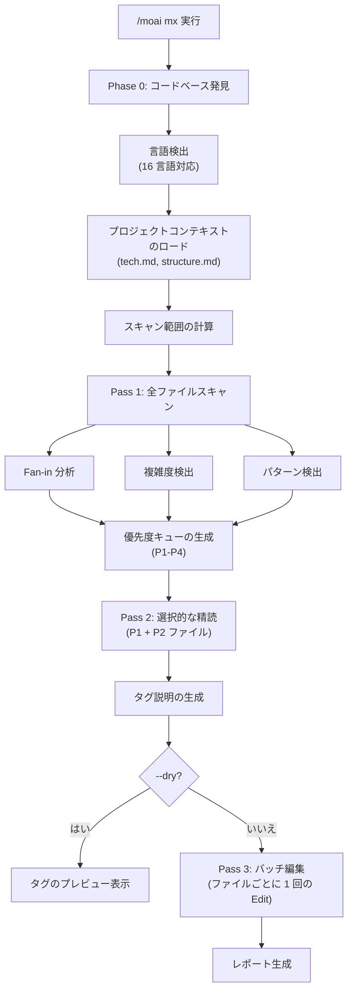
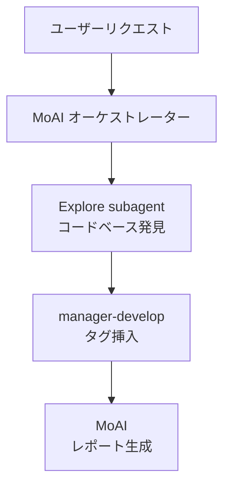

コードベースをスキャンして @MX コードレベルアノテーションを追加するコマンドです。AI エージェントが **コードコンテキストを素早く理解できるように** コメントを自動挿入します。


**一言まとめ**: `/moai mx` は「コードナビゲーションの標識」を自動で設置します。危険なコード、重要な関数、欠落しているテストなどを **@MX タグでマーキング** し、AI エージェントがコードをよりよく理解できるようにします。



**スラッシュコマンド**: Claude Code で `/moai:mx` と入力すると、このコマンドをすぐに実行できます。`/moai` だけを入力すると、使用可能なすべてのサブコマンドの一覧が表示されます。


## 概要

@MX タグはコードに付与するメタデータアノテーションです。AI エージェントがコードを読むとき、重要な関数、危険なパターン、未完了の作業を即座に把握できるようにします。`/moai mx` は 3 段階のスキャンでコードベースを分析し、適切なタグを自動で挿入します。

エージェントのためにプロジェクト知識をファイルとして残しておくのはハーネス設計の基本パターンであり、@MX タグはそのパターンを **コードレベル** に適用したものです。エージェントが毎回コード全体を精読して危険箇所を再発見する代わりに、標識をたどればよいのです — 探索トークンを節約しながら (トークノミクス)、危険箇所を見逃さない (品質) という二重の効果です。

### @MX タグの種類

| タグ | 用途 | 使用タイミング |
|------|------|----------|
| `@MX:ANCHOR` | 不変契約 | fan_in >= 3 (3 箇所以上から呼び出し) |
| `@MX:WARN` | 危険ゾーン | 複雑度 >= 15、goroutine/async パターン |
| `@MX:NOTE` | コンテキストの伝達 | マジック定数、ビジネスルールの説明 |
| `@MX:TODO` | 未完了作業 | テスト欠落、SPEC 未実装 |

## 使い方

```bash
# コードベース全体をスキャン
> /moai mx --all

# プレビュー (修正なしで確認のみ)
> /moai mx --dry

# P1 優先度のみ (高 fan_in 関数)
> /moai mx --priority P1

# 既存タグを強制上書き
> /moai mx --all --force

# 特定言語のみスキャン
> /moai mx --all --lang go,python

# fan_in しきい値を下げる
> /moai mx --all --threshold 2
```

## サポートされるフラグ

| フラグ | 説明 | 例 |
|-------|------|------|
| `--all` | コードベース全体をスキャン (全言語、すべての P1+P2 ファイル) | `/moai mx --all` |
| `--dry` | プレビューのみ - ファイル修正なしでタグを表示 | `/moai mx --dry` |
| `--priority P1-P4` | 優先度レベルフィルタ (デフォルト: 全体) | `/moai mx --priority P1` |
| `--force` | 既存 @MX タグの上書き | `/moai mx --force` |
| `--exclude PATTERN` | 追加の除外パターン (カンマ区切り) | `/moai mx --exclude "vendor/**"` |
| `--lang LANGS` | 特定言語のみスキャン (デフォルト: 自動検出) | `/moai mx --lang go,ts` |
| `--threshold N` | fan_in しきい値の再定義 (デフォルト: 3) | `/moai mx --threshold 2` |
| `--no-discovery` | Phase 0 コードベース発見をスキップ | `/moai mx --no-discovery` |
| `--team` | 言語別の並列スキャン (エージェントチームモード) | `/moai mx --team` |

## 優先度レベル

| 優先度 | 条件 | タグの種類 |
|---------|------|----------|
| **P1** | fan_in >= 3 (3 箇所以上から呼び出し) | `@MX:ANCHOR` |
| **P2** | goroutine/async、複雑度 >= 15 | `@MX:WARN` |
| **P3** | マジック定数、docstring 欠落 | `@MX:NOTE` |
| **P4** | テスト欠落 | `@MX:TODO` |

中核原則は「すべてのコードにタグ」ではなく、**「AI が最初に注目すべきコードにだけタグ」** です。ほとんどのコードはどの条件も満たさないためタグがなく、それが正常です。

## 実行プロセス

`/moai mx` は 3 段階のパス (Pass) で実行されます。



### Phase 0: コードベース発見

16 言語に対応した自動検出:

| 言語 | 検出ファイル | コメント接頭辞 |
|------|-----------|------------|
| Go | go.mod, go.sum | `//` |
| Python | pyproject.toml, requirements.txt | `#` |
| TypeScript | tsconfig.json | `//` |
| JavaScript | package.json | `//` |
| Rust | Cargo.toml | `//` |
| Java | pom.xml, build.gradle | `//` |
| Kotlin | build.gradle.kts | `//` |
| Ruby | Gemfile | `#` |
| Elixir | mix.exs | `#` |
| C++ | CMakeLists.txt | `//` |
| Swift | Package.swift | `//` |
| ほか 5 言語 | 各言語の設定ファイル | 言語ごと |

### Pass 1: 全ファイルスキャン

すべてのソースファイルをスキャンして優先度キューを生成します:

- **Fan-in 分析**: 関数/メソッドの参照回数のカウント
- **複雑度検出**: 行数、分岐数、ネストの深さ
- **パターン検出**: 言語別の危険パターン (goroutine, async, threading, unsafe)

### Pass 2: 選択的な精読

P1 および P2 ファイルを詳細に分析し、正確なタグ説明を生成します。プロジェクトコンテキスト (tech.md, structure.md, product.md) を活用します。全ファイルの精読ではなく、優先度上位のファイルだけを深く読むこと — スキャン自体もトークン効率的に設計されています。

### Pass 3: バッチ編集

ファイルごとに 1 回の Edit 呼び出しでタグを挿入します。既存の @MX タグは保持されます (`--force` を除く)。

## バッチチェックポイント

大規模スキャン (50+ ファイル) はバッチ処理を使用します:

- **バッチサイズ**: 反復ごとに 50 ファイル
- **自動コミット**: 各バッチ完了後に中間結果をコミット
- **進捗の保存**: `.moai/cache/mx-scan-progress.json`
- **再開可能**: 中断されたスキャンを続きから進行


Rate limit 検知時は現在のバッチを保存して graceful に中断します。`/moai mx` を再実行すると、中断した地点から再開されます。


## エージェント委任チェーン



## 他のワークフローとの統合

@MX タグは SPEC 3-Phase の全段階に統合されています — plan で対象を識別、run で生成/更新、sync で検証と欠落補完:

| ワークフロー | MX 統合方式 |
|-----------|-------------|
| `/moai run` | DDD ANALYZE 段階で自動トリガー、タグの生成/更新 |
| `/moai sync` | 同期中に MX 検証を自動実行 |
| `/moai review` | MX タグ遵守検査を含む |

## よくある質問

### Q: @MX タグはコードの実行に影響しますか?

いいえ、@MX タグはコメントとしてのみ存在します。コードの実行やパフォーマンスにはまったく影響しません。

### Q: 既存のタグがある場合はどうなりますか?

デフォルトでは既存タグを保持します。`--force` フラグを使うと上書きします。

### Q: 自動生成されたファイルもタグ付けされますか?

いいえ。`.moai/config/sections/mx.yaml` の除外パターンに従い、生成ファイル、vendor、mock ファイルは自動的にスキップされます。

## 関連ドキュメント

- [/moai clean - デッドコード除去](/utility-commands/moai-clean)
- [/moai review - コードレビュー](/quality-commands/moai-review)
- [/moai - 完全自律自動化](/utility-commands/moai)
