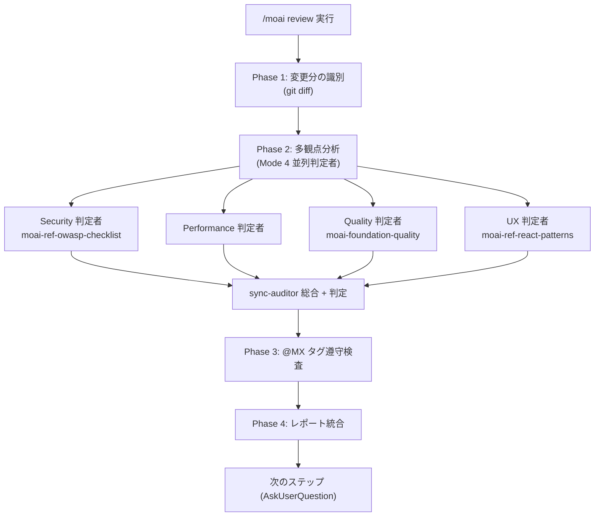

セキュリティ・パフォーマンス・品質・UX の 4 つの観点でコードをレビューし、`@MX` タグの遵守状況を確認して、優先度付けされた統合レポートを作成します。


**スラッシュコマンド**: Claude Code で `/moai:review` と入力すると、このコマンドをすぐに実行できます。`/moai` だけ入力すると、利用可能なすべてのサブコマンド一覧が表示されます。


## 概要

`/moai review` は **多観点コードレビュー**コマンドです。変更分をセキュリティ (Security)・パフォーマンス (Performance)・品質 (Quality)・UX の 4 観点の read-only 判定者で分析し、`@MX` タグの遵守を点検したうえで、深刻度別に整理された統合レポートを算出します。

`/moai review` は **read-only、レポート専用のレンズ**です — 欠陥を見つけて報告するだけで、いかなるファイルも修正しません。見つかった問題を実際に直すには `/moai fix` (または `/moai loop`) に渡します。つまり `/moai review` で問題を**報告**し、`/moai loop` で有限のイシュー集合を**修正**する階層関係です。

## サポートするフラグ

| フラグ | 説明 | 例 |
|-------|------|------|
| `--staged` | ステージングされた (`git add`) 変更分のみレビュー | `/moai review --staged` |
| `--branch BRANCH` | 現在のブランチを BRANCH と比較 (デフォルト main) | `/moai review --branch main` |
| `--security` | セキュリティレビュー (OWASP・injection・認証) に集中 | `/moai review --security` |
| `--file PATH` | 特定のファイルのみレビュー | `/moai review --file src/auth.go` |


`--team` 並列レビューモードは Agent Teams 静的階層とともに **引退 (tombstone)** しました。並列レビューは Mode 4 サブエージェントのファンアウトで行われ、チームではありません。


## エージェントチェーン

4 つの観点は **Mode 4 並列 read-only ファンアウト**で実行されます — 観点ごとに 1 つずつ、最大 4 個の read-only 判定者 (`Agent(general-purpose)`) を 1 ターンで spawn し、3-5 の同時実行上限の中で動作します。各判定者の発見は **sync-auditor** サブエージェントの総合に集められ、sync-auditor が最終判定を所有します — ファンアウトは実行形態を変えるだけで、判定の所有権を移しません。



## 4 つの観点

| 観点 | 検査項目 |
|------|-----------|
| **Security** | OWASP Top 10、入力検証、認証/認可、シークレット露出、injection (SQL/command/XSS/CSRF) |
| **Performance** | アルゴリズムの計算量、DB クエリ効率 (N+1)、メモリパターン、キャッシュの機会、並行性の安全性 |
| **Quality** | TRUST 5 遵守、命名/可読性、エラーハンドリング、変更コードのテストカバレッジ、プロジェクトパターンの一貫性 |
| **UX** | ユーザーフローの整合性、エラー状態/エッジケース、アクセシビリティ (WCAG/ARIA)、ローディング状態、公開インターフェースの breaking change |

発見段階では、確信が低いものや深刻度が低いものも**すべて**報告します (それぞれ confidence・severity を付与)。フィルタリングは判定段階 (must-pass しきい値 + 調和平均スコア) が downstream で担当します — 発見段階の目標はカバレッジです。

## --security 正本手順

`--security` フラグを指定すると、セキュリティ観点が優先度を得てより深く分析します。

### 依存関係の脆弱性スキャン

プロジェクトマニフェストファイル (`go.mod`、`package.json`、`requirements.txt`、`Cargo.toml`、`pyproject.toml`、`Gemfile`、`composer.json`、`mix.exs`、`Package.swift`、`pubspec.yaml`) を列挙し、project marker で言語を自動検出したうえで、per-spawn `Agent(general-purpose)` セキュリティレビュアーで脆弱性スキャンを行います。OWASP 全体のチェックリストは `moai-ref-owasp-checklist` スキルが供給します。

### シークレットスキャン (増分 + チェックポイント)

git 履歴を増分スキャンします。最後のスキャン SHA チェックポイントを `.moai/state/secrets-scan-checkpoint.txt` に記録し、チェックポイントがあれば新しいコミット範囲 + ワーキングツリーだけをスキャンしたあと、チェックポイントを現在の HEAD に更新します。初回実行または明示的な full-scan 時には `--all` で全履歴をスキャンします。

### データ隔離の点検

マルチテナント (クロステナントのデータフロー遮断)、PII 分離 (ログ・メトリクス・テレメトリに PII を記録しない)、共有状態の漏洩 (リクエストスコープのデータを運ぶ可変グローバルがない) の境界を確認します。

## @MX タグ遵守検査

観点分析のあと、変更されたファイルの `@MX` タグ遵守を点検します:

- 新規 export 関数: `@MX:NOTE` または `@MX:ANCHOR` 推奨
- high fan_in 関数 (呼び出し元 ≥ 3): `@MX:ANCHOR` 必須
- 危険パターン: `@MX:WARN` 推奨
- 未テストの公開関数: `@MX:TODO` 推奨

欠落または古い `@MX` タグを findings として報告します。

## レポート構造

統合レビューレポートは深刻度別に整理されます:

```markdown
## Code Review Report - {target}

### Critical Issues (must fix)
- [SECURITY] file:line: 説明
- [PERFORMANCE] file:line: 説明

### Warnings (should fix)
- [QUALITY] file:line: 説明
- [UX] file:line: 説明

### MX Tag Compliance
- Missing tags: N / Outdated tags: N / Compliant files: N/M

### Overall Assessment
- Security: PASS/FAIL
- Performance/Quality/UX: PASS/WARN
- TRUST 5 Score: N/5
```


**Security FAIL = 全体 FAIL**。セキュリティの must-pass 基準は、他の観点の高いスコアで相殺されません。


## 次のステップ

レポート後、`AskUserQuestion` で次のオプションを提示します:

- **自動修正 (推奨)**: `/moai fix` で Level 1-2 のイシューを自動解決 (critical・複雑なイシューは手動レビュー)
- **修正タスク作成**: 各 finding を TaskList 項目として登録
- **レポートのエクスポート**: `.moai/reports/` に保存
- **無視**: 即時の対応なしにレビューだけ確認

## 関連ドキュメント

- [/moai fix](/utility-commands/moai-fix) - 見つかったイシューを自動修正
- [/moai loop](/utility-commands/moai-loop) - 有限イシュー集合の反復修正
- [TRUST 5 品質システム](/core-concepts/trust-5) - 品質基準の詳細
