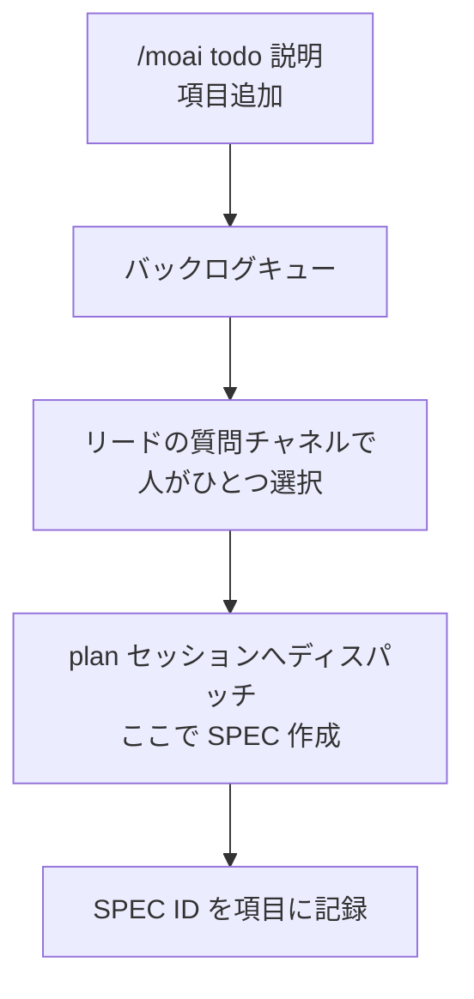



次にやることを一行ずつ積んでおく**バックログキュー**です。カンバンボードの `backlog` 列には担当セッションがおらず、誰も自分から仕事を流し込みません。したがって、カードをボードに入れることは常に人の判断であり、`/moai todo` がその窓口です。


**一行要約**: `/moai todo` は「次に何をやるか書き留める行」です。項目を入れ、一覧を見て、終わったものを消し、次に着手するひとつを選びます。SPEC でも計画でもなく、選んだ瞬間にはじめて SPEC になります。



**スラッシュコマンド**: Claude Code で `/moai:todo` を入力するとすぐ実行されます。`/moai` だけを入力すると、利用可能なすべてのサブコマンドの一覧が表示されます。


## 概要

バックログの項目は**意図の一行**です。SPEC でも計画書でも見積もりでもありません。人がその項目を選び、リードセッションが `plan` セッションへディスパッチしてはじめて SPEC になります。

キューは意図的に薄く作られています。SPEC や git 履歴、ボードがよりよく記録するものは格納せず、**人が次に何を望むか**だけを残します。



## 使い方

```bash
# 項目追加
> /moai todo "認証ミドルウェアのエラー経路を整理"

# キューを表示
> /moai todo
```

| 呼び出し | 動作 |
|------|------|
| `/moai todo "<説明>"` | 項目をキューの末尾に追加し、追加された項目と位置を表示します。 |
| `/moai todo` | キューを順に、位置番号付きで表示します。 |

項目の削除と次のカードの選択はスラッシュ表面にはありません。その2つは、下記のターミナル CLI(`moai todo done`、`moai todo next`)またはリードセッションを通じた選択が担います。

その他の引数の形は説明として扱われます。`/moai todo CI キャッシュ不安定を解決` はエラーではなく項目追加です — 聞き間違えた場合のコストが、人が一行消すことだけだからです。

## 状態ファイル

キューは `.moai/state/kanban/backlog.json` に保存されます。プロジェクト内にのみ存在し、コミットされません。

```json
{
  "version": 1,
  "items": [
    {
      "id": "t1",
      "text": "認証ミドルウェアのエラー経路を整理",
      "added_at": "<RFC3339 時刻>",
      "spec_id": null,
      "state": "queued"
    }
  ]
}
```

| フィールド | 意味 |
|------|------|
| `id` | 追加時に付く短く安定した識別子。削除後に再利用されません。 |
| `spec_id` | SPEC 識別子への任意の接続です。選択時に `--spec` で渡せばそのとき埋まり、不明なままなら `picked` 状態でも `null` のままです。 |
| `state` | ライフサイクルの判別子です。`queued` · `picked` · `dropped` のいずれかで、「まだバックログの項目」と「すでにボード上のカード」を分けるのはこの値です。選んだ項目もファイルに残り、何が進行中かが見えます。項目を**ファイルから消す**方法は `moai todo done` ひとつだけで、人が直接実行します — 仕事が終わっても自動的に消える経路はありません。破棄は削除とは違います: `moai todo drop <n> "<理由>"` はカードをファイルに残したまま `dropped` へ移し、理由をテキストの先頭に付けます。`moai todo undrop <n>` がそれを正確に元へ戻します。`dropped` のカードは選択候補から外れます。 |

ファイルは原子的に書かれます(一時ファイルに書いて名前を変えます)。書き込み途中で死んでもキューが途切れないためです。ファイルがなければエラーではなく**空のキュー**であり、壊れたファイルは報告だけして触りません — ここに収められた人の意図は、再生できない唯一の値だからです。

## 次のカードを選ぶ

選択は、リードセッションの質問チャネルを通じて人が行います。リードがキューを選択肢として表示します — 古いものからひと項目ずつ、ツールが許す4つまで表示し、残りは本文に要約して何も隠されないようにします。`/clear` 後の初手としてキューを提示するときも同じ方法です。ターミナルから候補を確認したいだけなら、引数なしの `moai todo next` が同じ一覧を読み取り専用で出力します。


 **選ぶ主体は人です。** 事前選択せず、推定した優先度で並べ替えず、「上から順に」をデフォルトにしません。キューが空なら空と伝えて止まります — 空のバックログは正常な状態であって、仕事をでっち上げろという合図ではありません。


複数のカードを一度に承認することもできます。カードを指差すか、キューが空になるまで順に進めるよう伝える方法です。これも人の選択であり、一枚ずつの代わりに一度にしただけです。リードは承認された順にカードを入れ、再度尋ねません。ただしその承認が許す範囲はそれだけです — 項目を追加したり、順序を変えたり、承認範囲外の判断が必要になったカードを代わりに決める根拠にはなりません。

カードを選んだ後はこう続きます。

1. 選んだ項目を `moai todo next <n> [--spec <SPEC-ID>]` の一度のロックされた書き込みで `picked` とマークします。識別子が既知ならその場で添付します。
2. カンバンディスパッチ規約に従い `plan` セッションへ渡します。カードは `plan` 列に入り、SPEC 作成はここではなくあちらで行われます。
3. 選択時に識別子が不明だった場合は、判明した後で `moai todo next <n> --spec <SPEC-ID>` を再度実行して項目に添付します。この後続の添付を自動化する経路はありません — ディスパッチも後続添付も、リードセッションが行う指示であって、キューが自分で行うことではありません。

## カンバンモードの外で

`/moai todo` はごく普通の単一セッションでもそのまま動きます — ただのキューだからです。ただしディスパッチはしません。同伴セッションがいなければ指示する相手がいないので、キューの読み書きまでがすべてで、残りは人が直接進めます。

## 境界

- **作業管理ツールではありません。** 優先度も担当者も期限も依存関係もありません。それらが必要な仕事はissueトラッカーや SPEC の領分です。
- **ボードではありません。** カードがどの列にいるかはリードセッションと SPEC 状態が握っており、このファイルではありません。
- **進行中の仕事の原本ではありません。** カードに SPEC ができてからは SPEC 成果物が基準で、バックログ項目はそれを指す標識にすぎません。
- **勝手に埋まりません。** TODO コメントやオープンな issue、監査結果をツールが勝手に拾ってくることはありません。項目を入れるのは人です。

## CLI 表面

同じキューをターミナルからも操作できます。スラッシュコマンド `/moai todo` は Claude Code のチャットで、ターミナル CLI `moai todo` はシェルで呼ぶ別個の表面です — 同じファイルを扱いますが、文法は異なります。

```bash
# 項目追加 — 発行された id とキュー位置を一行で出力
$ moai todo add "認証ミドルウェアのエラー経路を整理"

# 2語以上なら add がなくても追加されます (自然言語フォールスルー)
$ moai todo rename のヒントが古い

# キューを表示 (id · 状態 · 本文) — 動詞なしの bare 呼び出しも同じ結果
$ moai todo
$ moai todo list

# 構造化レコードとして表示
$ moai todo list --json

# 項目削除 — 番号(t4)も明示的 id も受け付けます
$ moai todo done 4

# 待機中の項目を古いものから出力(読み取り専用)
$ moai todo next

# ひとつの項目を選択として記録 — SPEC 識別子も一緒に
$ moai todo next 4 --spec SPEC-AUTH-001

# 追加と選択を一度のロックされた書き込みで
$ moai todo add "グラフ問合せドキュメントを整理" --pick

# 選択マークを取り消します — まだ plan に渡っていないカードに
$ moai todo unpick 4
```

| コマンド | 動作 |
|------|------|
| `moai todo` (bare) | キューを出力します。`list` と同じ出力です。 |
| `moai todo <2語以上>` | 自然言語をそのまま項目として追加します。1語(動詞の打ち間違いを含む)は追加ではなくエラーになります。 |
| `moai todo add "<text>" [--pick]` | 項目を追加し、発行された id と位置を出力します。`--pick` を付けると追加と選択マークが一度のロックされた書き込みで行われます。 |
| `moai todo list` / `--json` | キューを表示します。`--json` はレコード全体を JSON で出力します。 |
| `moai todo done <n>` | `n` 番の項目を削除します。明示的な `t<n>` id 推奨 — 同時追加で位置が動きうるためです。 |
| `moai todo next` | 待機中の項目を古いものから表示します。読み取り専用です。 |
| `moai todo next <n> [--spec <SPEC-ID>]` | 項目を `picked` とマークし、`--spec` を渡すと識別子をそのまま記録します。一度のロックされた書き込みで行われます。 |
| `moai todo unpick <n>` | `picked` マークを取り消します。選択自体が人の判断なので、取り消しも人が直接行います。 |
| `moai todo drop <n> "<理由>" [--expect <prefix>]` | 待機中のカードを `dropped` へ移し、テキストの先頭に `[DROPPED — <理由>] ` の目印を付けます。引数は2つとも必須で、理由が空、または `]` を含む場合は拒否します。カードはファイルに残り、選択候補から外れるだけです。`--expect` はカードのテキストがその接頭辞で始まるときだけ実行します。 |
| `moai todo undrop <n> [--expect <prefix>]` | `dropped` のカードを `queued` に戻し、目印があれば取り除きます。判断の基準は目印ではなく状態なので、手で `dropped` と書いたカードもテキストをそのままに復帰します。`drop` の正確な逆操作です。 |
| `moai todo edit <n> "<text>" [--expect <prefix>]` | カードのテキストだけを書き換えます。`id` · `added_at` · `state` · `spec_id` は保たれるため、done してから再追加する場合のようにカードの同一性が変わることはありません。確認行には新しいテキストと以前のテキストが併記されます。 |
| `moai todo move <n> (--top \| --bottom \| --before <m> \| --after <m>)` | キューファイルの**順序**の中でカードの位置を動かします。行き先フラグはちょうど1つ必要で、無い場合も2つある場合も不正な呼び出しとして拒否します。項目を並べ替えるだけで何も削除・変更しないので、誤って動かしたらもう一度動かして戻します。 |

CLI はプロンプトを出しません。引数とフラグを受け取り一行を出力し、エラーは stderr へ — スクリプトや CI で安全に使える形です。

リンクされたワークツリーの中で実行しても、キューは**プライマリチェックアウトのキューひとつに帰属**します — リポジトリ 1 つにキュー 1 つという契約です。カードのワークツリーで `moai todo add` をすると、リードとフォアマンループが読む同じファイルに追加されます。git メタデータのないプロジェクトは `~/.moai/todo/<project-key>/backlog.json` にキューを置きます。

両表面は同じ保存層を共有します。変更はキューファイル横のロックファイル(backlog.lock)を握った後、同ディレクトリの一時ファイルに書いて名前を変える原子的書き込みで反映され、読み取りはロックなしで行われます。項目 id はロック内で、ファイルに残った最高水準標識(`last_seq`)から発行されるため、削除された項目の id が再利用されることはありません。


**インストール済みバイナリ**: CLI は main に反映済みで配信されます。すでにインストールされた `moai` バイナリは、再インストールしてはじめてこのコマンドを得られます。


## 関連ドキュメント

- [カンバンモード](/ja/advanced/kanban-mode) — バックログから出たカードが流れていくボード
- [`/moai` 統合コマンド](/ja/utility-commands/moai) — サブコマンド全体の地図
- [`/moai plan`](/ja/workflow-commands/moai-plan) — 選んだカードが SPEC になる段階
