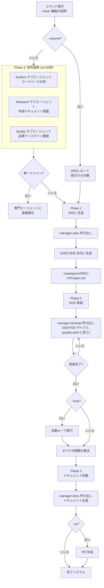

完全自律自動化コマンドです。ユーザーが目標を与えると、MoAI が **plan → run → sync** パイプラインを自律的に実行します。


  **一言まとめ**: `/moai` は「完全自律自動化」コマンドです。ユーザーは欲しい
  機能を自然言語で説明するだけで、MoAI が SPEC 生成から実装、ドキュメント化まで **すべての
  工程を自動で** 実行します。



**スラッシュコマンド対応**: MoAI のすべてのサブコマンドはスキルとしてラップされており、`/moai` だけを入力すると使用可能なサブコマンドの一覧が表示されます。各サブコマンドは `/moai:fix`、`/moai:loop`、`/moai:review` などの形式で直接実行することもできます。


## 概要

`/moai` は MoAI-ADK の **完全自律自動化ワークフロー** コマンドです。サブコマンドを個別に実行する必要なく、たった一度のコマンドで開発プロセス全体が自動化されます:

1. **SPEC 生成** (manager-spec)
2. **DDD/TDD 実装** (manager-develop — quality.yaml の development_mode に従う)
3. **ドキュメント同期** (manager-docs)

## Analyze-First ルーティング

v3 から `/moai` のデフォルトルーティングは **Analyze-First** — 言語非依存の意図分析です。英語キーワードマッチングではなくリクエストの意味を分類するため、どの `conversation_language` でリクエストしても同じ品質でルーティングされます。

ルーティングは次の順序で進みます:

1. **意図分析**: ユーザーリクエストの意図を分類 (入力言語とは無関係)
2. **コンテキスト十分性の確認**: 不十分な場合は Socratic インタビューで明確化
3. **実行計画の構成**: スキル / エージェント / 動的ワークフローチェーンの選択
4. **オーケストレーションモードの選択** (Phase 4): solo-sequential / parallel-subagents / dynamic-workflow

つまり `/moai "ログインのバグを直して"` のようにサブコマンドなしで自然言語だけ入力しても、意図分析を経て適切なワークフロー (修正なら fix 系、新機能なら plan→run→sync パイプライン) につながります。

## 使い方

```bash
# 基本的な使い方
> /moai "実装したい機能の説明"

# ワークツリーと併用
> /moai "機能の説明" --worktree

# ブランチと併用
> /moai "機能の説明" --branch

# ループモードを有効化
> /moai "機能の説明" --loop

# 既存の SPEC を再開
> /moai --resume SPEC-AUTH-001
```

## サポートされるフラグ

| フラグ              | 説明                             | 例                           |
| ------------------- | -------------------------------- | ------------------------------ |
| `--loop`            | 実装後の自動反復修正を有効化    | `/moai "機能" --loop`          |
| `--max N`           | 最大反復回数を指定 (デフォルト 100) | `/moai "機能" --loop --max 10` |
| `--branch`          | feature ブランチの自動作成         | `/moai "機能" --branch`        |
| `--pr`              | 完了後に PR を自動作成             | `/moai "機能" --pr`            |
| `--resume SPEC-XXX` | 既存 SPEC 作業の再開              | `/moai --resume SPEC-AUTH-001` |
| `--team`            | エージェントチームモードを強制            | `/moai "機能" --team`          |
| `--solo`            | サブエージェントモードを強制          | `/moai "機能" --solo`          |

### --loop フラグ

実装完了後、自動で反復修正を実行してすべてのエラーを修正します:

```bash
> /moai "JWT 認証システム" --loop
```

このオプションを使うと:

1. SPEC 生成
2. DDD 実装
3. **自動ループ実行** (LSP エラー、テスト失敗、カバレッジ不足を解決)
4. ドキュメント同期
5. PR 作成


  `--loop` オプションは **実装後の後片付け作業を完全に自動化** し、生産性を
  最大化します。


### --team / --solo フラグとオーケストレーションモード

フラグなしで実行すると、MoAI が作業規模を見てオーケストレーションモードを自動選択します:

**自動選択の基準** (フラグなしのとき):

- 影響ドメイン >= 3 個 → 並列実行
- 修正ファイル >= 10 個 → 並列実行
- 複雑度スコア >= 7 → 並列実行
- それ以外 → サブエージェントモード (逐次実行)

| フラグ | 動作 |
| ------ | ---- |
| `--team` | エージェントチームモードを強制 |
| `--solo` | サブエージェントモードを強制 (逐次実行) |
| (なし) | 複雑度ベースの自動選択 |


**v3.0.0-rc11 の変更**: Agent Teams 静的オーケストレーション層は **引退** しました。`--team` を強制しても `MODE_TEAM_UNAVAILABLE` とともにサブエージェントモードにフォールバックします。並列実行は並列サブエージェントファンアウトと動的ワークフロー 2 種 (plan-phase 研究並列ファンアウト、sync-phase 4 次元品質評価) が担当し、ネイティブ teammate ランタイム (`moai cg` の tmux pane) はそのまま維持されます。


並列実行はエージェントごとに独立したコンテキストウィンドウを使うため、トークン使用量が増えます。単純な単一ドメイン作業には `--solo` (逐次) の方が経済的です — 規模ベースの自動選択がデフォルトである理由です。

## 実行プロセス

`/moai` が内部的に実行する全体プロセスです:



**重要なポイント:**

- **Phase 0 (並列探索)**: 3 つのエージェントが同時に実行され、2-3 倍の高速化
- **単一ドメインルーティング**: 単純な作業は専門エージェントに直接委任して SPEC をスキップ
- **完了シグナル**: 作業完了時、完了レポートに作業完了を明示

## Phase 別の詳細

### Phase 0: 並列探索 (オプション)

3 つのエージェントが **同時に** 実行され、プロジェクトのコンテキストを素早く把握します:

| エージェント     | 役割            | 作業                                     |
| ------------ | --------------- | ---------------------------------------- |
| **Explore**  | コードベース分析 | 関連ファイル、アーキテクチャパターン、既存実装の発見 |
| **Research** | 外部ドキュメント調査  | 公式ドキュメント、API ドキュメント、類似実装の例      |
| **Quality**  | 品質ベースライン     | テストカバレッジ、lint 状態、技術的負債    |

**高速化:** 並列実行により逐次実行比で 2-3 倍高速 (15-30 秒 vs 45-90 秒)

**単一ドメインルーティング:**

- 単一ドメイン作業 (例: "SQL 最適化"): SPEC 生成なしで専門エージェントに直接委任
- 複数ドメイン作業: 全体ワークフローを進行

### Phase 1: SPEC 生成

**manager-spec** サブエージェントが EARS 形式の SPEC ドキュメントを生成します:

- .moai/specs/SPEC-XXX/spec.md
- EARS 形式の要求事項
- Given-When-Then 受け入れ基準
- conversation_language で書かれたコンテンツ

### Phase 2: DDD/TDD 実装ループ

**manager-develop** サブエージェントが SPEC に基づいて実装を行います:

- DDD サイクル: ANALYZE-PRESERVE-IMPROVE (既存コードのリファクタリング)
- TDD サイクル: RED-GREEN-REFACTOR (新機能開発)
- ドメインコンテキストの自動注入 (バックエンド、フロントエンド、セキュリティ、データベースなど)

**quality.yaml development_mode 設定:**

- `development_mode: ddd` → DDD サイクル使用 (既存コードの改善)
- `development_mode: tdd` → TDD サイクル使用 (新機能開発、デフォルト)

**ループ動作 (--loop または loop.enabled が true のとき):**

```
問題が存在 AND 反復 < 最大値:
  1. 診断実行 (LSP エラー、テスト失敗、カバレッジ)
  2. manager-develop に修正を委任
  3. 修正結果の検証
  4. 完了条件の充足確認
  5. 完了文の検出でループ終了
```

### Phase 3: ドキュメント同期

**manager-docs** サブエージェントが実装とドキュメントを同期します:

- API ドキュメント生成
- README 更新
- CHANGELOG 追加
- 成功時に作業完了を明示

## TODO 管理

**[HARD] TodoWrite ツール必須:** すべての作業追跡に TodoWrite の使用が必須

- 問題発見時: TodoWrite (pending 状態)
- 作業開始前: TodoWrite (in_progress 状態)
- 作業完了後: TodoWrite (completed 状態)
- TODO リストのテキスト出力は禁止

## 完了シグナル

すべてのワークフロー段階が正常に完了すると、MoAI は完了レポート (バナー/散文) に作業完了を明示して結果を明確にします。

## LLM モードルーティング

トークノミクスの中核となる仕組みです。llm.yaml の設定に従い、段階ごとに Claude と GLM を自動ルーティングします — 戦略・計画は Claude が、大量実装は低コストの GLM が担当するハイブリッドが可能です。

| モード          | Plan 段階      | Run 段階       |
| ------------- | -------------- | -------------- |
| `claude-only` | Claude         | Claude         |
| `hybrid`      | Claude         | GLM (worktree) |
| `glm-only`    | GLM (worktree) | GLM (worktree) |

## 実践例

### 例: JWT 認証システムの完全自動化

**ステップ 1: コマンド実行**

```bash
> /moai "JWT ベースのユーザー認証システム: 会員登録、ログイン、トークン更新" --worktree --loop --pr
```

**ステップ 2: Phase 0 - 並列探索**

```
[並列探索開始]
  Explore サブエージェント: src/auth/ を分析中...
  Research サブエージェント: JWT best practices を調査中...
  Quality サブエージェント: テストカバレッジ 32% を確認...

[探索完了 - 23秒]
  発見ファイル: 4 個
  推奨ライブラリ: PyJWT, bcrypt
  ベースライン: LSP 0 エラー、カバレッジ 32%
```

**ステップ 3: Phase 1 - SPEC 生成**

```
[manager-spec 呼び出し]
  SPEC ID: SPEC-AUTH-001
  要求事項: 5 件 (EARS 形式)
  受け入れ基準: 3 シナリオ

  ユーザー承認: 完了
```

**ステップ 4: Phase 2 - DDD 実装**

```
[manager-spec]
  作業分解: 7 タスク
  戦略計画完了

[manager-develop]
  ANALYZE: コード構造分析完了
  PRESERVE: 特性化テスト 12 件作成
  IMPROVE: 7 タスク実装完了

[sync-auditor]
  TRUST 5: すべての柱を通過
  カバレッジ: 89%
  状態: PASS
```

**ステップ 5: 自動ループ (--loop)**

```
[ループ開始 - 反復 1/100]
  診断: 型エラー 2 件発見
  修正: manager-develop サブエージェントに委任
  検証: すべてのエラー解決

[ループ終了 - 1 回反復]
  完了条件充足!
```

**ステップ 6: Phase 3 - ドキュメント同期**

```
[manager-docs]
  API ドキュメント: docs/api/auth.md 生成
  README: 使い方セクション更新
  CHANGELOG: v1.1.0 エントリ追加
  SPEC-AUTH-001: ACTIVE → COMPLETED
```

**ステップ 7: 完了**

```
[完了]
  SPEC: SPEC-AUTH-001
  コミット: 7 件
  テスト: 36/36 通過
  カバレッジ: 89%
  PR: #42 作成 (Draft → Ready)

<moai:COMPLETE />
```

## よくある質問

### Q: `/moai` とサブコマンドの違いは何ですか?

| コマンド       | 範囲        | 使用タイミング                    |
| ------------ | ----------- | ---------------------------- |
| `/moai`      | 全体自動化 | 素早い完全自動化を望むとき     |
| `/moai plan` | SPEC 生成のみ | SPEC を先にレビューしたいとき |
| `/moai run`  | 実装のみ      | SPEC がすでにあるとき          |
| `/moai sync` | ドキュメント化のみ    | 実装後にドキュメントだけ更新するとき |

### Q: --loop フラグはいつ使うべきですか?

実装後に自動ですべてのエラーを修正したいときに使います。特に大規模リファクタリング後の後片付け作業に便利です。

### Q: 単一ドメインルーティングとは何ですか?

単一ドメイン作業 (例: "SQL クエリ最適化") は SPEC 生成なしで該当ドメインの専門エージェントに直接委任し、時間を節約します。

### Q: 英語以外の言語でリクエストしてもよいですか?

はい。Analyze-First ルーティングは言語非依存の意図分析なので、韓国語・日本語・中国語などどの言語でリクエストしても同じように動作します。

## 関連ドキュメント

- [/moai plan](/workflow-commands/moai-plan) - SPEC 生成の詳細
- [/moai run](/workflow-commands/moai-run) - DDD 実装の詳細
- [/moai sync](/workflow-commands/moai-sync) - ドキュメント同期の詳細
- [/moai loop](/utility-commands/moai-loop) - 反復修正ループの詳細
- [/moai fix](/utility-commands/moai-fix) - ワンショット自動修正の詳細
