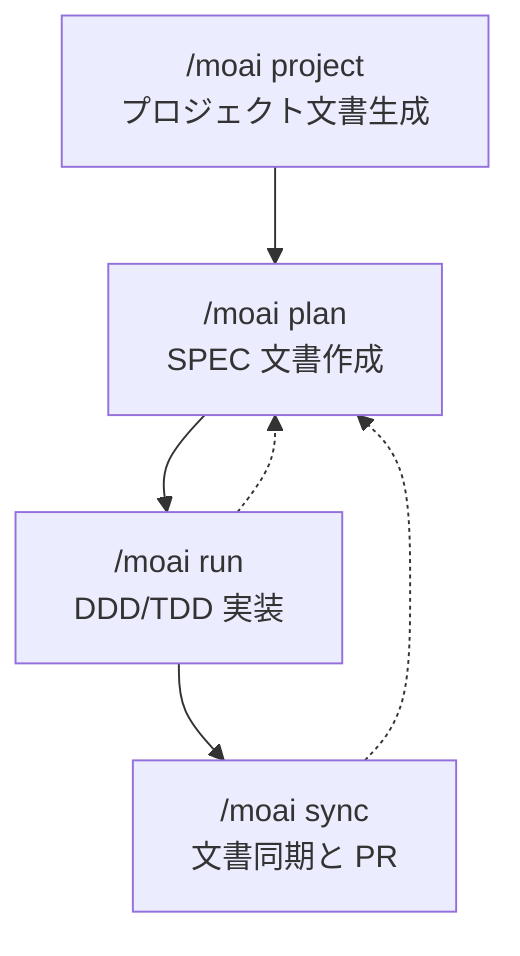

MoAI-ADK の 4 つのワークフローコマンドで体系的な開発サイクルを完了します。

## 開発サイクルの概要

MoAI-ADK は **4 段階ワークフローコマンド**を通じて、プロジェクト初期化からデプロイ準備までの全プロセスをサポートします。各コマンドは専門化された AI エージェントが担当し、順番に実行することで一貫して高品質なソフトウェアを作成できます。



## コマンド概要

| コマンド | フェーズ | 担当エージェント | トークン予算 | 目的 |
|---------|---------|-------------------|-------------|------|
| [`/moai project`](./moai-project) | フェーズ 0 | manager-project | - | プロジェクト文書の自動生成 |
| [`/moai plan`](./moai-plan) | フェーズ 1 | manager-spec | 30K | SPEC 文書作成 |
| [`/moai run`](./moai-run) | フェーズ 2 | manager-ddd / manager-tdd | 180K | DDD / TDD 方式で実装 |
| [`/moai sync`](./moai-sync) | フェーズ 3 | manager-docs | 40K | 文書同期と PR 作成 |


初めてご利用の場合は `/moai project` から始めてください。プロジェクト文書が必要なため、以降のフェーズで AI がプロジェクトを正確に理解して作業できます。


## クイックスタート

```bash
# フェーズ 0: プロジェクト文書生成 (最初のみ)
> /moai project

# フェーズ 1: SPEC 作成
> /moai plan "ユーザー認証機能の実装"
> /clear

# フェーズ 2: DDD 実装
> /moai run SPEC-AUTH-001
> /clear

# フェーズ 3: 文書同期と PR
> /moai sync SPEC-AUTH-001
```

## 関連ドキュメント

- [SPEC ベース開発](/core-concepts/spec-based-dev) - SPEC と EARS 形式の詳細説明
- [DDD 方法論](/core-concepts/ddd) - ANALYZE-PRESERVE-IMPROVE サイクルの詳細説明
- [TRUST 5 品質システム](/core-concepts/trust-5) - 品質ゲートの詳細説明
- [クイックスタート](/getting-started/quickstart) - 最初から最後までのチュートリアル
