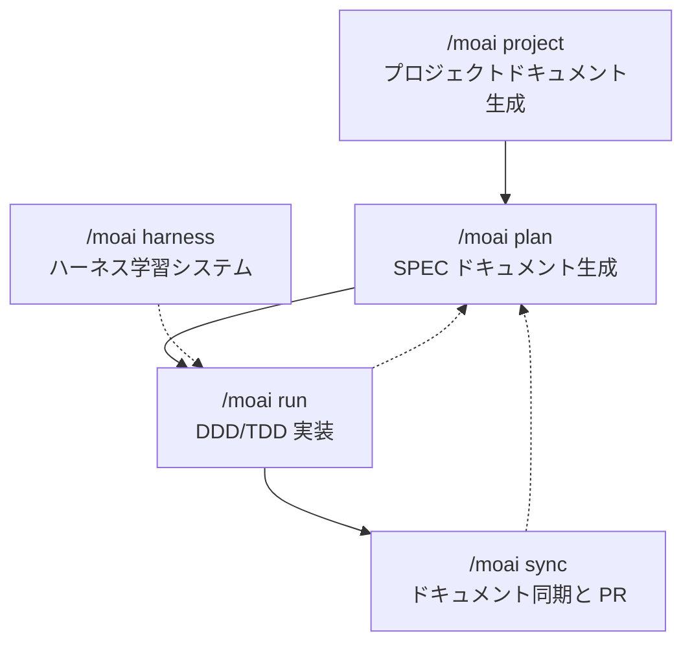

SPEC ベースの 3-Phase ライフサイクル (plan → run → sync) を実行するコマンド群です。



## エージェンティックハーネスの中心 — 3-Phase ライフサイクル

MoAI-ADK v3 の中核的な価値の 1 つが **エージェンティックハーネス** (Agentic Harness) です。コードを直接書く代わりに、エージェントがうまく働ける環境 — SPEC ドキュメント、品質ゲート、フィードバックループ — を設計するという意味です。ワークフローコマンドは、このハーネスの中心軸である **plan → run → sync** パイプラインを実行します。

各段階は専門化されたエージェントが担当し、作った本人が検査しないように **計画と監査が分離** されています。plan 段階の成果物は plan-auditor が独立して監査し、sync 段階の結果物は sync-auditor が 4 次元 (Functionality・Security・Craft・Consistency) で評価します。run 段階に入る直前には **実装着手承認** (ヒューマンゲート) が常にユーザーに戻ってきます。


```mermaid
flowchart TD
    A["/moai project<br>プロジェクトドキュメント生成"] --> B["/moai plan<br>SPEC ドキュメント生成"]
    B --> D["/moai run<br>DDD/TDD 実装"]
    D --> E["/moai sync<br>ドキュメント同期と PR"]
    E -.-> B
    D -.-> B
    F["/moai harness<br>ハーネス学習システム"] -.-> D
```

## コマンド要約

| コマンド | 段階 | 担当エージェント | トークン予算 | 目的 |
|--------|------|---------------|-----------|------|
| [`/moai project`](./moai-project) | Phase 0 | manager-docs | - | プロジェクトドキュメントの自動生成 |
| [`/moai plan`](./moai-plan) | Phase 1 | manager-spec | 30K | SPEC ドキュメントの生成 |
| [`/moai run`](./moai-run) | Phase 2 | manager-develop | 180K | DDD/TDD 方式の実装 |
| [`/moai sync`](./moai-sync) | Phase 3 | manager-docs | 40K | ドキュメント同期と PR 作成 |
| [`/moai harness`](./moai-harness) | 補助 | builder-harness | - | ハーネス生成と学習ライフサイクル管理 |

段階ごとにトークン予算が異なるのも、v3 の **トークノミクス** (Token Economics) 設計の一部です。計画は深い推論が必要ですが成果物が小さく (30K)、実装はコード量が多いため余裕のある予算が必要で (180K)、ドキュメント同期はその中間 (40K) です。段階の間に `/clear` でコンテキストを空にする慣行も同じ理由から生まれます — 前の段階の会話を次の段階に持ち込まないことで、各段階が予算をまるごと使えます。


初めて使う場合は `/moai project` から始めてください。プロジェクトドキュメントがあってこそ、以降の段階で AI がプロジェクトを正確に理解して作業できます。

`/moai harness` はハーネス学習サブシステム管理用の補助コマンドです — CLAUDE.md の変更をモニタリングし、ティアベースの自動更新を提案します。


## クイックスタート

```bash
# Phase 0: プロジェクトドキュメント生成 (初回 1 回)
> /moai project

# Phase 1: SPEC 生成
> /moai plan "ユーザー認証機能の実装"
> /clear

# Phase 2: DDD 実装
> /moai run SPEC-AUTH-001
> /clear

# Phase 3: ドキュメント同期と PR
> /moai sync SPEC-AUTH-001

# 補助: ハーネス学習管理 (任意)
> /moai harness status
> /moai harness apply
```

自然言語でそのままリクエストしてもかまいません。`/moai "ログインのバグを直して"` のようにサブコマンドなしで入力すると、**Analyze-First ルーティング** が意図を分析して適切なワークフローに自動接続します。

## 関連ドキュメント

- [SPEC ベース開発](/core-concepts/spec-based-dev) - SPEC と EARS/GEARS 形式の詳細説明
- [DDD 方法論](/core-concepts/ddd) - ANALYZE-PRESERVE-IMPROVE サイクルの詳細説明
- [TRUST 5 品質システム](/core-concepts/trust-5) - 品質ゲートの詳細説明
- [ハーネスエンジニアリング](/core-concepts/harness-engineering) - ハーネス学習サブシステムの概要
- [クイックスタート](/getting-started/quickstart) - 最初から追えるチュートリアル
