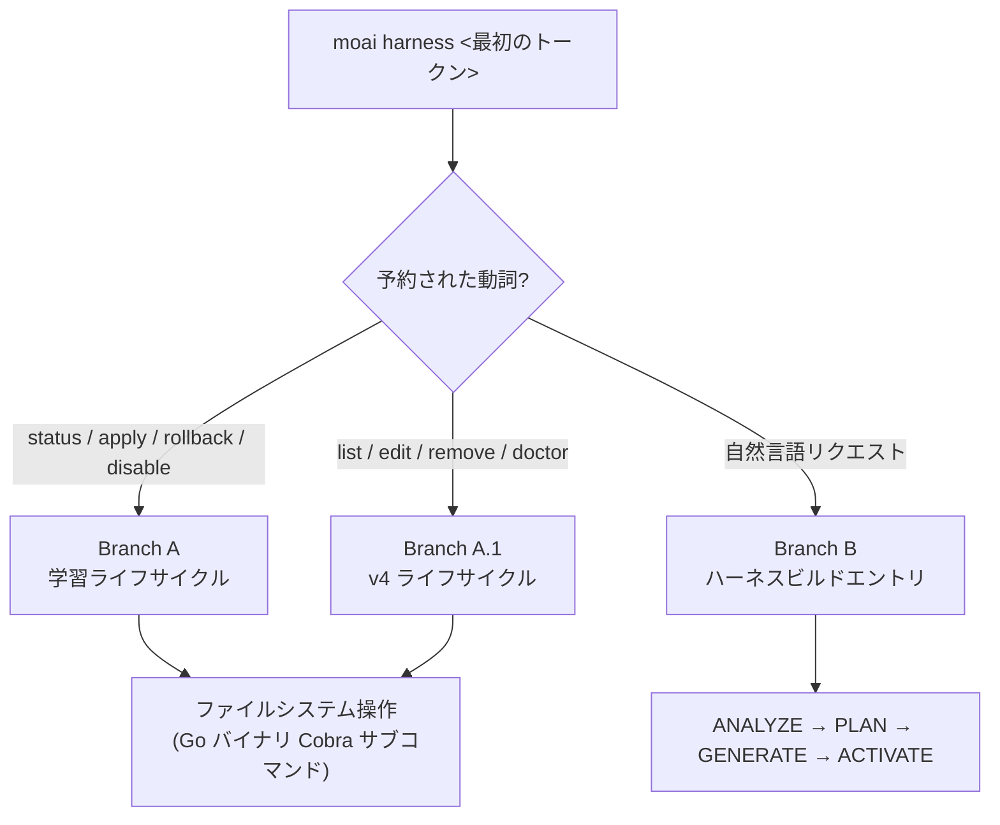

プロジェクト固有の動的な専門家チーム (ハーネス) を生成し、ハーネス学習ライフサイクルを管理します。


**スラッシュコマンド**: Claude Code で `/moai:harness <自然言語リクエスト>` と入力すると、このコマンドをすぐに実行できます。


## 概要

`/moai:harness` は MoAI-ADK の **Harness v4 Builder** を実行して、プロジェクト要件に合わせた動的な専門家チームを自動生成します。

v3 の 3 つ目の柱である **エージェンティックハーネス** をそのまま体感できるコマンドです — ハーネスがハーネスを作る再帰構造です。汎用エージェントカタログでは足りないプロジェクト固有の領域 (例: 特定の DB マイグレーション手順、社内 API 規約) があれば、自然言語一文でその領域の専門家チームをスキャフォールドできます。生成されたハーネスは **再帰的な自己学習** サブシステムにつながります — 使用の観察が蓄積されるとハーネスが自ら改善提案を作り、ユーザー承認ゲートを経て指針が進化します。

### Harness v4 Builder とは?

Harness v4 Builder は Socratic インタビューベースの 4-phase ワークフロー (ANALYZE → PLAN → GENERATE → ACTIVATE) でチームを構成します。

| ステップ | 説明 |
|------|------|
| ANALYZE | プロジェクト構造、使用言語、既存エージェントインベントリの分析 |
| PLAN | 必要なチーム規模 (3~5 名)、各メンバーの役割、worktree 隔離の有無を決定 |
| GENERATE | `.claude/agents/harness/` エージェントファイル、`.moai/harness/manifest.json` を生成 |
| ACTIVATE | チーム登録および `/harness:<name>` コマンドの有効化 |

## 単一の `harness` サブコマンドルーティング

`moai harness` は単一の Cobra サブコマンドツリーで、最初の引数 ($ARGUMENTS の最初のトークン) に応じて 3 つの経路のいずれかに分岐します — 別のコマンドを導入しない **argument-branching ルーティング** です。

| 最初のトークン | ルーティング先 | 説明 |
| ------- | ----------- | ---- |
| `status` / `apply` / `rollback` / `disable` | **Branch A — 学習ライフサイクル** | 観察の累積 → パターン → ルール → 自動進化提案の 4 階層学習システムの管理 |
| `list` / `edit` / `remove` / `doctor` | **Branch A.1 — v4 ライフサイクル** | 生成されたハーネスの列挙、編集、原子的削除、参照整合性の診断 |
| その他 (自然言語) | **Branch B — ハーネスビルドエントリ** | v4 Builder の ANALYZE → PLAN → GENERATE → ACTIVATE の 4-phase で新しいハーネスを生成 |



すべての動詞は `moai harness <verb>` の Go バイナリ Cobra サブコマンドツリーを通じて同じように dispatch されます — 学習動詞と v4 動詞がそれぞれ別の Go バイナリに分離されることはありません。

## 使用方法

### ステップ 1: 自然言語でチーム生成をリクエスト

```bash
> /moai:harness <自然言語リクエスト>
```

**例:**
```
私たちの Go バックエンドプロジェクトに合う専門家チームを作って。
DB マイグレーション、REST API エンドポイント、ユニットテストをそれぞれ担当するチームが必要。
```

### ステップ 2: Builder の自動処理

Builder が 4-phase を自動実行します:

1. **ANALYZE**: Go、PostgreSQL、REST API の技術スタックを検出
2. **PLAN**: DB Engineer、API Developer、Test Engineer の 3 名チーム構成を決定
3. **GENERATE**:
   - `.claude/agents/harness/db-engineer.md`
   - `.claude/agents/harness/api-developer.md`
   - `.claude/agents/harness/test-engineer.md`
   - `.moai/harness/manifest.json` を生成
4. **ACTIVATE**: `/harness:backend-team` コマンドを登録

### ステップ 3: 生成されたチームの活用

生成後、すべての作業でチームを自動活用:

```bash
/moai run SPEC-BACKEND-001
```

MoAI が SPEC の複雑度を分析し、manifest の phase 順にメンバーを自動委任します。

## Harness v4 ライフサイクル管理 (Branch A.1)

生成されたハーネスは `moai harness` サブコマンドで管理します。4 つの v4 ライフサイクル動詞が Go バイナリ Cobra サブコマンドとして dispatch されます。

### moai harness list

生成されたすべてのハーネス一覧を照会します:

```bash
moai harness list
```

出力情報: ハーネス名、ドメイン、エントリコマンド、manifest に宣言されたスケジュール (宣言時のみ表示)。

### moai harness edit <name>

manifest.json とエージェント定義ファイルのパスを表示して編集を案内します — manifest が SSOT です:

```bash
moai harness edit backend-team
```

編集対象:
- `.claude/commands/harness/<name>/manifest.json` (SSOT)
- `.claude/agents/harness/hns-<name>*-specialist.md` (専門家定義)
- `.claude/skills/hns-<name>*/` (コンパニオンスキル)

### moai harness remove <name>

ハーネスおよびすべての関連ファイルを原子的に削除します:

```bash
moai harness remove backend-team
```

削除される項目:
- `.claude/commands/harness/<name>.md` (thin-wrapper command)
- `.claude/commands/harness/<name>/manifest.json` (SSOT)
- `.claude/workflows/hns-<name>-run.js` (Runner)
- `.claude/agents/harness/hns-<name>*-specialist.md` (専門家)
- `.claude/skills/hns-<name>*/` (コンパニオンスキル)


`remove` は fail-closed で動作します — 成果物のいずれか 1 つでも欠落していると削除を中断し、欠落ファイルを報告します。orphan 成果物が残らないよう保証します。


### moai harness doctor

すべてのハーネスの参照整合性を検証する smoke gate です:

```bash
moai harness doctor
```

検査項目:
- すべてのハーネスの manifest / specialist / skill ファイルの存在有無
- manifest と成果物間の相互参照の一致
- スケジュール宣言のスキーマ有効性 (無効時は ERROR 深刻度)

## ハーネス学習ライフサイクル — 再帰的な自己学習 (Branch A)

ハーネスは生成して終わりの静的な成果物ではありません。`moai harness` サブコマンドで **学習サブシステム** のライフサイクルを管理します。学習動詞 (status / apply / rollback / disable) は Branch A にルーティングされます。

| コマンド | 説明 |
|--------|------|
| `moai harness status` | 学習状態の確認 (観察数、パターン、提案、tier 分布、rate-limit ウィンドウ) |
| `moai harness apply` | Tier-4 提案の適用 (オーケストレーター AskUserQuestion 承認ゲートの通過が必要) |
| `moai harness rollback <YYYY-MM-DD>` | 指定した日付のスナップショットへロールバック (日付引数が必須) |
| `moai harness disable` | 学習の無効化 (harness.yaml `learning.enabled: false` 設定) |

**4 階層学習のはしご** — 観察が積み重なるほど学習段階が上がります:

| Tier | 観察数 | 動作 |
|------|---------|------|
| TierObservation | ≥1 | 単純記録 |
| TierHeuristic | ≥3 | パターン認識 |
| TierRule | ≥5 | ルール形成 |
| TierAutoUpdate | ≥10 | 自動アップデート提案 (ユーザー承認が必須) |

**成果物**: `.moai/harness/` ディレクトリ (usage-log.jsonl, learned-rules.yaml, proposals/, learning-history/snapshots/)

### Tier-4 適用ゲート

Tier-4 (TierAutoUpdate) 提案はファイル修正前に **必ず** オーケストレーター発行の `AskUserQuestion` ラウンドを経る必要があります。ワークフロー本体はオーケストレーターのメインコンテキストで実行され、下位エージェントは `AskUserQuestion` を直接呼び出せません — 下位エージェントがユーザー入力を必要とする場合は構造化された blocker report を返し、オーケストレーターがゲートを再実行します。

承認時に 5-layer safety pipeline が実行されます:

1. **FrozenGuard** — path-prefix check (保護されたパスの修正を遮断)
2. **Schema validation** — 提案フィールドのスキーマ検証
3. **Diff inspection** — 変更内容の検査
4. **Rate-limit window** — 週あたり最大 3 回、24 時間クールダウン (harness.yaml `rate_limit` SSOT)
5. **Snapshot creation** — 修正前のスナップショットを `.moai/harness/learning-history/snapshots/<ISO-DATE>/` に保存


`moai harness apply --execute --id <proposal-id>` の CLI 経路は **別の ungated trust boundary** です — `AskUserQuestion` 承認ゲートなしで Go execute pipeline で直接適用します。CLI プロセスはユーザーにプロンプトできないので、`--execute` は呼び出し前に別の手段で承認を取得した呼び出し元のための明示的な opt-in です。デフォルトの `apply` (no `--execute`) は payload-only で JSON のみを出力し、ファイルを修正しません。


自動進化は常に **ユーザー承認ゲート** の下でのみ適用されます。いつでも `moai harness rollback <YYYY-MM-DD>` で復元できます。

## Manifest 構造

Harness v4 は **manifest.json** でチーム構成を定義します。

### manifest.json の例

```json
{
  "spec_id": "HARNESS-BACKEND-001",
  "name": "Backend Development Team",
  "version": "1.0.0",
  "created_at": "2026-07-01T10:00:00Z",
  "worktree_isolation": "L1_optional",
  
  "phases": [
    {
      "name": "plan",
      "teammates": [
        {
          "name": "architect",
          "role": "API アーキテクチャ専門家",
          "model": "inherit",
          "skills": ["moai-foundation-core"]
        }
      ]
    },
    {
      "name": "run",
      "teammates": [
        {
          "name": "db-engineer",
          "role": "DB 設計およびマイグレーション",
          "model": "inherit"
        },
        {
          "name": "api-developer",
          "role": "REST API エンドポイント",
          "model": "inherit"
        },
        {
          "name": "test-engineer",
          "role": "ユニットテスト",
          "model": "inherit"
        }
      ]
    }
  ]
}
```

### Phase フィールド

| フィールド | 説明 |
|------|------|
| `name` | ステップ名 (`plan`, `run`, `sync`) |
| `teammates` | このステップに参加するメンバーの配列 |

### Teammate フィールド

| フィールド | デフォルト値 | 説明 |
|------|--------|------|
| `name` | 必須 | メンバーの固有識別子 |
| `role` | 必須 | メンバーの役割説明 |
| `model` | `inherit` | モデル選択 (`inherit`, `sonnet`, `opus`) |
| `skills` | `[]` | 事前ロードするスキル一覧 |

メンバーごとにモデルを異なって指定できること (`model` フィールド) はトークノミクス設計の延長です — アーキテクチャ決定のように推論が重い役割と、反復的なテスト作成のように軽い役割に同じモデルを使う理由はありません。

## Worktree 隔離

Harness v4 はオプションの worktree 隔離をサポートします。

### L1_optional (デフォルト値)

```json
"worktree_isolation": "L1_optional"
```

Claude Code が並列メンバー間の衝突を検出したとき自動的に L1 ワークツリーを生成します。

- **オプション**: 衝突時のみ隔離を適用
- **自動**: ランタイムが衝突を検出後に自動生成
- **コスト**: ワークツリー隔離時にメモリが増加

### none

```json
"worktree_isolation": "none"
```

すべてのメンバーがプロジェクトルートで作業します (最小限のメモリ使用)。

## チーム委任ワークフロー

Harness が有効化されると MoAI はそのチームを自動的に活用します。

### SPEC 実行時のチーム委任

```bash
> /moai run SPEC-BACKEND-001
```

**MoAI の自動判断:**
1. SPEC の複雑度を推定 (ファイル数、コード行数)
2. 適切なハーネスを選択
3. manifest の phase 順にメンバーを順次/並列委任

### Phase ベースの委任例

```
PLAN Phase:
  → architect メンバーがアーキテクチャ設計を担当

RUN Phase:
  → db-engineer, api-developer を並列委任
  → test-engineer を順次委任 (テスト)

SYNC Phase:
  → ドキュメント生成および PR 作成 (デフォルト manager-docs)
```

## 自然言語リクエストの力

Harness v4 Builder は Socratic インタビュー方式で要件を把握します。

### 効果的なリクエストの例

```
私たちのチームは Python FastAPI バックエンドを開発中です。
API エンドポイント、データ検証、エラーハンドリングが得意なチームが必要です。
```

Builder が自動的に:
- Python、FastAPI、asyncio の技術スタックを検出
- 3~5 名のチーム規模を決定
- 各メンバーの特化領域を設定
- 必要なスキルを事前ロード

### 不明確なリクエストは Builder が尋ねます

```
チームが必要です。

→ Builder: プロジェクトの主要な技術は? (言語、フレームワーク)
→ Builder: チームが集中する領域は? (バックエンド、フロントエンド、全体)
→ Builder: 特に必要な専門性は?
```

## 関連ドキュメント

- [Harness v4 Builder ガイド](/advanced/builder-agents) - Builder 4-phase の詳細
- [エージェントガイド](/advanced/agent-guide) - 11 個のエージェントカタログの理解
- [SPEC ベース開発](/workflow-commands/moai-plan) - SPEC ワークフローの概要


**ヒント**: Harness を一度生成すれば、すべての後続作業でそのチームが自動的に活用されます。`/harness:team-name` コマンドでいつでも再利用できます。

