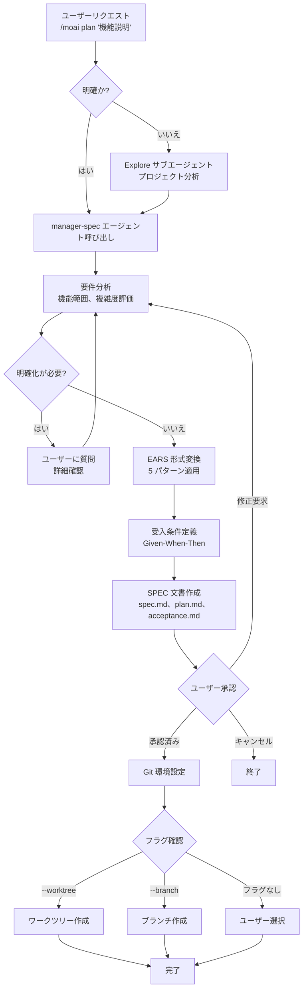
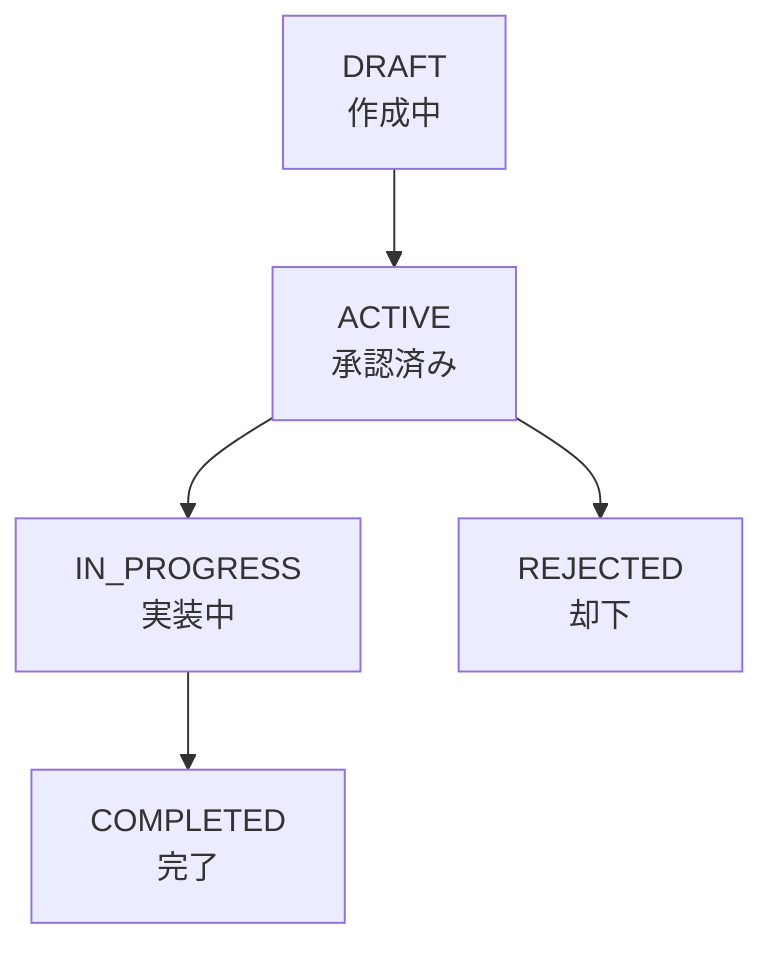

EARS 形式で明確な SPEC 文書を作成し、AI との対話を永続的な要件文書にします。


**スラッシュコマンド**: Claude Code で `/moai:plan` と入力すると、このコマンドを直接実行できます。`/moai` だけ入力すると、利用可能なすべてのサブコマンドの一覧が表示されます。


## 概要

`/moai plan` は MoAI-ADK ワークフローの **フェーズ 1 (Plan)** コマンドです。自然言語の機能要求を **EARS** (Easy Approach to Requirements Syntax) 形式の構造化された **SPEC** 文書に変換します。内部的には **manager-spec** エージェントが要件を分析して、曖昧さのない仕様書を生成します。



**SPEC が必要な理由**

**Vibe Coding** の最大の問題は **コンテキスト消失** です。

AI との対話中にセッションが終了すると **以前の議論内容がすべて消えます**。トークン制限を超過すると **古い会話からカットされます**。翌日作業を再開すると **昨日の決定事項を覚えていません**。

**SPEC 文書がこの問題を解決します。**

要件を **ファイルに保存** して永続的に保持します。EARS 形式で **曖昧さなく** 構造化します。セッションが中断されても SPEC を読むだけで **作業を継続** できます。



## 使用方法

Claude Code の会話で以下を入力します:

```bash
> /moai plan "実装したい機能の説明"
```

**使用例:**

```bash
# シンプルな機能
> /moai plan "ユーザーログイン機能"

# 詳細な機能説明
> /moai plan "JWT ベースのユーザー認証: ログイン、サインアップ、トークンリフレッシュ API"

# リファクタリング要求
> /moai plan "レガシー認証システムを JWT ベースにリファクタリング"
```

## サポートされるフラグ

| フラグ                | 説明                        | 例                                |
| ------------------- | --------------------------- | --------------------------------- |
| `--worktree`        | ワークツリー自動作成 (最優先) | `/moai plan "機能" --worktree`      |
| `--branch`          | 従来のブランチ作成            | `/moai plan "機能" --branch`        |
| `--resume SPEC-XXX` | 中断された SPEC 作業を再開   | `/moai plan --resume SPEC-AUTH-001` |
| `--team`            | Agent Teams モードを強制      | `/moai plan "feature" --team`          |
| `--solo`            | サブエージェントモードを強制  | `/moai plan "feature" --solo`          |
| `--seq`             | 並列ではなく順次診断          | `/moai plan "feature" --seq`           |
| `--ultrathink`      | Sequential Thinking MCP を有効化 | `/moai plan "feature" --ultrathink`  |

### フラグ優先順位

複数のフラグが指定されている場合、以下の順序で適用されます:

1. **--worktree** (最優先): 独立した Git ワークツリーを作成
2. **--branch** (代替): 従来の feature ブランチを作成
3. **フラグなし** (デフォルト): SPEC のみ作成、ユーザー選択に応じてブランチ作成

### --worktree フラグ

SPEC 作成と同時に **独立した Git ワークツリー** を作成して並列開発環境を準備します:

```bash
> /moai plan "決済システムの実装" --worktree
```

このオプションを使用すると:

1. SPEC 文書を作成します
2. SPEC をコミットします (ワークツリー作成の必須条件)
3. `feature/SPEC-{ID}` ブランチでワークツリーを作成します
4. メインコードに影響なしで独立して開発できます


  `--worktree` オプションは **複数の機能を同時に開発** する時に便利です。各 SPEC が独立したワークツリーで作業されるため、互いに競合しません。


## EARS 形式の要件

SPEC 文書は **EARS** (Easy Approach to Requirements Syntax) 形式で要件を定義します。5 つのパターンがあり、manager-spec エージェントが自然言語を自動的に適切なパターンに変換します。

| パターン         | 形式                          | 目的               | 例                                                |
| --------------- | ----------------------------- | ------------------ | ------------------------------------------------- |
| **Ubiquitous**  | "システムは ~しなければならない"            | 常に適用されるルール | "システムはすべての API リクエストをログしなければならない"                |
| **Event-driven**| "WHEN ~なら、THEN システムは ~しなければならない"| イベント応答        | "WHEN ログインする時、THEN システムは JWT を発行しなければならない"   |
| **State-driven**| "WHILE ~の間、システムは ~しなければならない"   | 状態ベースの動作     | "WHILE ログインしている間、システムはセッションを維持しなければならない"   |
| **Unwanted**    | "システムは ~してはならない"        | 禁止事項          | "システムはパスワードを平文で保存してはならない"   |
| **Optional**    | "可能な限り、システムは ~すべきである" | オプション機能  | "可能な限り、システムは 2FA をサポートすべきである"        |


  EARS 形式を暗記する必要はありません。manager-spec エージェントが自然言語を **自動変換** します。望む機能を自然に説明するだけで構いません。


## 実行プロセス

`/moai plan` が内部的に実行するプロセスです:



**主要ポイント:**

- リクエストが不明確な場合は **Explore サブエージェント** がプロジェクトを分析します
- 要件が不明確な場合は manager-spec エージェントが **ユーザーに追加質問** をします
- すべての要件に **Given-When-Then 形式の受入条件** を自動生成します
- 生成された SPEC 文書はユーザーの **承認後** に確定されます

## SPEC 作成フェーズ

### フェーズ 1A: プロジェクト分析 (オプション)

リクエストが不明確またはプロジェクト状況を理解する必要がある場合に実行されます:

| 実行条件         | スキップ条件               |
| ---------------- | -------------------------- |
| 不明確なリクエスト     | 明確な SPEC タイトル        |
| 既存ファイル/パターン発見が必要 | Resume シナリオ         |
| プロジェクト状態不確実   | 既存 SPEC コンテキスト存在 |

### フェーズ 1B: SPEC 計画

**manager-spec** エージェントが以下のタスクを実行します:

- プロジェクト文書分析 (product.md、structure.md、tech.md)
- 1-3 個の SPEC 候補提案とネーミング
- 重複 SPEC 確認 (.moai/specs/)
- EARS 構造設計
- 実装計画と技術制約の識別
- ライブラリバージョン確認 (安定版のみ、beta/alpha 除外)

### フェーズ 1.5: 事前検証ゲート

SPEC 作成前に一般的なエラーを防止します:

**ステップ 1 - 文書タイプ分類:**

- SPEC、Report、Documentation キーワード検出
- Report は .moai/reports/ にルーティング
- Documentation は .moai/docs/ にルーティング

**ステップ 2 - SPEC ID 検証 (すべてのチェック必須):**

- **ID 形式**: `SPEC-ドメイン-番号` パターン (例: `SPEC-AUTH-001`)
- **ドメイン名**: 承認済みドメインリスト (AUTH、API、UI、DB、REFACTOR、FIX、UPDATE、PERF、TEST、DOCS、INFRA、DEVOPS、SECURITY など)
- **ID 一意性**: .moai/specs/ で重複確認
- **ディレクトリ構造**: 必ずディレクトリ作成、フラットファイル禁止

**複合ドメインルール:** 最大 2 ドメイン推奨 (例: UPDATE-REFACTOR-001)、最大 3 まで許可。

### フェーズ 2: SPEC 文書作成

3 つのファイルが同時に作成されます:

**spec.md:**

- YAML フロントマター (7 つの必須フィールド: id、version、status、created、updated、author、priority)
- HISTORY セクション (フロントマターの直後)
- 完全な EARS 構造 (5 つの要件タイプ)
- conversation_language で記述されたコンテンツ

**plan.md:**

- タスク分解実装計画
- 技術スタック仕様と依存関係
- リスク分析と緩和戦略

**acceptance.md:**

- 最小 2 つの Given/When/Then シナリオ
- エッジケーステストシナリオ
- パフォーマンスと品質ゲート基準

**品質制約:**

- 要件モジュール: SPEC 当たり最大 5 個
- 受入条件: 最小 2 つの Given/When/Then シナリオ
- 技術用語と関数名は英語のまま維持

### フェーズ 3: Git 環境設定 (条件付き)

**実行条件:** フェーズ 2 完了かつ以下のいずれか:

- --worktree フラグ提供
- --branch フラグ提供またはユーザーがブランチ作成を選択
- 設定でブランチ作成許可 (git_strategy 設定)

**スキップ時点:** develop_direct ワークフロー、フラグなしで「現在のブランチを使用」を選択

## 出力

SPEC 文書は `.moai/specs/` ディレクトリに保存されます:

```
.moai/
└── specs/
    └── SPEC-AUTH-001/
        ├── spec.md          # EARS 要件
        ├── plan.md          # 実装計画
        └── acceptance.md     # 受入条件
```

**SPEC 文書の基本構造:**

```yaml
---
id: SPEC-AUTH-001
version: 1.0.0
status: ACTIVE
created: 2026-01-28
updated: 2026-01-28
author: 開発チーム
priority: HIGH
---
```

## SPEC ステータス管理

SPEC 文書は以下のステータスライフサイクルを持ちます:



| ステータス          | 説明                 | `/moai run` 実行可 |
| ------------- | -------------------- | ----------------- |
| `DRAFT`       | まだ作成中         | いいえ              |
| `ACTIVE`      | 承認済み、実装待ち   | **はい**           |
| `IN_PROGRESS` | 現在実装中         | はい (再開)        |
| `COMPLETED`   | 実装と検証完了      | いいえ             |
| `REJECTED`    | 却下、再作成必要    | いいえ             |

## 実践例

### 例: JWT 認証 SPEC 作成

**ステップ 1: コマンド実行**

```bash
> /moai plan "JWT ベースのユーザー認証システム: サインアップ、ログイン、トークンリフレッシュ"
```

**ステップ 2: manager-spec が質問** (必要時)

manager-spec エージェントが詳細を確認するために質問する場合があります:

- "パスワードの最小長は何文字ですか?"
- "トークンの有効期限はどのくらいにしますか?"
- "ソーシャルログインも含みますか?"

**ステップ 3: SPEC 文書作成結果**

以下の構造の SPEC 文書が作成されます:

```yaml
---
id: SPEC-AUTH-001
title: JWT ベースのユーザー認証システム
priority: HIGH
status: ACTIVE
---
```

```markdown
# 要件 (EARS 形式)

## Ubiquitous

- システムはすべてのパスワードを bcrypt でハッシュ化して保存しなければならない
- システムはすべての認証リクエストをログしなければならない

## Event-driven

- WHEN 有効な認証情報でログインする時、THEN システムは JWT アクセストークン(1 時間)とリフレッシュトークン(7 日)を発行しなければならない

## Unwanted

- システムはパスワードを平文で保存してはならない
- システムは期限切れトークンで API アクセスを許可してはならない
```

**ステップ 4: ユーザー承認後の Git 環境設定**

```bash
# --worktree フラグ使用時
> /moai plan "JWT 認証" --worktree

# 結果:
# 1. SPEC 文書作成 (.moai/specs/SPEC-AUTH-001/)
# 2. SPEC コミット (feat(spec): Add SPEC-AUTH-001)
# 3. ワークツリー作成 (.git/worktrees/SPEC-AUTH-001)
# 4. ワークツリーパス表示
```

**ステップ 5: `/clear` 実行後に実装フェーズへ移動**

```bash
# トークンクリア
> /clear

# 実装開始
> /moai run SPEC-AUTH-001
```

## よくある質問

### Q: SPEC 文書を手動で編集できますか?

はい、`.moai/specs/SPEC-XXX/spec.md` ファイルを直接編集できます。要件を追加または受入条件を修正した後 `/moai run` を実行すると変更が反映されます。

### Q: SPEC なしで直接コードを書くことはできますか?

Claude Code で直接コードを書くこともできますが、SPEC なしで作業するとセッションが終了するたびにコンテキストを失います。**複雑な機能ほど SPEC を最初に作る方が効率的**です。

### Q: SPEC ID はどのようなルールで生成されますか?

`SPEC-ドメイン-番号` 形式です (例: `SPEC-AUTH-001`)

- `SPEC-AUTH-001`: 認証関連の最初の SPEC
- `SPEC-PAYMENT-002`: 決済関連の 2 番目の SPEC

ドメインは機能領域に応じて manager-spec が自動的に決定します。

### Q: `/moai plan` と `/moai` の違いは何ですか?

`/moai plan` は **SPEC 文書作成のみ** を担当します。`/moai` は SPEC 作成から実装、文書化まで **全ワークフロー** を自動的に実行します。

### Q: --worktree と --branch の違いは何ですか?

**--worktree** は独立した作業ディレクトリを作成して完全に分離された環境を提供します。**--branch** は現在のリポジトリに新しいブランチを作成します。複数の機能を同時に開発する場合は --worktree を推奨します。

## 関連ドキュメント

- [SPEC ベース開発](/core-concepts/spec-based-dev) - EARS 形式詳細説明
- [/moai run](./moai-2-run) - 次のステップ: DDD 実装
- [/moai sync](./moai-3-sync) - 最終ステップ: 文書同期
