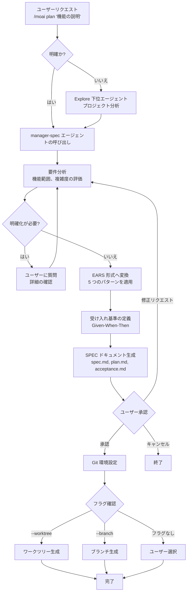
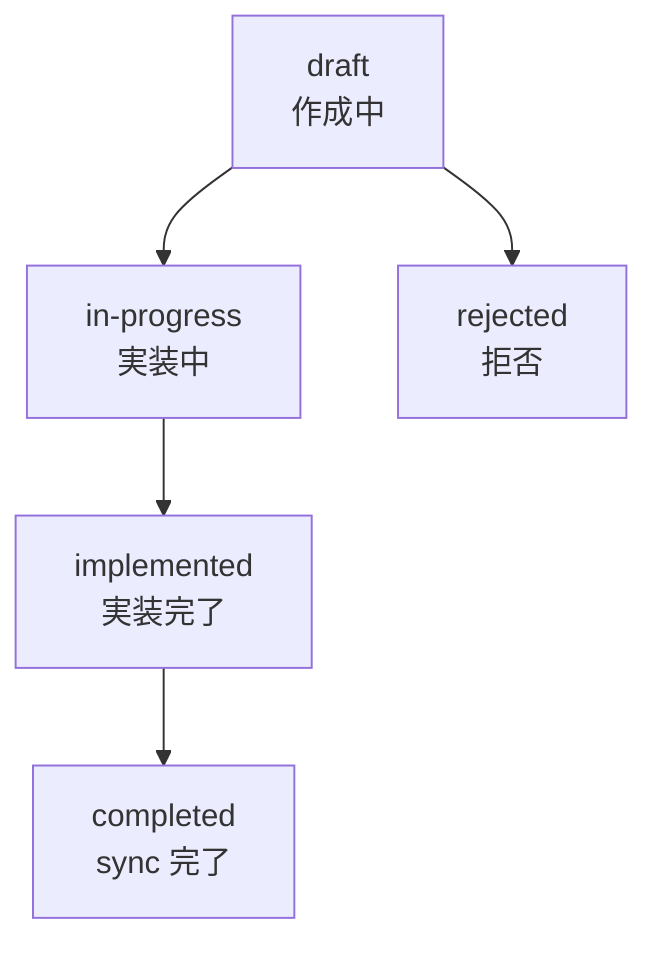

AI と交わした対話を永続的な要件ドキュメントに変えます。自然言語のリクエストが構造化された SPEC ドキュメントになり、このドキュメントが以降すべてのステップの基準になります。


**スラッシュコマンド**: Claude Code で `/moai:plan` と入力すると、このコマンドをすぐに実行できます。`/moai` だけ入力すると、利用可能なすべてのサブコマンド一覧が表示されます。


## 概要

`/moai plan` は MoAI-ADK ワークフローの **Phase 1 (Plan)** コマンドです。自然言語での機能リクエストを **GEARS** (Generalized Expression for AI-Ready Specs) 形式の構造化された SPEC ドキュメントに変換します。内部的に **manager-spec** エージェントが要件を分析し、曖昧さのない仕様書を生成します。

v3.0.0 から GEARS が正本の表記法であり、既存の **EARS** (Easy Approach to Requirements Syntax) は 6 か月間の後方互換として維持されます。2 つの表記法の違いとマイグレーションは [GEARS 表記法セクション](#gears-notation) を参照してください。

計画ステップは v3 トークノミクス設計で最も深い推論が割り当てられるステップです — ここで要件が明確になるほど、後に続く実装ステップの手戻りとトークンの浪費が減ります。だから MoAI-ADK は「計画は深く、実装は安く」という配分原則に従い、生成された SPEC は **plan-auditor** が独立して監査します。作ったエージェントが自分で検査しません。



**SPEC がなぜ必要ですか?**

**バイブコーディング** (Vibe Coding) の最大の問題は **文脈の喪失** です。

AI と対話中にセッションが切れると **以前の議論内容がすべて消えます**。トークン上限を超過すると **古い対話から切られます**。翌日作業を再開すると **昨日決めた事項を覚えていません**。

**SPEC ドキュメントがこの問題を解決します。**

要件を **ファイルに保存** して永久保存します。v3.0.0 から正式な表記法である **GEARS** 形式で **曖昧さなく** 構造化します (既存の EARS 表記法は 6 か月間の後方互換を維持)。セッションが切れても SPEC を読めば **続けて作業** できます。



## 使い方

Claude Code の対話画面で次のように入力します:

```bash
> /moai plan "実装したい機能の説明"
```

**使用例:**

```bash
# 簡単な機能
> /moai plan "ユーザーログイン機能"

# 詳細な機能の説明
> /moai plan "JWT ベースのユーザー認証: ログイン、会員登録、トークン更新 API"

# リファクタリングのリクエスト
> /moai plan "レガシー認証システムを JWT ベースにリファクタリング"
```

## 対応フラグ

| フラグ        | 説明                          | 例                           |
| ------------- | ----------------------------- | ------------------------------ |
| `--worktree`  | ワークツリーの自動生成 (最優先)   | `/moai plan "機能" --worktree` |
| `--branch`    | 従来のブランチ生成            | `/moai plan "機能" --branch`   |
| `--no-issue`  | GitHub Issue の自動生成を省略    | `/moai plan "機能" --no-issue` |

### フラグの優先順位

ブランチ戦略のフラグが指定されると次の順序で適用されます:

1. **--worktree** (最優先): 独立した Git ワークツリーの生成
2. **--branch** (次善): 従来の feature ブランチの生成
3. **フラグなし** (デフォルト): SPEC のみ生成、BODP ゲートでユーザーがブランチ戦略を選択

`--no-issue` はブランチ戦略と独立したオプションで、GitHub Issue 生成ステップ (Phase 12) を省略します。

### --worktree フラグ

SPEC 生成と同時に **独立した Git ワークツリー** を作って並列開発環境を準備します:

```bash
> /moai plan "決済システムの実装" --worktree
```

このオプションを使うと:

1. SPEC ドキュメントを生成します
2. SPEC をコミットします (ワークツリー生成の必須条件)
3. `feature/SPEC-{ID}` ブランチでワークツリーを生成します
4. メインコードに影響なく独立して開発できます


  `--worktree` オプションは **複数の機能を同時に開発** するときに有用です。各 SPEC が
  独立したワークツリーで作業されるので互いに衝突しません。


## 要件表記法 (EARS / GEARS)

SPEC ドキュメントは **EARS** (Easy Approach to Requirements Syntax) 形式で要件を定義します。5 つのパターンがあり、manager-spec エージェントが自然言語を自動的に適切なパターンに変換します。

v3.0.0 からは EARS の 5 つの核心パターンを維持しつつ、AI コーディングエージェントがより明確に解釈できるよう意味境界を整えた **GEARS** (Generalized Expression for AI-Ready Specs) が正式な表記法です。既存の EARS は 6 か月間の後方互換として維持され、新しい SPEC は GEARS パターンに従うよう推奨します。2 つの表記法の違いとマイグレーションは [GEARS 表記法セクション](#gears-notation) を参照してください。

| パターン             | 形式                          | 用途               | 例                                             |
| ---------------- | ----------------------------- | ------------------ | ------------------------------------------------ |
| **Ubiquitous**   | 「システムは ~しなければならない」         | 常に適用されるルール | 「システムはすべての API リクエストをロギングしなければならない」         |
| **Event-driven** | 「WHEN ~したら、THEN ~しなければならない」 | イベント反応        | 「WHEN ログインしたら、THEN JWT を発行しなければならない」      |
| **State-driven** | 「WHILE ~の間、~しなければならない」  | 状態ベースの動作     | 「WHILE ログイン状態の間、セッションを維持しなければならない」 |
| **Unwanted**     | 「システムは ~してはならない」      | 禁止事項          | 「システムはパスワードを平文で保存してはならない」      |
| **Optional**     | 「可能なら、~しなければならない」      | 選択的機能        | 「可能なら、2 段階認証をサポートしなければならない」         |


  EARS 形式を暗記する必要はありません。manager-spec エージェントが自然言語を **自動的に
  変換** します。あなたは望む機能を自然に説明するだけで十分です。


## 実行プロセス

`/moai plan` が内部的に行うプロセスです:


```mermaid
flowchart TD
    A["ユーザーリクエスト<br/>/moai plan '機能の説明'"] --> B{明確か?}
    B -->|いいえ| C["Explore 下位エージェント<br/>プロジェクト分析"]
    B -->|はい| D["manager-spec エージェントの呼び出し"]
    C --> D
    D --> E["要件分析<br/>機能範囲、複雑度の評価"]
    E --> F{"明確化が必要?"}
    F -->|はい| G["ユーザーに質問<br/>詳細の確認"]
    G --> E
    F -->|いいえ| H["EARS 形式へ変換<br/>5 つのパターンを適用"]
    H --> I["受け入れ基準の定義<br/>Given-When-Then"]
    I --> J["SPEC ドキュメント生成<br/>spec.md, plan.md, acceptance.md"]
    J --> K{"ユーザー承認"}
    K -->|承認| L["Git 環境設定"]
    K -->|修正リクエスト| E
    K -->|キャンセル| M["終了"]
    L --> N{"フラグ確認"}
    N -->|--worktree| O["ワークツリー生成"]
    N -->|--branch| P["ブランチ生成"]
    N -->|フラグなし| Q["ユーザー選択"]
    O --> R["完了"]
    P --> R
    Q --> R
```

**核心ポイント:**

- リクエストが不明確なら **Explore 下位エージェント** がプロジェクトを分析します
- manager-spec エージェントは要件が不明瞭なら **ユーザーに追加質問** をします
- すべての要件に **Given-When-Then 形式の受け入れ基準** を自動生成します
- 生成された SPEC ドキュメントはユーザーの **承認を受けた後** に確定されます

## SPEC 生成ステップ

`/moai plan` は 15 個の Phase と 2 個の Decision Point で構成された構造化されたワークフローに従います。Phase 1-3 はコンテキスト発見、Phase 4-7 は深層インタビュー、Phase 8 以降が本格的な SPEC 組み立てです。

### Phase 1-3: コンテキスト発見

| Phase | 名前 | 説明 |
|-------|------|------|
| Phase 1 | Brain 提案検出 | Brain IDEA スキャンおよび SPEC 候補の識別 |
| Phase 2 | プロジェクト探索 (オプション) | `Explore` サブエージェントのコードベース分析 |
| Phase 3 | 明確度評価 | 1-10 スコアベースの明確度評価およびスキップ条件 |

リクエストが曖昧かプロジェクトの状況を把握する必要があるとき Phase 1-3 が実行されます。明確なリクエストは Phase 3 でスキップできます。

### Phase 4-7: 深層インタビュー

明確度スコアが 4-10 の場合に実行されます:

| Phase | 名前 | 説明 |
|-------|------|------|
| Phase 4 | 深層インタビューループ | 1-5 ラウンドのテーマ中心インタビュー |
| Phase 5 | UltraThink 自動有効化 | 複雑度 ≥ 7 のとき拡張推論を有効化 |
| Phase 6 | 深層リサーチ | `Explore` サブエージェントの research.md 成果物 |
| Phase 7 | デザイン方向 | UI/UX キーワード検出時に意図優先のデザイン方向 |

### Phase 8: SPEC 計画

**manager-spec** エージェントが次の作業を行います:

- プロジェクトドキュメントの分析 (product.md, structure.md, tech.md)
- 1-3 個の SPEC 候補の提案および命名
- 重複 SPEC の確認 (.moai/specs/)
- GEARS 構造の設計 (EARS レガシー形式も許容)
- 実装計画および技術制約条件の識別
- ライブラリバージョンの確認 (安定版のみ、beta/alpha 除外)

### Decision Point 1: ユーザー承認ゲート (HUMAN GATE)

Phase 8 完了後、ユーザーが明示的に承認して次のステップに進みます。4 つの選択肢があります:

| 選択 | 意味 |
|------|------|
| **Proceed** | 現在の SPEC で進行 |
| **Annotate** | フィードバック反映後に再作成 (1-6 ラウンドの反復) |
| **Draft** | SPEC を draft 状態で保存して待機 |
| **Cancel** | SPEC 生成の中断 |

### Phase 9: 事前検証ゲート

SPEC 生成前に一般的なエラーを防ぎます:

**Step 1 - ドキュメントタイプの分類:**

- SPEC, Report, Documentation キーワードの検出
- Report は .moai/reports/ にルーティング
- Documentation は .moai/docs/ にルーティング

**Step 2 - SPEC ID 検証 (すべての検査の通過が必須):**

- **ID 形式**: `SPEC-ドメイン-番号` パターン (例: `SPEC-AUTH-001`)
- **ドメイン名**: 承認されたドメイン一覧 (AUTH, API, UI, DB, REFACTOR, FIX, UPDATE,
  PERF, TEST, DOCS, INFRA, DEVOPS, SECURITY など)
- **ID の一意性**: .moai/specs/ で重複を確認
- **ディレクトリ構造**: 必ずディレクトリを生成、フラットファイル禁止

**複合ドメインルール:** 最大 2 個のドメインを推奨 (例: UPDATE-REFACTOR-001)、最大 3 個まで許容

### Phase 10: SPEC ドキュメント生成

3 つのファイルが同時に生成されます:

**spec.md:**

- YAML フロントマター (**12 個の必須フィールド**: id, title, version, status, created, updated,
  author, priority, phase, module, lifecycle, tags)
- HISTORY セクション (フロントマターの直後)
- 完全な GEARS/EARS 構造 (5 種の要件タイプ)
- conversation_language で書かれたコンテンツ

**plan.md:**

- 作業分解の実装計画
- 技術スタック仕様および依存性
- リスク分析および緩和戦略

**acceptance.md:**

- 最小 2 個の Given/When/Then シナリオ
- エッジケーステストシナリオ
- 性能および品質ゲート基準

**品質制約条件:**

- 要件モジュール: SPEC あたり最大 5 個
- 受け入れ基準: 最小 2 個の Given/When/Then シナリオ
- 技術用語と関数名は英語を維持

### Phase 11: plan-auditor の独立監査

**plan-auditor** サブエージェントが manager-spec が作成した SPEC 成果物を独立して監査します。作ったエージェントが自分の結果を検査しない **独立監査原則** に従います。

- 最大 3 回反復 (Retry Loop Contract)
- 各ラウンドでスコア回帰が発生時に STOP 信号 + 範囲縮小の提案
- PASS / PASS-with-debt / FAIL の 3 つの判定
- 監査報告書は `.moai/reports/plan-audit/` に保存

### Phase 12: GitHub Issue 生成 (条件付き)

`--no-issue` フラグがなければ GitHub Issue を生成し SPEC と双方向参照を連携します。v3.0.0 からは Issue 生成がデフォルトで省略され、`--issue` フラグで明示的に有効化できます。

### Phase 13: Git 環境設定 (条件付き)

**BODP (Branch Origin Decision Protocol) ゲート** を通じてブランチ戦略を決定します:

- **--worktree** (最優先): 独立した Git ワークツリーの生成
- **--branch** (次善): 従来の feature ブランチの生成
- **現在のブランチを維持**: フラグなしで現在のチェックアウトから継続

### Phase 14: MX タグ計画

実装ステップで追加する `@MX` コード注釈のターゲットを識別します:

- `@MX:ANCHOR` — 不変契約 (high fan_in の関数)
- `@MX:WARN` — 危険区間 (goroutine、複雑度 ≥ 15)
- `@MX:NOTE` — コンテキスト/意図の記録

### Phase 15: SPEC 品質ゲート

GEARS/EARS 要件と受け入れ基準 (AC) の間のカバレッジを検証し、セキュリティ範囲の点検を行います。

### Decision Point 2/3/3.5: 実行モード選択

SPEC 生成完了後に次のステップを選択します。詳しい内容は [Decision Point 3.5 セクション](#decision-point-35-実行モード選択ゲート) を参照してください。

## 出力結果

SPEC ドキュメントは `.moai/specs/` ディレクトリに保存されます:

```
.moai/
└── specs/
    └── SPEC-AUTH-001/
        ├── spec.md          # EARS 要件
        ├── plan.md          # 実装計画
        └── acceptance.md     # 受け入れ基準
```

**SPEC ドキュメントの基本構造:**

```yaml
---
id: SPEC-AUTH-001
version: 1.0.0
status: draft
created: 2026-01-28
updated: 2026-01-28
author: 開発チーム
priority: HIGH
---
```

## SPEC 状態管理

SPEC ドキュメントは次のような状態ライフサイクルを持ちます:


```mermaid
flowchart TD
    A["draft<br/>作成中"] --> B["in-progress<br/>実装中"]
    B --> C["implemented<br/>実装完了"]
    C --> D["completed<br/>sync 完了"]
    A --> E["rejected<br/>拒否"]
```

| 状態           | 説明                 | `/moai run` 実行可能 |
| -------------- | -------------------- | --------------------- |
| `draft`        | SPEC 作成完了、承認待ち | はい (承認後)      |
| `in-progress`  | 現在実装中         | はい (続けて)           |
| `implemented`  | 実装完了、sync 待ち | いいえ                |
| `completed`    | sync 完了、全体完了 | いいえ                |
| `rejected`     | 拒否済み、再作成が必要  | いいえ                |

## ブラウンフィールド分類 — Delta Markers

既存コードベース (ブラウンフィールド) プロジェクトで SPEC 要件を分類します。

| マーカー | 意味 | 説明 |
|------|------|------|
| `[EXISTING]` | 既存維持 | 変更なしで参照のみ |
| `[MODIFY]` | 修正 | 既存コードの変更 |
| `[NEW]` | 新規 | 新しく生成 |
| `[REMOVE]` | 削除 | 既存コードの除去 |

## トークン節約の仕組み — spec-compact.md

Plan phase で SPEC ドキュメントの要約版 (`spec-compact.md`) を自動生成します。Run phase で spec.md 全体の代わりに要約版をロードして **~30% のトークンを節約** します — SPEC ライフサイクルの中にトークノミクスの仕組みが組み込まれている代表的な例です。

## 範囲逸脱の防止 — Exclusions と What/Why 制約

**Exclusions の必須化 ("What NOT to Build")**: すべての SPEC ドキュメントに **Out of Scope / Exclusions** セクションが必須です。範囲逸脱を事前に防ぎます。

**What/Why 制約**: SPEC 要件は **What** (何を) と **Why** (なぜ) のみを記述します。**How** (どうやって) は実装ステップで決定し、SPEC に過剰仕様化しません。

## Decision Point 3.5: 実行モード選択ゲート

Plan 完了後 Run 開始前に、実行環境を自動検出しユーザーに最適モードを提案します。

**検出項目:**
1. tmux の可用性 (`$TMUX` 環境変数)
2. 現在の LLM モード (`llm.yaml` の `team_mode`: cc/glm/cg)

**tmux 使用可能時:**
- Worktree + 現在のモード (推奨)
- Sub-agent Mode (順次)

**tmux 使用不可時:**
- Sub-agent Mode (推奨)


Agent Teams 静的オーケストレーション階層 (Module 3) は引退しました。`--team` フラグと Team Mode オプションはもう提供されず、強制時は `MODE_TEAM_UNAVAILABLE` フォールバックで Sub-agent Mode に切り替わります。CG モード (Claude+GLM) は `moai cg` コマンドで進入します。


## 実践例

### 例: JWT 認証 SPEC の生成

**ステップ 1: コマンド実行**

```bash
> /moai plan "JWT ベースのユーザー認証システム: 会員登録、ログイン、トークン更新"
```

**ステップ 2: manager-spec が質問** (必要時)

manager-spec エージェントが詳細を確認するために質問することがあります:

- 「パスワードの最小長は何文字ですか?」
- 「トークン有効期限はいくつに設定しますか?」
- 「ソーシャルログインも含めますか?」

**ステップ 3: SPEC ドキュメント生成結果**

次のような構造の SPEC ドキュメントが生成されます:

```yaml
---
id: SPEC-AUTH-001
title: JWT ベースのユーザー認証システム
priority: HIGH
status: draft
---
```

```markdown
# 要件 (GEARS/EARS 形式)

## Ubiquitous

- システムはすべてのパスワードを bcrypt でハッシュして保存しなければならない
- システムはすべての認証リクエストをロギングしなければならない

## Event-driven

- WHEN 有効な資格情報でログインしたら、THEN JWT アクセストークン (1 時間) とリフレッシュ
  トークン (7 日) を発行しなければならない

## Unwanted

- システムはパスワードを平文で保存してはならない
- システムは有効期限切れのトークンで API アクセスを許可してはならない
```

**ステップ 4: ユーザー承認後の Git 環境設定**

```bash
# --worktree フラグ使用時
> /moai plan "JWT 認証" --worktree

# 結果:
# 1. SPEC ドキュメント生成 (.moai/specs/SPEC-AUTH-001/)
# 2. SPEC コミット (feat(spec): Add SPEC-AUTH-001)
# 3. ワークツリー生成 (.git/worktrees/SPEC-AUTH-001)
# 4. ワークツリーパスの表示
```

**ステップ 5: `/clear` 実行後に実装ステップへ移動**

```bash
# トークンの整理
> /clear

# 実装開始
> /moai run SPEC-AUTH-001
```

## よくある質問

### Q: SPEC ドキュメントを手動で修正できますか?

はい、`.moai/specs/SPEC-XXX/spec.md` ファイルを直接編集できます。要件を追加したり受け入れ基準を修正したりした後 `/moai run` を実行すると修正された内容が反映されます。

### Q: SPEC なしですぐにコードを書くことはできませんか?

Claude Code で直接コードを書くこともできますが、SPEC なしで作業するとセッションが切れるたびに文脈を失います。**複雑な機能ほど SPEC を先に作るのが効率的** です。

### Q: SPEC ID はどんなルールで生成されますか?

`SPEC-ドメイン-番号` 形式です (例: `SPEC-AUTH-001`)

- `SPEC-AUTH-001`: 認証関連の最初の SPEC
- `SPEC-PAYMENT-002`: 決済関連の 2 番目の SPEC

ドメインは機能の領域に応じて manager-spec が自動的に決定します。

### Q: `/moai plan` と `/moai` の違いは何ですか?

`/moai plan` は **SPEC ドキュメント生成のみ** を担当します。`/moai` は SPEC 生成から実装、ドキュメント化まで **ワークフロー全体** を自動的に行います。

### Q: --worktree と --branch の違いは何ですか?

**--worktree** は独立した作業ディレクトリを生成して完全に隔離された環境を提供します。**--branch** は現在のリポジトリに新しいブランチを作ります。複数の機能を同時に開発するなら --worktree を推奨します。

## GEARS 表記法 (v3.0.0+) {#gears-notation}

MoAI-ADK v3.0.0 からは **GEARS** (Generalized Expression for AI-Ready Specs) を SPEC 作成の推奨表記法として導入します。既存の EARS 表記法は **6 か月** 間の後方互換を維持し、その間に段階的に GEARS へマイグレーションできます。新しい SPEC は最初から GEARS パターンに従うよう推奨します。

GEARS は EARS の 5 つの核心パターンを維持しつつ、AI コーディングエージェントがより明確に解釈できるよう意味境界を整えた表記法です。核心的な変更は **IF/THEN パターンの廃止** (WHEN に正規化) と **WHERE の意味の再定義** (静的な前提条件/構成/機能フラグ) です。

参考資料: Σ\*/SubLang、**"GEARS: The Spec Syntax That Makes AI Coding Actually Work"**、DEV Community 2026-01-23。<https://dev.to/sublang/gears-the-spec-syntax-that-makes-ai-coding-actually-work-4f3f>

### 5 つのパターン比較表

| 表記パターン | EARS (legacy) | GEARS (canonical) | Lint 動作 |
|---|---|---|---|
| Ubiquitous (普遍) | `The system shall <action>` | Same | 変更なし |
| Event-driven (WHEN) | `WHEN <event>, the system shall <action>` | Same | 変更なし |
| State-driven (WHILE) | `WHILE <state>, the system shall <action>` | Same (stateful precondition) | 変更なし |
| Precondition (WHERE) | `WHERE <feature-exists>, the system shall <action>` | `WHERE <precondition>, the system shall <action>` (再定義: 静的な前提条件、構成、機能フラグ) | lint 階層では変更なし |
| Negative trigger | `IF <condition>, THEN the system shall <action>` | **DEPRECATED** — 代わりに `WHEN <event-detected>, the system shall <action>` を使用 | **新規: `LegacyEARSKeyword` warning** |

### 後方互換期間 (6 か月)

マイグレーションウィンドウは v3.0.0 リリース時点から **6 か月** または `SPEC-V3R6-GEARS-SWEEP-001` (provisional) の一括修正 SPEC 完了時点のうち先に到来する時点まで有効です。ウィンドウ中の動作は次のとおりです。

- **非-strict モード (デフォルト値)**: `LegacyEARSKeyword` コードの warning のみ発生、lint 失敗なし
- **`--strict` モード (opt-in)**: warning が error に昇格され CI 遮断
- **既存の 88 個の SPEC**: 本 SPEC の範囲では直接修正しない (REQ-GM-007)。一括修正は後続の SWEEP SPEC の責任

### LegacyEARSKeyword 診断

`internal/spec/lint.go` の `isLegacyEARSPattern()` ヘルパーが EARS legacy IF/THEN パターンを検出すると次のようなメッセージを出力します。

```
REQ <REQ-ID>: GEARS migration: replace IF/THEN with WHEN/event normalization; see https://adk.mo.ai.kr/en/workflow-commands/moai-plan/#gears-notation
```

- **コード**: `LegacyEARSKeyword`
- **深刻度**: warning (非-strict) / error (`--strict`)
- **出所**: `internal/spec/lint.go`

### ツール作成者への案内

downstream ツール (検証器、コード生成器、IDE プラグインなど) で SPEC テキストをマッチングするときは次のようにマイグレーションしてください。

- `IF .* THEN` マッチングを今後 `WHEN .* shall` マッチングに転換
- 6 か月の deprecation ウィンドウを認識し、ウィンドウ終了時点まで両方のパターンを認識するよう実装
- `LegacyEARSKeyword` finding コードを upgrade 信号として活用

### マイグレーション例

**Before (EARS legacy):**

```
IF input is null, THEN the system shall return an error.
```

**After (GEARS canonical):**

```
WHEN input is null is detected, the system shall return an error.
```

この正規化はトリガーを「条件」ではなく「事件」として明示することで AI エージェントの意図解釈の曖昧さを減らし、テストケース作成時に入力/検証時点をより明確にします。

## 適応型の推奨配置 (Adaptive Recommendation Placement)

MoAI-ADK v0.1.0 から **AskUserQuestion の推奨** がユーザーの決定パターンに合わせてパーソナライズされます。システムは選択をキャプチャし、システムのデフォルト値ではなく観測された統計的多数に基づいて未来の質問オプションをパーソナライズします。ループが観察を蓄積しシステムがその観察から学ぶという点で、v3 の **再帰的な自己学習** 原則が質問・推奨領域に適用された事例です。

### 動作原理

MoAI が `AskUserQuestion` で質問するとき、推奨配置を案内する 5 つの原則が適用されます:

1. **Fisher 情報タイミング** — 不確実性が最も高いとき (p≈0.5、Fisher 情報 I=p(1−p) が最大の決定境界) 質問が発火されます。p≈0 または p≈1 (ほぼ確定) のときはシステムが自動処理し質問を省略します。

2. **質問順序 — 情報利得の降順** — 複数の質問が必要なとき、推定情報利得が高い順にソートされ最も重要な決定を先に下します。

3. **統計的多数の合理的なデフォルト値** — 推奨オプション (`(推奨)` 表示) は決定記録の観測された多数選択を反映し、**システムのポリシーデフォルト値ではありません**。データが不足すると (cold-start) *「デフォルト設定ベース、パーソナライズに N 件の観察が必要」* を公開します。

4. **前提条件の公開** — 各推奨オプションは成立の前提条件を *「Recommended when <precondition>」* 形式で明示し、即座にトレードオフを評価できるようにします。

5. **熟練度に基づく適応型の強度** — 推奨強度はセッションカウントに応じて調節されます:
   - **専門家** (20+ セッション): 弱い強度 — inferred preference を `(推奨)` override なしで公開のみ (info-centric、自律性尊重)
   - **一般ユーザー** (5-19 セッション): 強い強度 — `(推奨)` + 透明な根拠の提示
   - **Cold-start** (<5 セッション): 中立強度 — override なし、システムのデフォルト値を適用

### プライバシーおよび安全

- **セッション範囲トグル**: `moai preference toggle` でプロジェクト別のパーソナライズを無効化 (セッション間で非永続)
- **機密ドメインゲート**: セキュリティ関連のテーマ (脆弱性、侵入テスト、漏洩) は中立推奨 + 公開ログ
- **自動減衰**: Transient な選好は 28 日後に soft-delete、stable な選好 (明示的な表示) は保存
- **Advisory キャプチャ**: PostToolUse キャプチャフックは AskUserQuestion 実行を決して遮断しない (fail-open 設計)
- **Recovery-Signal Carve-Out**: recovery ターン (compact 復旧、prompt_too_long など) で advisory フックは復旧に譲る (recovery-signal carve-out 準拠、doctrine-honest)

### 技術実装


**内部動作**: 5 つの原則は `.claude/rules/moai/core/askuser-protocol.md` § Recommendation Placement Principles に明細化されており、`moai.md` にレンダリングされます。キャプチャフックは `internal/hook/user_decision_capture.go` に実装されており schema 許容パースとドメイン分類をサポートします。減衰ポリシーは power-law 関数 `(age+1)^(-0.5)` に従い α=0.5 固定 (Standard tier)。全体のアーキテクチャと受け入れ基準はプロジェクトの SPEC ドキュメントを参照してください。


## 関連ドキュメント

- [SPEC ベース開発](/core-concepts/spec-based-dev) - EARS 形式の詳細説明
- [/moai run](./moai-run) - 次のステップ: DDD 実装
- [/moai sync](./moai-sync) - 最終ステップ: ドキュメント同期
