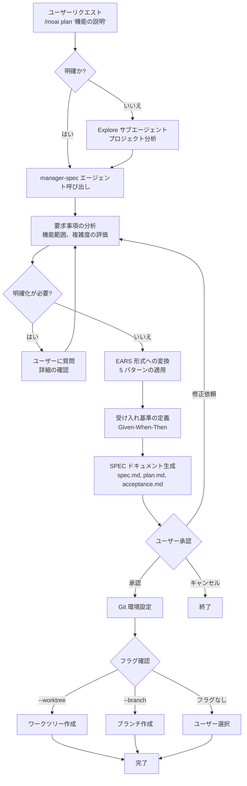
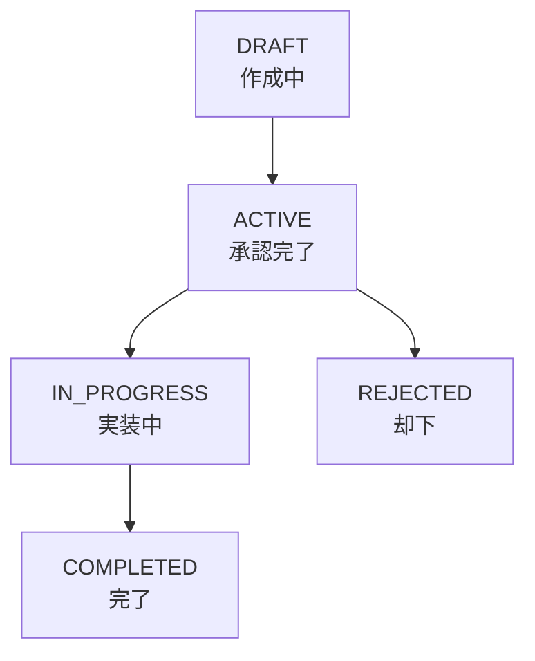

AI と交わした会話を恒久的な要求ドキュメントに変えます。自然言語のリクエストが構造化された SPEC ドキュメントになり、このドキュメントが以降のすべての段階の基準になります。


**スラッシュコマンド**: Claude Code で `/moai:plan` と入力すると、このコマンドをすぐに実行できます。`/moai` だけを入力すると、使用可能なすべてのサブコマンドの一覧が表示されます。


## 概要

`/moai plan` は MoAI-ADK ワークフローの **Phase 1 (Plan)** コマンドです。自然言語の機能リクエストを **EARS** (Easy Approach to Requirements Syntax) 形式の構造化された SPEC ドキュメントに変換します。内部では **manager-spec** エージェントが要求事項を分析し、曖昧さのない仕様書を生成します。

計画段階は v3 トークノミクス設計で最も深い推論が割り当てられる段階です — ここで要求事項が明確になるほど、後続の実装段階での手戻りとトークンの浪費が減ります。だからこそ MoAI-ADK は「計画は深く、実装は安く」という配分原則に従い、生成された SPEC は **plan-auditor** が独立して監査します。作ったエージェントが自ら検査することはありません。



**なぜ SPEC が必要なのか?**

**バイブコーディング** (Vibe Coding) の最大の問題は **コンテキストの喪失** です。

AI と会話していてセッションが切れると **それまでの議論内容がすべて消えます**。トークン上限を超えると **古い会話から切り捨てられます**。翌日に作業を再開すると **昨日決めた事項を覚えていません**。

**SPEC ドキュメントがこの問題を解決します。**

要求事項を **ファイルとして保存** し、恒久的に保存します。EARS 形式で **曖昧さなく** 構造化します。セッションが切れても SPEC を読めば **続きから作業** できます。



## 使い方

Claude Code の会話ウィンドウで次のように入力します:

```bash
> /moai plan "実装したい機能の説明"
```

**使用例:**

```bash
# シンプルな機能
> /moai plan "ユーザーログイン機能"

# 詳細な機能説明
> /moai plan "JWT ベースのユーザー認証: ログイン、会員登録、トークン更新 API"

# リファクタリングのリクエスト
> /moai plan "レガシー認証システムを JWT ベースにリファクタリング"
```

## サポートされるフラグ

| フラグ              | 説明                        | 例                                |
| ------------------- | --------------------------- | ----------------------------------- |
| `--worktree`        | ワークツリーの自動作成 (最優先) | `/moai plan "機能" --worktree`      |
| `--branch`          | 従来型のブランチ作成          | `/moai plan "機能" --branch`        |
| `--resume SPEC-XXX` | 中断された SPEC 作業の再開       | `/moai plan --resume SPEC-AUTH-001` |
| `--team`            | エージェントチームモードを強制       | `/moai plan "機能" --team`          |
| `--solo`            | サブエージェントモードを強制     | `/moai plan "機能" --solo`          |
| `--seq`             | 並列ではなく逐次診断          | `/moai plan "機能" --seq`           |
| `--ultrathink`      | Adaptive Thinking の有効化 | `/moai plan "機能" --ultrathink`  |

### フラグの優先順位

複数のフラグが指定された場合、次の順序で適用されます:

1. **--worktree** (最優先): 独立した Git ワークツリーを作成
2. **--branch** (次点): 従来型の feature ブランチを作成
3. **フラグなし** (デフォルト): SPEC のみ生成、ユーザーの選択に応じてブランチ作成

### --worktree フラグ

SPEC 生成と同時に **独立した Git ワークツリー** を作り、並列開発環境を準備します:

```bash
> /moai plan "決済システムの実装" --worktree
```

このオプションを使うと:

1. SPEC ドキュメントを生成します
2. SPEC をコミットします (ワークツリー作成の必須条件)
3. `feature/SPEC-{ID}` ブランチでワークツリーを作成します
4. メインコードに影響なく独立して開発できます


  `--worktree` オプションは **複数の機能を同時に開発** するときに便利です。各 SPEC が
  独立したワークツリーで作業されるため、互いに衝突しません。


## EARS 形式の要求事項

SPEC ドキュメントは **EARS** (Easy Approach to Requirements Syntax) 形式で要求事項を定義します。5 つのパターンがあり、manager-spec エージェントが自然言語を自動的に適切なパターンに変換します。

| パターン             | 形式                          | 用途               | 例                                             |
| ---------------- | ----------------------------- | ------------------ | ------------------------------------------------ |
| **Ubiquitous**   | 「システムは~しなければならない」         | 常に適用されるルール | 「システムはすべての API リクエストをログに記録しなければならない」         |
| **Event-driven** | 「WHEN ~したら、THEN ~しなければならない」 | イベントへの反応        | 「WHEN ログインしたら、THEN JWT を発行しなければならない」      |
| **State-driven** | 「WHILE ~の間、~しなければならない」  | 状態ベースの動作     | 「WHILE ログイン状態の間、セッションを維持しなければならない」 |
| **Unwanted**     | 「システムは~してはならない」      | 禁止事項          | 「システムはパスワードを平文で保存してはならない」      |
| **Optional**     | 「可能であれば、~すべきである」      | オプション機能        | 「可能であれば、二段階認証をサポートすべきである」         |


  EARS 形式を覚える必要はありません。manager-spec エージェントが自然言語を **自動で
  変換** します。あなたは欲しい機能を自然に説明するだけでよいのです。


## 実行プロセス

`/moai plan` が内部的に実行するプロセスです:


```mermaid
flowchart TD
    A["ユーザーリクエスト<br/>/moai plan '機能の説明'"] --> B{明確か?}
    B -->|いいえ| C["Explore サブエージェント<br/>プロジェクト分析"]
    B -->|はい| D["manager-spec エージェント呼び出し"]
    C --> D
    D --> E["要求事項の分析<br/>機能範囲、複雑度の評価"]
    E --> F{"明確化が必要?"}
    F -->|はい| G["ユーザーに質問<br/>詳細の確認"]
    G --> E
    F -->|いいえ| H["EARS 形式への変換<br/>5 パターンの適用"]
    H --> I["受け入れ基準の定義<br/>Given-When-Then"]
    I --> J["SPEC ドキュメント生成<br/>spec.md, plan.md, acceptance.md"]
    J --> K{"ユーザー承認"}
    K -->|承認| L["Git 環境設定"]
    K -->|修正依頼| E
    K -->|キャンセル| M["終了"]
    L --> N{"フラグ確認"}
    N -->|--worktree| O["ワークツリー作成"]
    N -->|--branch| P["ブランチ作成"]
    N -->|フラグなし| Q["ユーザー選択"]
    O --> R["完了"]
    P --> R
    Q --> R
```

**重要なポイント:**

- リクエストが不明確な場合、**Explore サブエージェント** がプロジェクトを分析します
- manager-spec エージェントは要求事項が不明瞭なら **ユーザーに追加質問** をします
- すべての要求事項に **Given-When-Then 形式の受け入れ基準** を自動生成します
- 生成された SPEC ドキュメントはユーザーの **承認を得た後** に確定します

## SPEC 生成の段階

### Phase 1A: プロジェクト分析 (オプション)

リクエストが曖昧、またはプロジェクトの状況を把握する必要があるときに実行されます:

| 実行条件                | 省略条件               |
| ------------------------ | ----------------------- |
| 不明確なリクエスト            | 明確な SPEC タイトル        |
| 既存ファイル/パターンの発見が必要 | resume シナリオ         |
| プロジェクト状態が不確実     | 既存 SPEC コンテキストが存在 |

### Phase 1B: SPEC 計画

**manager-spec** エージェントが次の作業を行います:

- プロジェクトドキュメントの分析 (product.md, structure.md, tech.md)
- 1-3 個の SPEC 候補の提案とネーミング
- 重複 SPEC の確認 (.moai/specs/)
- EARS 構造の設計
- 実装計画と技術的制約の識別
- ライブラリバージョンの確認 (安定版のみ、beta/alpha は除外)

### Phase 3: 事前検証ゲート

SPEC 生成前に一般的なエラーを防止します:

**Step 1 - ドキュメント種別の分類:**

- SPEC、Report、Documentation キーワードの検出
- Report は .moai/reports/ へルーティング
- Documentation は .moai/docs/ へルーティング

**Step 2 - SPEC ID の検証 (すべての検査の通過が必須):**

- **ID 形式**: `SPEC-ドメイン-番号` パターン (例: `SPEC-AUTH-001`)
- **ドメイン名**: 承認済みドメイン一覧 (AUTH, API, UI, DB, REFACTOR, FIX, UPDATE,
  PERF, TEST, DOCS, INFRA, DEVOPS, SECURITY など)
- **ID の一意性**: .moai/specs/ での重複確認
- **ディレクトリ構造**: 必ずディレクトリを作成、フラットファイルは禁止

**複合ドメインのルール:** 最大 2 ドメイン推奨 (例: UPDATE-REFACTOR-001)、最大 3 まで許容

### Phase 2: SPEC ドキュメント生成

3 つのファイルが同時に生成されます:

**spec.md:**

- YAML フロントマター (7 つの必須フィールド: id, version, status, created, updated, author,
  priority)
- HISTORY セクション (フロントマターの直後)
- 完全な EARS 構造 (5 種類の要求事項タイプ)
- conversation_language で書かれたコンテンツ

**plan.md:**

- 作業分解による実装計画
- 技術スタックの仕様と依存関係
- リスク分析と緩和戦略

**acceptance.md:**

- 最低 2 つの Given/When/Then シナリオ
- エッジケースのテストシナリオ
- パフォーマンスと品質ゲートの基準

**品質制約:**

- 要求事項モジュール: SPEC あたり最大 5 個
- 受け入れ基準: 最低 2 つの Given/When/Then シナリオ
- 技術用語と関数名は英語を維持

### Phase 3: Git 環境設定 (条件付き)

**実行条件:** Phase 2 完了 AND 次のいずれか:

- --worktree フラグの指定
- --branch フラグの指定、またはユーザーがブランチ作成を選択
- 設定でブランチ作成を許可 (git_strategy 設定)

**省略タイミング:** develop_direct ワークフロー、フラグなしで「現在のブランチを使用」を選択

## 出力結果

SPEC ドキュメントは `.moai/specs/` ディレクトリに保存されます:

```
.moai/
└── specs/
    └── SPEC-AUTH-001/
        ├── spec.md          # EARS 要求事項
        ├── plan.md          # 実装計画
        └── acceptance.md     # 受け入れ基準
```

**SPEC ドキュメントの基本構造:**

```yaml
---
id: SPEC-AUTH-001
version: 1.0.0
status: ACTIVE
created: 2026-01-28
updated: 2026-01-28
author: 開発チーム
priority: HIGH
---
```

## SPEC 状態管理

SPEC ドキュメントは次の状態ライフサイクルを持ちます:


```mermaid
flowchart TD
    A["DRAFT<br/>作成中"] --> B["ACTIVE<br/>承認完了"]
    B --> C["IN_PROGRESS<br/>実装中"]
    C --> D["COMPLETED<br/>完了"]
    B --> E["REJECTED<br/>却下"]
```

| 状態          | 説明                 | `/moai run` 実行可能 |
| ------------- | -------------------- | --------------------- |
| `DRAFT`       | まだ作成中         | いいえ                |
| `ACTIVE`      | 承認完了、実装待ち | **はい**                |
| `IN_PROGRESS` | 現在実装中         | はい (続きから)           |
| `COMPLETED`   | 実装と検証が完了    | いいえ                |
| `REJECTED`    | 却下、再作成が必要  | いいえ                |

## ブラウンフィールド分類 — Delta Markers

既存コードベース (ブラウンフィールド) のプロジェクトで SPEC 要求事項を分類します。

| マーカー | 意味 | 説明 |
|------|------|------|
| `[EXISTING]` | 既存を維持 | 変更なしで参照のみ |
| `[MODIFY]` | 修正 | 既存コードの変更 |
| `[NEW]` | 新規 | 新しく作成 |
| `[REMOVE]` | 削除 | 既存コードの除去 |

## トークン節約の仕組み — spec-compact.md

Plan phase で SPEC ドキュメントの要約版 (`spec-compact.md`) を自動生成します。Run phase では spec.md 全体の代わりに要約版をロードして **~30% のトークンを節約** します — SPEC ライフサイクルの中にトークノミクスの仕組みが組み込まれている代表例です。

## スコープ逸脱の防止 — Exclusions と What/Why 制約

**Exclusions の必須化 ("What NOT to Build")**: すべての SPEC ドキュメントに **Out of Scope / Exclusions** セクションが必須です。スコープ逸脱を事前に防ぎます。

**What/Why 制約**: SPEC 要求事項は **What** (何を) と **Why** (なぜ) のみを記述します。**How** (どのように) は実装段階で決定し、SPEC で過剰に仕様化しません。

## Decision Point 3.5: 実行モード選択ゲート

Plan 完了後、Run 開始前に、実行環境を自動検出してユーザーに最適なモードを提案します。

**検出項目:**
1. tmux の可用性 (`$TMUX` 環境変数)
2. 現在の LLM モード (`llm.yaml` の `team_mode`: cc/glm/cg)

**tmux 使用可能時:**
- Worktree + \{現在のモード\} (Recommended)
- Team Mode (in-process)
- Sub-agent Mode (sequential)

**tmux 使用不可時:**
- Sub-agent Mode (Recommended)
- Team Mode (in-process)

## 実践例

### 例: JWT 認証 SPEC の生成

**ステップ 1: コマンド実行**

```bash
> /moai plan "JWT ベースのユーザー認証システム: 会員登録、ログイン、トークン更新"
```

**ステップ 2: manager-spec が質問** (必要時)

manager-spec エージェントが詳細を確認するために質問することがあります:

- 「パスワードの最小長は何文字ですか?」
- 「トークンの有効期限はどのくらいに設定しますか?」
- 「ソーシャルログインも含めますか?」

**ステップ 3: SPEC ドキュメント生成結果**

次のような構造の SPEC ドキュメントが生成されます:

```yaml
---
id: SPEC-AUTH-001
title: JWT ベースのユーザー認証システム
priority: HIGH
status: ACTIVE
---
```

```markdown
# 要求事項 (EARS 形式)

## Ubiquitous

- システムはすべてのパスワードを bcrypt でハッシュ化して保存しなければならない
- システムはすべての認証リクエストをログに記録しなければならない

## Event-driven

- WHEN 有効な資格情報でログインしたら、THEN JWT アクセストークン (1 時間) とリフレッシュ
  トークン (7 日) を発行しなければならない

## Unwanted

- システムはパスワードを平文で保存してはならない
- システムは失効したトークンでの API アクセスを許可してはならない
```

**ステップ 4: ユーザー承認後の Git 環境設定**

```bash
# --worktree フラグ使用時
> /moai plan "JWT 認証" --worktree

# 結果:
# 1. SPEC ドキュメント生成 (.moai/specs/SPEC-AUTH-001/)
# 2. SPEC のコミット (feat(spec): Add SPEC-AUTH-001)
# 3. ワークツリー作成 (.git/worktrees/SPEC-AUTH-001)
# 4. ワークツリーパスの表示
```

**ステップ 5: `/clear` 実行後に実装段階へ移動**

```bash
# トークンの整理
> /clear

# 実装開始
> /moai run SPEC-AUTH-001
```

## よくある質問

### Q: SPEC ドキュメントを手動で修正できますか?

はい、`.moai/specs/SPEC-XXX/spec.md` ファイルを直接編集できます。要求事項を追加したり受け入れ基準を修正した後 `/moai run` を実行すると、修正内容が反映されます。

### Q: SPEC なしで直接コードを書くことはできませんか?

Claude Code で直接コードを書くこともできますが、SPEC なしで作業するとセッションが切れるたびにコンテキストを失います。**複雑な機能ほど SPEC を先に作る方が効率的** です。

### Q: SPEC ID はどのようなルールで生成されますか?

`SPEC-ドメイン-番号` 形式です (例: `SPEC-AUTH-001`)

- `SPEC-AUTH-001`: 認証関連の最初の SPEC
- `SPEC-PAYMENT-002`: 決済関連の 2 番目の SPEC

ドメインは機能の領域に応じて manager-spec が自動的に決定します。

### Q: `/moai plan` と `/moai` の違いは何ですか?

`/moai plan` は **SPEC ドキュメント生成のみ** を担当します。`/moai` は SPEC 生成から実装、ドキュメント化まで **ワークフロー全体** を自動で実行します。

### Q: --worktree と --branch の違いは何ですか?

**--worktree** は独立した作業ディレクトリを作成して完全に分離された環境を提供します。**--branch** は現在のリポジトリに新しいブランチを作ります。複数の機能を同時に開発するなら --worktree をおすすめします。

## GEARS 表記法 (v3.0.0+) {#gears-notation}

MoAI-ADK v3.0.0 からは **GEARS** (Generalized Expression for AI-Ready Specs) を SPEC 作成の推奨表記法として導入します。従来の EARS 表記法は **6 か月** の間、後方互換を維持し、その間に段階的に GEARS へ移行できます。新しい SPEC は最初から GEARS パターンに従うことを推奨します。

GEARS は EARS の 5 つの中核パターンを維持しつつ、AI コーディングエージェントがより明確に解釈できるよう意味の境界を整えた表記法です。中核の変更は **IF/THEN パターンの廃止** (WHEN への正規化) と **WHERE の意味の再定義** (静的な前提条件/構成/機能フラグ) です。

参考資料: Σ\*/SubLang, **"GEARS: The Spec Syntax That Makes AI Coding Actually Work"**, DEV Community 2026-01-23. <https://dev.to/sublang/gears-the-spec-syntax-that-makes-ai-coding-actually-work-4f3f>

### 5 パターンの比較表

| 表記パターン | EARS (legacy) | GEARS (canonical) | Lint 動作 |
|---|---|---|---|
| Ubiquitous (普遍) | `The system shall <action>` | Same | 変更なし |
| Event-driven (WHEN) | `WHEN <event>, the system shall <action>` | Same | 変更なし |
| State-driven (WHILE) | `WHILE <state>, the system shall <action>` | Same (stateful precondition) | 変更なし |
| Precondition (WHERE) | `WHERE <feature-exists>, the system shall <action>` | `WHERE <precondition>, the system shall <action>` (再定義: 静的な前提条件、構成、機能フラグ) | lint 層では変更なし |
| Negative trigger | `IF <condition>, THEN the system shall <action>` | **DEPRECATED** — 代わりに `WHEN <event-detected>, the system shall <action>` を使用 | **新規: `LegacyEARSKeyword` warning** |

### 後方互換期間 (6 か月)

移行ウィンドウは v3.0.0 リリース時点から **6 か月**、または `SPEC-V3R6-GEARS-SWEEP-001` (provisional) の一括修正 SPEC 完了時点のいずれか早い方まで有効です。ウィンドウ期間中の動作は次のとおりです。

- **非 strict モード (デフォルト)**: `LegacyEARSKeyword` コードの warning のみ発生、lint 失敗なし
- **`--strict` モード (opt-in)**: warning が error に昇格して CI をブロック
- **既存 88 個の SPEC**: 本 SPEC の範囲では直接修正しない (REQ-GM-007)。一括修正は後続の SWEEP SPEC の責任

### LegacyEARSKeyword 診断

`internal/spec/lint.go` の `isLegacyEARSPattern()` ヘルパーが EARS legacy の IF/THEN パターンを検出すると、次のメッセージを出力します。

```
REQ <REQ-ID>: GEARS migration: replace IF/THEN with WHEN/event normalization; see https://adk.mo.ai.kr/en/workflow-commands/moai-plan/#gears-notation
```

- **コード**: `LegacyEARSKeyword`
- **深刻度**: warning (非 strict) / error (`--strict`)
- **出典**: `internal/spec/lint.go`

### ツール作者への案内

downstream ツール (バリデーター、コードジェネレーター、IDE プラグインなど) で SPEC テキストをマッチングする際は、次のように移行してください。

- `IF .* THEN` のマッチングを今後 `WHEN .* shall` のマッチングへ移行
- 6 か月の deprecation ウィンドウを認識し、ウィンドウ終了時点まで両方のパターンを認識するよう実装
- `LegacyEARSKeyword` finding コードを upgrade シグナルとして活用

### 移行例

**Before (EARS legacy):**

```
IF input is null, THEN the system shall return an error.
```

**After (GEARS canonical):**

```
WHEN input is null is detected, the system shall return an error.
```

この正規化はトリガーを「条件」ではなく「事象」として明示することで、AI エージェントの意図解釈の曖昧さを減らし、テストケース作成時の入力/検証タイミングをより明確にします。

## 適応型推薦配置 (Adaptive Recommendation Placement)

MoAI-ADK v0.1.0 から **AskUserQuestion の推薦** がユーザーの決定パターンに合わせてパーソナライズされます。システムは選択をキャプチャし、システムデフォルトではなく観測された統計的多数に基づいて将来の質問オプションをパーソナライズします。ループが観察を蓄積し、システムがその観察から学ぶという点で、v3 の **再帰的自己学習** 原則が質問・推薦の領域に適用された事例です。

### 動作原理

MoAI が `AskUserQuestion` で質問するとき、推薦配置を導く 5 つの原則が適用されます:

1. **Fisher 情報タイミング** — 不確実性が最も高いとき (p≈0.5、Fisher 情報 I=p(1−p) が最大となる決定境界) に質問が発火します。p≈0 または p≈1 (ほぼ確定) のときはシステムが自動処理して質問を省略します。

2. **質問の順序 — 情報利得の降順** — 複数の質問が必要なとき、推定情報利得の高い順に整列され、最も重要な決定を先に下せます。

3. **統計的多数の合理的デフォルト** — 推薦オプション (`(推奨)` 表示) は決定記録の観測された多数の選択を反映し、**システムポリシーのデフォルトではありません**。データが不足している場合 (cold-start) は *「デフォルト設定に基づく、パーソナライズには N 件の観察が必要」* を開示します。

4. **前提条件の開示** — 各推薦オプションは成立の前提条件を *"Recommended when <precondition>"* 形式で明示し、即座にトレードオフを評価できるようにします。

5. **習熟度ベースの適応的な強度** — 推薦の強度はセッション数に応じて調整されます:
   - **エキスパート** (20+ セッション): 弱い強度 — inferred preference を `(推奨)` override なしで開示のみ (info-centric、自律性の尊重)
   - **一般ユーザー** (5-19 セッション): 強い強度 — `(推奨)` + 透明な根拠の提示
   - **Cold-start** (<5 セッション): 中立の強度 — override なし、システムデフォルトを適用

### プライバシーと安全性

- **セッション範囲のトグル**: `moai preference toggle` でプロジェクトごとのパーソナライズを無効化 (セッション間で非永続)
- **センシティブドメインのゲート**: セキュリティ関連トピック (脆弱性、ペネトレーション test、漏洩) は中立推薦 + 開示ログ
- **自動減衰**: Transient な選好は 28 日後に soft-delete、stable な選好 (明示的な指定) は保持
- **Advisory キャプチャ**: PostToolUse キャプチャフックは AskUserQuestion の実行を決してブロックしない (fail-open 設計)
- **Recovery-Signal Carve-Out**: recovery ターン (compact 復旧、prompt_too_long など) で advisory フックは復旧に譲る (recovery-signal carve-out 準拠、doctrine-honest)

### 技術実装


**内部動作**: 5 つの原則は `.claude/rules/moai/core/askuser-protocol.md` § Recommendation Placement Principles に仕様化されており、`moai.md` にレンダリングされます。キャプチャフックは `internal/hook/user_decision_capture.go` に実装されており、schema 許容パースとドメイン分類をサポートします。減衰ポリシーは power-law 関数 `(age+1)^(-0.5)` に従い α=0.5 固定 (Standard tier) です。全体アーキテクチャと受け入れ基準はプロジェクトの SPEC ドキュメントを参照してください。


## 関連ドキュメント

- [SPEC ベース開発](/core-concepts/spec-based-dev) - EARS 形式の詳細説明
- [/moai run](./moai-run) - 次の段階: DDD 実装
- [/moai sync](./moai-sync) - 最終段階: ドキュメント同期
