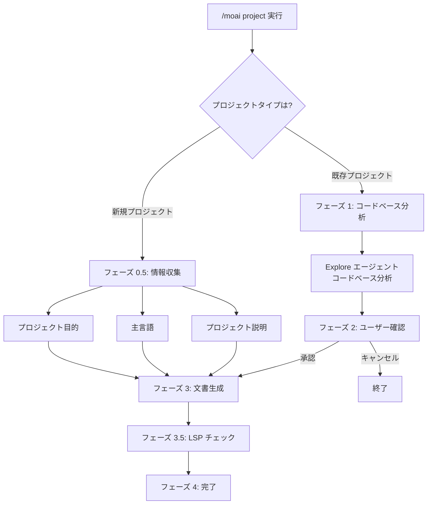
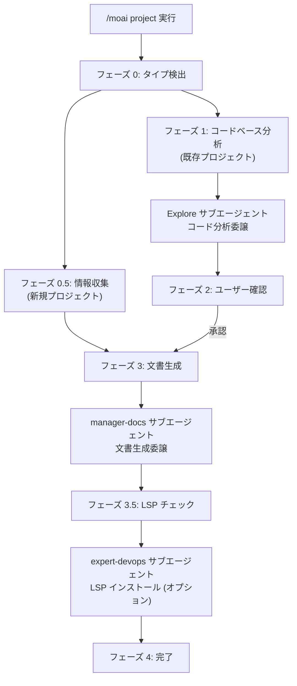

# /moai project

プロジェクトのコードベースを分析して、AI がプロジェクトを理解するために必要な基礎文書を自動生成します。


**スラッシュコマンド**: Claude Code で `/moai:project` と入力すると、このコマンドを直接実行できます。`/moai` だけ入力すると、利用可能なすべてのサブコマンドの一覧が表示されます。


## 概要

`/moai project` は MoAI-ADK ワークフローの **プロジェクト文書生成** コマンドです。プロジェクトのソースコード、設定ファイル、ディレクトリ構造を分析して、AI がプロジェクトを素早く理解できるように支援します。


**なぜプロジェクト文書が必要なのですか?**

Claude Code は新しい会話を開始するとき、プロジェクトについて何も知りません。
`/moai project` が作成した文書を通じて、AI は以下を理解できます:

- プロジェクトが **何をするか** (product.md)
- コードが **どのように構成されているか** (structure.md)
- どの **技術が使われているか** (tech.md)

これらの文書があって初めて、`/moai plan` や `/moai run` などの以降のコマンドで AI がプロジェクトコンテキストに合わせた正確な作業を実行できます。



## 使用方法

```bash
> /moai project
```

別の引数やオプションなしで実行すると、現在のプロジェクトディレクトリを自動的に分析します。

## 生成される文書

`/moai project` は `.moai/project/` ディレクトリの下に 3 つの文書を作成します:

```
.moai/
└── project/
    ├── product.md      # プロジェクト概要
    ├── structure.md    # ディレクトリ構造分析
    └── tech.md         # 技術スタック情報
```

### product.md - プロジェクト概要

プロジェクトのコア情報を含みます:

| 項目            | 説明                      | 例                           |
| --------------- | ------------------------- | ---------------------------- |
| **プロジェクト名** | プロジェクトの正式名称     | "MoAI-ADK"                   |
| **説明**         | プロジェクトがすること     | "AI ベース開発ツールキット"   |
| **ターゲットユーザー** | 誰のためのプロジェクトか | "Claude Code を使う開発者"    |
| **主な機能**     | 主な機能リスト             | "SPEC 作成、DDD 実装、文書自動化" |
| **プロジェクトステータス** | 現在の開発段階       | "v1.1.0、Production"         |

### structure.md - ディレクトリ構造

プロジェクトのファイルとフォルダ構成を分析します:

| 項目               | 説明                                      |
| ------------------ | ----------------------------------------- |
| **ディレクトリツリー** | 全体フォルダ構造を可視化               |
| **主なフォルダの目的** | 各フォルダの役割を説明                  |
| **モジュール構成**     | コアモジュール間の関係                 |
| **エントリーポイント**  | プログラム開始ファイル (main.py、index.ts など) |

### tech.md - 技術スタック

プロジェクトで使用されている技術情報を整理します:

| 項目                | 説明                | 例                          |
| ------------------- | ------------------- | --------------------------- |
| **プログラミング言語** | 使用言語とバージョン | "Python 3.12、TypeScript 5.5" |
| **フレームワーク**      | 主要フレームワーク     | "FastAPI 0.115、React 19"     |
| **データベース**        | DB 種類と ORM        | "PostgreSQL 16、SQLAlchemy"   |
| **ビルドツール**       | ビルドとパッケージ管理 | "Poetry、Vite"                |
| **デプロイ環境**       | ホスティングと CI/CD  | "Docker、GitHub Actions"      |

## 実行プロセス

`/moai project` はプロジェクトタイプに応じて異なるワークフローを実行します。

### 新規プロジェクト vs 既存プロジェクト



## 詳細ワークフロー

### フェーズ 0: プロジェクトタイプ検出

最初にプロジェクトタイプを確認します。


  **[HARD] ルール**: 最初にプロジェクトタイプを聞く必要があります。コードベース分析の前に、ユーザーにプロジェクト状況を確認します。


**質問**: どのタイプのプロジェクトですか?

| オプション            | 説明                                                   |
| ----------------- | ------------------------------------------------------ |
| **新規プロジェクト**   | 最初から始めるプロジェクト。情報収集形式で進行        |
| **既存プロジェクト** | 既にコードがあるプロジェクト。コードを自動的に分析     |

### フェーズ 0.5: 新規プロジェクト情報収集

新規プロジェクトの場合、以下の情報を収集します:

**質問 1 - プロジェクト目的**:

- **Web Application**: フロントエンド、バックエンド、またはフルスタック Web アプリ
- **API Service**: REST API、GraphQL、またはマイクロサービス
- **CLI Tool**: コマンドラインユーティリティまたは自動化ツール
- **Library/Package**: 再利用可能なコードライブラリまたは SDK

**質問 2 - 主言語**:

- **Python**: バックエンド、データサイエンス、自動化
- **TypeScript/JavaScript**: Web、Node.js、フロントエンド
- **Go**: 高パフォーマンスサービス、CLI ツール
- **Other**: Rust、Java、Ruby など (詳細な質問)

**質問 3 - プロジェクト説明** (自由入力):

- プロジェクト名
- 主な機能または目標
- ターゲットユーザー

収集された情報を基に初期文書を生成してフェーズ 4 に移動します。

### フェーズ 1: コードベース分析 (既存プロジェクト)

既存プロジェクトの場合、**Explore エージェント**に分析を委譲します。


  **エージェント委譲**: コードベース分析は Explore サブエージェントが実行します。MoAI は結果のみを収集してユーザーに表示します。


**分析目標**:

- **プロジェクト構造**: メインディレクトリ、エントリーポイント、アーキテクチャパターン
- **技術スタック**: 言語、フレームワーク、コア依存関係
- **主な機能**: 主な機能とビジネスロジックの場所
- **ビルドシステム**: ビルドツール、パッケージマネージャー、スクリプト

**Explore エージェント出力**:

- 検出された主言語
- 識別されたフレームワーク
- アーキテクチャパターン (MVC、Clean Architecture、Microservices など)
- 主ディレクトリマッピング (source、tests、config、docs)
- 依存関係カタログ
- エントリーポイント識別

### フェーズ 2: ユーザー確認

分析結果をユーザーに表示して承認を得ます。

**表示内容**:

- 検出された言語
- フレームワーク
- アーキテクチャ
- 主な機能リスト

**オプション**:

- **進行**: 文書生成を継続
- **詳細レビュー**: 最初に分析詳細をレビュー
- **キャンセル**: プロジェクト設定調整

### フェーズ 3: 文書生成

**manager-docs エージェント**に文書生成を委譲します。

**渡される内容**:

- フェーズ 1 分析結果 (またはフェーズ 0.5 ユーザー入力)
- フェーズ 2 ユーザー確認
- 出力ディレクトリ: `.moai/project/`
- 言語: config の conversation_language

**生成ファイル**:

| ファイル             | 内容                                                                     |
| ---------------- | ------------------------------------------------------------------------ |
| **product.md**   | プロジェクト名、説明、ターゲットユーザー、主な機能、ユースケース       |
| **structure.md** | ディレクトリツリー、各ディレクトリの目的、コアファイルの場所、モジュール構成 |
| **tech.md**      | 技術スタック概要、フレームワーク選択根拠、開発環境要件、ビルド/デプロイ設定 |

### フェーズ 3.5: 開発環境チェック

検出された技術スタックに適した LSP サーバーがインストールされているか確認します。

**言語別 LSP マッピング** (16 言語対応):

| 言語                  | LSP サーバー                   | チェックコマンド                        |
| --------------------- | ------------------------------ | -------------------------------------- |
| Python                | pyright または pylsp            | `which pyright`                        |
| TypeScript/JavaScript | typescript-language-server     | `which typescript-language-server`     |
| Go                    | gopls                          | `which gopls`                          |
| Rust                  | rust-analyzer                  | `which rust-analyzer`                  |
| Java                  | jdtls (Eclipse JDT)            | -                                      |
| Ruby                  | solargraph                     | `which solargraph`                     |
| PHP                   | intelephense                   | npm 経由で確認                        |
| C/C++                 | clangd                         | `which clangd`                         |
| Kotlin                | kotlin-language-server         | -                                      |
| Scala                 | metals                         | -                                      |
| Swift                 | sourcekit-lsp                  | -                                      |
| Elixir                | elixir-ls                      | -                                      |
| Dart/Flutter          | dart language-server           | Dart SDK に組み込み                     |
| C#                    | OmniSharp または csharp-ls     | -                                      |
| R                     | languageserver (R パッケージ)  | -                                      |
| Lua                   | lua-language-server            | -                                      |

**LSP 未インストール時のオプション**:

- **LSP なしで継続**: 完了まで進行
- **インストールガイド表示**: 検出された言語のセットアップガイドを表示
- **今すぐ自動インストール**: expert-devops エージェントでインストール (確認が必要)

### フェーズ 4: 完了

ユーザーの言語で完了メッセージを表示します。

- 生成ファイルリスト
- 場所: `.moai/project/`
- ステータス: 成功または一部完了

**次のステップオプション**:

- **SPEC 作成**: `/moai plan` で機能仕様を定義
- **文書レビュー**: 生成されたファイルを開いてレビュー
- **新規セッション開始**: コンテキストをクリアして新規開始

## いつ使用するか?

### 必ず実行すべき場合

- **新規プロジェクトに MoAI-ADK を初めて適用する時** - AI がプロジェクトを理解するための基礎文書が必要
- **既存プロジェクトに MoAI-ADK を導入する時** - 既にコードがあるプロジェクトでも文書を自動生成

### 再実行すると良い場合

- **プロジェクト構造が大きく変更された後** - ディレクトリ構造や技術スタックが変わった時
- **新しい主要技術を導入した後** - 例: データベース変更、フレームワーク追加
- **チームメンバーがプロジェクトに新しく参加する時** - 最新文書を基にオンボーディング


  `/moai project` は既存の文書を **上書き** します。手動で修正した内容がある場合は、実行前にバックアップしてください。


## 実践例

### 例 1: 新規プロジェクトで始める

#### ステップ 1: コマンド実行

最初にターミナルでプロジェクトを初期化して Claude Code を実行します。

```bash
# ターミナルでプロジェクト初期化
$ moai init my-api-project
$ cd my-api-project

# Claude Code でプロジェクト文書生成
> /moai project
```

#### ステップ 2: プロジェクトタイプ選択

新規プロジェクトなので「新規プロジェクト」を選択します。

```bash
AI: プロジェクトタイプを選択してください:
1. 新規プロジェクト (最初から始める)
2. 既存プロジェクト (コードがある)

User: 1
```

AI が新規プロジェクト情報収集モードに切り替わります。

#### ステップ 3: プロジェクト目的選択

プロジェクトの目的を選択します。

```bash
AI: プロジェクト目的を選択してください:
1. Web Application
2. API Service
3. CLI Tool
4. Library/Package

User: 2
```

API Service を選択して REST API サーバープロジェクトであることを指定します。

#### ステップ 4: 主言語選択

使用するプログラミング言語を選択します。

```bash
AI: 主言語を選択してください:
1. Python
2. TypeScript/JavaScript
3. Go
4. Other

User: 1
```

Python を選択してバックエンド API サーバー開発環境を構成します。

#### ステップ 5: プロジェクト詳細情報入力

プロジェクトに関する詳細情報を入力します。

```bash
AI: プロジェクトについて説明してください (名前、目標、ターゲットユーザー):

User: REST API サーバーです。ユーザー認証とデータ管理機能があります。開発者向けのツールです。
```

この情報は `product.md` 文書作成に使用されます。

#### ステップ 6: 文書生成完了

AI が収集された情報を基に自動的に文書を生成します。

```bash
[文書生成中...]

完了! .moai/project/ ディレクトリに 3 つの文書が作成されました。
```

生成された文書:

- `.moai/project/product.md` - プロジェクト概要
- `.moai/project/structure.md` - ディレクトリ構造
- `.moai/project/tech.md` - 技術スタック

### 例 2: 既存プロジェクトに MoAI-ADK を導入

#### ステップ 1: プロジェクトディレクトリ移動と初期化

既にコードがあるプロジェクトに移動して MoAI-ADK を初期化します。

```bash
# 既存プロジェクトディレクトリに移動
$ cd ~/projects/existing-api

# MoAI-ADK 初期化
$ moai init

# Claude Code でプロジェクト文書生成
> /moai project
```

#### ステップ 2: プロジェクトタイプ選択

既存プロジェクトであることを選択します。

```bash
AI: プロジェクトタイプを選択してください:
1. 新規プロジェクト (最初から始める)
2. 既存プロジェクト (コードがある)

User: 2
```

既存プロジェクトモードで進行してコードベース分析を開始します。

#### ステップ 3: コードベース自動分析

Explore エージェントが自動的にプロジェクトを分析します。

```bash
[Explore エージェントがコードベースを分析中...]

分析結果:
- 言語: Python 3.12
- フレームワーク: FastAPI 0.115
- データベース: PostgreSQL 16
- アーキテクチャ: Clean Architecture
- 主な機能:
  * ユーザー認証
  * データ CRUD
  * API エンドポイント管理
```

エージェントがプロジェクト構造、依存関係、パターンを自動的に識別します。

#### ステップ 4: 分析結果確認

分析結果をレビューして文書生成を承認します。

```bash
この分析で文書を生成しますか?
1. 進行
2. 詳細レビュー
3. キャンセル

User: 1
```

分析結果が正確であれば「進行」を選択して文書生成を継続します。

#### ステップ 5: 文書生成

manager-docs エージェントが分析結果を基に文書を生成します。

```bash
[manager-docs エージェントが文書生成中...]

完了! 以下のファイルが作成されました:
- .moai/project/product.md
- .moai/project/structure.md
- .moai/project/tech.md
```

各文書はプロジェクトの異なる側面を文書化します。

#### ステップ 6: LSP チェックと完了

開発環境が正しく構成されているか確認します。

```bash
LSP サーバー 'pyright' がインストールされています。

次のステップを選択してください:
1. SPEC 作成 (/moai plan)
2. 文書レビュー
3. 新規セッション開始
```

LSP サーバーがインストールされているので、すぐに開発を開始できます。

### 例 3: プロジェクト文書生成後のワークフロー進行

#### ステップ 1: プロジェクト文書生成 (最初のみ)

プロジェクトを最初に設定する時に文書を生成します。

```bash
> /moai project
```

このステップはプロジェクトごとに 1 回だけで済みます。

#### ステップ 2: SPEC 作成

プロジェクト文書が生成されれば、AI はプロジェクトを理解した状態です。

```bash
> /moai plan "ユーザー認証機能の実装"
```

AI はプロジェクトの技術スタックと構造を既に知っているため、より正確な SPEC を作成できます。


  `/moai project` は通常プロジェクトごとに **1-2 回** 実行するだけで済みます。毎回実行する必要はなく、プロジェクト構造が大きく変わった時だけ再度実行してください。


## エージェントチェイン



## よくある質問

### Q: プロジェクト文書なしで `/moai plan` を実行するとどうなりますか?

SPEC は作成できますが、AI がプロジェクトの技術スタックや構造を知らないため **不正確な技術的判断** をする可能性があります。常に `/moai project` を最初に実行することをお勧めします。

### Q: 非公開コードも分析しますか?

`/moai project` は **ローカル環境のみ** で動作します。コードは外部サーバーに送信されず、生成された文書も `.moai/project/` ディレクトリにローカル保存されます。

### Q: モノレポプロジェクトでも動作しますか?

はい、モノレポ構造もサポートしています。ルートディレクトリから実行するとプロジェクト全体の構造を分析します。

### Q: LSP サーバーがないとどうなりますか?

LSP サーバーがなくても文書生成は進行します。ただし、以降の `/moai run` フェーズでのコード品質診断が制限される可能性があります。フェーズ 3.5 で LSP インストールガイドを提供します。

## 関連ドキュメント

- [クイックスタート](/getting-started/quickstart) - 完全ワークフローチュートリアル
- [/moai plan](./moai-1-plan) - 次のステップ: SPEC 文書作成
- [SPEC ベース開発](/core-concepts/spec-based-dev) - SPEC 方法論詳細説明
- [サブエージェントカタログ](/advanced/agent-guide) - Explore、manager-docs エージェント詳細
