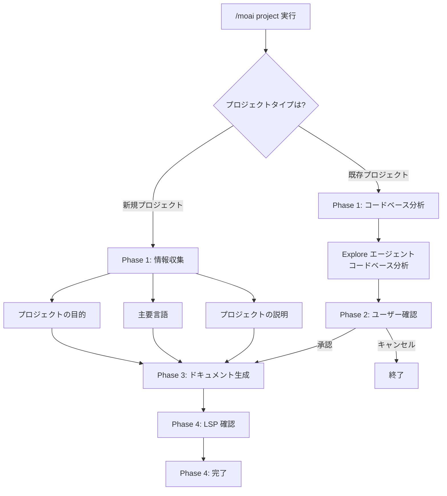
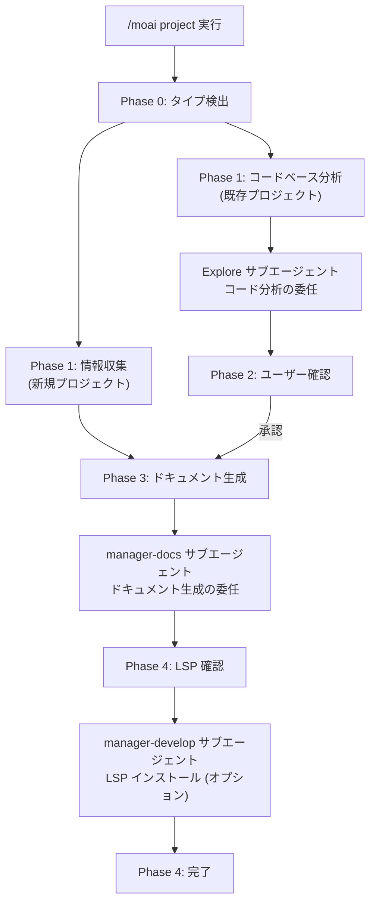

プロジェクトのコードベースを分析し、AI がプロジェクトを理解するために必要な基礎ドキュメントを自動生成します。


**スラッシュコマンド**: Claude Code で `/moai:project` と入力すると、このコマンドをすぐに実行できます。`/moai` だけを入力すると、使用可能なすべてのサブコマンドの一覧が表示されます。


## 概要

`/moai project` は MoAI-ADK ワークフローの **プロジェクトドキュメント生成** コマンドです。プロジェクトのソースコード、設定ファイル、ディレクトリ構造を分析し、AI がプロジェクトを素早く理解できるよう支援します。

エージェンティックハーネスの観点で見ると、このコマンドはハーネスの **基礎工事** です。エージェントが毎セッションでコードベースをゼロから把握し直す代わりに、プロジェクト知識をファイルとして固定しておくこと — ファイルベースの永続記憶がハーネス設計の基本パターンであり、`/moai project` がその出発点を作ります。毎セッション繰り返される探索コストをドキュメント 1 回の生成で置き換えるという点で、トークノミクス効果もあります。


**なぜプロジェクトドキュメントが必要なのか?**

Claude Code は新しい会話を始めるとき、プロジェクトについて何も知りません。
`/moai project` が生成したドキュメントを通じて、AI は次を理解します:

- このプロジェクトが **何をするのか** (product.md)
- コードが **どのように構成されているのか** (structure.md)
- どんな **技術を使っているのか** (tech.md)

このドキュメントがあってこそ、`/moai plan`、`/moai run` などの以降のコマンドで AI がプロジェクトの
コンテキストに合った正確な作業を行えます。



## 使い方

```bash
> /moai project
```

引数やオプションなしで実行すると、現在のプロジェクトディレクトリを自動で分析します。

## 生成されるドキュメント

`/moai project` は `.moai/project/` ディレクトリ配下に 3 つのドキュメントを生成します:

```
.moai/
└── project/
    ├── product.md      # プロジェクト概要
    ├── structure.md    # ディレクトリ構造の分析
    └── tech.md         # 技術スタック情報
```

ドキュメント生成とともに、プロジェクトに合った **ハーネスの自動構成** もこのコマンドの役割です — 分析された技術スタックをもとに、プロジェクト専用のエージェントチーム (ハーネス) を併せて構成できます。ハーネス生成の詳細は [/moai harness](./moai-harness) を参照してください。

### product.md - プロジェクト概要

プロジェクトの中核情報を含みます:

| 項目              | 説明                     | 例                               |
| ----------------- | ------------------------ | ---------------------------------- |
| **プロジェクト名** | プロジェクトの正式名称     | "MoAI-ADK"                         |
| **説明**          | プロジェクトが行うこと       | "AI ベースの開発ツールキット"           |
| **ターゲットユーザー**   | 誰のためのプロジェクトか | "Claude Code を使う開発者"    |
| **中核機能**     | 主要機能の一覧           | "SPEC 生成、DDD 実装、ドキュメント自動化" |
| **プロジェクト状態** | 現在の開発段階           | "v1.1.0, Production"               |

### structure.md - ディレクトリ構造

プロジェクトのファイルとフォルダの構成を分析します:

| 項目               | 説明                                      |
| ------------------ | ----------------------------------------- |
| **ディレクトリツリー**  | 全体フォルダ構造の可視化                     |
| **主要フォルダの目的** | 各フォルダが果たす役割の説明                  |
| **モジュール構成**      | 中核モジュール間の関係                         |
| **エントリーポイント**         | プログラムの開始ファイル (main.py, index.ts など) |

### tech.md - 技術スタック

プロジェクトで使用する技術情報を整理します:

| 項目                | 説明                | 例                          |
| ------------------- | ------------------- | ----------------------------- |
| **プログラミング言語** | 使用言語とバージョン   | "Python 3.12, TypeScript 5.5" |
| **フレームワーク**      | 主要フレームワーク     | "FastAPI 0.115, React 19"     |
| **データベース**    | DB の種類と ORM      | "PostgreSQL 16, SQLAlchemy"   |
| **ビルドツール**       | ビルドとパッケージ管理 | "Poetry, Vite"                |
| **デプロイ環境**       | ホスティングと CI/CD     | "Docker, GitHub Actions"      |

## 実行プロセス

`/moai project` はプロジェクトタイプに応じて異なるワークフローを実行します。

### 新規プロジェクト vs 既存プロジェクト


```mermaid
flowchart TD
    Start["/moai project 実行"] --> Q1{プロジェクトタイプは?}

    Q1 -->|新規プロジェクト| New["Phase 1: 情報収集"]
    Q1 -->|既存プロジェクト| Exist["Phase 1: コードベース分析"]

    New --> NewQ["プロジェクトの目的"]
    New --> NewL["主要言語"]
    New --> NewD["プロジェクトの説明"]

    NewQ --> Gen["Phase 3: ドキュメント生成"]
    NewL --> Gen
    NewD --> Gen

    Exist --> Exp["Explore エージェント<br/>コードベース分析"]
    Exp --> Conf["Phase 2: ユーザー確認"]

    Conf -->|承認| Gen
    Conf -->|キャンセル| End["終了"]

    Gen --> LSP["Phase 4: LSP 確認"]
    LSP --> Complete["Phase 4: 完了"]
```

## 詳細ワークフロー

### Phase 0: プロジェクトタイプの検出

まず最初にプロジェクトタイプを確認します。


  **[HARD] ルール**: プロジェクトタイプを先に尋ねる必要があります。コードベース分析の前に
  ユーザーにプロジェクトの状況を確認します。


**質問**: どのタイプのプロジェクトですか?

| オプション              | 説明                                                 |
| ----------------- | ---------------------------------------------------- |
| **新規プロジェクト** | ゼロから始めるプロジェクト。情報を収集形式で進行 |
| **既存プロジェクト** | すでにコードがあるプロジェクト。コードを自動で分析      |

### Phase 1: 新規プロジェクトの情報収集

新規プロジェクトを選択した場合、次の情報を収集します:

**質問 1 - プロジェクトの目的**:

- **Web Application**: フロントエンド、バックエンド、またはフルスタック Web アプリ
- **API Service**: REST API、GraphQL、またはマイクロサービス
- **CLI Tool**: コマンドラインユーティリティまたは自動化ツール
- **Library/Package**: 再利用可能なコードライブラリまたは SDK

**質問 2 - 主要言語**:

- **Python**: バックエンド、データサイエンス、自動化
- **TypeScript/JavaScript**: Web、Node.js、フロントエンド
- **Go**: 高性能サービス、CLI ツール
- **Other**: Rust、Java、Ruby など (詳細質問)

**質問 3 - プロジェクトの説明** (自由入力):

- プロジェクト名
- 主要機能または目標
- ターゲットユーザー

収集された情報をもとに初期ドキュメントを生成し、Phase 4 へ移動します。

### Phase 1: コードベース分析 (既存プロジェクト)

既存プロジェクトを選択した場合、**Explore エージェント** に分析を委任します。


  **エージェント委任**: コードベース分析は Explore サブエージェントが行います。
  MoAI は結果のみを収集してユーザーに提示します。


**分析目標**:

- **プロジェクト構造**: メインディレクトリ、エントリーポイント、アーキテクチャパターン
- **技術スタック**: 言語、フレームワーク、中核依存関係
- **中核機能**: 主要機能とビジネスロジックの位置
- **ビルドシステム**: ビルドツール、パッケージマネージャー、スクリプト

**Explore エージェントの出力**:

- 検出された基本言語
- 識別されたフレームワーク
- アーキテクチャパターン (MVC, Clean Architecture, Microservices など)
- 主要ディレクトリのマッピング (source, tests, config, docs)
- 依存関係カタログ
- エントリーポイントの識別

### Phase 2: ユーザー確認

分析結果をユーザーに提示し、承認を得ます。

**表示内容**:

- 検出された言語
- フレームワーク
- アーキテクチャ
- 中核機能の一覧

**オプション**:

- **進行**: ドキュメント生成を続行
- **詳細レビュー**: 分析の詳細を先にレビュー
- **キャンセル**: プロジェクト設定の調整

### Phase 3: ドキュメント生成

**manager-docs エージェント** にドキュメント生成を委任します。

**伝達内容**:

- Phase 1 の分析結果 (または Phase 1 のユーザー入力)
- Phase 2 のユーザー確認
- 出力ディレクトリ: `.moai/project/`
- 言語: config の conversation_language

**生成ファイル**:

| ファイル             | 内容                                                                     |
| ---------------- | ------------------------------------------------------------------------ |
| **product.md**   | プロジェクト名、説明、ターゲットユーザー、中核機能、ユースケース                  |
| **structure.md** | ディレクトリツリー、各ディレクトリの目的、中核ファイルの位置、モジュール構成             |
| **tech.md**      | 技術スタックの概要、フレームワーク選択の根拠、開発環境の要件、ビルド/デプロイ設定 |

### Phase 4: 開発環境の確認

検出された技術スタックに合った LSP サーバーがインストールされているかを確認します。

**言語別 LSP マッピング** (16 言語対応):

| 言語                  | LSP サーバー                   | 確認コマンド                        |
| --------------------- | -------------------------- | ---------------------------------- |
| Python                | pyright または pylsp         | `which pyright`                    |
| TypeScript/JavaScript | typescript-language-server | `which typescript-language-server` |
| Go                    | gopls                      | `which gopls`                      |
| Rust                  | rust-analyzer              | `which rust-analyzer`              |
| Java                  | jdtls (Eclipse JDT)        | -                                  |
| Ruby                  | solargraph                 | `which solargraph`                 |
| PHP                   | intelephense               | npm 経由で確認                      |
| C/C++                 | clangd                     | `which clangd`                     |
| Kotlin                | kotlin-language-server     | -                                  |
| Scala                 | metals                     | -                                  |
| Swift                 | sourcekit-lsp              | -                                  |
| Elixir                | elixir-ls                  | -                                  |
| Dart/Flutter          | dart language-server       | Dart SDK 内蔵                      |
| C#                    | OmniSharp または csharp-ls   | -                                  |
| R                     | languageserver (R パッケージ)  | -                                  |
| Lua                   | lua-language-server        | -                                  |

**LSP 未インストール時のオプション**:

- **LSP なしで継続**: 完了まで進行
- **インストール案内の表示**: 検出された言語の設定ガイドを表示
- **今すぐ自動インストール**: manager-develop エージェントでインストール (確認が必要)

### Phase 4: 完了

ユーザーの言語で完了メッセージを表示します。

- 生成されたファイルの一覧
- 場所: `.moai/project/`
- 状態: 成功または部分完了

**次のステップのオプション**:

- **SPEC 作成**: `/moai plan` で機能仕様を定義
- **ドキュメントのレビュー**: 生成されたファイルを開いてレビュー
- **新しいセッションを開始**: コンテキストをクリアして新しく開始

## いつ使うのか?

### 必ず実行すべきケース

- **新規プロジェクトに MoAI-ADK を初めて適用するとき** - AI がプロジェクトを理解する基礎ドキュメントが必要です
- **既存プロジェクトに MoAI-ADK を導入するとき** - すでにコードがあるプロジェクトでもドキュメントを自動生成します

### 再実行するとよいケース

- **プロジェクト構造が大きく変わった後** - ディレクトリ構造や技術スタックが変わったとき
- **新しい主要技術を導入した後** - 例: データベース変更、フレームワーク追加
- **メンバーがプロジェクトに新しく参加するとき** - 最新ドキュメントに基づくオンボーディング


  `/moai project` は既存のドキュメントを **上書きします**。手動で修正した内容があれば、
  実行前にバックアップしてください。


## 実践例

### 例 1: 新規プロジェクトで開始

#### ステップ 1: コマンド実行

まずターミナルでプロジェクトを初期化し、Claude Code を起動します。

```bash
# ターミナルでプロジェクトを初期化
$ moai init my-api-project
$ cd my-api-project

# Claude Code でプロジェクトドキュメントを生成
> /moai project
```

#### ステップ 2: プロジェクトタイプの選択

新しいプロジェクトなので「新規プロジェクト」を選択します。

```bash
AI: プロジェクトタイプを選択してください:
1. 新規プロジェクト (ゼロから開始)
2. 既存プロジェクト (コードがある)

User: 1
```

AI が新規プロジェクトの情報収集モードに切り替わります。

#### ステップ 3: プロジェクトの目的の選択

プロジェクトの目的を選択します。

```bash
AI: プロジェクトの目的を選択してください:
1. Web Application
2. API Service
3. CLI Tool
4. Library/Package

User: 2
```

API Service を選択して REST API サーバープロジェクトであることを指定します。

#### ステップ 4: 主要言語の選択

使用するプログラミング言語を選択します。

```bash
AI: 主要言語を選択してください:
1. Python
2. TypeScript/JavaScript
3. Go
4. Other

User: 1
```

Python を選択してバックエンド API サーバーの開発環境を構成します。

#### ステップ 5: プロジェクトの詳細情報の入力

プロジェクトについての詳しい情報を入力します。

```bash
AI: プロジェクトについて説明してください (名前、目標、ターゲットユーザー):

User: REST API サーバーです。ユーザー認証とデータ管理機能があります。開発者向けのツールです。
```

この情報は `product.md` ドキュメントの生成に使用されます。

#### ステップ 6: ドキュメント生成の完了

AI が収集した情報をもとに自動でドキュメントを生成します。

```bash
[ドキュメント生成中...]

完了! .moai/project/ ディレクトリに 3 つのドキュメントが生成されました。
```

生成されたドキュメント:

- `.moai/project/product.md` - プロジェクト概要
- `.moai/project/structure.md` - ディレクトリ構造
- `.moai/project/tech.md` - 技術スタック

### 例 2: 既存プロジェクトへの MoAI-ADK 導入

#### ステップ 1: プロジェクトディレクトリへの移動と初期化

すでにコードがあるプロジェクトへ移動し、MoAI-ADK を初期化します。

```bash
# 既存のプロジェクトディレクトリへ移動
$ cd ~/projects/existing-api

# MoAI-ADK の初期化
$ moai init

# Claude Code でプロジェクトドキュメントを生成
> /moai project
```

#### ステップ 2: プロジェクトタイプの選択

既存プロジェクトであることを選択します。

```bash
AI: プロジェクトタイプを選択してください:
1. 新規プロジェクト (ゼロから開始)
2. 既存プロジェクト (コードがある)

User: 2
```

既存プロジェクトモードで進み、コードベース分析を開始します。

#### ステップ 3: コードベースの自動分析

Explore エージェントが自動でプロジェクトを分析します。

```bash
[Explore エージェントがコードベースを分析中...]

分析結果:
- 言語: Python 3.12
- フレームワーク: FastAPI 0.115
- データベース: PostgreSQL 16
- アーキテクチャ: Clean Architecture
- 中核機能:
  * ユーザー認証
  * データ CRUD
  * API エンドポイント管理
```

エージェントがプロジェクト構造、依存関係、パターンを自動で把握します。

#### ステップ 4: 分析結果の確認

分析結果をレビューしてドキュメント生成を承認します。

```bash
この分析でドキュメントを生成しますか?
1. 進行
2. 詳細レビュー
3. キャンセル

User: 1
```

分析結果が正確であれば「進行」を選択してドキュメント生成を続けます。

#### ステップ 5: ドキュメント生成

manager-docs エージェントが分析結果をもとにドキュメントを生成します。

```bash
[manager-docs エージェントがドキュメント生成中...]

完了! 次のファイルが生成されました:
- .moai/project/product.md
- .moai/project/structure.md
- .moai/project/tech.md
```

各ドキュメントはプロジェクトの異なる側面をドキュメント化します。

#### ステップ 6: LSP 確認と完了

開発環境が適切に構成されているかを確認します。

```bash
LSP サーバー 'pyright' がインストールされています。

次のステップを選択してください:
1. SPEC 作成 (/moai plan)
2. ドキュメントのレビュー
3. 新しいセッションを開始
```

LSP サーバーがインストールされているため、すぐに開発を始められます。

### 例 3: プロジェクトドキュメント生成後のワークフロー進行

#### ステップ 1: プロジェクトドキュメントの生成 (初回 1 回)

プロジェクトを初めて設定するときにドキュメントを生成します。

```bash
> /moai project
```

このステップはプロジェクトごとに 1 回だけ実行すれば十分です。

#### ステップ 2: SPEC の生成

プロジェクトドキュメントが生成されていれば、AI はプロジェクトを理解した状態です。

```bash
> /moai plan "ユーザー認証機能の実装"
```

AI がプロジェクトの技術スタックと構造をすでに知っているため、より正確な SPEC を生成できます。


  `/moai project` はプロジェクトごとに通常 **1-2 回** 実行すれば十分です。毎回実行する
  必要はなく、プロジェクト構造が大きく変わった場合にのみ再実行してください。


## エージェントチェーン


```mermaid
flowchart TD
    Start["/moai project 実行"] --> Phase0["Phase 0: タイプ検出"]
    Phase0 --> Phase05["Phase 1: 情報収集<br/>(新規プロジェクト)"]
    Phase0 --> Phase1["Phase 1: コードベース分析<br/>(既存プロジェクト)"]

    Phase1 --> Explore["Explore サブエージェント<br/>コード分析の委任"]
    Explore --> Phase2["Phase 2: ユーザー確認"]

    Phase05 --> Phase3["Phase 3: ドキュメント生成"]
    Phase2 -->|承認| Phase3

    Phase3 --> Docs["manager-docs サブエージェント<br/>ドキュメント生成の委任"]
    Docs --> Phase35["Phase 4: LSP 確認"]

    Phase35 --> DevOps["manager-develop サブエージェント<br/>LSP インストール (オプション)"]
    DevOps --> Phase4["Phase 4: 完了"]
```

## よくある質問

### Q: プロジェクトドキュメントなしで `/moai plan` を実行するとどうなりますか?

SPEC を生成することはできますが、AI がプロジェクトの技術スタックや構造を知らないため、**不正確な技術的判断** をする可能性があります。常に `/moai project` を先に実行することを推奨します。

### Q: 非公開コードも分析しますか?

`/moai project` は **ローカル環境でのみ** 動作します。コードが外部サーバーに送信されることはなく、生成されたドキュメントも `.moai/project/` ディレクトリにローカル保存されます。

### Q: モノレポプロジェクトでも動作しますか?

はい、モノレポ構造もサポートします。ルートディレクトリで実行するとプロジェクト全体の構造を分析します。

### Q: LSP サーバーがない場合はどうなりますか?

LSP サーバーがなくてもドキュメント生成は進行します。ただし、以降の `/moai run` 段階でコード品質診断が制限されることがあります。Phase 4 で LSP のインストール案内を提供します。

## 関連ドキュメント

- [クイックスタート](/getting-started/quickstart) - 全体ワークフローのチュートリアル
- [/moai plan](./moai-plan) - 次の段階: SPEC ドキュメント生成
- [/moai harness](./moai-harness) - プロジェクト専用ハーネスの生成
- [SPEC ベース開発](/core-concepts/spec-based-dev) - SPEC 方法論の詳細説明
- [サブエージェントカタログ](/advanced/agent-guide) - Explore、manager-docs エージェントの詳細
