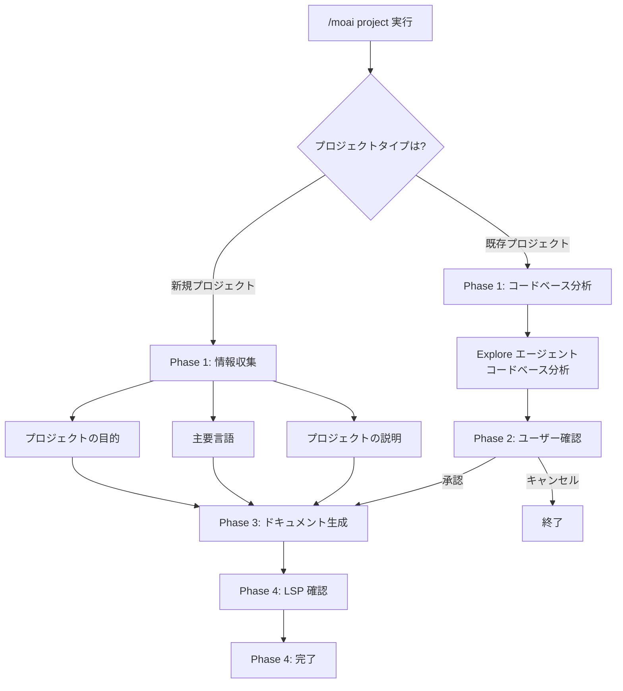
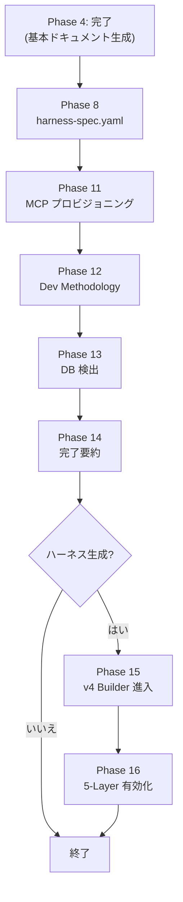
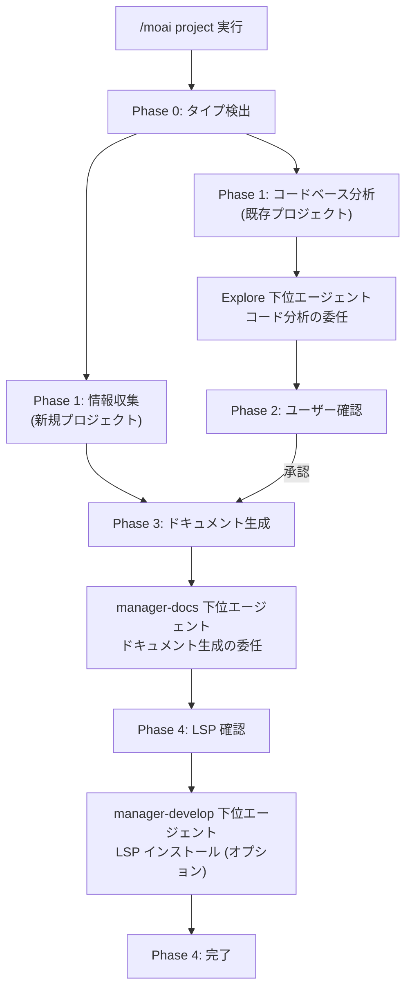

プロジェクトのコードベースを分析して、AI がプロジェクトを理解するために必要な基礎ドキュメントを自動的に生成します。


**スラッシュコマンド**: Claude Code で `/moai:project` と入力すると、このコマンドをすぐに実行できます。`/moai` だけ入力すると、利用可能なすべてのサブコマンド一覧が表示されます。


## 概要

`/moai project` は MoAI-ADK ワークフローの **プロジェクトドキュメント生成** コマンドです。プロジェクトのソースコード、設定ファイル、ディレクトリ構造を分析して、AI がプロジェクトを素早く理解できるよう助けます。

エージェンティックハーネスの観点で見ると、このコマンドはハーネスの **基礎工事** です。エージェントが毎セッションでコードベースを最初から把握し直すのではなく、プロジェクトの知識をファイルに固定しておくこと — ファイルベースの永続記憶がハーネス設計の基本パターンで、`/moai project` がその出発点を作ります。毎セッション繰り返される探索コストをドキュメント 1 回の生成で置き換える点でトークノミクス効果もあります。


**なぜプロジェクトドキュメントが必要ですか?**

Claude Code は新しい対話を始めるときプロジェクトについて何も知りません。
`/moai project` が生成したドキュメントを通じて AI は次を理解するようになります:

- このプロジェクトが **何をするか** (product.md)
- コードが **どう構成されているか** (structure.md)
- どんな **技術を使うか** (tech.md)

このドキュメントがあってこそ `/moai plan`、`/moai run` などの以降のコマンドで AI がプロジェクトの
文脈に合った正確な作業を行えます。



## 使い方

```bash
> /moai project
```

引数やオプションなしで実行すると、現在のプロジェクトディレクトリを自動的に分析します。

## 生成されるドキュメント

`/moai project` は `.moai/project/` ディレクトリの下に 3 つのドキュメントを生成します:

```
.moai/
└── project/
    ├── product.md      # プロジェクト概要
    ├── structure.md    # ディレクトリ構造分析
    └── tech.md         # 技術スタック情報
```

ドキュメント生成とともにプロジェクトに合った **ハーネスの自動構成** もこのコマンドの役割です — 分析された技術スタックを基にプロジェクト専用のエージェントチーム (ハーネス) を一緒に構成できます。ハーネス生成の詳細は [/moai harness](./moai-harness) を参照してください。

### product.md - プロジェクト概要

プロジェクトの核心情報を込めています:

| 項目              | 説明                     | 例                               |
| ----------------- | ------------------------ | ---------------------------------- |
| **プロジェクト名** | プロジェクトの公式名称     | "MoAI-ADK"                         |
| **説明**          | プロジェクトがすること       | "AI ベースの開発ツールキット"           |
| **ターゲットユーザー**   | 誰のためのプロジェクトか | "Claude Code を使う開発者"    |
| **核心機能**     | 主要機能の一覧           | "SPEC 生成、DDD 実装、ドキュメント自動化" |
| **プロジェクト状態** | 現在の開発ステップ           | "v1.1.0, Production"               |

### structure.md - ディレクトリ構造

プロジェクトのファイルおよびフォルダ構成を分析します:

| 項目               | 説明                                      |
| ------------------ | ----------------------------------------- |
| **ディレクトリツリー**  | フォルダ構造全体の可視化                     |
| **主要フォルダの目的** | 各フォルダが果たす役割の説明                  |
| **モジュール構成**      | 核心モジュール間の関係                         |
| **進入点**         | プログラム開始ファイル (main.py, index.ts など) |

### tech.md - 技術スタック

プロジェクトで使う技術情報を整理します:

| 項目                | 説明                | 例                          |
| ------------------- | ------------------- | ----------------------------- |
| **プログラミング言語** | 使用言語およびバージョン   | "Python 3.12, TypeScript 5.5" |
| **フレームワーク**      | 主要フレームワーク     | "FastAPI 0.115, React 19"     |
| **データベース**    | DB の種類および ORM      | "PostgreSQL 16, SQLAlchemy"   |
| **ビルドツール**       | ビルドおよびパッケージ管理 | "Poetry, Vite"                |
| **デプロイ環境**       | ホスティングおよび CI/CD     | "Docker, GitHub Actions"      |

## 実行プロセス

`/moai project` はプロジェクトタイプに応じて異なるワークフローを実行します。

### 新規プロジェクト vs 既存プロジェクト


```mermaid
flowchart TD
    Start["/moai project 実行"] --> Q1{プロジェクトタイプは?}

    Q1 -->|新規プロジェクト| New["Phase 1: 情報収集"]
    Q1 -->|既存プロジェクト| Exist["Phase 1: コードベース分析"]

    New --> NewQ["プロジェクトの目的"]
    New --> NewL["主要言語"]
    New --> NewD["プロジェクトの説明"]

    NewQ --> Gen["Phase 3: ドキュメント生成"]
    NewL --> Gen
    NewD --> Gen

    Exist --> Exp["Explore エージェント<br/>コードベース分析"]
    Exp --> Conf["Phase 2: ユーザー確認"]

    Conf -->|承認| Gen
    Conf -->|キャンセル| End["終了"]

    Gen --> LSP["Phase 4: LSP 確認"]
    LSP --> Complete["Phase 4: 完了"]
```

## 詳細ワークフロー

### Phase 0: プロジェクトタイプの検出

最初にプロジェクトタイプを確認します。


  **[HARD] ルール**: プロジェクトタイプを先に尋ねる必要があります。コードベース分析の前に
  ユーザーにプロジェクトの状況を確認します。


**質問**: どのタイプのプロジェクトですか?

| オプション              | 説明                                                 |
| ----------------- | ---------------------------------------------------- |
| **新規プロジェクト** | 最初から始めるプロジェクト。情報を収集する形式で進行 |
| **既存プロジェクト** | すでにコードがあるプロジェクト。コードを自動的に分析      |

### Phase 1: 新規プロジェクトの情報収集

新規プロジェクトを選んだ場合、次の情報を収集します:

**質問 1 - プロジェクトの目的**:

- **Web Application**: フロントエンド、バックエンド、またはフルスタックの Web アプリ
- **API Service**: REST API、GraphQL、またはマイクロサービス
- **CLI Tool**: コマンドラインユーティリティまたは自動化ツール
- **Library/Package**: 再利用可能なコードライブラリまたは SDK

**質問 2 - 主要言語**:

- **Python**: バックエンド、データサイエンス、自動化
- **TypeScript/JavaScript**: Web、Node.js、フロントエンド
- **Go**: 高性能サービス、CLI ツール
- **Other**: Rust, Java, Ruby など (詳細質問)

**質問 3 - プロジェクトの説明** (自由入力):

- プロジェクト名
- 主要機能または目標
- ターゲットユーザー

収集された情報を基に初期ドキュメントを生成し Phase 4 へ移動します。

### Phase 1: コードベース分析 (既存プロジェクト)

既存プロジェクトを選んだ場合、**Explore エージェント** に分析を委任します。


  **エージェント委任**: コードベース分析は Explore 下位エージェントが行います。
  MoAI は結果だけを収集してユーザーに見せます。


**分析目標**:

- **プロジェクト構造**: メインディレクトリ、進入点、アーキテクチャパターン
- **技術スタック**: 言語、フレームワーク、核心依存性
- **核心機能**: 主要機能とビジネスロジックの場所
- **ビルドシステム**: ビルドツール、パッケージマネージャー、スクリプト

**Explore エージェントの出力**:

- 検出された基本言語
- 識別されたフレームワーク
- アーキテクチャパターン (MVC, Clean Architecture, Microservices など)
- 主要ディレクトリのマッピング (source, tests, config, docs)
- 依存性カタログ
- 進入点の識別

### Phase 2: ユーザー確認

分析結果をユーザーに見せて承認を受けます。

**表示内容**:

- 検出された言語
- フレームワーク
- アーキテクチャ
- 核心機能の一覧

**オプション**:

- **進行**: ドキュメント生成を続けて進行
- **詳細レビュー**: 分析の詳細を先にレビュー
- **キャンセル**: プロジェクト設定の調整

### Phase 3: ドキュメント生成

**manager-docs エージェント** にドキュメント生成を委任します。

**伝達内容**:

- Phase 1 の分析結果 (または Phase 1 のユーザー入力)
- Phase 2 のユーザー確認
- 出力ディレクトリ: `.moai/project/`
- 言語: config の conversation_language

**生成ファイル**:

| ファイル             | 内容                                                                     |
| ---------------- | ------------------------------------------------------------------------ |
| **product.md**   | プロジェクト名、説明、ターゲットユーザー、核心機能、ユースケース                  |
| **structure.md** | ディレクトリツリー、各ディレクトリの目的、核心ファイルの場所、モジュール構成             |
| **tech.md**      | 技術スタック概要、フレームワーク選択の根拠、開発環境要件、ビルド/デプロイ設定 |

### Phase 4: 開発環境の確認

検出された技術スタックに合った LSP サーバーがインストールされているか確認します。

**言語別 LSP マッピング** (16 言語対応):

| 言語                  | LSP サーバー                   | 確認コマンド                        |
| --------------------- | -------------------------- | ---------------------------------- |
| Python                | pyright または pylsp         | `which pyright`                    |
| TypeScript/JavaScript | typescript-language-server | `which typescript-language-server` |
| Go                    | gopls                      | `which gopls`                      |
| Rust                  | rust-analyzer              | `which rust-analyzer`              |
| Java                  | jdtls (Eclipse JDT)        | -                                  |
| Ruby                  | solargraph                 | `which solargraph`                 |
| PHP                   | intelephense               | npm を通じて確認                      |
| C/C++                 | clangd                     | `which clangd`                     |
| Kotlin                | kotlin-language-server     | -                                  |
| Scala                 | metals                     | -                                  |
| Swift                 | sourcekit-lsp              | -                                  |
| Elixir                | elixir-ls                  | -                                  |
| Flutter               | dart language-server       | Dart SDK 内蔵                      |
| C#                    | OmniSharp または csharp-ls   | -                                  |
| R                     | languageserver (R パッケージ)  | -                                  |

**LSP 未インストール時のオプション**:

- **LSP なしで継続**: 完了まで進行
- **インストール案内の表示**: 検出された言語の設定ガイドを表示
- **今すぐ自動インストール**: manager-develop エージェントでインストール (確認が必要)

### Phase 4: 完了

ユーザーの言語で完了メッセージを表示します。

- 生成されたファイルの一覧
- 場所: `.moai/project/`
- 状態: 成功または部分完了

**次のステップのオプション**:

- **SPEC 作成**: `/moai plan` で機能仕様書を定義
- **ドキュメントレビュー**: 生成されたファイルを開いてレビュー
- **新しいセッション開始**: コンテキストを消して新しく開始

## 拡張ステップ (Phase 8-16)

基本ドキュメント生成 (Phase 0-4) の後、`/moai project` はプロジェクト環境を総合的に構成する拡張ステップを行います。


```mermaid
flowchart TD
    A["Phase 4: 完了<br/>(基本ドキュメント生成)"] --> B["Phase 8<br/>harness-spec.yaml"]
    B --> C["Phase 11<br/>MCP プロビジョニング"]
    C --> D["Phase 12<br/>Dev Methodology"]
    D --> E["Phase 13<br/>DB 検出"]
    E --> F["Phase 14<br/>完了要約"]
    F --> G{"ハーネス生成?"}
    G -->|はい| H["Phase 15<br/>v4 Builder 進入"]
    H --> I["Phase 16<br/>5-Layer 有効化"]
    G -->|いいえ| J["終了"]
    I --> J
```

### Phase 8: harness-spec.yaml ブリッジ

インタビューの回答から `.moai/project/harness-spec.yaml` を生成します。このファイルは 8 フィールドのスキーマでプロジェクトの文脈をハーネスビルダーに伝えるブリッジの役割をします — ユーザー相互作用なしに interview.md の回答から自動抽出されます。

### Phase 11: MCP サーバーのプロビジョニング

技術スタックを検出し `mcp-matrix.yaml` から適切な MCP サーバーを選択します。オーケストレーター承認後に `.mcp.json` に追加記録 (additive write) — 既存の MCP 設定を上書きしません。

### Phase 13: DB 検出

Grep/Glob で DB キーワードを検出して `db-detection.json` を生成します。対応 DB エンジンのカテゴリ:

- **Relational/SQL**: PostgreSQL, MySQL, MariaDB, SQLite, Oracle, SQL Server, CockroachDB, Supabase, Neon, Planetscale
- **NoSQL Document**: MongoDB, Firestore, Firebase, Couchbase
- **NoSQL Key-Value**: Redis, DynamoDB, Cassandra, ScyllaDB, Riak
- **Search/Analytics**: Elasticsearch, ClickHouse, Snowflake, InfluxDB

### Phase 15-16: v4 Builder 連携

Phase 15 は v4 ハーネスビルダーにリダイレクトします — Context-First Discovery + オーケストレーター直接の 4-phase Builder (ANALYZE → PLAN → GENERATE → ACTIVATE) がハーネスを生成します。Phase 16 は CLAUDE.md マーカーのインストール + main.md ルーターの登録で 5-Layer 有効化を行い、生成後に smoke gate を実行します。


Phase 15-16 は選択ステップです — `/moai project` 実行時にハーネス生成が必要なら進行し、そうでなければ Phase 14 で完了します。


## いつ使うか?

### 必ず実行すべき場合

- **新しいプロジェクトに MoAI-ADK を初めて適用するとき** - AI がプロジェクトを理解する基礎ドキュメントが必要です
- **既存プロジェクトに MoAI-ADK を導入するとき** - すでにコードがあるプロジェクトでもドキュメントを自動生成します

### 再実行すると良い場合

- **プロジェクト構造が大きく変わった後** - ディレクトリ構造や技術スタックが変わったとき
- **新しい主要技術を導入した後** - 例: データベース変更、フレームワーク追加
- **チームメンバーがプロジェクトに新しく参加するとき** - 最新のドキュメントを基にオンボーディング


  `/moai project` は既存のドキュメントを **上書きします**。手動で修正した内容があれば
  実行前にバックアップしてください。


## 実践例

### 例 1: 新しいプロジェクトで始める

#### ステップ 1: コマンド実行

まずターミナルでプロジェクトを初期化して Claude Code を実行します。

```bash
# ターミナルでプロジェクト初期化
$ moai init my-api-project
$ cd my-api-project

# Claude Code でプロジェクトドキュメント生成
> /moai project
```

#### ステップ 2: プロジェクトタイプの選択

新しいプロジェクトなので「新規プロジェクト」を選択します。

```bash
AI: プロジェクトタイプを選択してください:
1. 新規プロジェクト (最初から始める)
2. 既存プロジェクト (コードがある)

User: 1
```

AI が新規プロジェクトの情報収集モードに切り替わります。

#### ステップ 3: プロジェクトの目的の選択

プロジェクトの目的を選択します。

```bash
AI: プロジェクトの目的を選択してください:
1. Web Application
2. API Service
3. CLI Tool
4. Library/Package

User: 2
```

API Service を選択して REST API サーバープロジェクトであることを指定します。

#### ステップ 4: 主要言語の選択

使うプログラミング言語を選択します。

```bash
AI: 主要言語を選択してください:
1. Python
2. TypeScript/JavaScript
3. Go
4. Other

User: 1
```

Python を選択してバックエンド API サーバー開発環境を構成します。

#### ステップ 5: プロジェクト詳細情報の入力

プロジェクトについての詳しい情報を入力します。

```bash
AI: プロジェクトについて説明してください (名前、目標、ターゲットユーザー):

User: REST API サーバーです。ユーザー認証とデータ管理機能があります。開発者のためのツールです。
```

この情報は `product.md` ドキュメント生成に使われます。

#### ステップ 6: ドキュメント生成完了

AI が収集された情報を基に自動的にドキュメントを生成します。

```bash
[ドキュメント生成中...]

完了! .moai/project/ ディレクトリに 3 つのドキュメントが生成されました。
```

生成されたドキュメント:

- `.moai/project/product.md` - プロジェクト概要
- `.moai/project/structure.md` - ディレクトリ構造
- `.moai/project/tech.md` - 技術スタック

### 例 2: 既存プロジェクトへの MoAI-ADK 導入

#### ステップ 1: プロジェクトディレクトリへの移動および初期化

すでにコードがあるプロジェクトに移動して MoAI-ADK を初期化します。

```bash
# すでにあるプロジェクトディレクトリへ移動
$ cd ~/projects/existing-api

# MoAI-ADK 初期化
$ moai init

# Claude Code でプロジェクトドキュメント生成
> /moai project
```

#### ステップ 2: プロジェクトタイプの選択

既存プロジェクトであることを選択します。

```bash
AI: プロジェクトタイプを選択してください:
1. 新規プロジェクト (最初から始める)
2. 既存プロジェクト (コードがある)

User: 2
```

既存プロジェクトモードで進行してコードベース分析を開始します。

#### ステップ 3: コードベースの自動分析

Explore エージェントが自動的にプロジェクトを分析します。

```bash
[Explore エージェントがコードベースを分析中...]

分析結果:
- 言語: Python 3.12
- フレームワーク: FastAPI 0.115
- データベース: PostgreSQL 16
- アーキテクチャ: Clean Architecture
- 核心機能:
  * ユーザー認証
  * データ CRUD
  * API エンドポイント管理
```

エージェントがプロジェクト構造、依存性、パターンを自動的に把握します。

#### ステップ 4: 分析結果の確認

分析結果をレビューしてドキュメント生成を承認します。

```bash
この分析でドキュメントを生成しますか?
1. 進行
2. 詳細レビュー
3. キャンセル

User: 1
```

分析結果が正確なら「進行」を選択してドキュメント生成を続けます。

#### ステップ 5: ドキュメント生成

manager-docs エージェントが分析結果を基にドキュメントを生成します。

```bash
[manager-docs エージェントがドキュメント生成中...]

完了! 次のファイルが生成されました:
- .moai/project/product.md
- .moai/project/structure.md
- .moai/project/tech.md
```

各ドキュメントはプロジェクトの異なる側面をドキュメント化します。

#### ステップ 6: LSP 確認および完了

開発環境がきちんと構成されているか確認します。

```bash
LSP サーバー 'pyright' がインストールされています。

次のステップを選択してください:
1. SPEC 作成 (/moai plan)
2. ドキュメントレビュー
3. 新しいセッション開始
```

LSP サーバーがインストールされているのですぐに開発を始められます。

### 例 3: プロジェクトドキュメント生成後のワークフロー進行

#### ステップ 1: プロジェクトドキュメント生成 (最初の 1 回)

プロジェクトを初めて設定するときにドキュメントを生成します。

```bash
> /moai project
```

このステップはプロジェクトあたり 1 回だけ行えばよいです。

#### ステップ 2: SPEC 生成

プロジェクトドキュメントが生成されれば AI がプロジェクトを理解した状態です。

```bash
> /moai plan "ユーザー認証機能の実装"
```

AI がプロジェクトの技術スタックと構造をすでに知っているのでより正確な SPEC を生成できます。


  `/moai project` はプロジェクトあたり通常 **1-2 回** だけ実行すればよいです。毎回実行する
  必要はなく、プロジェクト構造が大きく変わった場合にのみ再実行してください。


## エージェントチェーン


```mermaid
flowchart TD
    Start["/moai project 実行"] --> Phase0["Phase 0: タイプ検出"]
    Phase0 --> Phase05["Phase 1: 情報収集<br/>(新規プロジェクト)"]
    Phase0 --> Phase1["Phase 1: コードベース分析<br/>(既存プロジェクト)"]

    Phase1 --> Explore["Explore 下位エージェント<br/>コード分析の委任"]
    Explore --> Phase2["Phase 2: ユーザー確認"]

    Phase05 --> Phase3["Phase 3: ドキュメント生成"]
    Phase2 -->|承認| Phase3

    Phase3 --> Docs["manager-docs 下位エージェント<br/>ドキュメント生成の委任"]
    Docs --> Phase35["Phase 4: LSP 確認"]

    Phase35 --> DevOps["manager-develop 下位エージェント<br/>LSP インストール (オプション)"]
    DevOps --> Phase4["Phase 4: 完了"]
```

## よくある質問

### Q: プロジェクトドキュメントなしで `/moai plan` を実行するとどうなりますか?

SPEC を生成することはできますが、AI がプロジェクトの技術スタックや構造を知らないため **不正確な技術的判断** をすることがあります。常に `/moai project` を先に実行することを推奨します。

### Q: 非公開コードも分析しますか?

`/moai project` は **ローカル環境でのみ** 動作します。コードが外部サーバーに送信されず、生成されたドキュメントも `.moai/project/` ディレクトリにローカルで保存されます。

### Q: モノレポプロジェクトでも動作しますか?

はい、モノレポ構造も対応します。ルートディレクトリで実行するとプロジェクト構造全体を分析します。

### Q: LSP サーバーがなければどうなりますか?

LSP サーバーがなくてもドキュメント生成は進行します。ただし、以降の `/moai run` ステップでコード品質診断が制限されることがあります。Phase 4 で LSP インストールの案内を提供します。

## 関連ドキュメント

- [クイックスタート](/getting-started/quickstart) - ワークフロー全体のチュートリアル
- [/moai plan](./moai-plan) - 次のステップ: SPEC ドキュメント生成
- [/moai harness](./moai-harness) - プロジェクト専用ハーネスの生成
- [SPEC ベース開発](/core-concepts/spec-based-dev) - SPEC 方法論の詳細説明
- [下位エージェントカタログ](/advanced/agent-guide) - Explore, manager-docs エージェントの詳細
