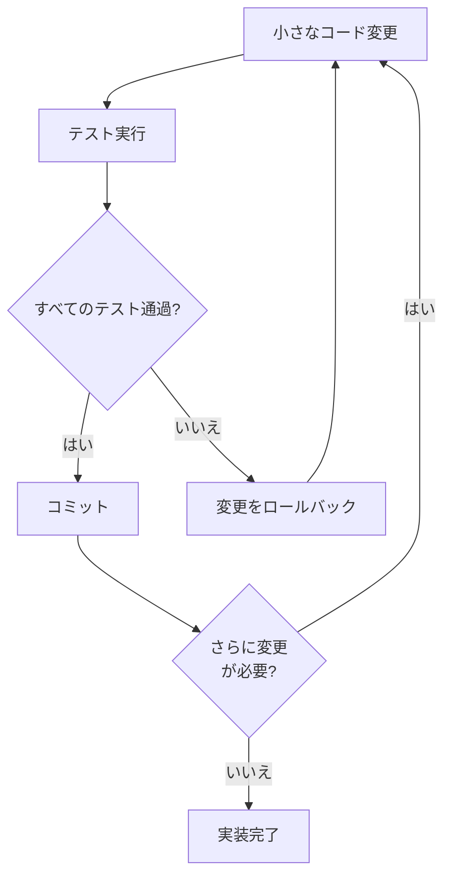
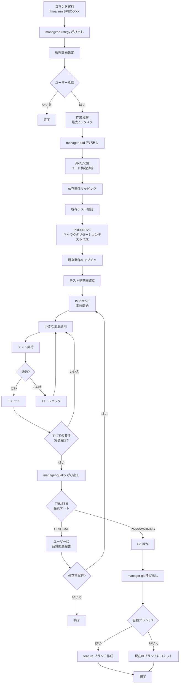

SPEC 文書を基に DDD (Domain-Driven Development) 方法でコードを実装します。


**スラッシュコマンド**: Claude Code で `/moai:run` と入力すると、このコマンドを直接実行できます。`/moai` だけ入力すると、利用可能なすべてのサブコマンドの一覧が表示されます。


## 概要

`/moai run` は MoAI-ADK ワークフローの **フェーズ 2 (Run)** コマンドです。フェーズ 1 で作成された SPEC 文書を読み、**ANALYZE-PRESERVE-IMPROVE** サイクルを通じて既存の機能を壊さずに安全にコードを実装します。内部的には **manager-ddd** エージェントが全プロセスを管理します。


**家のリフォームで理解する DDD**

DDL の ANALYZE-PRESERVE-IMPROVE サイクルは **家のリフォーム** のようなものです:

| フェーズ         | 比喩                | 実際の作業                       |
| ------------ | ------------------- | ------------------------------- |
| **ANALYZE**  | 家の点検            | 現在のコード構造と問題点を理解    |
| **PRESERVE** | 現在の状態を写真に撮る | キャラクタリゼーションテストで既存の動作を記録  |
| **IMPROVE**  | 部屋を一つずつリフォーム   | テストが通るように少しずつ改善   |

一度に家全体を取り壊すのは危険なように、コードも **少しずつ変更して毎回確認** するのが安全です。



## 使用方法

Plan フェーズで作成された SPEC ID を引数として渡します:

```bash
# Plan フェーズ完了後に必ず /clear を実行
> /clear

# SPEC ID を指定して実装開始
> /moai run SPEC-AUTH-001
```


  `/moai run` を実行する前に必ず `/clear` を実行してください。Plan フェーズで使用したトークンをクリアして、Run フェーズで **200K トークンを十分に活用** できるようにする必要があります。


## サポートされるフラグ

| フラグ              | 説明                  | 例                               |
| ------------------- | --------------------- | -------------------------------- |
| `--resume SPEC-XXX` | 中断された実装作業を再開 | `/moai run --resume SPEC-AUTH-001` |
| `--team`            | Agent Teams モードを強制 | `/moai run SPEC-AUTH-001 --team`   |
| `--solo`            | サブエージェントモードを強制 | `/moai run SPEC-AUTH-001 --solo`   |

**再開機能:**

再実行時に最後の成功したフェーズチェックポイントから作業を継続します。

## DDD サイクル

`/moai run` は **ANALYZE -> PRESERVE -> IMPROVE** の 3 つのフェーズを順番に実行します。各フェーズで何が起こるか詳しく見てみましょう。

### 1. ANALYZE (分析)

既存のコードを読み、SPEC 要件と比較して何をするべきかを把握します。

**分析項目:**

| 項目        | 説明                 | 例                               |
| ----------- | -------------------- | -------------------------------- |
| コード構造   | ファイル、モジュール、依存関係   | "auth.py が user_service.py に依存"      |
| ドメイン境界 | ビジネスロジックの範囲     | "認証ドメインとユーザードメインを分離" |
| テスト現状   | 既存のテストカバレッジ     | "現在 45% カバレッジ"                |
| 技術的負債   | 改善が必要な部分       | "SQL Injection 脆弱性発見"        |

### 2. PRESERVE (保存)

既存のコードの現在の動作を **キャラクタリゼーションテスト** として記録します。このテストはリファクタリング後にも既存の機能がそのまま動作するかを確認する **安全網** の役割を果たします。


**キャラクタリゼーションテストとは?**

「このコードが正しいか間違っているか」を判断するのではなく、**「現在このように動いている」を記録** することです。

例えば、既存のログイン関数が成功時に `{"status": "success"}` を返すなら、この動作をテストとして記録します。後でコードを変更してこのテストが失敗したら、「既存の動作が変わった」ことをすぐに知ることができます。



### 3. IMPROVE (改善)

SPEC 要件に従って **小さな単位で** コードを変更し、毎回テストを実行して既存の動作が保持されていることを確認します。

**核心原則: 小さな変更 + 毎回の検証**



## 実行プロセス

`/moai run` が内部的に実行する全プロセスです:



## フェーズ別詳細

### フェーズ 1: 分析と計画

**manager-strategy** サブエージェントが以下のタスクを実行します:

- SPEC 文書の完全分析
- 要件と成功基準の抽出
- 実装フェーズと個別タスクの識別
- 技術スタックと依存関係要件の決定
- 複雑度と作業量の見積もり
- 段階的アプローチの詳細実行戦略作成

**出力:** plan_summary、requirements リスト、success_criteria、effort_estimate を含む実行計画

### フェーズ 1.5: 作業分解

承認された実行計画を原子でレビュー可能なタスクに分解します:

**タスク構造:**

- **Task ID**: SPEC 内での連番 (TASK-001、TASK-002 など)
- **Description**: 明確なタスク記述
- **Requirement Mapping**: 満たす SPEC 要件
- **Dependencies**: 前提タスクリスト
- **Acceptance Criteria**: 完了検証方法

**制約:** SPEC 当たり最大 10 タスク。それ以上必要な場合は SPEC 分割を推奨

### フェーズ 2: DDD 実装

**manager-ddd** サブエージェントが ANALYZE-PRESERVE-IMPROVE サイクルを実行します:

**要件:**

- タスク追跡の初期化
- 完全な ANALYZE-PRESERVE-IMPROVE サイクル実行
- 各変換後に既存テスト通過検証
- カバレッジがないコードパスにキャラクタリゼーションテスト作成
- テストカバレッジ 85% 以上達成

**出力:** files_modified、characterization_tests_created、test_results、behavior_preserved、structural_metrics

### フェーズ 2.5: 品質検証

**manager-quality** サブエージェントが TRUST 5 検証を実行します:

| TRUST 5 柱  | 検証項目                          |
| ------------- | ---------------------------------- |
| **Tested**    | テストが存在して通過、DDD 規律維持 |
| **Readable**  | プロジェクトルール準拠、文書含む      |
| **Unified**   | 既存プロジェクトパターンに従う            |
| **Secured**   | セキュリティ脆弱性なし、OWASP 準拠       |
| **Trackable** | 明確なコミットメッセージ、履歴分析対応 |

**追加検証:**

- テストカバレッジ 85% 以上
- 動作保存: 既存テスト変更なしで通過
- キャラクタリゼーションテスト通過: 動作スナップショット一致
- 構造的改善: 結合度と凝集度メトリクス改善

**出力:** trust_5_validation 結果、coverage_percentage、overall_status (PASS/WARNING/CRITICAL)、issues_found

### フェーズ 3: Git 操作 (条件付き)

**manager-git** サブエージェントが Git 自動化を実行します:

**実行条件:**

- quality_status が PASS または WARNING
- git_strategy.automation.auto_branch が true なら feature ブランチ作成
- auto_branch が false なら現在のブランチに直接コミット

### フェーズ 4: 完了と案内

ユーザーに以下のオプションを提示します:

| オプション           | 説明                                  |
| -------------- | ------------------------------------- |
| 文書同期    | `/moai sync` を実行して文書と PR を作成 |
| 他の機能実装 | `/moai plan` で追加 SPEC を作成       |
| 結果レビュー      | ローカルで実装とテストカバレッジを確認 |
| 完了           | セッション終了                             |

## 品質ゲート

実装完了時、以下の品質基準をすべて満たす必要があります:

| 項目            | 基準         | 説明                                 |
| --------------- | ------------ | ------------------------------------ |
| LSP エラー       | **0 個**      | タイプチェッカー、リンターエラーなし            |
| タイプエラー      | **0 個**      | pyright、mypy、tsc などタイプエラーなし |
| リンターエラー     | **0 個**      | ruff、eslint などリンターエラーなし       |
| テストカバレッジ | **85% 以上** | コードテストカバレッジ目標            |
| 動作保存       | **100%**     | すべてのキャラクタリゼーションテスト通過      |



**85% カバレッジが必要な理由**

100% ではなく 85% を目標とする理由

**100% は非現実的** であり、無意味なテストが追加される可能性があります。**85% ならコアロジック** は大部分テストされます。残り 15% は設定ファイル、エラーハンドラーなどテストが難しいコードです。



## 実践例

### 例: SPEC-AUTH-001 実装

**ステップ 1: Plan フェーズで SPEC 作成完了**

```bash
> /moai plan "JWT ベースのユーザー認証: サインアップ、ログイン、トークンリフレッシュ"
# SPEC-AUTH-001 作成完了
```

**ステップ 2: トークンクリア後に実装開始**

```bash
> /clear
> /moai run SPEC-AUTH-001
```

**ステップ 3: manager-ddd が自動的に実行するタスク**

manager-ddd エージェントが SPEC を実装するために実行する 4 つのフェーズです。

---

#### フェーズ 1: 戦略計画

SPEC 文書を分析して実装戦略を策定します。

```bash
フェーズ 1: 戦略計画
- SPEC 文書分析完了
- 要件 5 つ抽出
- 7 つのタスクに分解 (TASK-001 ~ TASK-007)
- 想定複雑度: 中程度
```

---

#### フェーズ 1.5: 作業分解

実装作業を詳細単位に分割します。

```bash
フェーズ 1.5: 作業分解
- TASK-001: ユーザーモデル定義
- TASK-002: パスワードハッシュユーティリティ
- TASK-003: JWT トークン生成/検証
- TASK-004: サインアップ API
- TASK-005: ログイン API
- TASK-006: トークンリフレッシュ API
- TASK-007: 入力検証ミドルウェア
```

---

#### フェーズ 2: DDD 実装

ANALYZE-PRESERVE-IMPROVE サイクルで安全に実装します。

**ANALYZE フェーズ** - 既存コードを理解します:

```bash
ANALYZE フェーズ:
- 既存コード構造分析: src/auth/ (4 ファイル)
- テストカバレッジ確認: 現在 32%
- 依存関係マッピング: bcrypt、PyJWT、SQLAlchemy
```

**PRESERVE フェーズ** - 既存動作を保護します:

```bash
PRESERVE フェーズ:
- キャラクタリゼーションテスト 12 件作成
- 既存動作キャプチャ完了
- テスト基準線確立: 32%
```

**IMPROVE フェーズ** - 段階的に実装します:

```bash
IMPROVE フェーズ:
- イテレーション 1: TASK-001 ユーザーモデル (テスト通過)
- イテレーション 2: TASK-002 パスワードハッシュ (テスト通過)
- イテレーション 3: TASK-003 JWT トークン (テスト通過)
- イテレーション 4: TASK-004 サインアップ API (テスト通過)
- イテレーション 5: TASK-005 ログイン API (テスト通過)
- イテレーション 6: TASK-006 トークンリフレッシュ (テスト通過)
- イテレーション 7: TASK-007 入力検証 (テスト通過)
```

---

#### フェーズ 2.5: 品質検証

TRUST 5 柱で品質を検証します。

```bash
フェーズ 2.5: 品質検証
- TRUST 5 柱すべて通過
- テストカバレッジ: 89%
- LSP エラー: 0 個
- タイプエラー: 0 個
- キャラクタリゼーションテスト: 12/12 通過
- 新規テスト: 24/24 通過
- ステータス: PASS
```

---

#### フェーズ 3: Git 操作

Conventional Commits でコミットを作成します。

```bash
フェーズ 3: Git 操作
- ブランチ: feature/SPEC-AUTH-001
- コミット 7 件作成 (Conventional Commits)
```

---

#### フェーズ 4: 完了

実装完了時に次のステップへ案内します。

```bash
フェーズ 4: 完了
- 実装完了
- 次のステップ: /moai sync
```

**ステップ 4: 実装完了後に Sync フェーズへ移動**

```bash
> /clear
> /moai sync SPEC-AUTH-001
```

## よくある質問

### Q: 新規プロジェクトで既存コードがない場合、PRESERVE フェーズはどうなりますか?

既存コードがない場合、PRESERVE フェーズは **素早く通過** します。新しいコードに対するテストは IMPROVE フェーズで一緒に作成されます。

### Q: 実装中にトークンが不足したらどうなりますか?

manager-ddd エージェントが **自動的に進行状況を保存** します。`/clear` 後にもう一度 `/moai run SPEC-XXX` を実行すると、SPEC 文書を基に作業を継続できます。

### Q: テストカバレッジ 85% を達成するのが難しい場合は?

`quality.yaml` でカバレッジ目標を調整できますが、**推奨しません**。
85% はコアロジックがテストされたことを保証する最低基準です。カバレッジが不足している場合、manager-ddd が不足しているテストを自動的に追加します。

### Q: フェーズ 2.5 で CRITICAL ステータスが出たらどうなりますか?

ユーザーに品質問題を報告し、修正を再試行するか尋ねます。「はい」を選択すると IMPROVE フェーズに戻って修正を継続します。

### Q: `/moai run` と `/moai` の違いは何ですか?

`/moai run` は **既に作成された SPEC を基に実装のみ** を実行します。`/moai` は SPEC 作成から実装、文書化まで **全ワークフロー** を自動的に実行します。

## 関連ドキュメント

- [ドメイン駆動開発](/core-concepts/ddd) - ANALYZE-PRESERVE-IMPROVE サイクル詳細説明
- [TRUST 5 品質システム](/core-concepts/trust-5) - 品質ゲート詳細説明
- [/moai plan](./moai-1-plan) - 前のフェーズ: SPEC 文書作成
- [/moai sync](./moai-3-sync) - 次のフェーズ: 文書同期と PR
