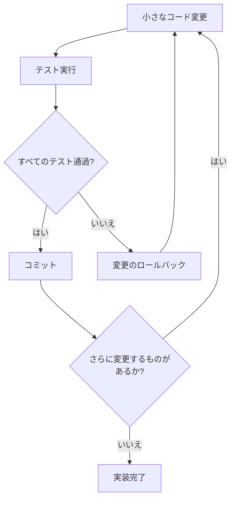
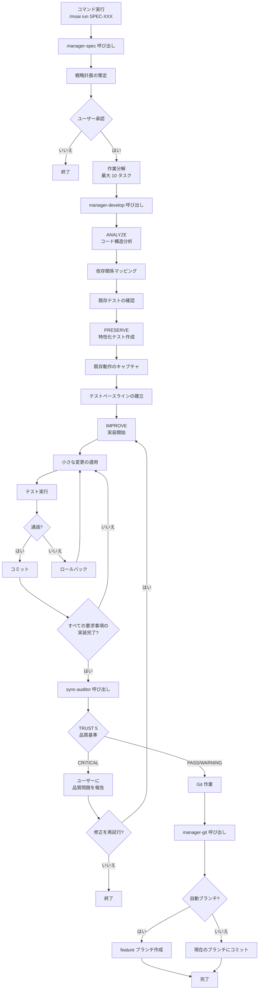

SPEC ドキュメントに基づいてコードを実装する Run 段階のコマンドです。プロジェクトの状態に応じて TDD (RED-GREEN-REFACTOR) または DDD (ANALYZE-PRESERVE-IMPROVE) サイクルが適用され、このドキュメントは既存コードを安全に改善する DDD サイクルを中心に説明します。


**スラッシュコマンド**: Claude Code で `/moai:run` と入力すると、このコマンドをすぐに実行できます。`/moai` だけを入力すると、使用可能なすべてのサブコマンドの一覧が表示されます。


## 概要

`/moai run` は MoAI-ADK ワークフローの **Phase 2 (Run)** コマンドです。Phase 1 で生成された SPEC ドキュメントを読み、**ANALYZE-PRESERVE-IMPROVE** サイクルを通じて既存機能を壊さずに安全にコードを実装します。内部では **manager-develop** エージェントが全工程を管理します。

実装段階は 3-Phase パイプラインでトークンが最も多くかかる段階です。そのため v3 トークノミクス設計がこの段階に集中的に組み込まれています — SPEC 要約版 (`spec-compact.md`) の自動ロードで ~30% のトークンを節約し、SPEC の複雑度に応じて検証の深さを調整する Harness Level Routing が不要な監査コストを減らし、進捗がファイルとして保存されるためセッションが切れても続きから作業できます。


**DDD を家のリモデリングで理解する**

DDD の ANALYZE-PRESERVE-IMPROVE サイクルは **家のリモデリング** と同じです:

| 段階         | たとえ                | 実際の作業                       |
| ------------ | ------------------- | ------------------------------- |
| **ANALYZE**  | 家の点検         | 現在のコード構造と問題点の把握    |
| **PRESERVE** | 現状の写真を撮る | 特性化テストで既存の動作を記録  |
| **IMPROVE**  | 部屋を 1 つずつリモデリング  | テストを通しながら少しずつ改善 |

一度に家全体を壊すと危険なように、コードも **少しずつ変えながら毎回確認** するのが安全です。



## 使い方

Plan 段階で生成された SPEC ID を引数として渡します:

```bash
# Plan 段階完了後、必ず /clear を実行
> /clear

# SPEC ID を指定して実装開始
> /moai run SPEC-AUTH-001
```


  `/moai run` 実行前に必ず `/clear` を実行してください。Plan 段階で使った
  トークンを整理してこそ、Run 段階で **200K トークンをまるごと活用** できます。


## サポートされるフラグ

| フラグ              | 説明                  | 例                               |
| ------------------- | --------------------- | ---------------------------------- |
| `--resume SPEC-XXX` | 中断された実装作業の再開 | `/moai run --resume SPEC-AUTH-001` |
| `--team`            | エージェントチームモードを強制 | `/moai run SPEC-AUTH-001 --team`   |
| `--solo`            | サブエージェントモードを強制 | `/moai run SPEC-AUTH-001 --solo`   |

**Resume 機能:**

再実行時、最後に成功した段階のチェックポイントから続きの作業を行います。

## DDD サイクル

`/moai run` は **ANALYZE -> PRESERVE -> IMPROVE** の 3 段階を順に実行します。各段階で何が起きるのかを詳しく見ていきましょう。

### 1. ANALYZE (分析)

既存コードを読み、SPEC 要求事項と比較して何をすべきかを把握します。

**分析項目:**

| 項目        | 説明                 | 例                               |
| ----------- | -------------------- | ---------------------------------- |
| コード構造   | ファイル、モジュール、依存関係   | 「auth.py が user_service.py に依存」 |
| ドメイン境界 | ビジネスロジックの範囲 | 「認証ドメインとユーザードメインの分離」 |
| テスト状況 | 既存のテストカバレッジ | 「現在 45% カバレッジ」                |
| 技術的負債   | 改善が必要な箇所   | 「SQL Injection 脆弱性を発見」        |

### 2. PRESERVE (保存)

既存コードの現在の動作を **特性化テスト** として記録します。このテストはリファクタリング後も既存機能がそのまま動作するかを確認する **セーフティネット** の役割を果たします。


**特性化テストとは?**

「このコードが正しいか間違っているか」を判断するのではなく、**「現在このように動作する」を
記録** するものです。

たとえば、既存のログイン関数が成功時に `{"status": "success"}` を返すなら、この
動作をテストとして記録します。後でコードを変えたときにこのテストが失敗すれば、「既存の
動作が変わった」ことがすぐに分かります。



### 3. IMPROVE (改善)

SPEC 要求事項に従って **小さな単位で** コードを変更し、毎回テストを実行して既存の動作が保存されているかを確認します。

**中核原則: 小さな変更 + 毎回検証**


```mermaid
flowchart TD
    A["小さなコード変更"] --> B["テスト実行"]
    B --> C{"すべてのテスト通過?"}
    C -->|はい| D["コミット"]
    D --> E{"さらに変更するものが<br/>あるか?"}
    E -->|はい| A
    E -->|いいえ| F["実装完了"]
    C -->|いいえ| G["変更のロールバック"]
    G --> A
```

## 実行プロセス

`/moai run` が内部的に実行する全体プロセスです:


```mermaid
flowchart TD
    A["コマンド実行<br/>/moai run SPEC-XXX"] --> B["manager-spec 呼び出し"]
    B --> C["戦略計画の策定"]

    C --> D{"ユーザー承認"}
    D -->|いいえ| E["終了"]
    D -->|はい| F["作業分解<br/>最大 10 タスク"]

    F --> G["manager-develop 呼び出し"]
    G --> H["ANALYZE<br/>コード構造分析"]
    H --> I["依存関係マッピング"]
    I --> J["既存テストの確認"]

    J --> K["PRESERVE<br/>特性化テスト作成"]
    K --> L["既存動作のキャプチャ"]
    L --> M["テストベースラインの確立"]

    M --> N["IMPROVE<br/>実装開始"]
    N --> O["小さな変更の適用"]
    O --> P["テスト実行"]
    P --> Q{"通過?"}
    Q -->|はい| R["コミット"]
    R --> S{"すべての要求事項の<br/>実装完了?"}
    S -->|いいえ| O
    S -->|はい| T["sync-auditor 呼び出し"]

    Q -->|いいえ| U["ロールバック"]
    U --> O

    T --> V{"TRUST 5<br/>品質基準"}
    V -->|CRITICAL| W["ユーザーに<br/>品質問題を報告"]
    V -->|PASS/WARNING| X["Git 作業"]

    W --> Y{"修正を再試行?"}
    Y -->|はい| N
    Y -->|いいえ| Z["終了"]

    X --> AA["manager-git 呼び出し"]
    AA --> AB{"自動ブランチ?"}
    AB -->|はい| AC["feature ブランチ作成"]
    AB -->|いいえ| AD["現在のブランチにコミット"]
    AC --> AE["完了"]
    AD --> AE
```

## 段階別の詳細

### Phase 3: JIT Language Detection (言語の自動検出)

プロジェクトの主要言語を自動検出し、エージェントのスポーン時に適切な言語スキルを注入します。16 言語を同等にサポートします。

| 検出ファイル | 言語スキル |
|-----------|-----------|
| `go.mod` | moai-lang-go |
| `package.json` (typescript) | moai-lang-typescript |
| `pyproject.toml` | moai-lang-python |
| `Cargo.toml` | moai-lang-rust |
| `pom.xml` / `build.gradle` | moai-lang-java |

### Phase 4: Scale-Based Mode Selection (規模ベースのモード選択)

SPEC の規模に応じて最適な実行モードを自動選択します。小さな作業に重いパイプラインを回さないこと — これもトークノミクスです。

| パターン | 基準 | 実行モード |
|------|------|-----------|
| バグ修正 | ファイル ≤ 3、単一ドメイン | **Fix Mode** |
| 単一機能 | ファイル ≤ 5、単一ドメイン | **Focused Mode** |
| ドメイン内機能 | ファイル 5-10 | **Standard Mode** |
| マルチドメイン | ファイル ≥ 10 またはドメイン ≥ 3 | **Full Pipeline** |
| 大規模変更 | complexity ≥ 7 + --team | **Team Mode** |

### Harness Level Routing (品質の深さのルーティング)

Run phase 開始時、SPEC の複雑度に応じて品質パイプラインの深さを自動決定します。

| レベル | 対象 | evaluator | スキップする Phase |
|------|------|-----------|---------------|
| **minimal** | 単純なバグ修正、設定変更 | 非アクティブ | 0, 0.5, 2.0, 2.5, 2.75, 2.8a |
| **standard** | 一般的な機能開発 (デフォルト) | final-pass (Phase 16 のみ) | なし |
| **thorough** | セキュリティ/決済など重要機能 | per-sprint (Phase 10 + 2.8a) | なし |

失敗時は自動エスカレーション: minimal → standard → thorough (最大 2 回)

### Phase 1: 分析と計画

**manager-spec** サブエージェントが次の作業を行います:

- SPEC ドキュメントの完全な分析
- 要求事項と成功基準の抽出
- 実装段階と個別作業の識別
- 技術スタックと依存関係の要件の決定
- 複雑度と工数の推定
- 段階的アプローチの詳細な実行戦略の生成

**出力:** plan_summary、requirements 一覧、success_criteria、effort_estimate を含む実行計画

### Phase 6: 作業分解

承認された実行計画をアトミックでレビュー可能な作業に分解します:

**作業構造:**

- **Task ID**: SPEC 内で連番 (TASK-001, TASK-002 など)
- **Description**: 明確な作業文
- **Requirement Mapping**: 満たす SPEC 要求事項
- **Dependencies**: 先行作業の一覧
- **Acceptance Criteria**: 完了の検証方法

**制約:** SPEC あたり最大 10 タスク。それ以上必要なら SPEC の分割を推奨

タスク分解の結果は `.moai/specs/SPEC-{ID}/tasks.md` に永続記録されます。Git で追跡可能で、Drift Guard が参照します。

### Phase 10: Sprint Contract (thorough 専用)

thorough レベルでのみ実行されます。sync-auditor と実装前に Done 基準を事前合意します。

**契約内容:**
- 通過すべき具体的なテストケース
- 識別されたエッジケース
- ハードしきい値 (カバレッジ %、パフォーマンス目標、セキュリティ要件)

最大 2 ラウンドの交渉後、evaluator の勧告案で確定します。

### Phase 2: DDD 実装

**manager-develop** サブエージェントが ANALYZE-PRESERVE-IMPROVE サイクルを実行します:

**要求事項:**

- 作業追跡の初期化
- 完全な ANALYZE-PRESERVE-IMPROVE サイクルの実行
- 各変換後に既存テストの通過を検証
- カバレッジのないコードパスに特性化テストを作成
- テストカバレッジ 85% 以上の達成

**出力:** files_modified、characterization_tests_created、test_results、behavior_preserved、structural_metrics

### Phase 13: 品質検証

**sync-auditor** サブエージェントが TRUST 5 検証を行います:

| TRUST 5 の柱  | 検証項目                          |
| ------------- | ---------------------------------- |
| **Tested**    | テストの存在と通過、DDD 規律の維持 |
| **Readable**  | プロジェクトルールの遵守、ドキュメントの包含      |
| **Unified**   | 既存プロジェクトパターンへの追従            |
| **Secured**   | セキュリティ脆弱性なし、OWASP 遵守       |
| **Trackable** | 明確なコミットメッセージ、履歴分析のサポート |

**追加検証:**

- テストカバレッジ 85% 以上
- 動作の保存: 既存テストが変更なしで通過
- 特性化テストの通過: 動作スナップショットの一致
- 構造的改善: 結合度と凝集度の指標改善

**出力:** trust_5_validation の結果、coverage_percentage、overall_status (PASS/WARNING/CRITICAL)、issues_found

### Phase 16/2.8b: 能動評価と静的検証

品質評価が 2 段階に分かれて実行されます:

- **Phase 16**: sync-auditor の能動評価 (Functionality/Security/Craft/Consistency)
- **Phase 17**: sync-auditor の TRUST 5 静的検証


Security FAIL = 全体 FAIL。最大 3 回の修正-評価サイクルの後、ユーザーに報告されます。


### Drift Guard (スコープ逸脱の検知)

DDD/TDD サイクル完了時、計画に対する実際の変更を比較します:

- drift ≤ 20%: 情報記録のみ
- 20% < drift ≤ 30%: 警告
- drift > 30%: Phase 14 再計画ゲートをトリガー

### Phase 3: Git 作業 (条件付き)

**manager-git** サブエージェントが Git の自動化を行います:

**実行条件:**

- quality_status が PASS または WARNING
- git_strategy.automation.auto_branch が true なら feature ブランチを作成
- auto_branch が false なら現在のブランチに直接コミット

### Phase 4: 完了と案内

ユーザーに次のオプションを提示します:

| オプション           | 説明                                  |
| -------------- | ------------------------------------- |
| ドキュメント同期    | `/moai sync` を実行してドキュメントと PR を作成 |
| 別の機能を実装 | `/moai plan` で追加 SPEC を作成       |
| 結果のレビュー      | ローカルで実装とテストカバレッジを確認 |
| 完了           | セッション終了                             |

## トークン節約の仕組み — spec-compact.md

Run phase 進入時に SPEC 要約版を自動ロードして **~30% のトークンを節約** します。`.moai/specs/SPEC-{ID}/spec-compact.md` が存在すれば、spec.md 全体の代わりに使用されます。

## 品質ゲート

実装が完了すると、次の品質基準をすべて通過する必要があります:

| 項目            | 基準         | 説明                                 |
| --------------- | ------------ | ------------------------------------ |
| LSP エラー        | **0 件**      | 型チェッカー、リンターのエラーなし            |
| 型エラー       | **0 件**      | pyright, mypy, tsc などの型エラーなし |
| lint エラー       | **0 件**      | ruff, eslint などのリンターエラーなし       |
| テストカバレッジ | **85% 以上** | コードのテストカバレッジ目標            |
| 動作の保存       | **100%**     | すべての特性化テストの通過              |



**なぜ 85% カバレッジが必要なのか?**

100% ではなく 85% を目標にする理由

**100% は非現実的** で、意味のないテストが追加される可能性があります。**85% あればコア
ロジック** はほとんどテストされます。残りの 15% は設定ファイル、エラーハンドラーなどテストが
難しいコードです。



## 実践例

### 例: SPEC-AUTH-001 の実装

**ステップ 1: Plan 段階で SPEC 生成を完了**

```bash
> /moai plan "JWT ベースのユーザー認証: 会員登録、ログイン、トークン更新"
# SPEC-AUTH-001 生成完了
```

**ステップ 2: トークン整理後に実装開始**

```bash
> /clear
> /moai run SPEC-AUTH-001
```

**ステップ 3: manager-develop が自動で行う作業**

manager-develop エージェントが SPEC を実装するために実行する 4 つの Phase です。

---

#### Phase 1: 戦略計画

SPEC ドキュメントを分析し、実装戦略を策定します。

```bash
Phase 1: 戦略計画
- SPEC ドキュメントの分析完了
- 要求事項 5 件を抽出
- 作業 7 件に分解 (TASK-001 ~ TASK-007)
- 予想複雑度: 中
```

---

#### Phase 6: 作業分解

実装作業を細かい単位に分けます。

```bash
Phase 6: 作業分解
- TASK-001: ユーザーモデルの定義
- TASK-002: パスワードハッシュユーティリティ
- TASK-003: JWT トークンの生成/検証
- TASK-004: 会員登録 API
- TASK-005: ログイン API
- TASK-006: トークン更新 API
- TASK-007: 入力検証ミドルウェア
```

---

#### Phase 2: DDD 実装

ANALYZE-PRESERVE-IMPROVE サイクルで安全に実装します。

**ANALYZE 段階** - 既存コードを理解します:

```bash
ANALYZE 段階:
- 既存コード構造の分析: src/auth/ (4 ファイル)
- テストカバレッジの確認: 現在 32%
- 依存関係マッピング: bcrypt, PyJWT, SQLAlchemy
```

**PRESERVE 段階** - 既存の動作を保護します:

```bash
PRESERVE 段階:
- 特性化テスト 12 件を作成
- 既存動作のキャプチャ完了
- テストベースラインの確立: 32%
```

**IMPROVE 段階** - 段階的に実装します:

```bash
IMPROVE 段階:
- 反復 1: TASK-001 ユーザーモデル (テスト通過)
- 反復 2: TASK-002 パスワードハッシュ (テスト通過)
- 反復 3: TASK-003 JWT トークン (テスト通過)
- 反復 4: TASK-004 会員登録 API (テスト通過)
- 反復 5: TASK-005 ログイン API (テスト通過)
- 反復 6: TASK-006 トークン更新 (テスト通過)
- 反復 7: TASK-007 入力検証 (テスト通過)
```

---

#### Phase 13: 品質検証

TRUST 5 の柱で品質を検証します。

```bash
Phase 13: 品質検証
- TRUST 5 の柱すべて通過
- テストカバレッジ: 89%
- LSP エラー: 0 件
- 型エラー: 0 件
- 特性化テスト: 12/12 通過
- 新規テスト: 24/24 通過
- 状態: PASS
```

---

#### Phase 3: Git 作業

Conventional Commits でコミットを作成します。

```bash
Phase 3: Git 作業
- ブランチ: feature/SPEC-AUTH-001
- コミット 7 件を作成 (Conventional Commits)
```

---

#### Phase 4: 完了

実装が完了すると次のステップを案内します。

```bash
Phase 4: 完了
- 実装完了
- 次のステップ: /moai sync
```

**ステップ 4: 実装完了後に Sync 段階へ移動**

```bash
> /clear
> /moai sync SPEC-AUTH-001
```

## よくある質問

### Q: 新規プロジェクトで既存コードがない場合、PRESERVE 段階はどうなりますか?

既存コードがない場合、PRESERVE 段階は **すぐに通過** します。新しいコードのテストは IMPROVE 段階で一緒に作成します。

### Q: TDD と DDD のどちらのサイクルが適用されますか?

`quality.yaml` の `development_mode` 設定に従います。新機能開発は TDD (RED-GREEN-REFACTOR)、テストカバレッジの低い既存プロジェクトのリファクタリングは DDD (ANALYZE-PRESERVE-IMPROVE) が適しています。

### Q: 実装の途中でトークンが足りなくなったらどうなりますか?

manager-develop エージェントが **自動で進捗を保存** します。`/clear` 後に再度 `/moai run SPEC-XXX` を実行すると、SPEC ドキュメントに基づいて続きから作業します。

### Q: テストカバレッジ 85% の達成が難しい場合は?

`quality.yaml` でカバレッジ目標を調整できますが、**推奨しません**。85% はコアロジックがテストされていることを保証する最低基準です。カバレッジが不足すると manager-develop が欠落したテストを自動で追加します。

### Q: Phase 13 で CRITICAL 状態になったらどうなりますか?

ユーザーに品質問題を報告し、修正を再試行するか尋ねます。「はい」を選択すると IMPROVE 段階に戻って修正を続けます。

### Q: `/moai run` と `/moai` の違いは何ですか?

`/moai run` は **すでに生成された SPEC に基づいて実装のみ** を行います。`/moai` は SPEC 生成から実装、ドキュメント化まで **ワークフロー全体** を自動で実行します。

## 関連ドキュメント

- [ドメイン駆動開発](/core-concepts/ddd) - ANALYZE-PRESERVE-IMPROVE サイクルの詳細説明
- [TRUST 5 品質システム](/core-concepts/trust-5) - 品質ゲートの詳細説明
- [/moai plan](./moai-plan) - 前の段階: SPEC ドキュメント生成
- [/moai sync](./moai-sync) - 次の段階: ドキュメント同期と PR
