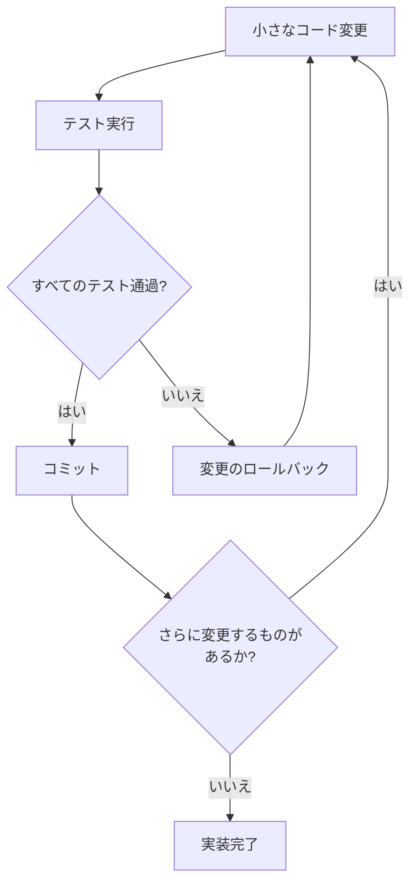
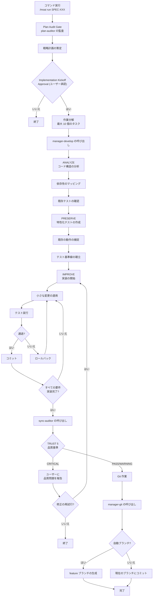

SPEC ドキュメントを基にコードを実装する Run ステップのコマンドです。プロジェクトの状態に応じて TDD (RED-GREEN-REFACTOR) または DDD (ANALYZE-PRESERVE-IMPROVE) サイクルが適用され、このドキュメントは既存コードを安全に改善する DDD サイクルを中心に説明します。


**スラッシュコマンド**: Claude Code で `/moai:run` と入力すると、このコマンドをすぐに実行できます。`/moai` だけ入力すると、利用可能なすべてのサブコマンド一覧が表示されます。


## 概要

`/moai run` は MoAI-ADK ワークフローの **Phase 2 (Run)** コマンドです。Phase 1 で生成された SPEC ドキュメントを読み、**ANALYZE-PRESERVE-IMPROVE** サイクルを通じて既存機能を壊さずに安全にコードを実装します。内部的に **manager-develop** エージェントが全体のプロセスを管理します。

実装ステップは 3-Phase パイプラインでトークンが最もかかるステップです。だから v3 トークノミクス設計がこのステップに集中的に入っています — SPEC 要約版 (`spec-compact.md`) の自動ロードで ~30% のトークンを節約し、SPEC の複雑度に応じて検証深度を調節する Harness Level Routing が不要な監査コストを減らし、進行状況がファイルに保存されてセッションが切れても続けて作業できます。


**DDD を家のリモデリングで理解する**

DDD の ANALYZE-PRESERVE-IMPROVE サイクルは **家のリモデリング** と同じです:

| ステップ         | たとえ                | 実際の作業                       |
| ------------ | ------------------- | ------------------------------- |
| **ANALYZE**  | 家を点検する         | 現在のコード構造と問題点の把握    |
| **PRESERVE** | 現在の状態を写真に撮る | 特性化テストで既存の動作を記録  |
| **IMPROVE**  | 部屋を 1 つずつリモデリング  | テストを通過しながら少しずつ改善 |

一度に家全体を壊すと危険なように、コードも **少しずつ変えながら毎回確認** するのが安全です。



## 使い方

Plan ステップで生成された SPEC ID を引数として渡します:

```bash
# Plan ステップ完了後に必ず /clear を実行
> /clear

# SPEC ID を指定して実装を開始
> /moai run SPEC-AUTH-001
```


  `/moai run` 実行前に必ず `/clear` を実行してください。Plan ステップで使った
  トークンを整理しないと Run ステップでコンテキストウィンドウを十分に活用できません。
  GLM-5.2 および Opus 4.8 は 1M コンテキスト (推奨使用量 50%)、Sonnet/Haiku 系列は
  200K コンテキスト (推奨使用量 90%) です。


## 対応フラグ

| フラグ              | 説明                  | 例                               |
| ------------------- | --------------------- | ---------------------------------- |
| `--resume SPEC-XXX` | 中断された実装作業の再開 | `/moai run --resume SPEC-AUTH-001` |
| `--solo`            | 下位エージェントモードの強制 | `/moai run SPEC-AUTH-001 --solo`   |

**Resume 機能:**

再実行時に最後に成功したステップのチェックポイントから続けて作業します。

## DDD サイクル

`/moai run` は **ANALYZE -> PRESERVE -> IMPROVE** の 3 段階を順に実行します。各ステップで何が起きるかを詳しく見ていきます。

### 1. ANALYZE (分析)

既存コードを読み、SPEC 要件と比較して何をすべきかを把握します。

**分析項目:**

| 項目        | 説明                 | 例                               |
| ----------- | -------------------- | ---------------------------------- |
| コード構造   | ファイル、モジュール、依存性   | "auth.py が user_service.py に依存" |
| ドメイン境界 | ビジネスロジックの範囲 | "認証ドメインとユーザードメインの分離" |
| テスト現況 | 既存のテストカバレッジ | "現在 45% カバレッジ"                |
| 技術的負債   | 改善が必要な部分   | "SQL Injection の脆弱性を発見"        |

### 2. PRESERVE (保存)

既存コードの現在の動作を **特性化テスト** で記録します。このテストはリファクタリング後にも既存機能がそのまま動作するかを確認する **安全網** の役割を果たします。


**特性化テストとは?**

「このコードが正しいか間違っているか」を判断するのではなく、**「現在このように動作する」を
記録** するものです。

たとえば、既存のログイン関数が成功時に `{"status": "success"}` を返すなら、この
動作をテストで記録します。後でコードを変えたときにこのテストが失敗すれば、「既存の
動作が変わった」ことをすぐに分かります。



### 3. IMPROVE (改善)

SPEC 要件に応じて **小さな単位で** コードを変更し、毎回テストを実行して既存の動作が保存されるかを確認します。

**核心原則: 小さな変更 + 毎回検証**


```mermaid
flowchart TD
    A["小さなコード変更"] --> B["テスト実行"]
    B --> C{"すべてのテスト通過?"}
    C -->|はい| D["コミット"]
    D --> E{"さらに変更するものが<br/>あるか?"}
    E -->|はい| A
    E -->|いいえ| F["実装完了"]
    C -->|いいえ| G["変更のロールバック"]
    G --> A
```

## 実行プロセス

`/moai run` が内部的に行う全体のプロセスです:


```mermaid
flowchart TD
    A["コマンド実行<br/>/moai run SPEC-XXX"] --> B["Plan Audit Gate<br/>plan-auditor の監査"]
    B --> C["戦略計画の策定"]

    C --> D{"Implementation Kickoff<br/>Approval (ユーザー承認)"}
    D -->|いいえ| E["終了"]
    D -->|はい| F["作業分解<br/>最大 10 個のタスク"]

    F --> G["manager-develop の呼び出し"]
    G --> H["ANALYZE<br/>コード構造の分析"]
    H --> I["依存性のマッピング"]
    I --> J["既存テストの確認"]

    J --> K["PRESERVE<br/>特性化テストの作成"]
    K --> L["既存の動作の捕捉"]
    L --> M["テスト基準線の確立"]

    M --> N["IMPROVE<br/>実装の開始"]
    N --> O["小さな変更の適用"]
    O --> P["テスト実行"]
    P --> Q{"通過?"}
    Q -->|はい| R["コミット"]
    R --> S{"すべての要件<br/>実装完了?"}
    S -->|いいえ| O
    S -->|はい| T["sync-auditor の呼び出し"]

    Q -->|いいえ| U["ロールバック"]
    U --> O

    T --> V{"TRUST 5<br/>品質基準"}
    V -->|CRITICAL| W["ユーザーに<br/>品質問題を報告"]
    V -->|PASS/WARNING| X["Git 作業"]

    W --> Y{"修正の再試行?"}
    Y -->|はい| N
    Y -->|いいえ| Z["終了"]

    X --> AA["manager-git の呼び出し"]
    AA --> AB{"自動ブランチ?"}
    AB -->|はい| AC["feature ブランチの生成"]
    AB -->|いいえ| AD["現在のブランチにコミット"]
    AC --> AE["完了"]
    AD --> AE
```

## 段階別の詳細

### Phase 3: JIT Language Detection (言語自動検出)

プロジェクトの主要言語を自動検出してエージェントスポーン時に適切な言語スキルを注入します。16 言語を同等に対応します。

| 検出ファイル | 言語スキル |
|-----------|-----------|
| `go.mod` | moai-lang-go |
| `package.json` (typescript) | moai-lang-typescript |
| `pyproject.toml` | moai-lang-python |
| `Cargo.toml` | moai-lang-rust |
| `pom.xml` / `build.gradle` | moai-lang-java |

### Phase 4: Scale-Based Mode Selection (規模ベースのモード選択)

SPEC の規模に応じて最適な実行モードを自動選択します。小さな作業に重いパイプラインを回さないこと — これもトークノミクスです。

| パターン | 基準 | 実行モード |
|------|------|-----------|
| バグ修正 | ファイル ≤ 3、単一ドメイン | **Fix Mode** |
| 単一機能 | ファイル ≤ 5、単一ドメイン | **Focused Mode** |
| ドメイン内機能 | ファイル 5-10 | **Standard Mode** |
| マルチドメイン | ファイル ≥ 10 またはドメイン ≥ 3 | **Full Pipeline** |

### Harness Level Routing (品質深度ルーティング)

Run phase 開始時に SPEC の複雑度に応じて品質パイプラインの深度を自動決定します。

| レベル | 対象 | evaluator | スキップする Phase |
|------|------|-----------|---------------|
| **minimal** | 単純なバグ修正、設定変更 | 非有効 | 0, 0.5, 2.0, 2.5, 2.75, 2.8a |
| **standard** | 一般的な機能開発 (デフォルト値) | final-pass (Phase 16 のみ) | なし |
| **thorough** | セキュリティ/決済など重要な機能 | per-sprint (Phase 10 + 2.8a) | なし |

失敗時の自動エスカレーション: minimal → standard → thorough (最大 2 回)

### Plan Audit Gate

`/moai run` 進入時に最初に実行される必須のゲートです。**plan-auditor** サブエージェントが plan ステップで作成された SPEC 成果物を独立して監査します。

- plan-auditor は manager-spec と独立したエージェント — 作ったエージェントが自分の結果を検査しません
- SPEC 成果物のハッシュが変更されておらず以前の判定スコア ≥ 0.90 の場合 skip-eligible (キャッシュされた判定の再利用)
- そうでなければ plan-auditor が再実行され新しい判定を下します
- PASS / PASS-with-debt / FAIL の 3 つの判定


Plan Audit Gate の skip ポリシー (plan-auditor 再実行の省略) はスコアベースです。しかし下記の **Implementation Kickoff Approval** はスコアと無関係な別のユーザー承認ゲートであり、どんな場合も迂回できません (REQ-ATR-015)。


### Implementation Kickoff Approval

Plan Audit Gate 通過後、実装を始める前にユーザーの明示的な承認を受ける **ヒューマンゲート (HUMAN GATE)** です。

- plan-auditor の判定要約 + SPEC 成果物をユーザーに提示
- `AskUserQuestion` で「run 進入 / 追加レビュー / 中断」の 3 つのオプションを提示
- スコアが 0.90 以上でも、PASS-with-debt でも、この承認は省略されません
- ユーザー承認後にはじめて実装ステップが始まります

### Phase 1: 分析および計画

**manager-develop** 下位エージェントが次の作業を行います:

- SPEC ドキュメントの完全な分析
- 要件および成功基準の抽出
- 実装ステップおよび個別作業の識別
- 技術スタックおよび依存性要件の決定
- 複雑度および労力の推定
- 段階別アプローチの詳細な実行戦略の生成

**出力:** plan_summary, requirements の一覧, success_criteria, effort_estimate を含む実行計画

### Phase 6: 作業分解

承認された実行計画を原子的でレビュー可能な作業に分解します:

**作業構造:**

- **Task ID**: SPEC 内で順次 (TASK-001, TASK-002 など)
- **Description**: 明確な作業文
- **Requirement Mapping**: 充足する SPEC 要件
- **Dependencies**: 先行作業の一覧
- **Acceptance Criteria**: 完了検証の方法

**制約条件:** SPEC あたり最大 10 個の作業。さらに必要なら SPEC 分割を推奨

タスク分解の結果は `.moai/specs/SPEC-{ID}/tasks.md` に永続記録されます。Git で追跡可能で Drift Guard が参照します。

### Phase 10: Sprint Contract (thorough 専用)

thorough レベルでのみ実行されます。sync-auditor と実装前の Done 基準を事前合意します。

**契約内容:**
- 通過すべき具体的なテストケース
- 識別されたエッジケース
- ハード閾値 (カバレッジ %、性能目標、セキュリティ要件)

最大 2 ラウンドの交渉後に evaluator の勧告案で確定されます。

### Phase 2: DDD 実装

**manager-develop** 下位エージェントが ANALYZE-PRESERVE-IMPROVE サイクルを実行します:

**要件:**

- 作業追跡の初期化
- 完全な ANALYZE-PRESERVE-IMPROVE サイクルの実行
- 各変換後の既存テスト通過の検証
- カバレッジのないコード経路への特性化テストの生成
- テストカバレッジ 85% 以上の達成

**出力:** files_modified, characterization_tests_created, test_results, behavior_preserved, structural_metrics

### Phase 13: 品質検証

**sync-auditor** 下位エージェントが TRUST 5 検証を行います:

| TRUST 5 の柱  | 検証項目                          |
| ------------- | ---------------------------------- |
| **Tested**    | テストの存在および通過、DDD 規律の維持 |
| **Readable**  | プロジェクトルールの遵守、ドキュメントの含有      |
| **Unified**   | 既存のプロジェクトパターンに従う            |
| **Secured**   | セキュリティ脆弱性なし、OWASP 準拠       |
| **Trackable** | 明確なコミットメッセージ、履歴分析の支援 |

**追加検証:**

- テストカバレッジ 85% 以上
- 動作保存: 既存テストを変更なく通過
- 特性化テスト通過: 動作スナップショットの一致
- 構造的改善: 結合度および凝集度の指標の改善

**出力:** trust_5_validation の結果, coverage_percentage, overall_status (PASS/WARNING/CRITICAL), issues_found

### Phase 16/2.8b: 能動評価と静的検証

品質評価が 2 段階に分かれて実行されます:

- **Phase 16**: sync-auditor の能動評価 (Functionality/Security/Craft/Consistency)
- **Phase 17**: sync-auditor の TRUST 5 静的検証


Security FAIL = 全体 FAIL。最大 3 回の修正-評価サイクル後にユーザーに報告されます。


### Drift Guard (範囲逸脱の検出)

DDD/TDD サイクル完了時に計画対比の実際の変更を比較します:

- drift ≤ 20%: 情報記録のみ
- 20% < drift ≤ 30%: 警告
- drift > 30%: Phase 14 の再計画ゲートをトリガー

### Phase 3: Git 作業 (条件付き)

**manager-git** 下位エージェントが Git 自動化を行います:

**実行条件:**

- quality_status が PASS または WARNING
- git_strategy.automation.auto_branch が true なら feature ブランチを生成
- auto_branch が false なら現在のブランチに直接コミット

### Phase 4: 完了および案内

ユーザーに次のオプションを提示します:

| オプション           | 説明                                  |
| -------------- | ------------------------------------- |
| ドキュメント同期    | `/moai sync` を実行してドキュメントおよび PR を生成 |
| 別の機能の実装 | `/moai plan` で追加 SPEC を生成       |
| 結果のレビュー      | ローカルで実装およびテストカバレッジを確認 |
| 完了           | セッション終了                             |

## トークン節約の仕組み — spec-compact.md

Run phase 進入時に SPEC 要約版を自動ロードして **~30% のトークンを節約** します。`.moai/specs/SPEC-{ID}/spec-compact.md` が存在すれば spec.md 全体の代わりに使われます。

## 品質ゲート

実装が完了すると次の品質基準をすべて通過する必要があります:

| 項目            | 基準         | 説明                                 |
| --------------- | ------------ | ------------------------------------ |
| LSP エラー        | **0 個**      | 型チェッカー、リンターエラーなし            |
| 型エラー       | **0 個**      | pyright, mypy, tsc など型エラーなし |
| リントエラー       | **0 個**      | ruff, eslint などリンターエラーなし       |
| テストカバレッジ | **85% 以上** | コードテストカバレッジの目標            |
| 動作保存       | **100%**     | すべての特性化テストの通過              |



**85% カバレッジはなぜ必要ですか?**

100% ではなく 85% を目標にする理由

**100% は非現実的** で、意味のないテストが追加されることがあります。**85% なら核心
ロジック** は大部分がテストされます。残りの 15% は設定ファイル、エラーハンドラーなどテストしにくい
コードです。



## 実践例

### 例: SPEC-AUTH-001 の実装

**ステップ 1: Plan ステップで SPEC 生成完了**

```bash
> /moai plan "JWT ベースのユーザー認証: 会員登録、ログイン、トークン更新"
# SPEC-AUTH-001 生成完了
```

**ステップ 2: トークン整理後に実装開始**

```bash
> /clear
> /moai run SPEC-AUTH-001
```

**ステップ 3: manager-develop が自動的に行う作業**

manager-develop エージェントが SPEC を実装するために行う 4 つの Phase です。

---

#### Phase 1: 戦略計画

SPEC ドキュメントを分析し実装戦略を策定します。

```bash
Phase 1: 戦略計画
- SPEC ドキュメントの分析完了
- 要件 5 個を抽出
- 作業 7 個に分解 (TASK-001 ~ TASK-007)
- 予想複雑度: 中程度
```

---

#### Phase 6: 作業分解

実装作業を詳細な単位に分けます。

```bash
Phase 6: 作業分解
- TASK-001: ユーザーモデルの定義
- TASK-002: パスワードハッシュユーティリティ
- TASK-003: JWT トークン生成/検証
- TASK-004: 会員登録 API
- TASK-005: ログイン API
- TASK-006: トークン更新 API
- TASK-007: 入力検証ミドルウェア
```

---

#### Phase 2: DDD 実装

ANALYZE-PRESERVE-IMPROVE サイクルで安全に実装します。

**ANALYZE ステップ** - 既存コードを理解します:

```bash
ANALYZE ステップ:
- 既存コード構造の分析: src/auth/ (4 個のファイル)
- テストカバレッジの確認: 現在 32%
- 依存性のマッピング: bcrypt, PyJWT, SQLAlchemy
```

**PRESERVE ステップ** - 既存の動作を保護します:

```bash
PRESERVE ステップ:
- 特性化テスト 12 個を作成
- 既存の動作の捕捉完了
- テスト基準線の確立: 32%
```

**IMPROVE ステップ** - 段階的に実装します:

```bash
IMPROVE ステップ:
- 反復 1: TASK-001 ユーザーモデル (テスト通過)
- 反復 2: TASK-002 パスワードハッシュ (テスト通過)
- 反復 3: TASK-003 JWT トークン (テスト通過)
- 反復 4: TASK-004 会員登録 API (テスト通過)
- 反復 5: TASK-005 ログイン API (テスト通過)
- 反復 6: TASK-006 トークン更新 (テスト通過)
- 反復 7: TASK-007 入力検証 (テスト通過)
```

---

#### Phase 13: 品質検証

TRUST 5 の柱で品質を検証します。

```bash
Phase 13: 品質検証
- TRUST 5 の柱すべて通過
- テストカバレッジ: 89%
- LSP エラー: 0 個
- 型エラー: 0 個
- 特性化テスト: 12/12 通過
- 新テスト: 24/24 通過
- 状態: PASS
```

---

#### Phase 3: Git 作業

Conventional Commits でコミットを生成します。

```bash
Phase 3: Git 作業
- ブランチ: feature/SPEC-AUTH-001
- コミット 7 個を生成 (Conventional Commits)
```

---

#### Phase 4: 完了

実装が完了すると次のステップに案内します。

```bash
Phase 4: 完了
- 実装完了
- 次のステップ: /moai sync
```

**ステップ 4: 実装完了後に Sync ステップへ移動**

```bash
> /clear
> /moai sync SPEC-AUTH-001
```

## よくある質問

### Q: 新規プロジェクトで既存コードがなければ PRESERVE ステップはどうなりますか?

既存コードがなければ PRESERVE ステップは **速く通過** されます。新しいコードに対するテストを IMPROVE ステップで一緒に書きます。

### Q: TDD と DDD のどちらのサイクルが適用されますか?

`quality.yaml` の `development_mode` 設定に従います。新機能開発は TDD (RED-GREEN-REFACTOR)、テストカバレッジが低い既存プロジェクトのリファクタリングは DDD (ANALYZE-PRESERVE-IMPROVE) が適しています。

### Q: 実装途中でトークンが足りなくなったらどうしますか?

manager-develop エージェントが **自動的に進行状況を保存** します。`/clear` の後にもう一度 `/moai run SPEC-XXX` を実行すると SPEC ドキュメントを基に続けて作業します。

### Q: テストカバレッジ 85% の達成が難しければ?

`quality.yaml` でカバレッジ目標を調整できますが、**推奨しません**。85% は核心ロジックがテストされたことを保証する最小基準です。カバレッジが不足すると manager-develop が欠落したテストを自動的に追加します。

### Q: Phase 13 で CRITICAL 状態が出たらどうしますか?

ユーザーに品質問題を報告し、修正を再試行するか尋ねます。「はい」を選ぶと IMPROVE ステップに戻って修正を続けます。

### Q: `/moai run` と `/moai` の違いは何ですか?

`/moai run` は **すでに生成された SPEC を基に実装のみ** を行います。`/moai` は SPEC 生成から実装、ドキュメント化まで **ワークフロー全体** を自動的に行います。

## 関連ドキュメント

- [ドメイン駆動開発](/core-concepts/ddd) - ANALYZE-PRESERVE-IMPROVE サイクルの詳細説明
- [TRUST 5 品質システム](/core-concepts/trust-5) - 品質ゲートの詳細説明
- [/moai plan](./moai-plan) - 前のステップ: SPEC ドキュメント生成
- [/moai sync](./moai-sync) - 次のステップ: ドキュメント同期および PR
