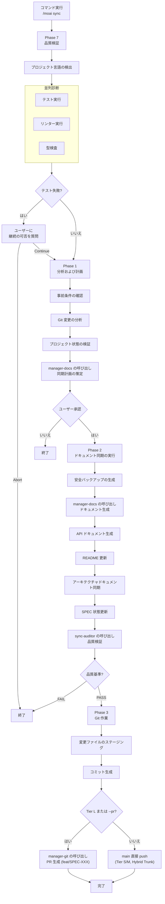

実装完了したコードのドキュメントを同期し、Git 自動化を通じてデプロイを準備します。3-Phase ライフサイクルの最後のステップです。


**スラッシュコマンド**: Claude Code で `/moai:sync` と入力すると、このコマンドをすぐに実行できます。`/moai` だけ入力すると、利用可能なすべてのサブコマンド一覧が表示されます。


## 概要

`/moai sync` は MoAI-ADK ワークフローの **Phase 3 (Sync)** コマンドです。Phase 2 で実装が完了したコードを分析してドキュメントを自動生成し、Git コミットおよび PR (Pull Request) を作ってデプロイ準備を完了します。内部的に **manager-docs** エージェントが全体のプロセスを管理します。

同期の成果物は **sync-auditor** が独立して評価します — ドキュメントを作ったエージェントと検査するエージェントが分離されているので、「同期した」という主張ではなく検証された証拠でステップが締めくくられます。


**なぜドキュメント同期が必要ですか?**

コードを書いた後にドキュメントを別途書くのは面倒で、コードとドキュメントが不一致になり
やすいです。`/moai sync` はこの問題を解決します:

- **コードを分析** して API ドキュメントを **自動生成** します
- README と CHANGELOG を **自動更新** します
- Git コミットと PR を **自動的に生成** します

コード変更とドキュメントが常に同期されるので「ドキュメントが古いです」という問題がなくなります。



## 使い方

Run ステップが完了した後に実行します:

```bash
# Run ステップ完了後に /clear を実行 (推奨)
> /clear

# ドキュメント同期および PR 生成
> /moai sync
```

## 対応モード

| モード          | 説明                        | 使用タイミング                  |
| ------------- | --------------------------- | -------------------------- |
| `auto` (デフォルト) | 変更ファイルのみスマート同期   | 日常開発                  |
| `force`       | ドキュメント全体の再生成            | エラー復旧、大規模リファクタリング |
| `status`      | 読み取り専用の状態確認         | 素早い健康チェック             |
| `project`     | プロジェクト全体のドキュメント更新 | マイルストーン完了、周期同期 |

デフォルトの `auto` モードが変更ファイルだけを選んで同期するのもトークノミクス設計です — 毎回ドキュメント全体を作り直す理由がなければ、その分のトークンを使いません。

### モード別の使い方

```bash
# デフォルトモード (変更ファイルのみ)
> /moai sync

# 全体再生成
> /moai sync --mode force

# 状態確認のみ
> /moai sync --mode status

# プロジェクト全体の更新
> /moai sync --mode project
```

## 対応フラグ

| フラグ    | 説明                 | 例                 |
| --------- | -------------------- | -------------------- |
| `--pr`   | changelog プロンプトをスキップし PR を自動で開く (Tier L またはレビューが必要な時) | `/moai sync --pr` |
| `--skip-mx` | MX タグ検査のスキップ | `/moai sync --skip-mx` |


`--merge` および `--team` / `--solo` フラグは **Deprecated** または **除去** されました。

- `--merge`: Hybrid Trunk 1-person OSS 運用で Tier S/M は main 直接 push がデフォルト動作なので PR 自動マージがもう必要ありません。Tier L で PR を生成した後にマージが必要なら `gh pr merge` を手動で実行してください。
- `--team` / `--solo`: Agent Teams 静的オーケストレーション階層が RETIRED されました。`--team` は `MODE_TEAM_UNAVAILABLE` フォールバックを発生させ、サブエージェントモードが唯一のモードなので `--solo` も意味がありません。


### --pr フラグ

changelog プロンプトをスキップして自動的に PR を開きます:

```bash
> /moai sync --pr
```

**使用事例**: changelog 情報を手動で入力せず素早く PR を作りたいとき。changelog は PR レビュー中に後で追加できます。

### Tier-based PR ルーティング

PR 生成の可否は SPEC の tier に応じて自動決定されます (Hybrid Trunk 1-person OSS のデフォルト動作):

| Tier | PR 生成 | 実行主体 |
| ---- | ------- | --------- |
| **Tier S** (≤ 300 LOC, < 5 files) | main 直接 push (PR なし) | manager-develop または orchestrator |
| **Tier M** (300-1000 LOC, 5-15 files) | main 直接 push (PR なし) | manager-develop または orchestrator |
| **Tier L** (> 1000 LOC または constitutional) | `feat/SPEC-XXX` ブランチで PR via manager-git | manager-git |
| **明示的な `--pr`** (すべての tier) | `feat/SPEC-XXX` ブランチで PR via manager-git | manager-git |

Tier S/M は CI 4 status checks + pre-push hook が安全を保証するので main に直接 push します。Tier L は広範な scope のため PR review window とフル CI マトリックス検証が必要です。

**トークン効率化戦略:**

- SPEC ドキュメントのメタデータと要約のみをロードします
- 以前のステップで変更されたファイルの一覧をキャッシュして再利用します
- ドキュメントテンプレートを使って生成時間を短縮します

## 実行プロセス

`/moai sync` が内部的に行う全体のプロセスです:



## 段階別の詳細

### Phase 7: 品質検証 (並列診断)

ドキュメント同期前にプロジェクトの品質を検証します。

**Step 1 - プロジェクト言語の検出:**

| 言語                | 表示ファイル                                  |
| ------------------- | ------------------------------------------ |
| Python              | pyproject.toml, setup.py, requirements.txt |
| TypeScript          | tsconfig.json, package.json (typescript)   |
| JavaScript          | package.json (no tsconfig)                 |
| Go                  | go.mod, go.sum                             |
| Rust                | Cargo.toml, Cargo.lock                     |
| その他 11 言語対応 |

**Step 2 - 並列診断:**

3 つのツールが同時に実行されます:

| 診断ツール   | 目的             | タイムアウト |
| ----------- | ---------------- | -------- |
| テスト実行 | テスト失敗の検出 | 180 秒    |
| リンター        | コードスタイルの検査 | 120 秒    |
| 型検査   | 型エラーの検査   | 120 秒    |

**Step 3 - テスト失敗の処理:**

テストが失敗するとユーザーに選択肢を提示します:

- **Continue**: 失敗に関係なく継続
- **Abort**: 中断して終了

**Step 4 - コードレビュー:**

**sync-auditor** 下位エージェントが TRUST 5 品質検証を行い総合報告を生成します。

**Step 5 - 品質報告書の生成:**

test-runner, linter, type-checker, code-review の状態を集計して全体の状態 (PASS または WARN) を決定します。

### Phase 1: 分析および計画

**manager-docs** 下位エージェントが同期戦略を策定します。

**出力:** documents_to_update, specs_requiring_sync, project_improvements_needed, estimated_scope

### Phase 2: ドキュメント同期の実行

**Step 1 - 安全バックアップの生成:**

修正前にバックアップを生成します:

- タイムスタンプの生成
- バックアップディレクトリ: `.moai-backups/sync-{timestamp}/`
- 重要ファイルのコピー: README.md, docs/, .moai/specs/
- バックアップの整合性検証

**Step 2 - ドキュメント同期:**

**manager-docs** 下位エージェントが次の作業を行います:

- Living Documents への変更されたコードの反映
- API ドキュメントの自動生成および更新
- README の必要時の更新
- アーキテクチャドキュメントの同期
- プロジェクトの問題の修正および壊れた参照の復旧
- SPEC ドキュメントが実装と一致するかの確認
- 変更されたドメインの検出およびドメイン別の更新の生成
- 同期報告書の生成: `.moai/reports/sync-report-{timestamp}.md`

**Step 3 - 事後同期の品質検証:**

**sync-auditor** 下位エージェントが TRUST 5 基準で同期品質を検証します:

- すべてのプロジェクトリンクの完了
- ドキュメントが適切にフォーマットされている
- すべてのドキュメントの一貫性の維持
- 資格情報の露出なし
- すべての SPEC が適切に連携されている

**Step 4 - SPEC 状態の更新:**

完了した SPEC の状態を一括更新して "completed" に設定し、バージョン変更と状態遷移を記録します。

### Phase 3: Git 作業および PR

**manager-git** 下位エージェントが Git 作業を行います:

**Step 1 - コミット生成:**

- すべての変更されたドキュメント、報告書、README、docs/ ファイルのステージング
- 同期されたドキュメント、プロジェクト修理、SPEC 更新を列挙する単一コミットの生成
- git log でコミットを検証

**Step 2 - Tier-based PR ルーティング:**

SPEC の tier に応じて Git 作業の経路が決定されます:

- **Tier S/M** (デフォルト): main ブランチに直接 push。CI 4 status checks + pre-push hook が安全を保証します。
- **Tier L または `--pr` フラグ**: `feat/SPEC-XXX` ブランチで manager-git が PR を生成します (`gh pr create`)。PR 生成後にレビュアー指定およびラベル割り当てが行われます。


`--merge` フラグは Deprecated されました。Tier L PR をマージするには CI 通過後 `gh pr merge --squash --delete-branch` を手動で実行してください。


### Phase 4: 完了および次のステップ

**標準完了報告:**

次の内容を要約して表示します:

- mode, scope, 更新/生成されたファイル数
- プロジェクトの改善事項
- 更新されたドキュメント
- 生成された報告書
- バックアップの場所

**ワークツリーモードの次のステップ (git コンテキストで自動検出):**

| オプション                 | 説明                         |
| -------------------- | ---------------------------- |
| メインディレクトリへ復帰 | ワークツリーから出てメインへ |
| ワークツリーで継続    | 現在のワークツリーで作業継続  |
| 別のワークツリーへ切替 | 別のワークツリーの選択           |
| このワークツリーの削除     | ワークツリーの整理                |

**ブランチモードの次のステップ (git コンテキストで自動検出):**

| オプション                  | 説明                      |
| --------------------- | ------------------------- |
| 変更のコミットおよびプッシュ | リモートに変更をアップロード    |
| メインブランチへ復帰    | develop または main へ     |
| PR 生成               | Pull Request の生成         |
| ブランチで継続       | 現在のブランチで作業継続 |

**標準の次のステップ:**

| オプション           | 説明                     |
| -------------- | ------------------------ |
| 次の SPEC の生成 | `/moai plan` の実行        |
| 新しいセッション開始   | `/clear` の実行            |
| PR レビュー        | Tier L: `gh pr view`     |
| 開発継続      | Tier S/M: 作業継続      |

## 生成されるドキュメント

`/moai sync` が自動的に生成または更新するドキュメントは次のとおりです:

### API ドキュメント

実装されたコードから API エンドポイント、関数シグネチャ、クラス構造を分析してドキュメントを生成します。

| ドキュメントタイプ    | 内容                         | 生成条件               |
| ------------ | ---------------------------- | ----------------------- |
| API リファレンス | エンドポイント、リクエスト/レスポンススキーマ | REST API が含まれている場合  |
| 関数ドキュメント    | パラメータ、戻り値、例外       | 公開関数が含まれている場合 |
| クラスドキュメント  | 属性、メソッド、継承関係      | クラスが含まれている場合    |

### README 更新

プロジェクトの README.md を次のように更新します:

- **使い方セクション**: 新しく追加された機能の使用例
- **API セクション**: 新しいエンドポイント一覧の追加
- **依存性セクション**: 新しく追加されたライブラリの反映

### CHANGELOG 作成

[Keep a Changelog](https://keepachangelog.com) 形式で変更履歴を記録します:

```markdown
## [Unreleased]

### Added

- JWT ベースのユーザー認証システム (SPEC-AUTH-001)
  - POST /api/auth/register - 会員登録
  - POST /api/auth/login - ログイン
  - POST /api/auth/refresh - トークン更新
```

## Git 自動化

`/moai sync` はドキュメント生成後に Git 作業を自動的に行います。

### コミットメッセージ形式

MoAI-ADK は [Conventional Commits](https://www.conventionalcommits.org/) 形式に従います:

| 接頭辞     | 用途      | 例                                        |
| ---------- | --------- | ------------------------------------------- |
| `feat`     | 新機能   | `feat(auth): add JWT authentication`        |
| `fix`      | バグ修正 | `fix(auth): resolve token expiration issue` |
| `docs`     | ドキュメント      | `docs(auth): update API documentation`      |
| `refactor` | リファクタリング  | `refactor(auth): centralize auth logic`     |
| `test`     | テスト    | `test(auth): add characterization tests`    |

## PR マージ後の CI モニタリング

`/moai sync` が PR を生成した直後、MoAI-ADK は 2 段階の自動モニタリングを実行します。Wave 1 は CI 結果をポーリングしてどの required check が失敗したかを判断し、Wave 2 は失敗が発生した場合に自動 fix ループに入ります。PR 生成後にも人が CI 画面を見張る代わりにループが結果を観察して対応する — エージェンティックループエンジニアリングが CI 領域まで続く構造です。

### Wave 1 — CI 結果のポーリング

- 30 秒間隔で `gh pr checks` を呼び出し (GitHub API rate limit を尊重)
- 30 分 hard timeout — その時間内に required check が完了しないと
  watch loop が exit code 3 で終了
- required check 定義の SSoT: `.github/required-checks.yml`
- auxiliary check は fail しても merge blocker ではない (warning のみ)

### Wave 2 — 自動 fix ループ (最大 3 回)

required check が fail すると MoAI-ADK は自動 fix ループに入ります。

- 各 iteration ごとに **新しい commit** で fix を適用 (force-push / amend 禁止)
- 最大 3 iterations per PR push (per-session ではない)
- iteration ≥ 4 になるとユーザーに blocking AskUserQuestion で escalation

### 自動処理 vs 人の決定が必要

| 欠陥タイプ                  | 自動処理?    | 備考                                         |
| -------------------------- | ------------- | -------------------------------------------- |
| lint error                 | 自動          | `golangci-lint` autofix 可能な項目          |
| format drift               | 自動          | `gofmt` / `prettier` など                      |
| test syntax error          | 自動          | import 欠落 / コンパイルエラー                    |
| **data race**              | **人の決定** | semantic failure — 意図された並行性かの判断   |
| **deadlock**               | **人の決定** | semantic failure                             |
| **panic**                  | **人の決定** | semantic failure                             |
| **test assertion failure** | **人の決定** | spec またはコードのどちらが正しいか人が判断    |

### auto-fix が絶対に触らないファイル


auto-fix ループは次のファイルを **絶対に修正しません**:

- `.env`, `.env.*` (環境変数 / 秘密)
- credentials ファイル
- `scripts/ci-watch/run.sh` (Wave 2 infrastructure)
- `.github/required-checks.yml` (Wave 1 SSoT)


### 関連ドキュメント

- ポーリング doctrine SSoT: `.claude/rules/moai/workflow/ci-watch-protocol.md`
- auto-fix doctrine SSoT: `.claude/rules/moai/workflow/ci-autofix-protocol.md`

## 品質ゲート

Sync ステップの品質基準は Run ステップよりドキュメント中心です:

| 項目     | 基準          | 説明                        |
| -------- | ------------- | --------------------------- |
| LSP エラー | **0 個**       | コードにエラーがない必要があります |
| 警告     | **最大 10 個** | ドキュメント生成時に一部の警告を許容 |
| LSP 状態 | **Clean**     | 全体的にクリーンな状態      |


  品質ゲートを通過できないとドキュメント生成と PR 生成が **中断** されます。まず
  `/moai run` に戻ってコードの問題を修正するか、`/moai fix` で素早くエラーを
  修正してください。


## Sync ステップの Human Gates

Sync プロセスには 2 つの HUMAN GATE が存在します。このゲートは自動通過の対象ではなく、FAIL または INCONCLUSIVE 判定時にチェーンが中断されます。

| ゲート | 名前 | タイミング | 役割 |
| ------ | ---- | ---- | ---- |
| `gate-sync-1` | Pre-Sync Quality | Phase 3 進入前 | 作業ツリーが clean で、すべてのテストが通過するか確認 |
| `gate-sync-2` | Documentation Scope | ドキュメント生成範囲の承認 | divergence report をユーザーがレビューしドキュメント再生成の範囲を承認 |

`gate-sync-1` はコード品質が sync 進入条件を満たすかを検証します — テスト失敗や汚れた作業ツリーがあればドキュメント生成に進みません。`gate-sync-2` はどのドキュメントを再生成するかユーザーが確認する承認ステップです — 自動生成が意図しないドキュメント変更を作るのを防ぎます。


sync-auditor の判定が FAIL/INCONCLUSIVE か、ゲートが遮断するとチェーンが中断されます。ゲート通過なしに自動完了しません。


## ワークツリーコンテキストの Auto-Merge

ワークツリー環境で実行時に auto-merge がデフォルト動作です。

**ワークツリーコンテキストの検出:**
- 現在の git ディレクトリパスに `/.moai/worktrees/` を含むかどうか
- または `.moai/worktrees/registry.json` に現在の SPEC-ID のアクティブ項目が存在

**フラグの動作:**

| フラグ | v2.8 以前 | v2.9.0 以降 |
|--------|----------|------------|
| (なし) | マージしない | ワークツリーコンテキストで **自動マージ** |
| `--merge` | 自動マージ | **Deprecated** (警告を表示) |
| `--no-merge` | N/A | 自動マージのスキップ |

**Auto-merge の実行条件:**
1. すべての CI/CD チェックの通過
2. マージ衝突なし
3. `--no-merge` フラグ未設定


CI 失敗または衝突時に自動マージを行わず、復旧コマンドとともにエラーを報告します。


### ポストマージ自動クリーンアップ

PR マージ成功後に自動整理を行います。

**条件:** Auto-merge 成功 AND `workflow.worktree.auto_cleanup == true`

**整理項目:**
1. ワークツリーディレクトリの削除
2. フィーチャーブランチの削除 (`--delete-branch`)
3. ワークツリーレジストリの更新


クリーンアップの失敗はマージ結果に影響を与えません。失敗時: `moai worktree done SPEC-{ID}` で手動整理してください。


## `/cd` キャッシュ保存再開 (CC 2.1.169+)

ディレクトリ境界を越えて多段階のワークフローを再開するとき (例: run と sync の間に L2 worktree 進入)、Claude Code 2.1.169+ は `/cd <path>` を提供します — セッションの作業ディレクトリを **プロンプトキャッシュを保存しながら** 切り替えるコマンドで、蓄積された推論コンテキストが cwd 変更時に再構築される代わりに維持されます。これは新しいターミナルを開くことに対するキャッシュ保存の代替です: `/cd` はコンテキストを維持し、新しいターミナルは cold-start します。run-phase のコンテキストを維持しながら L2 worktree で sync-phase に進入するとき、`/cd <worktree-path>` が摩擦の少ない経路です。キャッシュヒット率がそのままトークンコストであるだけに、プロンプトキャッシュを保存する習慣はトークノミクスの観点でも有効です。切り替えが `cwd` フィールドに反映される方式は [Statusline ガイド](/ja/advanced/statusline) を参照してください。

## 実践例

### 例: ドキュメント同期および PR 生成

**ステップ 1: Run ステップ完了の確認**

```bash
# Run ステップが完了したか確認
# manager-develop が "DONE" または "COMPLETE" マーカーを出力したはずです
```

**ステップ 2: トークン整理後に Sync 実行**

```bash
> /clear
> /moai sync
```

**ステップ 3: manager-docs が自動的に行う作業**

manager-docs エージェントがドキュメント同期のために行う 4 つの Phase です。

---

#### Phase 7: 品質検証

ドキュメント生成前にプロジェクトの状態を検証します。

```bash
Phase 7: 品質検証
  プロジェクト言語: Python
  テスト: 36/36 通過
  リンター: 0 エラー
  型検査: 0 エラー
  カバレッジ: 89%
  全体の状態: PASS
```

---

#### Phase 1: 分析および計画

Git の変更事項を分析し同期計画を策定します。

```bash
Phase 1: 分析および計画
  Git 変更: 12 個のファイルを修正
  同期計画: API ドキュメント 1 個、README 更新、CHANGELOG 追加
  ユーザー承認: 完了
```

---

#### Phase 2: ドキュメント同期

必要なドキュメントを生成し既存のドキュメントを更新します。

```bash
Phase 2: ドキュメント同期
  バックアップ生成: .moai-backups/sync-20260128-143052/
  API ドキュメント: docs/api/auth.md (新規)
  README.md: 使い方セクションの更新
  CHANGELOG.md: v1.1.0 項目の追加
  SPEC-AUTH-001 状態: ACTIVE → COMPLETED

  品質検証: すべての項目を通過
```

---

#### Phase 3: Git 作業

コミットを生成し PR を開きます。

```bash
Phase 3: Git 作業
  コミット生成: docs(auth): synchronize documentation for SPEC-AUTH-001
  Push: main 直接 push (Tier M, Hybrid Trunk)
```

**ステップ 4: 生成された PR の確認**

```bash
# ターミナルで PR 確認
$ gh pr view 42
```

生成された PR には SPEC 要件、変更ファイルの一覧、テスト結果が自動的に含まれます。

## よくある質問

### Q: PR を自動で作りたくなければ?

Tier S/M SPEC は Hybrid Trunk 運用でデフォルト的に main に直接 push するので PR が生成されません。Tier L でも PR の代わりにコミットだけ残しておくなら、sync 完了後に手動で `git push` のタイミングを調節できます。

### Q: CHANGELOG 形式を変えられますか?

現在は [Keep a Changelog](https://keepachangelog.com) 形式をデフォルトで使います。カスタム形式は今後対応予定です。

### Q: ドキュメントだけ生成して Git 作業はしないようにするには?

`git-strategy.yaml` で `auto_commit: false` に設定するとドキュメント生成のみを行います。Git 作業は手動で進められます。

### Q: 品質ゲート失敗時はどうしますか?

2 つの方法があります:

```bash
# 方法 1: /moai fix で素早く修正
> /moai fix "リントエラーの修正"

# 方法 2: /moai run で再実装
> /moai run SPEC-AUTH-001
```

修正後にもう一度 `/moai sync` を実行してください。

### Q: `/moai sync` と `/moai` の違いは何ですか?

`/moai sync` は **実装完了したコードのドキュメント化のみ** を担当します。`/moai` は SPEC 生成から実装、ドキュメント化まで **ワークフロー全体** を自動的に行います。

## 関連ドキュメント

- [/moai run](/workflow-commands/moai-run) - 前のステップ: DDD 実装
- [TRUST 5 品質システム](/core-concepts/trust-5) - 品質ゲートの詳細説明
- [クイックスタート](/getting-started/quickstart) - ワークフロー全体のチュートリアル
