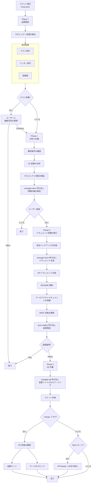

実装が完了したコードのドキュメントを同期し、Git 自動化によってデプロイの準備をします。3-Phase ライフサイクルの最終段階です。


**スラッシュコマンド**: Claude Code で `/moai:sync` と入力すると、このコマンドをすぐに実行できます。`/moai` だけを入力すると、使用可能なすべてのサブコマンドの一覧が表示されます。


## 概要

`/moai sync` は MoAI-ADK ワークフローの **Phase 3 (Sync)** コマンドです。Phase 2 で実装が完了したコードを分析してドキュメントを自動生成し、Git コミットと PR (Pull Request) を作ってデプロイの準備を完了します。内部では **manager-docs** エージェントが全工程を管理します。

同期の成果物は **sync-auditor** が独立して評価します — ドキュメントを作ったエージェントと検査するエージェントが分離されているため、「同期した」という主張ではなく検証された証拠で段階が締めくくられます。


**なぜドキュメント同期が必要なのか?**

コードを書いた後にドキュメントを別途書くのは面倒で、コードとドキュメントが不一致に
なりがちです。`/moai sync` はこの問題を解決します:

- **コードを分析** して API ドキュメントを **自動生成** します
- README と CHANGELOG を **自動更新** します
- Git コミットと PR を **自動で作成** します

コードの変更とドキュメントが常に同期されるため、「ドキュメントが古い」という問題が消えます。



## 使い方

Run 段階が完了した後に実行します:

```bash
# Run 段階完了後に /clear を実行 (推奨)
> /clear

# ドキュメント同期と PR 作成
> /moai sync
```

## サポートされるモード

| モード          | 説明                        | 使用タイミング                  |
| ------------- | --------------------------- | -------------------------- |
| `auto` (デフォルト) | 変更ファイルのみスマート同期   | 日常開発                  |
| `force`       | 全ドキュメントの再生成            | エラー復旧、大規模リファクタリング |
| `status`      | 読み取り専用の状態確認         | 素早いヘルスチェック             |
| `project`     | プロジェクト全体のドキュメント更新 | マイルストーン完了、定期同期 |

デフォルトの `auto` モードが変更ファイルだけを選んで同期するのもトークノミクス設計です — 毎回全ドキュメントを作り直す理由がなければ、その分のトークンを使いません。

### モード別の使い方

```bash
# デフォルトモード (変更ファイルのみ)
> /moai sync

# 全体再生成
> /moai sync --mode force

# 状態確認のみ
> /moai sync --mode status

# プロジェクト全体の更新
> /moai sync --mode project
```

## サポートされるフラグ

| フラグ    | 説明                 | 例                 |
| --------- | -------------------- | -------------------- |
| `--pr`   | changelog プロンプトをスキップして PR を自動オープン | `/moai sync --pr` |
| `--merge` | 完了後に PR を自動マージ | `/moai sync --merge` |
| `--skip-mx` | MX タグチェックをスキップ | `/moai sync --skip-mx` |
| `--team`  | エージェントチームモードを強制 | `/moai sync --team`   |
| `--solo`  | サブエージェントモードを強制 | `/moai sync --solo`   |

### --pr フラグ

changelog プロンプトをスキップして自動で PR を開きます:

```bash
> /moai sync --pr
```

**ユースケース**: changelog 情報を手動で入力せずに素早く PR を作りたいとき。changelog は PR レビュー中に後から追加できます。

### --merge フラグ

Sync 完了後に自動で PR をマージし、ブランチを整理します:

```bash
> /moai sync --merge
```

**作業フロー:**

1. CI/CD 状態の確認 (gh pr checks)
2. マージ衝突の確認 (gh pr view --json mergeable)
3. 通過してマージ可能な場合: 自動マージ (gh pr merge --squash --delete-branch)
4. develop ブランチへチェックアウト、pull、ローカルブランチの削除


  `--merge` オプションは **CI/CD が通過した場合のみ** PR を自動マージします。安全な
  自動化を保証します。


**トークン効率化戦略:**

- SPEC ドキュメントのメタデータと要約のみをロードします
- 前の段階で変更されたファイル一覧をキャッシュして再利用します
- ドキュメントテンプレートを使って生成時間を短縮します

## 実行プロセス

`/moai sync` が内部的に実行する全体プロセスです:



## 段階別の詳細

### Phase 7: 品質検証 (並列診断)

ドキュメント同期前にプロジェクトの品質を検証します。

**Step 1 - プロジェクト言語の検出:**

| 言語                | インジケーターファイル                                  |
| ------------------- | ------------------------------------------ |
| Python              | pyproject.toml, setup.py, requirements.txt |
| TypeScript          | tsconfig.json, package.json (typescript)   |
| JavaScript          | package.json (no tsconfig)                 |
| Go                  | go.mod, go.sum                             |
| Rust                | Cargo.toml, Cargo.lock                     |
| その他 11 言語をサポート |

**Step 2 - 並列診断:**

3 つのツールが同時に実行されます:

| 診断ツール   | 目的             | タイムアウト |
| ----------- | ---------------- | -------- |
| テスト実行 | テスト失敗の検出 | 180秒    |
| リンター        | コードスタイルの検査 | 120秒    |
| 型検査   | 型エラーの検査   | 120秒    |

**Step 3 - テスト失敗の処理:**

テストが失敗するとユーザーに選択肢を提示します:

- **Continue**: 失敗にかかわらず継続
- **Abort**: 中断して終了

**Step 4 - コードレビュー:**

**sync-auditor** サブエージェントが TRUST 5 品質検証を行い、総合レポートを生成します。

**Step 5 - 品質レポートの生成:**

test-runner、linter、type-checker、code-review の状態を集計し、全体状態 (PASS または WARN) を決定します。

### Phase 1: 分析と計画

**manager-docs** サブエージェントが同期戦略を策定します。

**出力:** documents_to_update、specs_requiring_sync、project_improvements_needed、estimated_scope

### Phase 2: ドキュメント同期の実行

**Step 1 - 安全バックアップの作成:**

修正前にバックアップを作成します:

- タイムスタンプの生成
- バックアップディレクトリ: `.moai-backups/sync-{timestamp}/`
- 重要ファイルのコピー: README.md, docs/, .moai/specs/
- バックアップの整合性検証

**Step 2 - ドキュメント同期:**

**manager-docs** サブエージェントが次の作業を行います:

- Living Documents に変更されたコードを反映
- API ドキュメントの自動生成と更新
- 必要に応じて README を更新
- アーキテクチャドキュメントの同期
- プロジェクトの問題修正と壊れた参照の復旧
- SPEC ドキュメントが実装と一致するか確認
- 変更されたドメインの検出とドメイン別更新の生成
- 同期レポートの生成: `.moai/reports/sync-report-{timestamp}.md`

**Step 3 - 同期後の品質検証:**

**sync-auditor** サブエージェントが TRUST 5 基準で同期品質を検証します:

- すべてのプロジェクトリンクの完了
- ドキュメントの適切なフォーマット
- すべてのドキュメントの一貫性の維持
- 資格情報の露出なし
- すべての SPEC の適切なリンク

**Step 4 - SPEC 状態の更新:**

完了した SPEC の状態を一括更新して "completed" に設定し、バージョン変更と状態遷移を記録します。

### Phase 3: Git 作業と PR

**manager-git** サブエージェントが Git 作業を行います:

**Step 1 - コミット作成:**

- 変更されたすべてのドキュメント、レポート、README、docs/ ファイルのステージング
- 同期されたドキュメント、プロジェクト修理、SPEC 更新を列挙する単一コミットの作成
- git log でコミットを検証

**Step 2 - PR Ready への切り替え (Team モードのみ):**

- git_strategy.mode で設定を確認
- Team モードなら: Draft PR から Ready へ切り替え (gh pr ready)
- 設定されていればレビュアーの指定とラベルの割り当て
- Personal モードなら: スキップ

**Step 3 - 自動マージ (--merge フラグ時):**

- gh pr checks で CI/CD 状態を確認
- gh pr view --json mergeable でマージ衝突を確認
- 通過してマージ可能なら: gh pr merge --squash --delete-branch を実行
- develop チェックアウト、pull、ローカルブランチの削除

### Phase 4: 完了と次のステップ

**標準完了レポート:**

次の内容を要約して表示します:

- mode、scope、更新/生成されたファイル数
- プロジェクトの改善事項
- 更新されたドキュメント
- 生成されたレポート
- バックアップの場所

**ワークツリーモードの次のステップ (git コンテキストから自動検出):**

| オプション                 | 説明                         |
| -------------------- | ---------------------------- |
| メインディレクトリへ復帰 | ワークツリーから出てメインへ |
| ワークツリーで継続    | 現在のワークツリーで作業を継続  |
| 別のワークツリーへ切り替え | 別のワークツリーを選択           |
| このワークツリーを削除     | ワークツリーの整理                |

**ブランチモードの次のステップ (git コンテキストから自動検出):**

| オプション                  | 説明                      |
| --------------------- | ------------------------- |
| 変更のコミットとプッシュ | リモートに変更をアップロード    |
| メインブランチへ復帰    | develop または main へ     |
| PR 作成               | Pull Request の作成         |
| ブランチで継続       | 現在のブランチで作業を継続 |

**標準の次のステップ:**

| オプション           | 説明                     |
| -------------- | ------------------------ |
| 次の SPEC を作成 | `/moai plan` を実行        |
| 新しいセッションを開始   | `/clear` を実行            |
| PR のレビュー        | Team モード: gh pr view    |
| 開発を継続      | Personal モード: 作業を継続 |

## 生成されるドキュメント

`/moai sync` が自動で生成または更新するドキュメントは次のとおりです:

### API ドキュメント

実装されたコードから API エンドポイント、関数シグネチャ、クラス構造を分析してドキュメントを生成します。

| ドキュメント種別    | 内容                         | 生成条件               |
| ------------ | ---------------------------- | ----------------------- |
| API リファレンス | エンドポイント、リクエスト/レスポンススキーマ | REST API が含まれる場合  |
| 関数ドキュメント    | パラメーター、戻り値、例外       | 公開関数が含まれる場合 |
| クラスドキュメント  | 属性、メソッド、継承関係      | クラスが含まれる場合    |

### README の更新

プロジェクトの README.md を次のように更新します:

- **使い方セクション**: 新しく追加された機能の使用例
- **API セクション**: 新エンドポイント一覧の追加
- **依存関係セクション**: 新しく追加されたライブラリの反映

### CHANGELOG の作成

[Keep a Changelog](https://keepachangelog.com) 形式で変更履歴を記録します:

```markdown
## [Unreleased]

### Added

- JWT ベースのユーザー認証システム (SPEC-AUTH-001)
  - POST /api/auth/register - 会員登録
  - POST /api/auth/login - ログイン
  - POST /api/auth/refresh - トークン更新
```

## Git 自動化

`/moai sync` はドキュメント生成後、Git 作業を自動で行います。

### コミットメッセージ形式

MoAI-ADK は [Conventional Commits](https://www.conventionalcommits.org/) 形式に従います:

| 接頭辞     | 用途      | 例                                        |
| ---------- | --------- | ------------------------------------------- |
| `feat`     | 新機能   | `feat(auth): add JWT authentication`        |
| `fix`      | バグ修正 | `fix(auth): resolve token expiration issue` |
| `docs`     | ドキュメント      | `docs(auth): update API documentation`      |
| `refactor` | リファクタリング  | `refactor(auth): centralize auth logic`     |
| `test`     | テスト    | `test(auth): add characterization tests`    |

## PR マージ後の CI モニタリング

`/moai sync` が PR を作成した直後、MoAI-ADK は 2 段階の自動モニタリングを実行します。Wave 1 は CI 結果をポーリングしてどの required check が失敗したかを判断し、Wave 2 は失敗が発生した場合に自動 fix ループへ入ります。PR 作成後も人間が CI 画面を見張る代わりに、ループが結果を観察して対応する — エージェンティックループエンジニアリングが CI 領域まで続く構造です。

### Wave 1 — CI 結果のポーリング

- 30 秒間隔で `gh pr checks` を呼び出し (GitHub API rate limit を尊重)
- 30 分の hard timeout — その時間内に required check が完了しない場合、
  watch loop は exit code 3 で終了
- required check 定義の SSoT: `.github/required-checks.yml`
- auxiliary check は fail しても merge blocker ではない (warning のみ)

### Wave 2 — 自動 fix ループ (最大 3 回)

required check が fail すると、MoAI-ADK は自動 fix ループに入ります。

- 毎 iteration ごとに **新しい commit** で fix を適用 (force-push / amend は禁止)
- PR push あたり最大 3 iterations (per-session ではない)
- iteration ≥ 4 になるとユーザーに blocking AskUserQuestion で escalation

### 自動処理 vs 人間の決定が必要

| 欠陥の種類                  | 自動処理?    | 備考                                         |
| -------------------------- | ------------- | -------------------------------------------- |
| lint error                 | 自動          | `golangci-lint` autofix が可能な項目          |
| format drift               | 自動          | `gofmt` / `prettier` など                      |
| test syntax error          | 自動          | import 欠落 / コンパイルエラー                    |
| **data race**              | **人間の決定** | semantic failure — 意図された並行性かどうかの判断   |
| **deadlock**               | **人間の決定** | semantic failure                             |
| **panic**                  | **人間の決定** | semantic failure                             |
| **test assertion failure** | **人間の決定** | spec とコードのどちらが正しいかは人間の判断    |

### auto-fix が絶対に触れないファイル


auto-fix ループは次のファイルを **絶対に修正しません**:

- `.env`, `.env.*` (環境変数 / シークレット)
- credentials ファイル
- `scripts/ci-watch/run.sh` (Wave 2 infrastructure)
- `.github/required-checks.yml` (Wave 1 SSoT)


### 関連ドキュメント

- ポーリング doctrine SSoT: `.claude/rules/moai/workflow/ci-watch-protocol.md`
- auto-fix doctrine SSoT: `.claude/rules/moai/workflow/ci-autofix-protocol.md`

## 品質ゲート

Sync 段階の品質基準は Run 段階よりドキュメント中心です:

| 項目     | 基準          | 説明                        |
| -------- | ------------- | --------------------------- |
| LSP エラー | **0 件**       | コードにエラーがないこと |
| 警告     | **最大 10 件** | ドキュメント生成時に一部の警告を許容 |
| LSP 状態 | **Clean**     | 全体的にクリーンな状態      |


  品質ゲートを通過できないと、ドキュメント生成と PR 作成が **中断** されます。まず
  `/moai run` に戻ってコードの問題を修正するか、`/moai fix` で素早くエラーを
  修正してください。


## ワークツリーコンテキストの Auto-Merge

ワークツリー環境で実行すると auto-merge がデフォルトの動作です。

**ワークツリーコンテキストの検出:**
- 現在の git ディレクトリパスに `/.moai/worktrees/` が含まれるか
- または `.moai/worktrees/registry.json` に現在の SPEC-ID のアクティブなエントリが存在

**フラグの動作:**

| フラグ | v2.8 以前 | v2.9.0 以降 |
|--------|----------|------------|
| (なし) | マージしない | ワークツリーコンテキストで **自動マージ** |
| `--merge` | 自動マージ | **Deprecated** (警告表示) |
| `--no-merge` | N/A | 自動マージのスキップ |

**Auto-merge の実行条件:**
1. すべての CI/CD チェックの通過
2. マージ衝突なし
3. `--no-merge` フラグ未設定


CI 失敗または衝突時は自動マージを行わず、復旧コマンドとともにエラーを報告します。


### ポストマージ自動クリーンアップ

PR マージ成功後、自動整理を行います。

**条件:** Auto-merge 成功 AND `workflow.worktree.auto_cleanup == true`

**整理項目:**
1. ワークツリーディレクトリの削除
2. フィーチャーブランチの削除 (`--delete-branch`)
3. ワークツリーレジストリの更新


クリーンアップの失敗はマージ結果に影響しません。失敗時は `moai worktree done SPEC-{ID}` で手動整理してください。


## `/cd` キャッシュ保存の再開 (CC 2.1.169+)

ディレクトリ境界をまたいで多段階ワークフローを再開するとき (例: run と sync の間に L2 worktree へ進入)、Claude Code 2.1.169+ は `/cd <path>` を提供します — セッションの作業ディレクトリを **プロンプトキャッシュを保存しながら** 切り替えるコマンドで、蓄積された推論コンテキストが cwd 変更時に再構築される代わりに維持されます。これは新しいターミナルを開くことに対するキャッシュ保存の代替手段です: `/cd` はコンテキストを維持し、新しいターミナルは cold-start します。run-phase のコンテキストを維持したまま L2 worktree で sync-phase に入るとき、`/cd <worktree-path>` が摩擦の少ない経路です。キャッシュヒット率がすなわちトークンコストである以上、プロンプトキャッシュを保存する習慣はトークノミクスの観点でも有効です。切り替えが `cwd` フィールドに反映される仕組みは [Statusline ガイド](/ja/advanced/statusline) を参照してください。

## 実践例

### 例: ドキュメント同期と PR 作成

**ステップ 1: Run 段階の完了確認**

```bash
# Run 段階が完了したかを確認
# manager-develop が "DONE" または "COMPLETE" マーカーを出力しているはずです
```

**ステップ 2: トークン整理後に Sync を実行**

```bash
> /clear
> /moai sync
```

**ステップ 3: manager-docs が自動で行う作業**

manager-docs エージェントがドキュメント同期のために実行する 4 つの Phase です。

---

#### Phase 7: 品質検証

ドキュメント生成前にプロジェクトの状態を検証します。

```bash
Phase 7: 品質検証
  プロジェクト言語: Python
  テスト: 36/36 通過
  リンター: 0 エラー
  型検査: 0 エラー
  カバレッジ: 89%
  全体状態: PASS
```

---

#### Phase 1: 分析と計画

Git の変更を分析して同期計画を策定します。

```bash
Phase 1: 分析と計画
  Git 変更: 12 ファイルの修正
  同期計画: API ドキュメント 1 件、README 更新、CHANGELOG 追加
  ユーザー承認: 完了
```

---

#### Phase 2: ドキュメント同期

必要なドキュメントを生成し、既存ドキュメントを更新します。

```bash
Phase 2: ドキュメント同期
  バックアップ作成: .moai-backups/sync-20260128-143052/
  API ドキュメント: docs/api/auth.md (新規)
  README.md: 使い方セクションの更新
  CHANGELOG.md: v1.1.0 エントリの追加
  SPEC-AUTH-001 状態: ACTIVE → COMPLETED

  品質検証: すべての項目を通過
```

---

#### Phase 3: Git 作業

コミットを作成して PR を開きます。

```bash
Phase 3: Git 作業
  コミット作成: docs(auth): synchronize documentation for SPEC-AUTH-001
  PR 状態: Draft → Ready (Team モード)
```

**ステップ 4: 作成された PR の確認**

```bash
# ターミナルで PR を確認
$ gh pr view 42
```

作成された PR には SPEC 要求事項、変更ファイル一覧、テスト結果が自動的に含まれます。

## よくある質問

### Q: PR を自動で作りたくない場合は?

`git-strategy.yaml` で `auto_pr: false` に設定すると、コミットまでのみ自動で行います。PR は好きなタイミングで直接作成できます。

### Q: CHANGELOG の形式を変えられますか?

現在は [Keep a Changelog](https://keepachangelog.com) 形式をデフォルトとして使用しています。カスタム形式は今後サポート予定です。

### Q: ドキュメントだけ生成して Git 作業はしたくない場合は?

`git-strategy.yaml` で `auto_commit: false` に設定すると、ドキュメント生成のみを行います。Git 作業は手動で進められます。

### Q: 品質ゲートに失敗した場合はどうすればよいですか?

2 つの方法があります:

```bash
# 方法 1: /moai fix で素早く修正
> /moai fix "lint エラーの修正"

# 方法 2: /moai run で再実装
> /moai run SPEC-AUTH-001
```

修正後、再度 `/moai sync` を実行してください。

### Q: `/moai sync` と `/moai` の違いは何ですか?

`/moai sync` は **実装完了したコードのドキュメント化のみ** を担当します。`/moai` は SPEC 生成から実装、ドキュメント化まで **ワークフロー全体** を自動で実行します。

## 関連ドキュメント

- [/moai run](/workflow-commands/moai-run) - 前の段階: DDD 実装
- [TRUST 5 品質システム](/core-concepts/trust-5) - 品質ゲートの詳細説明
- [クイックスタート](/getting-started/quickstart) - 全体ワークフローのチュートリアル
