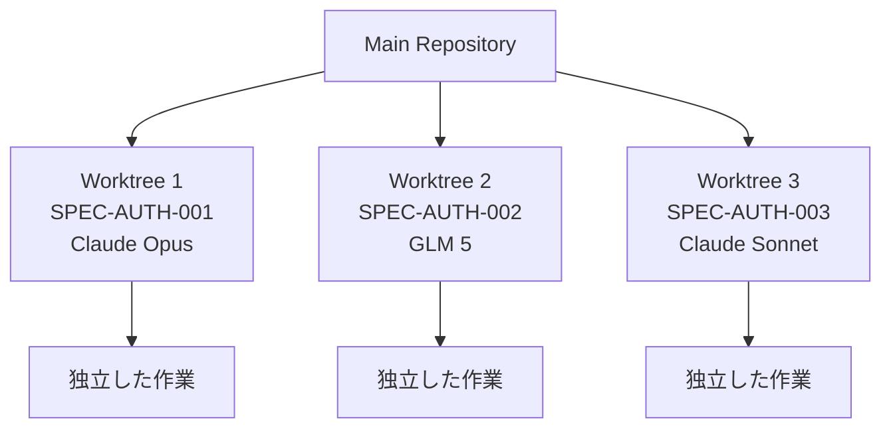
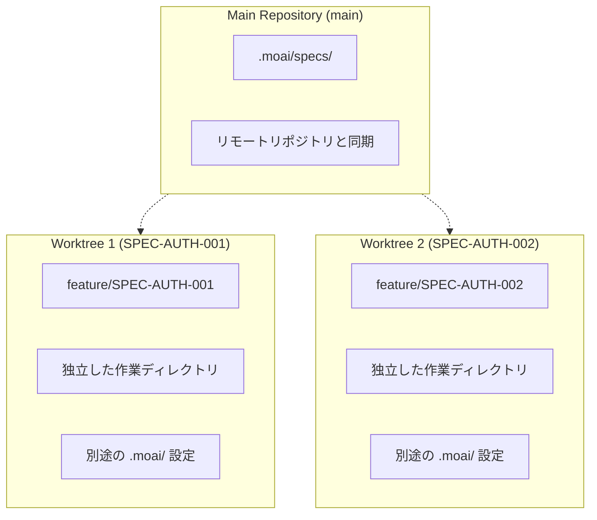
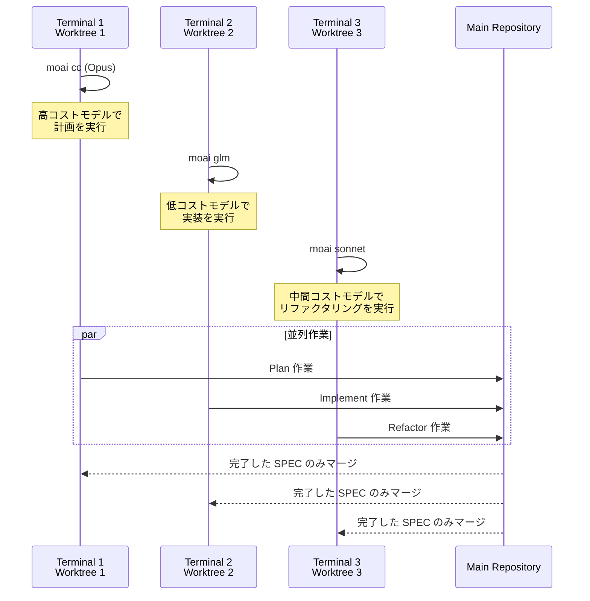
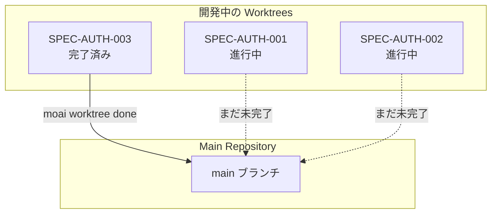

Git Worktree は MoAI-ADK で並列開発を行うための中核機能です。各 SPEC を独立した環境で開発できるように完全な分離を提供します。

## なぜ Worktree が必要なのか

### 問題点: LLM 設定の共有

従来の MoAI-ADK では `moai glm` または `moai cc` コマンドで LLM を変更すると、**すべての開かれたセッションに同じ LLM が適用**されます。これにより以下の問題が発生します:

- **SPEC 間の干渉**: 別の SPEC を開発する際に LLM 設定が互いに影響する
- **並列開発不可**: 同時に複数の SPEC を開発できない
- **コスト効率の低下**: すべてのセッションで高コストの Opus を使用する必要がある

### 解決策: 完全な分離

Git Worktree を使用すると、各 SPEC が**完全に独立した Git 状態と LLM 設定**を維持します:



## コアワークフロー

### 3段階開発プロセス

Git Worktree を活用した MoAI-ADK 開発は 3 段階で構成されます:

```mermaid
flowchart TD
    subgraph Phase1["Phase 1: Plan (Terminal 1)"]
        A1[/moai plan<br/>feature description<br/>--worktree/] --> A2[SPEC ドキュメント作成]
        A2 --> A3[Worktree 自動作成]
        A3 --> A4[Feature ブランチ作成]
    end

    subgraph Phase2["Phase 2: Implement (Terminals 2, 3, 4...)"]
        B1[moai worktree go SPEC-ID] --> B2[Worktree に入る]
        B2 --> B3[moai glm<br/>LLM 変更]
        B3 --> B4[/moai run SPEC-ID]
        B4 --> B5[/moai sync SPEC-ID]
    end

    subgraph Phase3["Phase 3: Merge & Cleanup"]
        C1[moai worktree done SPEC-ID] --> C2[main チェックアウト]
        C2 --> C3[マージ]
        C3 --> C4[クリーンアップ]
    end

    Phase1 --> Phase2
    Phase2 --> Phase3
```

### 段階別詳細説明

#### 1段階: Plan (Terminal 1)

Claude 4.5 Opus を使用して SPEC ドキュメントを作成します:

```bash
> /moai plan "認証システム追加" --worktree
```

**作業内容**:

- EARS 形式の SPEC ドキュメント自動作成
- 該当 SPEC 用の Worktree 自動作成
- Feature ブランチ自動作成と切り替え

**成果物**:

- `.moai/specs/SPEC-AUTH-001/spec.md`
- 新しい Worktree ディレクトリ
- `feature/SPEC-AUTH-001` ブランチ

#### 2段階: Implement (Terminals 2, 3, 4...)

GLM 5 またはその他のコスト効率の良いモデルを使用して実装します:

```bash
# Worktree に入る (新しいターミナル)
$ moai worktree go SPEC-AUTH-001

# LLM 変更
$ moai glm

# 開発開始
$ claude
> /moai run SPEC-AUTH-001
> /moai sync SPEC-AUTH-001
```

**利点**:

- 完全に分離された作業環境
- GLM コスト効率 (Opus 比 70% 節減)
- 衝突のない無制限並列開発

#### 3段階: Merge & Cleanup

```bash
moai worktree done SPEC-AUTH-001              # main → マージ → クリーンアップ
moai worktree done SPEC-AUTH-001 --push       # 上記作業 + リモートリポジトリにプッシュ
```

## Worktree コマンドリファレンス

| コマンド                 | 説明                       | 使用例                      |
| ------------------------ | -------------------------- | ------------------------------ |
| `moai worktree new SPEC-ID`    | 新しい Worktree 作成        | `moai worktree new SPEC-AUTH-001`    |
| `moai worktree go SPEC-ID`     | Worktree に入る (新しいシェルを開く) | `moai worktree go SPEC-AUTH-001`     |
| `moai worktree list`           | Worktree 一覧表示           | `moai worktree list`                 |
| `moai worktree done SPEC-ID`   | マージとクリーンアップ       | `moai worktree done SPEC-AUTH-001`   |
| `moai worktree remove SPEC-ID` | Worktree 削除              | `moai worktree remove SPEC-AUTH-001` |
| `moai worktree status`         | Worktree 状態確認           | `moai worktree status`               |
| `moai worktree clean`          | マージされた Worktree クリーンアップ | `moai worktree clean --merged-only`  |
| `moai worktree config`         | Worktree 設定確認           | `moai worktree config root`          |

## Worktree の核心的な利点

### 1. 完全な分離 (Complete Isolation)

各 SPEC は独立した Git 状態を維持します:



**利点**:

- 各 Worktree で独立してコミット可能
- ブランチ間の衝突なしで作業
- 完了した SPEC のみ main にマージ

### 2. LLM 独立性 (LLM Independence)

各 Worktree は別個の LLM 設定を維持します:



### 3. 無制限並列開発 (Unlimited Parallel)

同時に複数の SPEC を開発できます:

```bash
# Terminal 1: SPEC-AUTH-001 計画
> /moai plan "認証システム" --worktree

# Terminal 2: SPEC-AUTH-002 実装 (GLM)
$ moai worktree go SPEC-AUTH-002
$ moai glm
> /moai run SPEC-AUTH-002

# Terminal 3: SPEC-AUTH-003 実装 (GLM)
$ moai worktree go SPEC-AUTH-003
$ moai glm
> /moai run SPEC-AUTH-003

# Terminal 4: SPEC-AUTH-004 ドキュメント化
$ moai worktree go SPEC-AUTH-004
> /moai sync SPEC-AUTH-004
```

### 4. 安全なマージ (Safe Merge)

完了した SPEC のみ main ブランチにマージされます:



## 並列開発の視覚化

複数のターミナルで同時に作業する様子:

```mermaid
graph TB
    subgraph Terminal1["Terminal 1: Planning"]
        T1A[/moai plan<br/>--worktree/]
        T1B[Claude Opus<br/>高コスト/高品質]
        T1C[SPEC ドキュメント作成]
    end

    subgraph Terminal2["Terminal 2: Implementing"]
        T2A[moai worktree go<br/>SPEC-AUTH-001]
        T2B[moai glm<br/>低コスト]
        T2C[/moai run<br/>DDD 実装]
    end

    subgraph Terminal3["Terminal 3: Implementing"]
        T3A[moai worktree go<br/>SPEC-AUTH-002]
        T3B[moai glm<br/>低コスト]
        T3C[/moai run<br/>DDD 実装]
    end

    subgraph Terminal4["Terminal 4: Documenting"]
        T4A[moai worktree go<br/>SPEC-AUTH-003]
        T4B[moai sonnet<br/>中間コスト]
        T4C[/moai sync<br/>ドキュメント化]
    end

    T1C --> T2A
    T1C --> T3A
    T1C --> T4A
```

## 次のステップ

- **[完全ガイド](/worktree/faq)** - Git Worktree のすべてのコマンドと詳細な使用方法
- **[実際の使用例](/worktree/faq)** - 実際のプロジェクトでの使用事例
- **[よくある質問](/worktree/faq)** - FAQ および問題解決

## 関連ドキュメント

- [MoAI-ADK ドキュメント](https://adk.mo.ai.kr)
- [SPEC システム](../spec/)
- [DDD ワークフロー](../workflow/)
